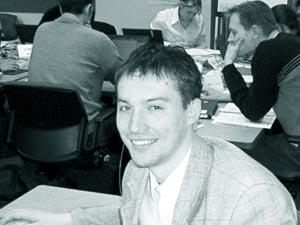

<table>
<tbody>
<tr class="odd">
<td>
<h1 id="уладзімір-каткоўскі-беларусы-часам-самі-сабе-нецікавыя">Уладзімір Каткоўскі: "Беларусы часам самі сабе нецікавыя"</h1>

<a href="mailto:alicerelease@yahoo.com?subject=pravapis.org%20interview">Аліса Бізяева</a>, газэта "Чалавек і Інтэрнэт"

На рэсурсе пра беларускую мову Pravapis.org нядаўна зьявілася цікавае дасьледваньне гэтак званага "беларускага netspeak" - гаворкі, якую ўжываюць беларускамоўныя карыстальнікі сеціва (<a href="articles/art_netspeak.html">www.pravapis.org/articles/art_netspeak.html</a>). Мы гутарым з Уладзімірам Каткоўскім, аўтарам дасьледваньня й стваральнікам рэсурсу Pravapis.org. Мовазнаўства - адно з захапленьняў гэтага разнабаковага чалавека, а асноўная спэцыялізацыя - праграмаваньне. Цяпер ён працуе ў Нямеччыне IT-аналістам кампаніі Accenture, тымчасам як ягоныя аватары <a href="http://rydel.cjb.net/">rydel n23</a> і <a href="http://www.geocities.com/by_esmi/ralda/">Эсмэральда</a> актыўна дзейнічаюць у беларускім сеціве, на беларускіх дыскусійных пляцоўках. Ствараецца ўражаньне, што яны ўсюдыісныя, і нішто не ўнікае іхнага дапытлівага позірку.

<em>– Інтэрнэт і сапраўды дапамагае зьвязаць усё з усім, у тым ліку Беларусь з астатнім сьветам? Што ты думаеш на гэты конт? Таксама раскажы, калі ласка, у чым місія pravapis.org. Мяркуючы па водгуках і статыстыцы, наколькі запатрабаваны гэты праект?</em>

– Бясспрэчна, зьяўленьне Інтэрнэту (у кантэксьце Беларусі) дала нам, беларусам, магчымасьць лепш рэпрэзэнтаваць сваю краіну. Мы вельмі доўга жылі "чужым жыцьцём", у чужой інфармацыйнай абшары (Расейская імпэрыя, потым СССР), і ўся інфармацыя пра нас у замежжы зьяўлялася праз расейскія крыніцы, які цяжка назваць аб'ектыўнымі. Пашырэньне Інтэрнэту дазволіла нам досыць хутка зьліквідаваць гэтую "белую пляму" (ці хутчэй перафарбаваць пляму ў тый колер, які больш нам адпавядае). Паводле пашукавіка <a href="http://www.google.com/webhp?hl=be">google.com</a> у больш як 2 мільёнах вэб-старонак прысутнічае слова <a href="articles/art_belarus_name.html">"Belarus"</a>. Цяпер мы самі можам расказаць пра сябе.

Наагул, сеціва - гэта сродак камунікацыі, які можа зьвязваць, а можа раздзяляць. Як ён злучае, гэта зразумела ўсім, хто бываў у інэце. А як разлучае і дзеліць? Па-першае, гэта спам, кібэрвойны, хакінг (напрыклад, падчас апошняй он-ляйн канфэрэнцыі аднаго беларускага палітыка быў зьнішчаны ўвесь сайт той палітычнай арганізацыі, на чыёй бачыне адбываўся чат). Па-другое, прыгадайма майстэрства флэйму. У рэале ён папросту немагчымы! Па-трэцяе, успомнім пра сямейныя сваркі, калі адзін з партнэраў "падсажваецца" на інтэрнэт і губляе ўсялякі інтарэс да людзей у рэчаіснасьці. Скандальныя разводы з гэтай нагоды ўжо не зьяўляюцца навінай.

Місія Pravapis.org - злучальная. Мая мэта - злучыць дзьве групы людзей, якія ніколі раней не сутыкаліся. Рэч у тым, што аўдыторыя сайта падзеленая на дзьве вельмі адрозныя "палавінкі". Першая - англамоўныя наведнікі, якія цікавяцца беларускай мовай ды культурай. А другая - беларускамоўныя ўдзельнікі, якія цікавяцца філялёгіяй, лінгвістыкай, папросту нашай мовай ва ўсіх аспэктах.

Зь іх толькі адна "палавінка" з большага раскручаная: Pravapis.org добра вядомы сярод нашых мовазнаўцаў і філёлягаў. Раскруткай другой часткі я яшчэ не займаўся, бо гэта рабіць зарана. База англамоўных артыкулаў яшчэ занадта малая. Я не хачу купляць AdWord (рэклямныя ключавыя слова ны google), каб потым плаціць 10-20 цэнтаў за кожнага наведніка і прыводзіць яго на паўпусты сайт, дзе на дадзены момант можна ўбачыць толькі 5-6 артыкулаў па-ангельску. Аднак я маю пляны ў бліжэйшыя некалькі месяцаў дадаць шмат артыкулаў на ангельскай мове. Тады і займуся англамоўнымі.

Патэнцыйна, гэтая частка маёй аўдыторыі можа быць значна большая па памеры за беларускую. Але якасна яны адрозьніваюцца. Гэта хутчэй будуць наведнікі амаль з нулявымі ведамі, якія будуць шукаць самую базавую інфармацыю, накшталт электроннай вэрсіі размоўніка ці сьпісу асноўных выразаў. Іх будзе цікавіць, як сказаць "зь днём народзінаў" альбо "я цябе кахаю" па-беларуску (каб уразіць віртуальную незнаёмку), а не <a href="articles/art_vocative.html">артыкул пра тое</a>, ці можна разглядаць клічную форму як асобны сёмы склон.

Калі казаць пра канкрэтныя лічбы на дадзены момант: звычайна прыходзяць каля 30 чалавек штодня, але калі зьяўляецца новы артыкул ці ўтыліта, то сягае да 150 ўнікальных у дзень. Я маю лічыльнік Акавіты, і мая статыстыка <a href="http://adlik.akavita.by/stat/stat.pl?id=1586&amp;lang=be">адкрытая</a> для ўсіх.

<em>– Што пра беларускі Інтэрнэт ведаюць у сьвеце? Як беларускі Інтэрнэт уплывае на погляды замежнікаў на беларусаў?</em>

– Я ж не <a href="http://www.ask.com">Jeeves</a>, каб на такія скамплікаваныя пытаньні даваць адказы <em>(усьміхаецца)</em>. Але я думаю, што ўплывае зусім слаба. Я нават думаю, што чацьвертае мейсца па хакею на зімовай алімпіядзе выклікала значна мацнейшы розгалас, чым усе нашы вэб-старонкі за ўвесь час існаваньня Інтэрнэту. Хаця сур'ёзны артыкул у нэце пра Беларусь для англамоўнага навукоўца і спартовы посьпех Макса Мірнага ці беларускай хакейнай дружыны – гэта якасна розныя рэчы. Канечне, ёсьць некалькі адносна папулярных вэб-старонак пра Беларусь на ангельскай мове (<a href="http://www.belarusguide.com">Віртуальны гід па Беларусі</a>, <a href="http://www.belarus-misc.org/">Belarus Miscellany</a>, <a href="http://www.ac.by/country/">Academy of Science Links Collection</a>), але гэта дробненькая кропелька ў вялікім забруджаным акіяне WWW.

 <em>– Для многіх людзей Інтэрнэт - адзіная магчымасьць размаўляць на роднай мове. Як ты думаеш, ці магчыма, што гэта паспрыяе разьвіцьцю беларушчыны ў рэальным жыцьці?</em>

– Адно ёсьць люстэркам другога. Беларуская мова ў сеціве пачуваецца добра, і я назіраю, як ейная сфэра ўжытку з кожным годам значна пашыраецца. Значыць напэўна і ў рэчаіснасьці адбываецца нешта падобнае (хаця дакладна паралелі праводзіць небясьпечна і не заўсёды правільна). У вольных абшарах сеціва экспансію беларускага слова нішто не спыняе, і мы бачым натуральнае разьвіцьцё беларушчыны.

<em>– Як табе, дарэчы, мова Farba.net, нейкія дзіўныя канчаткі?</em>

– Ці толькі канчаткі? Я табе скажу, Вячоркі на іх няма <em>(сьмяецца)</em>. Калі больш сур'ёзна, то ім патрэбны прафэсійны карэктар і стыль-рэдактар. Наагул, шмат чаго можна параіць. Я толькі два нумары бачыў і пакуль не хачу задужа крытыкаваць маладое пэрспэктыўнае он-ляйн выданьне. Пра зьмест наагул - no comment. Аднак, трэба заўважыць, што зьяўленьне беларускамоўнай pop-culture зьява абсалютна новая, магчыма нават рэвалюцыйная.

<em>– Раней людзі, якіх няшмат было ў сеціве, займаліся ўсім адразу. Зараз суполка падзялілася на тых, хто стварае інтэрнэт (і карыстаецца збольшага спецыялізаванымі рэсурсамі) і тых, хто яго спажывае. Як гэта ўплывае на зьмест і характар сеціва?</em>

– Спэцыялізацыя - гэта добрая і натуральная зьява. І я гарачы яе прыхільнік. Гэта гарантуе лепшую якасьць ва ўсіх аспэктах. То бок, скрыпт будзе працаваць без багаў, здымак будзе выглядаць як з вокладкі часопіса Cosmopolitan, тэкст будзе якасны і без памылак. Няхай фірма сэртыфікуюцца па ISO 9001, няхай флэш-аніматар ня робіць анічога апрача флэшак, няхай спэцыяліст па PHP піша толькі скрыпты і канфігуруе Apache, няхай спэцыяліст па usability праверае кожную спасылачку на "юзабельнасьць". Гэта цудоўна. Гэта гарант лепшай якасьці канчатковага прадукту. А аматарскія праекты ўсё адно застануцца. Наагул, ля вытокаў кожнага выбітнага вэбсайта амаль заўсёды стаіць адзін энтузіяст, які і ёсьць душой праекту, ягоным рухавіком (але ці трэба называць яго аматарам?).

<em>– Давай пагаворым пра універсалізм людзей, якія працуюць у Інтэрнэце. Ці думаў ты калі-небудзь, што тыя, хто трапіў у Інтэрнэт даўно абавязкова незвычайны самі па сабе людзі?</em>

– Можа толькі ў тым сэнсе, што піянэры заўжды недзе наперадзе і таму з шэрага натоўпу выдзяляюцца заўсёды. Яны звычайна маюць большы досьвед як у тэхнічных, так і ў сацыяльных аспэктах сецявога жыцьця, сапраўды разумеюць, што такое <em>netiquette</em>, адсочваюць усе апошнія тэхналягічныя навінкі. Але тое, што яны былі наперадзе, не гарантуе ім посьпеху ў будучыні. Інтэрнэт - гэта такі мэдыюм, дзе сытуацыя мяняецца вельмі хутка. Каб заставацца наперадзе, трэба ўвесь час прыкладаць вялікія намаганьні. І заставацца наверсе хвалі.

<em>– Якія рэсурсы патрэбныя беларусам больш за ўсё, каб наш Інтэрнэт быў цікавы для замежнікаў?</em>

– А навошта нам іх прывабліваць? Я проста ня бачу сэнсу. Як казаў клясык, "байнэт - для беларусаў" <em>(сьмяеецца)</em>. Ведаеш, Аліса, мы, беларусы, часта самі сабе нецікавыя, а ты патрабуеш цікавасьці да нас звонку. Я думаю, тут дзейнічае вельмі простае правіла: калі мы будзем <em>ім</em> цікавыя, яны <em>самі</em> створаць сайты пра нас. Вось толькі некалькі сайтаў, створаных у замежжы пра нас: <a href="http://www.belarusguide.com/">www.belarusguide.com</a>, <a href="http://www.belarus-misc.org/">www.belarus-misc.org</a>, <a href="http://www.bialorus.pl/">www.bialorus.pl</a>, <a href="http://www.belarusnews.de/">www.belarusnews.de</a>, <a href="http://www.vitryssland.nu/">www.vitryssland.nu</a>, <a href="http://www.belarus.cz/">www.belarus.cz</a>.

<a href="gb_add.html?ref=http%3A%2F%2Fwww%2Epravapis%2Eorg%2Fart%5Falice%5Finterview%2Easp">Напішыце водгук // Write your comment</a>
</td>
</tr>
</tbody>
</table>
