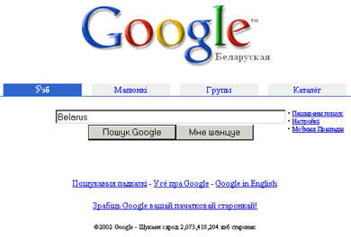

<h1 id="the-21-names-of-belarus">The 21 Names of Belarus</h1>

U.K. (inspired by <a href="http://www.google.com/jobs/britney.html">the intellgient Britney fans</a>)

No kidding about that. Inspired by <a href="http://www.google.com/jobs/britney.html">the misspellings</a> of Britney Spears' first name I decided to find out how the name of our country is <strong>[mis-]spelled</strong> in the cyberspace. I guess this sounds somewhat crazy, but that was my idea of having fun on Belarus independence day (25th of March).

To make things easier, I decided to concentrate on the English-speaking part of the Net (as much as this was possible). Basically this means that I was only searching for spellings that <strong>could</strong> be used in English. I ignored other alphabets such as Cyrillics, extended Latin-based alphabets, Arabic, etc. I also ignored adjectives that could be used in Belarusian Latin script (e.g. bielaruski, bielaruskaja). Finally I ignored the variants from languages other than English even if they use Latin-based alphabet, e.g. <a href="http://www.google.com/search?hl=be&amp;q=Belorusko">Belorusko</a> (in Czech) or <a href="http://www.google.com/search?hl=be&amp;q=Vitryssland">Vitryssland</a> (in Swedish). And here is what is left over:

<ol>
<li><a href="http://www.google.com/search?hl=be&amp;q=Belarus">Belarus</a>   2,150,000   (93,355%)</li>
<li><a href="http://www.google.com/search?hl=be&amp;q=Belorussia">Belorussia</a>   58,500   (2.540%)</li>
<li><a href="http://www.google.com/search?hl=be&amp;q=Bielorussia">Bielorussia</a>   36,100   (1.567%)</li>
<li><a href="http://www.google.com/search?hl=be&amp;q=Byelorussia">Byelorussia</a>   28,200   (1.224%)</li>
<li><a href="http://www.google.com/search?hl=be&amp;q=Belorus">Belorus</a>   10,200   (0.443%)</li>
<li><a href="http://www.google.com/search?hl=be&amp;q=%22White+Russia%22">White Russia</a>   7,180   (0.312%)</li>
<li><a href="http://www.google.com/search?hl=be&amp;q=Byelarus">Byelarus</a>   3,590   (0.156%)</li>
<li><a href="http://www.google.com/search?hl=be&amp;q=Belarussia">Belarussia</a>   2,560   (0.111%)</li>
<li><a href="http://www.google.com/search?hl=be&amp;q=White+Ruthenia">White Ruthenia</a>   1,200   (0.052%)</li>
<li><a href="http://www.google.com/search?hl=be&amp;q=Bielarus">Bielarus</a>   991   (0.043%)</li>
<li><a href="http://www.google.com/search?hl=be&amp;q=Great+Litva">Great Litva</a>   921   (0.040%)</li>
<li><a href="http://www.google.com/search?hl=be&amp;q=Bielorus">Bielorus</a>   881   (0.038%)</li>
<li><a href="http://www.google.com/search?hl=be&amp;q=Byelorus">Byelorus</a>   826   (0.036%)</li>
<li><a href="http://www.google.com/search?hl=be&amp;q=Kryvia">Kryvia</a>   760   (0.033%)</li>
<li><a href="http://www.google.com/search?hl=be&amp;q=Bellarus">Bellarus</a>   470   (0.020%)</li>
<li><a href="http://www.google.com/search?hl=be&amp;q=%22White+Rus%22">White Rus</a>   224   (0.010%)</li>
<li><a href="http://www.google.com/search?hl=be&amp;q=Belaja+Rus">Belaja Rus</a>   214   (0.009%)</li>
<li><a href="http://www.google.com/search?hl=be&amp;q=Ruthenia+Alba">Ruthenia Alba</a>   86   (0.004%)</li>
<li><a href="http://www.google.com/search?hl=be&amp;q=Byelarussia">Byelarussia</a>   59   (0.003%)</li>
<li><a href="http://www.google.com/search?hl=be&amp;q=Bielarussia">Bielarussia</a>   48   (0.002%)</li>
<li><a href="http://www.google.com/search?hl=be&amp;q=Bielaja+Rus">Bielaja Rus</a>   22   (0.001%)</li>
</ol>
   * searches performed on 25.03.2002

So far the situation does not look bad at all! More than 90% of the time people spell it right. This is a big improvement in comparison with 1997-1998 when the form "Byelorussia" (promoted by the Russians) was much more popular. Unfortunately I couldn't find the old data (but will definitely post it here, if I find it). In any case, I will repeat a similar "search rating" in a year's time. And today's bonus, the tips on how to make your Google "speak" in Belarusan, assuming that you are using Internet Explorer.

<h2 id="google-pa-bielarusku">Google  *pa-bielarusku* </h2>
<ol>
<li>In Internet Explorer go to "Tools | Internet Options..." dialog box, and click on the button "Languages".</li>
<li>In the "Language Preferences" dialog box that should appear, you should click "Add" button and select "Belarusian [be]" (this corresponds to the server variable <code>http_accept_language</code>)</li>
<li>Select "Belarusian [be]" and click "Move up" button as many times as needed to make "Belarusian [be]" the first item on the list</li>
<li>Just reload <a href="http://www.google.com/">Google</a> main page</li>
<li>The alternative way is to go to Google's settings from the main page and change the language settings there. In this case Google will set a cookie on your computer with your language preference.</li>
<li>Finally, yet another way of looking at Belarusian version of Google is to add a special variable <code>"hl=be"</code> to the URL, e.g. <a href="http://www.google.com/webhp?hl=be">http://www.google.com/webhp?hl=be</a>. This will be a temporary solution, since there are neither cookies nor changes in yout http_accept_language list.</li>
</ol>

<a href="gb_add.html?ref=http%3A%2F%2Fwww%2Epravapis%2Eorg%2Fart%5Fbelarus%5Fname%2Easp">- Write your comment</a>

