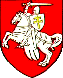

<table>
<tbody>
<tr class="odd">

<td>
<h1 id="belarus-real-or-fictitious-nation">Belarus: real or fictitious nation?</h1>

Ales Biely, the author of <em>The Chronicle of Ruthenia Alba</em>

Few people in the world were aware of the existence of Belarus until the so-called <a href="#footnote_pahonia" title="click to see the footnote 1">referendum1</a> of November 1995 that completely destroyed the remnants of parliamentary democracy that had briefly existed in the country after the collapse of the Soviet Union. The partial successes that the <em>Adradzennie</em> (Revival), movement for the restoration of the national identity, achieved during the post-independence "thaw" of 1991-1994, proved to be rather ephemeral. Belarus appears to be the first post-colonial state in modern history that is striving to re-unite with the former imperial centre. Re-Sovietisation is picking up speed. There is no shortage of people, both in the West and in Russia, who claim that the very existence of a separate Belarusian nation has always been a fiction. But this is not entirely true.

Indeed, what is now known as Belarus (Russian <em>Byelorussia</em>; in word for word translation, White Russia) has always been a <em>limitrophus</em> area between Europe and Muscovy, neither Polish nor Russian, never strong enough to determine its own destiny. Yet attempts to consolidate this area into a sort of a nation are more than thousand years old. National historiographical tradition traces country's statehood back to the early medieval principality of Polack, oldest town, known since 862 from East Slavonic chronicles and Icelandic sagas. It is believed that Polack was founded by Norwegian Vikings to control the route to Byzantium via Western Dvina and Dnieper rivers. The first known Prince of Polack, Rohvalad (Rognvald), presumably Norwegian, established a local dynasty in the second half of the 10th century. Shortly after that, Polack was conquered by the Kievan prince Vladimir, famous for converting the pagan Slavonic tribes of Kiev, Polack and Novgorod to Orthodox Christianity. Nevertheless, the Rohvalad dynasty most of the time ruled independently of Kiev. From the 1230's to the early 15th century Lithuanian dukes gradually took over appanage principalities of today's Belarus.  Contemporary Belarusian historians assert that they were not conquered by the Lithuanians, but rather the latter were initially mercenaries at the service of Slavonic princes. Whichever is true, the entry of the Slavs in the new state – the Grand Duchy of Lithuania (GDL) was of primary importance for the cultural development of Lithuanians. Monetary system and common law, official language and diplomatic rite were borrowed by them from their new compatriots. Almost all the Lithuanian Grand Dukes of 13th-15th centuries were brought up in the spirit of Slavonic culture, married Slavonic princesses and were, at least during certain periods of their lives, Orthodox. For centuries, the main centre of Belarusian, as well as Lithuanian, culture was Vilnius (Vilnia) until it was handed over by Stalin to the Lithuanian Republic in 1939.

Therefore the Grand Duchy (Chaucer's <em>Lettow and Ruce</em>) is regarded as a dual state, like Belgium or Canada and is called, ex post facto, Lithuania-Belarus. Radical nationalists, however, deny today's Lithuanians any right to the historical heritage of the GDL and contend that, if not Belarusian by its name, this state was <em>essentially</em> Belarusian. Oddly enough, both constituent people, known now as Lithuanians and Belarusians, called themselves "Lithuanians" in their tongues – <em>lietuviai</em> and <em>litviny</em>, respectively. The native language of the latter, however, was called <em>Russian</em> and the feeling of <em>Russian</em> identity remained quite strong, especially in the lowest classes. (Medieval and early modern Russia proper, however, was known abroad rather under the name of Muscovy). But even in the early 20th century, rural population had little sense of belonging except to <em>tuteisyja</em> ("local people").

Lithuanians and Belarusians called themselves "Lithuanians" in their tongues – <em>lietuviai</em> and <em>litviny</em>, respectively.

For most of their history, Belarusian lands had no other collective name other than <em>Litva</em> (Lithuania), common with the Lithuania proper. The itinerant name <em>White Russia</em> was coined in the medieval literature in German (<em>Weissrussland</em>) and Latin (<em>Russia Alba</em>) and since 13th century was applied by the Western scholars now to the north-west Russia adjacent to Finland and Karelia, then to the Black Sea northern littoral. Only in the late 16th century did it become associated with the north-east of today's Belarus and its Slavonic population – the future Belarusians. In 17th century, the Russian Tsars actively promoted the use of this name for propaganda purposes – to substantiate their claim to an alleged "old Russian heritage" which they tried to conquer back from the Polish-Lithuanian Commonwealth. When, after three partitions of the Commonwealth, the Tsars consolidated their position in Belarus, they tried to erase any token of distinction from people's awareness, officially renaming this territory the "north-west province." Neverteless, by the end of the 19th century the name <em>Belarus</em> had become widely accepted although many prominent figures of the national revival accepted it only reluctantly – fearing that it would encourage Russian claims. (Similarly, Ukrainians feel insulted when Ukraine is called by what was its official name in Tsarist times – Little Russia). Other names were suggested for the "north-west province", including <em>Vialikalitva</em> (Great Lithuania) and <em>Kryvija</em>, after the most powerful tribal union of the past, but neither of them gained enough public support.

Even a moderate interest in history [...] is perceived as "nationalism", and the word itself is used as a swearing, in a context more appropriate for "chauvinism."

Name, language and capital are among the things crucial to any nation's identity. But in the case of Belarus they have suffered repeated disruption of continuity. Even for a professional historian it is not so easy to keep one's bearings among these perplexing details. But the unwillingness of the average Belarusians of the 1990's, who had never been taught their country's tortuous history at school, even to make an effort to comprehend them, came as an unpleasant shock to the <em>conscious</em> ones. Even a moderate interest in history and national heritage is perceived as "nationalism", and the word itself is used as a swearing, in a context more appropriate for "chauvinism."

This indifference, to say the least, to the national values called here <em>national nihilism</em> is hardly surprising. In the late 1980's Belarusian intellectuals bitterly called their country the "Vendee of perestroika." Like the Breton peasant of the late 18th century, the rustic Belarusian clutches at primordial existence so tenaciously that all efforts to preach to him such intangible things as democracy or the market economy have so far been doomed to failure. It has proved much easier to build a political career on his striving to get back – not so much to today's new Russia but rather to his memory of the Soviet Union with its cheap sausage and vodka, guaranteed wages and absence of anything that would demand mental effort, initiative or any kind of responsibility.

Is it only the habits acquired during the Soviet era that are to blame? In speaking of the Lithuanian period of history as the Golden Age, nationalists tend to gloss over that even in its heyday, <em>Litva</em> (or, if you will, Lithuania-Belarus) was still a rural backwater of Europe: a country of serfdom, with peasants that knew no state institutions except their landlords and who were always considered too primitive to take responsibility for themselves, while the landlords, not unlike the <em>ante-bellum</em> aristocrats of Virginia, tried to lead lives reminiscent of some ancient Greek idyll. Significantly, the first "national" opera to be staged in the mid-19th century, was called <em>The Idyll</em> and appealed for reconciliation between the peasants and the nobles.

Indeed, there is a likeness between the recklessness with which economic and political problems were shrugged off in the Polish-Lithuanian Diet and how they are now treated by the collective farm bosses, that form the majority in Belarus' quasi-parliament. The latter have probably never even heard of the resolution of Slonim county dietine in 1666: "since innovations more than anything else harm the fatherland and undermine old rights, they should never be permitted." But the collective farmers' <em>angst</em> in the unexpectedly complicated world that suddenly emerged from behind the iron curtain together with their envy of their more entrepreneurial and, therefore, more prosperous neighbours, is reminiscent of it. Again, ostrich tactics are chosen to escape frustration. Economic interests that do not coincide with perceived Russian ones, are sacrificed to "Slavonic unity" in a naive hope that this will be appreciated by Moscow.

The romantic wing of the nationalists sees salvation in the preservation of the language. By the early 16th century the official language of the Grand Duchy (called <em>Old Belarusian</em> in retrospect) had diverged from the other East Slavonic languages, Russian and Ukrainian, sufficiently to give it a separate identity. It survived the ban on its official use imposed by the Polish Crown in 1699, a ban repeated in the 19th century by the Russian Empire. But decades of Soviet covert discrimination reduced the proportion of the population who could speak standard literary Belarusian fluently to that of the Gaelic-speaking community in Scotland. Both Poles and Russians often consider Belarusian a dialect of their tongues and a substantial part of the population of Belarus speaks a sort of pidgin Russian (<a href="articles/art_trasianka1.html">"trasianka"</a>).

Only some 40 years ago Belarusian was the language of the majority. But their vocabulary was effectively a few hundred words related to everyday life and primitive agriculture. Its literary version, in addition, included all the politically correct Communist phraseology. It was comparatively easy for the Belarusian literature that had re-emerged in the mid-19th century, after a hiatus of almost two centuries, to switch from mourning over the miserable lot of the pre-revolution peasant to praising the oh-so-happy life on the collective farms.

Adherents of the national revival point out that Belarusian literature had known better times. In the 16th century, even the Tatars living in the Grand Duchy translated <a href="articles/art_kitab1_en.html">Koran into Old Belarusian</a>. The official status of that language was confirmed by the Lithuanian Statute of 1588, sometimes termed, quite incorrectly, "the first written constitution in Europe," because of its respect for the political liberties of the nobles which was unparalleled in contemporary Europe. In the 17th century, the country was flooded with political and religious pamphlets – many of them anonymous. This set a sad Belarusian tradition, so that the authors of many books even of 19th and 20th centuries remain unknown.

It is surprising how so much of what stirred people's minds some 350 years ago is still relevant today.  The classic example of such an anonymous pamphlet is <em>The Letter to Abuhovic</em> accusing the addressee of high treason in surrendering the strategic fortress of <a href="#footnote_smolensk">Smolensk3</a> to Muscovite army in 1654. Another such diatribe, <em>Mialeska's oration</em>, sees the source of all misfortunes in the spread of foreign customs – including clothes and cuisine, proving that Belarusian xenophobia is not just a recent phenomenon.

Not just the Belarusian language, but the whole body of native folklore which fuelled the national revival of the late 19th and early 20th centuries, has effectively ceased to exist. It was ousted, however, not so much by genuine Russian culture as by Soviet <em>ersatz</em>, making a seamless integration into Russia no less doubtful than the reconstruction of national identity.

The rising generation is attracted not by folklore so much as by the emotive story of the age-old Russian-Lithuanian struggle. Since its beginning, the Grand Duchy had to defend itself against powerful enemies. From the West, it warded off the <a href="http://www.amazon.com/exec/obidos/ASIN/0781804337/belarusianlan-20">Teutonic Knights</a> who were supported by the major European nations and won the right to become a part of Europe. From the East, the Tatars who had totally devastated Russia proper, were repelled. But the pressure from the East did not disappear. Until the end of the 18th century two Slavonic states, Muscovy and the GDL, waged incessant wars against each other. The <em>causus belli</em> was really neither ethnic nor religious. The border divided two cultures, two modes of life above all. To the west of it, there were students, Jews, elections, litigation, Reformation, religious tolerance, lay books, European fashions – all kinds of things from which the population east of the line was carefully sheltered by the Tsars. It is no wonder that captives from the GDL, even those of Orthodox faith, were forcibly re-baptised in Muscovy since they were considered to be infected with the "Western disease." Some Russian historians of the early 20th century took an interest in the history of the GDL which they perceived as an "alternative Russia," a prototype of any would-be Europeanised East Slavonic state and an indication that Russia itself might well have developed according to a Western scenario. Ironically, today an ideology based on the mystical "Unity of all Slavs" against the world and denying individual freedom as "alien to Orthodox Slavs" is being exported from Belarus to Russia – a reversal of past trends.

Nevertheless, from year to year, more and more young Belarusians celebrate September, 8th, the anniversary of battle of <a href="#footnote_orsha">Orsha4</a> (1514), where Russian's drive westward suffered a humiliating setback. For them it has become an unofficial national holiday, "Belarusian military glory day." But these attempts are greeted with undisguised annoyance by "simple" people, especially of the older generation. To them, commemorating a victory over Russia, even one in the 16th century, is nothing less than "fascism" – though these same good souls were not the least offended when the president of Belarus, comrade Lukashenka, publicly admired Hitler's methods of ruling.

So, does the Belarusian national idea have any chance of survival? This depends, it would seem, on how strong is the pro-western stance of the younger generation and how ready they are to withstand the pressure. And traditional cuisine based on grated potatoes, the fabled Belarusian rustic simplicity, folk songs, midsummer bonfires and theme parks have little to do with the survival of the identity and the success of the Belarusian statehood.

Footnotes

1 <em>Pahonia</em> ("The Pursuit"), the coat-of-arms of the Grand Duchy of Lithuania, was the official national symbol of Belarus in 1991-1995 and was rejected by president Lukasenka as "alien to Orthodox Slavs." <a href="#pahonia">back</a>

2 The Bible translated into Old Belarusian by <a href="articles/art_skaryna1.html">Francysk Skaryna</a>, nation's first scholar, was the first book ever published on the territory of the future Soviet Union. Today, the imagery of Exodus is widely used by nationalists arguing that decades might be needed for Belarusians to shake off the humiliation of Russian and Soviet slavery. <a href="#skaryna">back</a>

3 Ironically, in 1919 it was in Smolensk that the Bolsheviks proclaimed the Byelorussian Soviet Socialist Republic, in opposition to the short-lived Belarusian People's Republic whose independence was proclaimed in 1918; in 1996 the city was the venue of the summit suggested by Russia allegedly to prevent upheaval in Belarus. <a href="#Smolensk">back</a>

4 The battle of Orsha (1514) despite major knock-on effects it had in the West failed to recover the strategic fortress of Smolensk lost in 1512. It was regained by the Polish-Lithuanian Commonwealth in 1611 but lost forever in 1654 never to be included into any essentially Belarusian state. From the end of the 15th century, the Polish army was constantly called upon to bolster the flagging efforts of the hard-pressed Lithuanians. Seeking support against Russia, the Grand Duchy signed the Union of Lublin with Poland (1569), forming the Polish-Lithuanian Commonwealth. <a href="#Orsha">back</a>

<em>Copyright © Ales Biely, 1997. The article was originally published in "History Today", April 1997.</em>

See also: 
 
- <strong><a href="articles/art_belarusian_adjective.html">"'Belarusian' and 'Belarusan' the correct adjective forms"</a></strong> by Katkouski 
- <strong><a href="articles/art_kitab1_en.html">"Kitabs, the unique highlight of the Belarusian language"</a></strong> by Niesciarovich 
- <strong><a href="articles/art_skaryna1.html">"Francis Skaryna, the first Belarusian printer"</a></strong> by Alexander Nadson 
- <strong><a href="articles/art_goujon1.html">"Language, nationalism, and populism in Belarus"</a></strong> by Alexandra Goujon 
- <strong><a href="articles/art_belarus_hogan.html">"Belarus: the thief that stole a whole country"</a></strong> by Katkouski 
- <strong><a href="articles/art_no_russian.html">"Saying Nyet to Russian"</a></strong> by Eve Conant 

 

<a href="gb_add.html?ref=http%3A%2F%2Fwww%2Epravapis%2Eorg%2Fart%5Fbelarus%5Fnation%2Easp">- Write your comment</a>
</td>
</tr>
</tbody>
</table>
