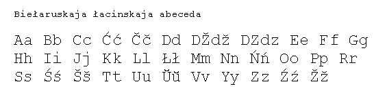

<table>
<tbody>
<tr class="odd">

<td>
<h1 id="introduction-to-belarusian-alphabet">Introduction to Belarusian Alphabet</h1>

Uladzimir Katkouski, Jonada Rrapo

This is an introduction to the two Belarusian alphabets: Cyrillics and <em>Lacinka</em> (<a href="articles/art_lac1.html">Latin Script</a>) . Here, we will not discuss <em>Arabica</em> (<a href="articles/art_kitab1_en.html">the Belarusian Arabic Script</a>). Please, feel free to link to this page, and also do not hestitate to ask questions about this topic or to send your suggestions.

<h2 id="the-cyrillic-alphabet">  1. The Cyrillic Alphabet</h2>

Most of the people who want to learn a Slavic language usually choose Russian and, thus, many would be familiar with the Russian alphabet. Therefore we start by comparing the Russian and Belarusian Cyrillic alphabets and then go on to provide a short pronunciation guide for the Belarusian Cyrillic letters.

<strong>Ўў</strong> – this is a short non-syllable "u", quite similar to "w" in "low." This is a unique Belarusian symbol that is not present in any other language (it was previously used in Azerbaidjani before they switched to a Latin-based alphabet).

<strong>Іі</strong> – unlike Russian, Belarusian does not use the letter "и", but "і". This is just historical heritage.

<strong>Ёё</strong> – this letter is mandatory in Belarusian while in Russian typically you can write "e" without the dots and the reader must understand that he has to read it as "yo" not as "ye". In Russian, in this case, the reader has to know the word to be able to read it correctly.

<strong>ДЗдз, ДЖдж</strong> – although they appear to be a combination of two letters, they actually correspond to one sound, unlike in Russian. In Serbian Cyrillic alphabet there is a special letter for the latter combination: Џџ. These two Belarusian letters are sometimes omitted from the alphabet, especially in the old Soviet grammar books.

<strong>Гг, Ґґ</strong> – the letter Гг in Belarusian and Ukrainian is pronounced quite differently from Гг in Russian and corresponds more closely to the Czech "Hh." And Gg with an upturn (Ґґ) is an optional addition to the alphabet. This Belarusian letter was abolished by the Soviet reform of 1933. According to the current official orthography rules one should always use Гг in writing and pronounce it as Ґґ in some words, most of which are loan words. Some people that use pre-reform orthography, still use letter Ґґ even today (as we do on our website).

<strong>Щщ</strong> – unlike in Russian, Belarusian alphabet does not have this letter at all. In corresponding Slavic words Belarusians pronounce and write "шч" like "szcz" in Polish. It's quite amusing that German requires seven letters to transliterate this sound: "schtsch."

<strong>Ъъ</strong> – the so called Russian "hard sign" is not present in Belarusian alphabet. Instead in Belarusian in such cases apostrophe is used. There are actually not many words containing an apostrophe.

<strong>Ьь</strong> – in Belarusian palatalization of ДЗЬдзь, ЗЬзь, СЬсь is very strong simliar to that in Polish language. The usage of Ьь in Belarusian is also different from the usage in Russian.

Below you will find a short guide for the pronunciation of the letters: 
<strong>Аа</strong> - between "a" in "cat" and "u" in "cut" 
<strong>Бб</strong> - like "b" in "bit" 
<strong>Вв</strong> - like "v" in "vine" 
<strong>Гг</strong> - approx. like "h" in "how" 
<strong>Ґґ</strong> - like "g" in "go" 
<strong>Дд</strong> - like "d" in "do" 
<strong>ДЖдж</strong> - like "j" in "journey" 
<strong>ДЗЬдзь</strong> - approx. like "ds" in "raids" 
<strong>Ее</strong> - like "ye" in "yet" 
<strong>Ёё</strong> - like "yo" in "yonder" 
<strong>Жж</strong> - like "s" in "pleasure" 
<strong>Зз</strong> - like "z" in "zoo" 
<strong>ЗЬзь</strong> - soft palatalized sound in between "z" and "zh". 
<strong>Іі</strong> - like "ee" in "see" 
<strong>Йй</strong> - like "y" in "gay" or "boy". It's a semivowel, and it is always combined with a full vowel. 
<strong>Кк</strong> - like "k" in "kitten" 
<strong>Лл</strong> - like "l" in "lady" 
<strong>ЛЬль</strong> - soft "l" like "l" in "lemon" 
<strong>Мм</strong> - like "m" in "my" 
<strong>Нн</strong> - like "n" in "not" 
<strong>НЬнь</strong> - like "n" in "near" 
<strong>Оо</strong> - like "o" in "hot" 
<strong>Пп</strong> - like "p" in "pot" 
<strong>Рр</strong> - trilled "r" (similar to a Scottish "r") 
<strong>Сс</strong> - like "s" in "sun" 
<strong>СЬсь</strong> - soft palatalized sound in between "s" and "sh". 
<strong>Тт</strong> - like "t" in "tip" 
<strong>Уу</strong> - like "oo" in "boot" 
<strong>Ўў</strong> - like final "w" in "window" 
<strong>Фф</strong> - like "f" in "face" 
<strong>Хх</strong> - like "ch" in Scottish "loch" 
<strong>Цц</strong> - like "ts" in "cats" 
<strong>ЦЬць</strong> - soft palatalized sound in between "ts" and "ch". 
<strong>Чч</strong> - hard "ch" that sounds like a combination of "t" and "sh". 
<strong>Шш</strong> - like "sh" in "shut" 
<strong>Ыы</strong> - a "dark" hard "i", like "i" in "Chris" 
<strong>Ээ</strong> - like "e" in "met" 
<strong>Юю</strong> - like "u" in "duke" 
<strong>Яя</strong> - like "ya" in "yard" 

<h2 id="the-latin-alphabet-lacinka">  2. The Latin Alphabet (Lacinka)</h2>

Belarusian language has a long tradition of using Lacinka (<a href="articles/art_lac1.html">Belarusian Latin-script writing</a>). Just to give you one example, during 1863 anti-Russian uprising Kastus Kalinouski (Kalinowski) wrote all of his leaflets and newspapers in Lacinka. From that period until 1920's, Lacinka was probably more popular than the Cyrillic alphabet. But during the Soviet times, due to the Russification policies Lacinka almost totally disappeared from print. Nowdays probably not more than 5% of the people use Lacinka script. No studies on Lacinka usage and therefore no good estimates on the number of Lacinka users exists because the current government views Cyrillics as the only official alphabet and ignores Lacinka altogether. Still, we think, it deserves some attention. Here are some specific Lacinka characters that are used in Belarusian:

<strong>Šš</strong> – like "sh" in "shut".

<strong>Čč</strong> – similar to "ch" in "church," but note that Belarusan Č is always hard, thus it sounds almost like "t"+"sh" pronounced quickly together.

<strong>Žž</strong> – like "s" in "pleasure".

<strong>DŽdž</strong> – like "j" in "journey".

<strong>Ńń</strong> – palatalized "n", like "n" in "near".

<strong>Ćć, Śś, Źź</strong> – have no equivalent sound in English, but sound somewhat similar to the Polish Ćć, Śś, Źź. These are so called soft (palatalized) consonants, e.g. ś probably will sound to you like something in between "s" and "sh", and ź something in between "z" and "ž". Soft "dz" is also quite similar to Polish.

<strong>Łł</strong> – hard L, like double LL in Albanian. Normal non-crossed L is soft like "l" in "Lemon".

<strong>Ŭŭ</strong> – like "w" in "low" or somewhat like Polish <em>ł kreskowane</em>. Note that Belarusan and Polish Ł's are pronounced differently.

<strong>Hh</strong> – like the Czech or Slovak pronounciation of "h" in "Praha".

<strong>Jj</strong> – like "y" in "boy". It is a semivowel, i.e. it is always combined with a full vowel..

The rest of the letters/sounds are, in the most cases, quite similar to the corresponding English letters and sounds. We think this overview should enable you to read Belarusan Lacinka easily. If you have a Cyrillic text, and would like to convert it to Lacinka, you can use this <a href="latin.html">converter</a>.

See also: 
 
- <strong><a href="articles/art_lac1.html">Introduction to Belarusian Lacinka</a></strong> by Mikola Paczkajeu 
- <strong><a href="articles/art_kitab1_en.html">Kitabs, Arabic Writing in Belarusian</a></strong> by Niesciarovicz 
- <strong><a href="articles/art_letter_monument.html#english">Monument to the Unique Belarusian Letter</a></strong> (English summar at the bottom) 
- <strong><a href="articles/art_cyrillic_translit.html">Slavic Cyrillic transliteration</a></strong> (Belarusian, Bulgarian, Macedonian, Russian, Serbian, Ukrainian) 
- <strong><a href="articles/art_phonetic_alphabet.html">Phonetic Alphabets</a></strong> (Belarusian, German, English, Russian) 
- <strong><a href="articles/art_letter_frequency.html">Letter Frequencies</a></strong> (Belarusian and Russian) 

Related books from Amazon: 
 
- <strong><a href="http://www.amazon.com/exec/obidos/ASIN/0071357432/belarusianlan-20">Lost Languages: The Enigma of the World's Undeciphered Scripts</a></strong> by Andrew Robinson 
- <strong><a href="http://www.amazon.com/exec/obidos/ASIN/050028105X/belarusianlan-20">The Story of Decipherment: From Egyptian Hieroglyphs to Maya Script</a></strong> by Maurice Pope 
- <strong><a href="http://www.amazon.com/exec/obidos/ASIN/0804816549/belarusianlan-20">Writing Systems of the World: Alphabets, Syllabaries, Pictograms</a></strong> by Akira Nakanishi 
- <strong><a href="http://www.amazon.com/exec/obidos/ASIN/0804717567/belarusianlan-20">Writing Systems: A Linguistic Introduction</a></strong> by Geoffrey Sampson 
- <strong><a href="http://www.amazon.com/exec/obidos/ASIN/0631165134/belarusianlan-20">The Writing Systems of the World</a></strong> by Florian Coulmas 
- <strong><a href="http://www.amazon.com/exec/obidos/ASIN/0226508366/belarusianlan-20">The History and Power of Writing</a></strong> by Henri Jean Martin 
- <strong><a href="http://www.amazon.com/exec/obidos/ASIN/0500281564/belarusianlan-20">The Story of Writing</a></strong> by Andrew Robinson 

<a href="gb_add.html?ref=http%3A%2F%2Fwww%2Epravapis%2Eorg%2Fart%5Fbelarusian%5Falphabet%2Easp">- Write your comment</a>
</td>
</tr>
</tbody>
</table>
