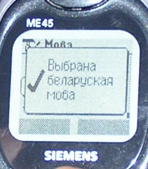

<table>
<tbody>
<tr class="odd">

<td>

English summary: This article by Siarhiej Dubaviec is devoted to the social and business issues and problems related to Belarusian language usage in mobile communication. Currently there is virtually no support for Belarusian language in the mobile phones UI, and the service language of Belarusian mobile operators is Russian. The author explores the sociolinguistic problems associated with this and proposes ways to solve the problem, comparing it with software localization projects such as Google's Belarusian interface which was done by volunteers. Siarhiej Dubaviec does not discuss technical issues (such as support for specific Belarusian Cyrillic and Latin characters in the mobile devices) but, rather, focuses on social and management issues.

<h1 id="mobile-communication-in-belarusian-мабільная-сувязь-па-беларуску">Mobile Communication in Belarusian 
Мабільная сувязь па-беларуску</h1>

Сяргей Дубавец, Юлія Шарова

 Нам кажуць пра дзьве дзяржаўныя мовы, але выбару, як правіла, няма. Нам кажуць, што беларусы выдатна разумеюць па-расейску з тым самым зьдзіўленьнем, зь якім некалі нашым продкам казалі, што ўсе тут выдатна разумеюць па-польску. Правы правамі, а гэта, так бы мовіць, жыцьцё – у яго свае ўнутраныя законы і нашмат прасьцей адпавядаць ім, чым перарабляць іх пад сябе, ускладняць сытуацыю ці, скажам, імкнуцца адпавядаць стандартам Эўрапейскага Зьвязу. Мы ж нікуды ня йдзем. Мы стаім на месцы і больш за ўсё на сьвеце хочам, каб усё было як ёсьць.

У адрозьненьне ад суседніх краінаў, у нас дзяржава не займаецца беларусізацыяй навінак. Калі нешта такое й робіцца, дык на ўзроўні прыватных ініцыятываў асобных людзей. Калі нешта было і ўстала на дзяржаўныя рэйкі, дык за цяперашнім кіраўніцтвам яно бязьлітасна праганяецца на ранейшы прыватны ўзровень. Красамоўны прыклад – зь Беларускім Ліцэем, які ўжо ня мае статусу дзяржаўнага і пастаўлены ва ўмовы выжываньня. Варта згадаць і разгон беларускамоўных FM-станцыяў – спачатку грамадзкага радыё 101.2, пасьля – і дзяржаўнай “Сталіцы”. Словам, усё беларускае мусіць выжываць сіламі саміх людзей пры жорсткім уціску з боку ўладаў. Натуральна, людзі ёсьць людзі, і ніхто ня можа папрыкнуць іх, напрыклад, у адсутнасьці жаданьня ды энтузіязму або волі, на якіх толькі і трымаецца сёньня нацыянальнае адраджэньне. Праўда, апроч уладаў і людзей ёсьць у гэтай справе і яшчэ адзін удзельнік – гэта нацыянальная ідэя, існаваньне якой аб’ектыўнае і, што самае галоўнае, безальтэрнатыўнае. Або мы ўсе станем урэшце беларусамі, або – нікім. І калі людзі сёньня не знаходзяць у сабе жаданьня ды волі, дык заўтра ім на зьмену прыйдуць іншыя. У гэтым і выяўляецца аб’ектыўнасьць нацыянальнай ідэі.

Каб яна з гадамі мацнела і больш укаранялася ў жыцьці, мусіць мацнець яе інфраструктура, мусіць разьвівацца тэхналёгія нацыянальнага адраджэньня. Скажам, збор подпісаў за беларусізацыю чыгункі або мітынг пратэсту супраць закрыцьця беларускай школы – гэта пачатковы тэхналягічны ўзровень, які ня мае на мэце абавязковага выніку. Суполка людзей, якія ладзяць пратэст, знаходзіць пэўную сатысфакцыю ўжо ў самім працэсе сваёй дзейнасьці. Такія паводзіны больш характэрныя для нацыянальнай меншасьці, дзейнасьць якой скіраваная на задавальненьне ўласных амбіцыяў і самазахаваньне, але не на агульнанацыянальны ахоп, уздым і зьмену нацыянальнае палітыкі ў краіне зь неспрыяльнае на спрыяльную.

Зусім іншы тэхналягічны ўзровень – дзейнасьць прафэсійных групаў, скіраваная на канкрэтны вынік. У якасьці прыкладу назаву беларусізацыю самай папулярнай інтэрнэтнай пошукавай прылады Google. Група энтузіястаў зрабіла гэтую працу і вось – канкрэтны вынік, сотні людзей карыстаюцца беларускім Гуглам.

Для ілюстрацыі сёньняшняй гаворкі пра тэхналёгію адраджэньня я абраў мабільныя або сотавыя тэлефоны. Зьява гэтая настолькі ж новая, наколькі татальная. Няма сумневу, што праз год-другі яна ахопіць усіх беларусаў, прынамсі амаль кожную беларускую сям’ю. Што нясе з сабой мабільная сувязь і ці паўплывае яна нейкім чынам на нас, на сытуацыю ў краіне?

Мабільнік або сотавік нясе бясспрэчныя зьмены ў інфраструктуру жыцьця. Калі б ён зьявіўся сто гадоў таму, Коласаў дзядзька Антось не паехаў бы ў Вільню, бо вырашыў бы свае праблемы проста зь лесу, а мы засталіся б бяз гэтага клясычнага сюжэту беларускае літаратуры. Зь іншага боку, сёньняшні бізнэсовец, узброены мабільнікам, можа пакінуць свой габінэт і падацца да сваякоў на вёску – капаць бульбу. І тут – наадварот – жыцьцё багацее яшчэ адным сюжэтам.

Мабільнікі.. Яшчэ тры-чатыры гады таму яны былі для нас страшэннай экзотыкай: мы рэфлектыўна азіраліся, чуючы на вуліцы телефонны званок, мы ўглядаліся ў чалавека, які даставаў з кішэні “трубку”, мы нават з пэўнай бестактоўнасьцю прыслухоўваліся да размовы, якую гэты чалавек вёў. Мы яшчэ не ацэньвалі мадэль мабільніка, ня думалі, якую б мэлёдыю лепей паставіць ды які тарыф абраць. Мы папросту бачылі новую зьяву ў нашым побыце і зь дзіцячай пакуль яшчэ непасрэднасьцю яе ўспрымалі.

Нехта зайздросьціў: дарагая па першых часох рэч ставіла ўладальніка сотавіка быццам бы на крыху вышэйшую прыступку, чымся ўвесь астатні люд паспаліты. Нехта бачыў у тэлефоне нятанную цацку, якой можна пахваліцца. Нехта раздражняўся нават болей, чым звычайна можна раздражняцца ад недарэчнага тэлефоннага званка. І толькі нядаўна для беларусаў мабільнік стаў найперш функцыянальнай рэччу, а ня дзівам дзіўным. На момант напісаньня гэтага артыкулу больш за 700 тысяч жыхароў краіны маюць сотавікі. Поліфанія тэлефонных званкоў чуецца на вуліцы, у офісах, у грамадзкім транспарце. На дзьвярах кабінэтаў урадавых чыноўнікаў зьявіліся абвесткі: на час знаходжаньня ў будынку Дому ўраду сотавыя тэлефоны й пэйджэры вылучыць. У тэатрах перад паказам падобную ж просьбу пачалі абвяшчаць у мікрафон. Словам, мабільнік стаў неад’емнай часткай быцьця.

Мы й не заўважылі, як сьвет крыху зьмяніўся вакол нас. Але ці зьмяніліся ад гэтага мы самі? Думаю, што не.

Зьяўленьне мабільніка падобнае да зьяўленьня кішанёвага гадзіньніка. Шмат хто і сёньня можа прыгадаць, як у незнаёмым горадзе дводзілася ісьці на вакзал, каб паглядзець, колькі часу. Або выбіраць, у каго б спытацца – сытуацыя абяцала цэлы сюжэт. А тут, зірнуў на руку і сам не заўважыў, як з твайго жыцьця выпала некалькі сюжэтаў. Праўда, гадзіньнік уваходзіў у нашае жыцьцё эвалюцыйна, а прыход сотавіка – паводле тэмпаў і ахопу – можна параўнаць з рэвалюцыяй.

Аднак тут, як і з кожнай новай цывілізацыйнай прыладай, вынік дваякі. Большае ў жыцьці парадку – большае і мітусьні. Да прыкладу, усе выгоды сотавіка, а менавіта – эканомія часу – ці не пакрываюцца патрэбай рэгістраваць яго на больш выгадны плян, мяняць SIM-карты, прыглядаць да яго аксэсуары, а ўрэшце – трымаць гэта ўсё ў галаве? У гэтым сэнсе выгада падманлівая. Яна зьіначвае сьвет вакол нас, але ніякім чынам не ўплывае на нас саміх. Чалавек застаецца ранейшым. Яму зручней? Напэўна. Аднак нулявы градус чалавечае зручнасьці застаецца на тым самым месцы, дзе ніжэй за нуль – голад і бяссоньне, холад і сьпёка, адзінота і няволя...

Мабільнік стаўся неад’емнай часткай быцьця. Дадам – таго быцьця, якое яно ў нас ёсьць – з татальным дамінаваньнем усяго расейскага над усім беларускім. Сотавік ня стаў неад’емнай часткай быларушчыны, не ўступіў у кантакт з мовай, як гэта адбылося ва ўсіх нашых суседзяў. На сваім экране ён ня піша беларускія словы, і ягоныя апэратары не адказваюць нам па-беларуску.

 Мабільная сувязь, якая настолькі імкліва пашырае свой уплыў у Беларусі, упарта абыходзіць уласна беларусаў. Колькі год яна існуе ў краіне, за гэты час не зьявілася ані намёку на сотавікі зь беларускім інтэрфэйсам, ані спробаў з боку апэратараў наладзіць беларускамоўны сэрвіс абслугоўваньня абанэнтаў. Беларускамоўнае насельніцтва вымушанае карыстацца телефонамі альбо з расейскім, альбо з ангельскім інтэрфэйсам, атрымліваць гукавыя паведамленьні па-расейску, дачыняцца з апэратарамі па-расейску. Можна, вядома ж, спасылацца на славуты білінгвізм: маўляў, нашто нам пакуль сотавікі зь беларускай мовай, калі па-расейску і так усе разумеюць.

Дарэчы, самая першая і, можна лічыць, пасьпяховая беларусізацыя адбылася не на моўным, а на музычным узроўні. Гаворка ідзе пра мэлёдыі, якімі звоняць мабільнікі. Дзясяткі такіх мэлёдыяў – ад “Касіў Ясь канюшыну” да “Мы выйдзем шчыльнымі радамі”, ад “Палянэзу” Агінскага да шлягераў N.R.M. кожны можа сьпісаць сабе з інтэрнэту – зь Беларускай палічкі на старонцы knihi.com і на іншых старонках.

Аднак музыка – яшчэ ня мова. Хоць і тут можна зрабіць псыхалягічнае назіраньне. Скажам, чаму б усім сьведамым беларусам не карыстацца адным пэўным сыгналам, каб свой заўсёды пазнаваў свайго, а то й прасякаўся салідарысцкім пачуцьцём. Аднак беларусы не салідарызуюцца, пра што мы гаварылі ў адной ранейшай праграме. Сьвет зьмяніўся і варожы чыньнік дэнацыяналізацыі перастаў быць варожым, як і ўся праблематыка станаўленьня нацыі з разраду войнаў і паўстаньняў перайшла ў разрад рабочых пытаньняў. Таму самапачуваньне беларусаў нічым не вылучаецца сярод нацыяў-суседак, якія сваё нацынальнае пытаньне ўжо вырашылі і цяпер занятыя іншымі клопатамі.

Але ж тэлефоны з інтэрфэйсам на нацыянальнай мове даўно ёсьць ува Ўкраіне, дзе па-расейску і толькі па-расейску таксама гутарыць вельмі значны адсотак насельніцтва. Чэхі й славакі цудоўна разумеюць адно аднаго, але тым ня менш усясьветныя вытворцы сотавікаў выпускаюць тэлефоны як з чэскім, так і з славацкім інтэрфэйсам. Сэрбы й харваты, мовы якіх таксама надзвычай падобныя, могуць выбіраць сэрбскі ці харвацкі інтэрфэйс. Беларусы – ня могуць.

Чаму ж сотавікі зь беларускамоўнай прашыўкай дагэтуль не зьявіліся? Гісторык Алесь Белы цьвердзіць, што мабільнікі зь беларускамоўным мэню зьявяцца ў Беларусі толькі тады, калі вытворцы тэлефонаў адчуюць у гэтым патрэбу. Калі на беларускім рынку такая прадукцыя будзе запатрабаванай у такой ступені, каб паставіць яе на сэрыйную вытворчасьць.

(Белы: ) “Вінаваціць вытворцаў у тым, што яны не вырабляюць такіх тэлефонаў, бадай што не выпадае. Перабудова пад патрэбы расейскага рынку таксама ідзе даволі павольна, бо нават расейскі рынак тэлефонаў стандарту GSM ва ўсясьветным маштабе не такі ўжо заўважны кавалак. Калі б дылеры вытворцаў у Беларусі казалі, што ім цяжка прадаваць тэлефоны без беларускамоўнага мэню, без беларускамоўных інструкцыяў і калі б такія сыгналі паўтараліся раз за разам, то вытворцы безумоўна зьвярнулі б на гэта ўвагу. Але насамрэч не настолькі шмат завозіцца тэлефонаў праз афіцыйных дылераў, праз апэратараў мабільнай сувязі. Наш рынак сотавых тэлефонаў пераважна “шэры”. Пастаўкі ажыцьцяўляюцца нават не праз прыватных прадпрымальнікаў, а праз прыватных асобаў, якія прывозяць з сабой у валізцы 10-20 штук тэлефонаў. Такія пастаўкі стыхійныя і яны дазваляюць зарабіць такому незарэгістраванаму прадпрымальніку ў лепшым выпадку па 5-10 даляраў з адной трубкі. Яны можа быць 90 адсоткаў рынку складаюць. І вось з-за такой распыленасьці гэтага рынку (нават калі б беларускамоўная грамада была б больш прыкметнай) прад’явіць гэты попыт не ўяўляецца магчымым.”

Разам з тым, лічыць спадар Белы, мэтазгодна на першым этапе патрабаваць ад вытворцаў інструкцыяў на беларускай мове і праз афіцыйных дылераў зьвяртаць увагу да сваіх спажывецкіх правоў. Што да магчымасьці прыватнай ініцыятывы пераводу телефонаў на беларускую мову, то на думку майго суразмоўцы, яна ня будзе мець плёну. Калі вытворцы адчуюць, што кан’юнктура беларускага рынку зьмянілася і ў сотавых тэлефонах зь беларускім мэню ёсьць істотная патрэба, яны самі знойдуць адмыслоўцаў, якія зоймуцца гэтай справай. Галоўнае, каб вытворцы атрымалі ад беларускага рынку такі сыгнал. Аднак атрымаць яго вельмі цяжка. Праблема нават ня ў тым, што карыстальнікаў мабільнае сувязі, якія былі б ня супраць мець тэлефоны зь беларускім інтэрфэйсам, можа быць няшмат. Папросту яны не арганізаваныя і таму часта ня ведаюць, якім чынам можна адстойваць свае спажывецкія правы.

Прадстаўнікі кампаніі МТС – аднаго з айчынных апэратараў мабільнай сувязі – таксама лічаць, што выпуск тэлефонаў з падтрымкай той ці іншай мовы – гэта пытаньне найперш вытворцы тэлефонаў. Мэтазгоднасьць выпуску тэлефонаў на канкрэтнай мове вызначаецца ёмістасьцю рынку ў краіне, сказалі мне ў кампаніі. У Беларусі рынак сотавай сувязі разьвіваецца эксплязіўна, таму зьяўленьне тэлефонаў зь беларускім інтэрфэйсам у кампаніі МТС лічаць цалкам верагодным. У Расеі тэлефоны з расейскім інтэрфэйсам таксама не адразу зьявіліся. Таму вырашэньне моўнай праблемы – хіба пытаньне часу.

Зрэшты, адсутнасьць мабільных тэлефонаў з прашыўкай на нацыянальнай мове – толькі адзін бок праблемы. Ня менш складанасьцяў зьвязана з адсутнасьцю беларускай мовы ў сэрвісах апэратараў мабільнае сувязі. І калі пра адсутнасьць мабільных тэлефонаў зь беларускім мэню апэратары яшчэ неяк выказваюцца і нават станоўча ацэньваюць ідэю зьяўленьня такіх мабілак, то пра ўласны пераход на беларускамоўнае абслугоўваньне альбо маўчаць, альбо адказваюць адмоўна.

Музыкант Віталь Стахіевіч зьвяртаўся да ўсіх трох айчынных апэратараў мабільнае сувязі з запытамі наконт магчымага ўвядзеньня беларускай мовы. Ён даслаў па электроннай пошце аднолькавы ліст да ўсіх трох кампаній. Адказы былі наступнымі: адзін з гэтых апэратараў не разглядае пытаньне пра пераход на беларускамоўнае абслугоўваньне кліентаў наагул, другі ўклонліва адказвае, што ў пэрспэктыве гэта магчыма, а трэці апэратар наагул пакінуў ліст па-за ўвагай.

Звычайна апэратары мабільнай сувязі пры зваротах да іх з падобнымі запытамі спасылаюцца на артыкул 17 беларускай канстытуцыі, згодна зь якім у нашай краіне дзьве дзяржаўныя мовы, таму камэрцыйная арганізацыя можа прытрымлівацца і расейскай. Аднак, на думку спадара Стахіевіча, узаконены білінгвізм ня можа быць прычынай адновы ад абслугоўваньня абанэнтаў па-беларуску.

(Стахіевіч: ) “Я папросту маю яскравыя прыклады іншых краінаў, дзе таксама ёсьць дзьвюхмоўе. Напрыклад, тая ж Бэльгія, дзе я час ад часу бываю і дзе я таксама падлучаны да адной з кампаніям, там чалавек мае выбар. Ён можа выбраць альбо французкую, альбо нямецкую мову, альбо нават ангельскую. Мне падаецца, што ў нашай краіне таксама было б даволі лягічна але таксама, напрыклад, і ангельскую, бо можна ўявіць, што прыедзе які-небудзь замежнік і яму таксама захочацца скарыстацца з паслугаў. Я б ня ставіў гэтую праблему ў нейкі палітычны разрэз, не рабіў з гэтага нейкай экстрэмальнай моўнай праблемы, а больш натуральна, каб гэта была б папросту праблема спажыўца і кампаніяў.”

Зрэшты, у краінах кшталту Бэльгіі апэратара мабільнае сувязі, які адмаўляецца абслугоўваць абанэнта на той ці іншай мове, спажывец можа пакараць ігнараваньнем – перайсьці да канкурэнта, які будез аказваць яму адпаведную паслугу. Але падобныя рынкавыя прынцыпы ў Беларусі не спрацуюць, бо беларускамоўным кліентам гэтых кампаніяў выбіраць не выпадае – абслугоўваць кліентаў па-беларуску адмаўляюцца ўсе тры апэратара.

Палітык і мовазнаўца Вінцук Вячорка распавёў нам пра цэлую маштабную кампанію. Каля сотні кліентаў Velcom’a перад прыходам МТС напісалі лісты ў гэтую кампанію з настойлівай прапановай заключыць пагаденьні з вытворцамі мабільных телефонаў на тое, каб там быў прадугледжаны беларускі інтэрфэйс, каб гукавыя паведамленьні службаў кампаніі былі па-беларуску, альбо, прынамсі, каб існаваў выбар кліента на гэты конт. Адказу не дачакаліся.

Як бачым, нават законы канкурэнцыі не працуюць на карысьць беларушчыны там, дзе гэта абяцае кампаніі пэўныя прыбыткі. Чаму? Ці таму, што няма ніякай рэальнай канкурэнцыі, ніякага рэальнага рынку, ці таму, што сапраўды расейцам у Беларусі ва ўсіх сэнсах быць лепей і зручней, чым беларусам?

У Таварыства беларускай мовы свой погляд на праблему. З прапановамі да вытворцаў увесьці тэлефоны зь беларускамоўным мэню грамадзкая арганізацыя пакуль не зьвярталася. Паводле словаў яе кіраўніка Алега Трусава, на сёньняшні дзень дзяржава стварае больш яскравыя прэцэдэнты для барацьбы за ўратаваньне матчынай мовы. Цяпер ТБМ зьвярнула ўвагу на гэтак званы “рыбакоўскі” экспэрымэнт – выключэньне беларускай мовы з выпускаў навінаў на БТ, а яшчэ вядзе інтэнсіўнае ліставаньне з кіраўніцтвам беларускай чыгункі, бо пачынаючы з траўня абвесткі ў электрацягніках гучаць па-расейску. А праблема мабільнай сувязі па-беларуску меней актуальная. Прынамсі, гаворыць спадар Трусаў, уладальнікаў мабілак на дадзены момант у Беларусі параўнальна няшмат. І ніхто зь іх у ТБМ па дапамогу ў абароне ўласных правоў на абслугоўваньне на роднай мове пакуль яшчэ не зьвяртаўся. У той жа час калі ў электрычках абвесткі загучэлі па-расейску, у ТБМ шквалам пайшлі тэлефонныя званкі і лісты ад абураных грамадзянаў.

З апэратарамі мабільнае сувязі таварыства таксама не працавала. Алег Трусаў нагадвае, што ТБМ параўнальна нядаўна дамаглося ад пэйджынгавых кампаніяў, каб яны перадавалі паведамленьні абанэнтаў па-беларуску. Але тут быў сустрэчны рух збоку ўладальнікаў пэйджэраў. Таму старшыня ТБМ раіць уладальнікам мабілак самім выявіць актыўнасьць.

(Трусаў: ) “Па-першае трэба, каб носьбіты беларускай мовы, якія карыстаюцца мабільнымі тэлефонамі згуртаваліся й выявілі ўласную актыўнасьць. Бо больш за ўсё чыноўнікі баяцца лістоў грамадзянаў. І калі б хаця б чалавек 100 з гэтых сямісот тысяч не паленавалася б узяць асадку і менавіта напісаць, а не званіць, таму што званок ня ўлічваецца, на яго забываюцца, а афіцыйна накіраваны ліст у адпаведнасьці з законам пра скаргі грамадзянаў трэба ўлічваць і ў трыццацідзённы тэрмін даваць на яго адказ. І я не сумняюся, што адказ быў бы станоўчы. Калі патрэбная дапамога ТБМ – калі ласка, няхай зьвяртаюцца. Мы таксама падключымся, створым ініцыятыўную групу гэтых карыстальнікаў і будзем дапамагаць, бо маем вялікі досьвед гэтых дзеяньняў.

Такім чынам, наўрад ці праблема беларускай мовы ў мабільнай сувязі разьвяжацца бліжэйшым часам. Нават калі карыстальнікі сотавых тэлефонаў выявяць максымум грамадзкай актыўнасьці ды запоўняць лістамі паштовыя скрыні ўсіх апэратараў, пачуць у слухаўцы гукавое паведамленьне па-беларуску давядзецца няхутка. Змаганьне за пашырэньне сфэры ўжытку беларускай мовы ідзе марудна і паступова. Літаральна ваяваць прыходзіцца за кожную драбязу, але разам з тым у комплексе праблема відавочна ня можа быць вырашаная без адпаведнага палітычнага рашэньня. Як сказаў адзін з маіх суразмоўцаў, калі пісаць лісты да кожнай арганізацыі, што ня хоча прытрымлівацца беларускай мовы, то папросту не застанецца часу на нармальнае чалавечае жыцьцё.

Сапраўды, часу не застанецца. Але пісаньне лістоў – гэта занятак пачэсны, але ўсё ж экстэнсіўны. І тут я зноў згадваю інтэрнэтны пошукавік Google, ягоную беларускую вэрсію і яе рэдактара Ўладзімера Каткоўскага ды іншых перакладчыкаў-добраахвотнікаў. У прынцыпе, і той Google можна было б закідваць лістамі кліентаў, якія патрабавалі б беларускай вэрсіі. Такія кампаніі часта сканчаюцца нічым, тады як сёньня беларускі Google ёсьць і ім карыстаецца мноства людзей. Чаму ж не скарыстаць гэты досьвед і ў справе мабільнае сувязі.

На маю думку, тут мусіць быць пэўная чарговасьць дзеяньняў. Скажам, калі апэратаркі не адказваюць па-беларуску, дык па-беларуску не гавораць і ўсе астатнія апэратаркі стацыянарнай тэлефоннай сувязі. Толькі калі ў стацыянарных апраўданьні звычайныя – маўляў, у нас дзяржаўны білінгвізм і вуліца карыстаецца расейскай мовай, дык у мабільных дадаецца яшчэ адно апраўданьне – адсутнасьць прафэсійнага жаргону па-беларуску. Гэты аргумэнт застанецца нават пры радыкальнай зьмене нацыянальнае палітыкі ў краіне. Гэта значыць, што ўсё адно справа зьвядзецца да таго мовазнаўцы, які распрацуе тэрміналягічную базу мабільнае сувязі. А што замінае яму зрабіць гэта сёньня?

Вось чаму гаворку варта было б пачынаць з саміх тэлефонных апаратаў, з дачыненьняў з вытворцамі-капіталістамі, якіх зусім не кранаюць нашыя моўныя і палітычныя праблемы. Натуральна, найбуйнейшыя фірмы Nokia, Siemens, Sony-Ericsson, Motorola ня будуць шукаць у сваім штаце беларускамоўнага спэцыяліста, каб задаволіць патрэбы сотні абураных карыстальнікаў зь Беларусі. Але, атрымаўшы ад нашага мовазнаўцы тэкст беларускага інтэрфэйсу, яны без праблем змогуць далучаць у свае тэлефоны яшчэ адну мову – хай сабе і для сотні карыстальнікаў. Даводзілася сустракаць у мабільніках і нашмат больш экзатычныя мовы, чым наша.

Маючы ў руках беларускамоўныя апараты, лягчэй будзе скрануць зь месца і Velcom з МТС і іхных апэратарак. Прынамсі, у іх ня будзе такога аргумэнту, як адсутнасьць тэрміналёгіі. Тады ў выпадку зьмены нацыянальнае палітыкі яны самі да такой зьмены будуць гатовыя. Калі ж усё будзе заставацца, як ёсьць, дык і ў гэтым выпадку прагрэс непазьбежны, бо сярод тых, хто забясьпечвае мабільную сувязь, абавязкова знойдуцца людзі, якія захочуць падтрымаць з вамі размову па-беларуску, і падтрымаюць, бо будуць ведаць, як гэта зрабіць.

Copyright © 2003. RFE/RL, Inc. Radio Free Europe/Radio Liberty, 1201 Connecticut Ave., N.W. Washington DC 20036. www.rferl.org. Big thanks to Siarhiej Dubaviec for sending me the full text of his radio programme Vostraja Brama.

See also / Гл. таксама: 
 
- <strong><a href="articles/art_software_localization.html">Беларуская кампутарная і інтэрнэтная тэрміналёгія</a></strong> - Сяргей Шупа 
- <strong><a href="articles/art_language2000.html">Мова-2000</a></strong> - Сяргей Дубавец; 
- <strong><a href="http://www.litara.net/forum/406/all">Мабільная сувязь па-беларуску</a></strong> - абмеркаваньне на форуме litara.net; 
- <strong><a href="http://forum.onliner.by/viewtopic.php?t=118677&amp;start=0">Беларуская мова ў мабільным тэлефоне</a></strong> - абмеркаваньне на форуме onliner.by; 
- <strong><a href="http://www.knihi.com/mabil/%20">knihi.com/mabil</a></strong> - мэлёдыі для мабільных тэлефонаў; 

<a href="gb_add.html?ref=http%3A%2F%2Fwww%2Epravapis%2Eorg%2Fart%5Fbelarusian%5Fmobile%2Easp">Напішыце водгук // Write your comment</a>
</td>
</tr>
</tbody>
</table>
