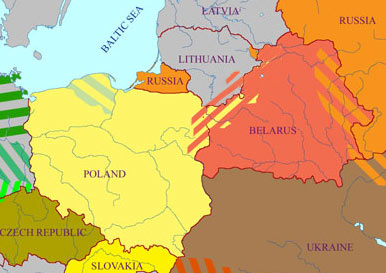

<table>
<tbody>
<tr class="odd">

<td>
  
<a href="articles/art_belarusian_poland2.html">this article in Belarusian</a>

<h1 id="an-unclaimed-creative-potential-or-the-belarusians-in-the-bialystok-region-as-a-trilingual-people">An Unclaimed Creative Potential or 
the Belarusians in the Bialystok Region as a Trilingual People</h1>

Jan Maksimiuk

<strong>1. Four important conclusions from the 2002 census in Poland</strong>

In the mid-2002 Poland held a national census, which for the first time in the country's post-war history included a question about ethnicity (<em>narodowość</em>) of respondents. On the nationwide scale the Belarusian ethnicity was declared by 48,700 people, including 46,400 in Podlasie Province (95 percent of Poland's Belarusians). The number of "officially attested" Belarusians in Poland is significantly lower than the optimistic estimates voiced by activists of Poland's Belarusian minority at various public forums in the 1980s and 1990s (from 150,000-250,000), but notably higher than the most pessimistic predictions made by the very same activists privately, in their own minority circle (10,000-20,000). However, regardless of all these "statistical discrepancies," when we compare the situation of Polish Belarusians with other ethnic and linguistic minorities in Europe, we can see that Poland's Belarusians live a normal "minority life" and continue to work — with many failures but also not without significant successes — against their assimilation by the Polish majority. The Belarusians in Poland, even if their actual number is below 50,000, are far away not only from the "ethnic death throes," but also from the symptoms of "ethnic degeneration" that could spell a beginning of their descent into oblivion. It is the first essential conclusion from the 2002 census.

 When analysing the census results broken down by gminas (Poland's basic administrative units) of Podlasie Province, we obtain the following important information: 37,000 Belarusians (nearly 80 percent of their total number in the province) belong to the so called subgroup of Podlasian Belarusians (<em>padlashy</em> in the Belarusian language), who live in the centre and south of Podlasie Province. In their everyday life <em>padlashy</em> use a language that is markedly different from the Belarusian literary language and its dialectal variants used by <em>litsviny</em>, that is, Belarusians living in the northern part of Podlasie Province. However, the language of <em>padlashy</em>, which is much closer to the Ukrainian than the Belarusian literary standard in terms of its phonetic and morphologic characteristics, has not become a decisive factor for the <em>padlashy</em>'s ethnic self-determination, despite efforts of the Union of Ukrainians of Podlasie, which made this language a pivotal argument in advancing its Ukrainianisation mission. The result of a 20-year-long Ukrainianisation process in Podlasie — 1,400 people who declared Ukrainian ethnicity in the census (2.8 percent of the number of Podlasie's Belarusians) — gives us the right to assert that the problem of Ukrainianisation will not have any significant influence on the further development of the Belarusian ethnic consciousness in the Bialystok region. It is the second essential conclusion from the 2002 census.

An analysis of the dynamics of the Polonisation of Belarusians in the Bialystok region — which is primarily possible thanks to estimates of the Belarusian-Orthodox community made by the communist authorities in 1945-46 — unambiguously shows that <em>litsviny</em> are assimilated by the Polish ethnic milieu two or three times faster than <em>padlashy</em>. This observation leads us to the third conclusion saying that the future of the Belarusian minority in Poland will be increasingly shaped by its <em>padlashy</em> demographic component, which is territorially centred in a quadrilateral with its vertices in Zabludow in the north, Hajnowka in the east, Bielsk in the west, and Czeremcha in the south. Perhaps it is not accidental that in the middle of this quadrilateral we have the Czyze gmina, where 82 percent of its inhabitants claimed Belarusian ethnicity (which is the highest ratio of registered Belarusians among all gminas in Podlasie Province). Even if the brain of the Belarusian ethnos in Podlasie Province is still placed in the provincial capital, Bialystok (the territory of <em>litsviny</em>), its vascular, respiratory, and motoric systems are certainly located between the rivers of Narew and Bug, in the habitat of <em>padlashy</em>. In other words, preserving the Belarusian ethnic identity of <em>padlashy</em> in Hajnowka and Bielsk Districts of Podlasie Province is tantamount to ensuring the survival of the Belarusian minority in Poland as a whole.

In reality the Belarusians in the Bialystok region are a trilingual community — apart from Polish and Belarusian, the overwhelming majority of them also speak a third language (or its local dialect), which has so far not been given any generally accepted name.

The fourth conclusion is connected with the 2002 census' question about the language (languages) that people commonly use at home. Belarusian as a language of domestic communication was declared by 39,900 people in Podlasie Province (82 percent of the total number of Belarusians in the province). This means that approximately 30,000 Belarusians belonging to the <em>padlashy</em> group officially identified their domestic language as Belarusian. From a "political" or an "emotional" point of view, this was a fully justifiable step. However, linguists and some others may have some justifiable arguments against such an identification, as well. The point is that in reality the Belarusians in the Bialystok region are a trilingual community — apart from Polish and Belarusian (or its dialectal variants), the overwhelming majority of them also speak a third language (or its local dialect), which has so far not been given any generally accepted name. This actual trilingualism of Belarusians in the Bialystok region was not registered by the 2002 census (at least, no such census data have been made public).

Our further considerations will be devoted to this third language of those Polish Belarusians who belong to the group of <em>padlashy</em>. Since this vernacular has no generally accepted name among its users, we will tentatively call it <em>Svoja mova</em> (literally: one's own language) or <em>Svoja</em> for short, proceeding from the fact that when you ask <em>padlashy</em> what language they speak at home, the most frequent answer will be this: We speak our own language (<em>po-našomu</em> or <em>po-svojomu</em>).

<strong>2. What is the purpose of this text?</strong>

This text is primarily an announcement of the recently initiated attempt to create a written, literary variant (variants) of <em>Svoja</em> and introduce it (them) into a wider use. At the same time, it is also an appeal to join this attempt to all those who see the need for such an accomplishment. This text substantiates, in social and cultural aspects, the need for the creation of a literary standard of <em>Svoja</em> and maps out tasks and priorities for what needs to be done in this regard. In other words, this text proposes some guidelines that in the future could be included in a programme for supporting and developing <em>Svoja</em> by a wider segment of society.

<strong>3. <em>Svoja</em> exists almost exclusively as a spoken language</strong>

So far, nobody in the Belarusian minority in Poland has analysed the reasons why <em>Svoja</em> -- the mother tongue of the overwhelming majority of Polish Belarusians — has been remaining in the "rural underground," being no more than an unpromising set of "unwritable" and "unlettered" local dialects that are doomed to perish in the period of urbanization and rapid development of the global communication sphere. We do not aspire in this text to identify all or even the main reasons for such a situation but we will try to make some suppositions.

Half a century ago, when the Belarusian minority in Poland set up the Belarusian Social and Cultural Association (BHKT) under circumstances of the post-Stalin political thaw, there could be not talk about taking into account the trilingual idiosyncrasy of Belarusians in the Bialystok region. The then authorities would have not allowed the <em>padlashy</em> to promote their own language even if there had been a distinct demand from their side. But such a demand was not voiced at that time.

To elevate the status to that of another written language could help to overcome the psychological alienation of a significant part of Belarusians in Poland who perceived the Belarusian literary language as something strange or not completely their own.

The political and psychological situation among Polish Belarusians changed in the early 1980s, when students of Belarusian ethnic origin in Poland organized the Belarusian Association of Students (BAS), which was lead primarily by <em>padlashy</em> activists. That period provided a good opportunity to "rehabilitate" <em>Svoja</em> and elevate its status to that of another written language of Polish Belarusians and, in this way, to overcome the psychological alienation of a significant part of Belarusian students who perceived the Belarusian literary language as something strange or not completely their own. However, it proved impossible to implement such a hypothetical plan with regard to <em>Svoja</em> because of an Ukrainianisation action undertaken by a group of BAS activists who wanted to redefine their identity as Ukrainian and split the dynamic movement of young Belarusians from within. Attempts to disorganise the movement of Belarusian students in Poland continued for some two or three years in the first half of the 1980s, until the BAS eventually got rid of Ukrainophile activists and broke social contacts with them. But the "Ukrainian syndrome" paralysed the "strategic thinking" in the Belarusian movement at that time to such a degree that nobody raised the issue of <em>Svoja</em> in a public forum in the subsequent 20 years. It was apparently believed that any initiative in this direction will only contribute to the Ukrainianisation of <em>padlashy</em>. As testified by the 2002 census, such an apprehension was very exaggerated, if not groundless altogether.

However, there have been attempts to publish texts in <em>Svoja</em> in the Bialystok region in the past century, even if on a statistically insignificant scale. In the 1970s, the Belarusian-language weekly "Niva" in Bialystok published a number of poems in <em>Svoja</em> by Zosia Sacko. Subsequently the Belarusian Literary Association Bielavieža published Sacko's three books of poems in <em>Svoja</em>: <em>Pošuki</em> (1982), <em>Nad dniom pochilana</em> (1991), <em>šce odna vesna</em> (1995). In 1981 "Niva" published a long poem by Ira Borovik, <em>Čas, kotory umiraje</em>. And in 2002 Bielavieža published a book of poems by Viktar Stachviuk, <em>Bahrovy cień</em>. Although not abundant in number, the poetical accomplishments of Sacko, Borovik, and Stachviuk clearly stand out in comparison with other authors in the Bialystok region, thus directly giving evidence to potentially large creative capabilities of the <em>padlashy</em> in their mother tongue. We will note here parenthetically that the <em>padlashy</em> have copiously proved their creativity primarily in the Belarusian language (the names of Nadzieja Artymovic, Jan Cykvin, and Viktar šved are the most representative in this context).

There is also a noteworthy publishing initiative by Doroteusz Fionik from Bielsk, who has published the periodical "Bielski hostinec" for the past seven years. "Bielski hostinec" publishes texts in three languages — Polish, Belarusian, and <em>Svoja</em> — and includes, among other materials, reminiscences of residents of Bielsk District written in <em>Svoja</em>. The periodical has no literary ambitions, therefore it does not raise the issue of a literary standard (standards) for <em>Svoja</em>.

<strong>4. What can and must be done for <em>Svoja</em>?</strong>

Belarusians in the Bialystok region need to clearly realize that if the <em>padlashy</em> lose their own language, one will be able to say that the Belarusian ethnic minority in Poland has been completely assimilated by Poles.

Belarusians in the Bialystok region need to clearly realize that if the <em>padlashy</em> lose their own language, one will be able to say that the Belarusian ethnic minority in Poland has been completely assimilated by Poles. It is possible that the assimilation of such a small ethnic community as Belarusians in the Bialystok region is historically unavoidable. However, we should not be indifferent to whether the history for Polish Belarusians will end after 50 or 100 years from now. By giving <em>Svoja</em> the status of a "public" language in the printed and electronic media available for the Belarusian minority in Poland, we will considerably slow down their assimilation. Simultaneously we can open unforeseen possibilities of artistic self-fulfilment for those potential authors among the <em>padlashy</em> who feel themselves "uncomfortable" in Belarusian or Polish. At the same time, we can also relieve the <em>padlashy</em> of the feeling of linguistic "inferiority" and "second-rateness" in comparison with their Belarusian compatriots, <em>litsviny</em>, who were historically lucky to have developed a full-fledged literary language.

In theory, the simplest way to begin the "rehabilitation" of <em>Svoja</em> is to start using it in the Belarusian-language media in which <em>padlashy</em> account for no less than 50 percent of their workforce. I mean primarily "Niva," "Czasopis," and "Pravincyja" as well as Belarusian-language broadcasts of Polish Radio and Polish Television in Bialystok. The printed media should publish both reader letters and editorials as well as stimulate and encourage writing original literary pieces in <em>Svoja</em>. Radio and television journalists in Bialystok should air more frequently interviews with local residents in <em>Svoja</em>.

At present the Belarusian-language journalists in Podlasie should not be particularly concerned about the standardization of <em>Svoja</em>. It is well known that the central and southern Bialystok region comprises a mosaic of local dialects that hypothetically can, but do not have to, serve as the basis for working out a single (or several) standard variant (variants) of <em>Svoja</em>. During the first stage of the building of <em>Svoja</em> the principal task should be to examine "public demand" and "public supply" in connection with the switchover of <em>Svoja</em> to a written-language status. In other words, the primary concern should be focused on creating a "corps of texts" in <em>Svoja</em> local dialects, as extensive as possible, in order to use it in the future as the basis for compiling <em>Svoja</em> dictionaries and grammars.

The dialects of <em>Svoja</em> can be classified and identified according to different phonetic and morphological features. Belarusian linguist Khvedar Klimchuk, a specialist in the East Slavonic dialects of the Bialystok region in particular and of the Western Palesse of the Republic of Belarus in general, proposed a very elegant classification in this regard. According to Klimchuk, dialects of <em>Svoja</em> in the Bialystok region can be divided into three (or even four) groups, depending on how the consonants d and t behave before the etymologic e and i. Thus, in the first group of <em>Svoja</em> dialects we have <em>deń, teper, choditi (chod'it'i)</em>; in the second — <em>deń, teper, chodyty</em>; in the third — <em>deń, teper, chodzici</em>.

 From a purely theoretical point of view, we can assume that on the path toward a single, unified literary variant of <em>Svoja</em>, it will be necessary to pass through an interim stage, in which three literary subvariants may be standardised to reflect the three above-mentioned groups of local dialects. Such a situation for less known "micro-languages" is a rule rather than an exception. In Switzerland some 40,000 people declare the Swiss Rheto-Romansh language (Rumantsch) as their native tongue. Rumantsch exists in five dialectal variants (each of them has a normalized written form) and as a supraregional Rheto-Romansh language (Romantsch grischun), which was artificially synthesized in 1982 on the basis of the five above-mentioned dialects. All these tongues in general and each of them in particular are referred to with the same name — <em>Rumantsch</em>. On the other hand, Rusyns (who are more known in Poland as Lemkos), which have been working to create a Rusyn language since 15 years, have not yet agreed on a single supraregional variant and continue to work simultaneously on four varieties that are characteristic for the region of their residence in Poland, Slovakia, Ukraine, and Serbia.

<strong>5. What will the magazine "Pravincyja" be doing for <em>Svoja</em>?</strong>

The literary magazine "Pravincyja" <em>[the atuhor, Jan Maksimiuk, is one of the editors of that magazine]</em> in Bialystok, which has usurped the title of a trailblazer in the purposeful effort to bring to life one more East Slavonic literary language — <em>Svoja</em> — will soon publish translations of contemporary Danish and Swiss authors into <em>Svoja</em>, thus inaugurating the attempt to expand the vocabulary and syntax of this language to such an extent when it becomes able to serve well not only communication requirements of Belarusians in the Bialystok region but also the satisfaction of the aesthetic needs that they have as either readers or authors.

Proceeding from the observation that the circle of active users of the Cyrillic script among Belarusians in the Bialystok region is unavoidably shrinking, the editors of "Pravincyja" has adapted the Latin alphabet for reproducing the sounds of <em>Svoja</em> in writing. From a purely practical point of view, using the Latin script for writing in <em>Svoja</em> seems to be much more promising that adapting the Cyrillic alphabet for this purpose. But the editors of "Pravincyja" are not going to demand a change of the script from those authors who will supply texts in <em>Svoja</em> written in the "traditional" Cyrillic form.

<em>The author presented this text at the "Belarusian Trialogue 2004,” which was organized by Belarusian writer Sakrat Janovic in Lapicze, north-eastern Poland, on 30 July 2004.</em>

See also: 
 
- <strong><a href="articles/art_belarusian_poland2.html">An Unclaimed Creative Potential or the Belarusians in the Bialystok Region as a Trilingual People</a></strong> - the Belarusian version of this article by Jan Maksimiuk 
- <strong><a href="articles/art_belarusian_poland_sample.html">Graham Greene's story "Nevinny"</a></strong> - a sample of Svoja 

 

<a href="gb_add.html?ref=http%3A%2F%2Fwww%2Epravapis%2Eorg%2Fart%5Fbelarusian%5Fpoland%2Easp">- Write your comment</a>
</td>
</tr>
</tbody>
</table>
