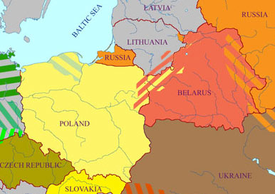
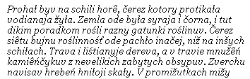

<a href="articles/art_belarusian_poland.html">This article in English</a>

Ян Максімюк

<strong>1. Чатыры важныя высновы зь перапісу насельніцтва ў Польшчы ў 2002 г.</strong>

 У палове 2002 году ў Польшчы адбыўся агульны перапіс насельніцтва, у якім упершыню ў пасьляваеннай гісторыі краіны было пастаўленае пытаньне пра нацыянальную прыналежнасьць (narodowo ) рэспандэнтаў. Ува ўсёй краіне беларусамі запісаліся 48 700 чалавек, у тым ліку 46 400 у Падляскім ваяводзтве (што складае 95% усіх польскіх беларусаў). Лік „афіцыйна сьцьверджаных” беларусаў у Польшчы значна ніжэйшы за аптымістычныя ацэнкі, якія гучалі з вуснаў дзеячоў беларускага руху на розных публічных форумах у 1990-х або 1980-х гадох (калі называліся лікі ад 150 000 да 250 000), але заўважна вышэйшы за найбольш пэсымістычныя прагнозы, якія з нагоды агульнадзяржаўнага перапісу рабіліся гэтымі самымі дзеячымі „паціху” ў сваім нацыянальна-меншасным коле (10 000-20 000). Аднак нягледзячы на ўсе гэтыя „статыстычныя нестыкоўкі” параўнаньне сытуацыі польскіх беларусаў зь іншымі нацыянальнымі і моўнымі меншасьцямі ў Эўропе дае нам права сьцьвярджаць, што беларуская меншасьць у Польшчы жыве нармальным „меншасным жыцьцём”, спрабуючы ※ з шматлікімі няўдачамі, але і не без істотных посьпехаў ※ супрацьставіцца асыміляцыі дзяржаўнай большасьцю. Беларусы ў Польшчы ※ нават калі іх сапраўды ня больш за 50 000 ※ далёкія ня толькі ад „нацыянальнай агоніі”, але і ад сымптомаў „нацыянальнай дэгенэрацыі”, якая прадвяшчала б пачатак шляху да сьмерці. Ыэта першая істотная выснова зь перапісу насельніцтва 2002 г.

Аналіз вынікаў перапісу па гмінах Падляскага ваяводзтва дае нам гэткую важную інфармацыю: 37 000 беларусаў (каля 80% іх агульнага ліку ў ваяводзтве) належыць да гэтак званых „падляшоў” зь сярэдне-паўднёвай часткі Беласточчыны, г.зн., людзей, якія штодня карыстаюцца мовай выразна адрознай ад беларускай літаратурнай мовы і яе дыялектных варыянтаў. Мова падляшоў ※ паводле сваіх фанэтычных і марфалягічных парамэтраў значна бліжэйшая да ўкраінскага чым да беларускага літаратурнага стандарту ※ ня сталася, аднак, вызначальным чыньнікам іхнай нацыянальнай ідэнтыфікацыі, нягледзячы на намаганьні Саюзу Ўкраінцаў Падляшша, якія гэтую мову ўчынілі галоўным аргумэнтам свае ўкраінізатарскае місіі. Вынік 20-гадовай украінізацыі нашага Падляшша ※ 1 400 перапісных украінцаў (2.8% ад ліку беластоцкіх беларусаў) ※ дае нам права сьцьвердзіць, што праблема украінства ня будзе мець істотнага ўплыву на далейшае разьвіцьцё беларускай нацыянальнай сьвядомасьці на Беласточчыне. Ыэта другая істотная выснова зь перапісу 2002 г., на якую хочам зьвярнуць увагу.

Аналіз дынамікі палянізацыі беластоцкіх беларусаў※ магчымы перш за ўсё дзякуючы колькаснай ацэнцы праваслаўна-беларускай грамады на Беласточчыне, якая была зробленая камуністычнай уладай у 1945-46 гадох ※ недвухсэнсоўна паказвае, што беларусы-ліцьвіны асымілююцца ў польскай нацыянальнай стыхіі ў два-тры разы хутчэй, чым беларусы-падляшы. Ыэтае назіраньне падводзіць нас да трэцяй высновы, якая сьцьвярджае, што далейшую жыцьцёвую пэрспэктыву беларускай нацыянальнай меншасьці ў Польшчы ў штораз большай ступені будзе вырашаць яе падляшоўскі дэмаграфічны кампанэнт, тэрытарыяльна ўцэнтраваны ў чатырохкутніку, які ўтвараюць Заблудаў (на поўначы), Ыайнаўка (на ўсходзе), Бельск (на захадзе) і Чаромха (на поўдні). Мусіць, невыпадкова, што ў сярэдзіне гэтага чатырохкутніка знаходзіцца гміна Чыжы, дзе беларусамі запісаліся 82% яе насельнікаў ※ прапарцыйна найбольш з усіх іншых гмінаў Беласточчыны. Нават калі мозг беларускага этнасу на Падляшшы далей месьціцца ў сталіцы ваяводзтва, Беластоку („ліцьвінскай тэрыторыі”) ※ дык яго крывяносная, дыхальная і маторная сыстэмы напэўна знаходзяцца паміж Нарвай і Бугам, у селішчы падляшоў. Інакш кажучы, захаваць беларускую нацыянальную сьвядомасьць сярод падляшоў Ыайнаўскага і Бельскага паветаў наўпрост абазначае захаваць жыцьцяздольнасьць беларускай нацыянальнай меншасьці ў Польшчы наагул.

Чацьвертая выснова зьвязаная з пытаньнем перапісу 2002 г. пра мову (мовы), якую (якія) людзі найчасьцей ужываюць дома. Беларускую як мову хатняй камунікацыі дэкляравалі 39 900 чалавек у Падляскім ваяводзтве (82% ад агульнага ліку запісаных беларусаў). Ыэта абазначае, што прыблізна 30 000 беларусаў-падляшоў афіцыйна ідэнтыфікавала сваю мову як беларускую. З „палітычнага” або „эмацыйнага” пунктаў гледжаньня гэта быў цалкам апраўданы крок. Лінгвісты ды яшчэ некаторыя іншыя могуць тут мець засьцярогі, таксама цалкам апраўданыя. Сутнасьць праблемы ў тым, што беларусы Беласточчыны ※ народ у сапраўднасьці трохмоўны: акрамя дзяржаўнай польскай і літаратурнай беларускай (або яе дыялектных варыянтаў), пераважная большасьць зь іх яшчэ валодае трэцяй мовай (у гутарковай форме), для якое пакуль што не знайшлося агульнапрынятага пайменаваньня. Ыэтая фактычная трохмоўнасьць польскіх беларусаў не была зарэгістраваная перапісам 2002 г. (прынамсі нічога такога не вынікае з дадзеных перапісу, якія даступныя шырэйшай публіцы).

Нашы далейшыя разважаньні будуць прысьвечаныя пытаньню гэтай трэцяй, „падляшоўскай” мовы польскіх беларусаў. Паколькі гэтая мова ня мае агульнапрынятай назвы сярод яе носьбітаў і карыстальнікаў, мы назавем яе ў рабочым парадку СВАЁЙ МОВАЙ, грунтуючыся на тым, што найбольш частым адказам на пытаньне ў падляшоўскай беларускай вёсцы ※ Po-jakomu vy hovoryte doma? ※ будзе „Po-na omu” або „Po-svojomu”.

<strong>2. Якой мэце служыць гэты тэкст?</strong>

Ыэты тэкст ёсьць перш за ўсё паведамленьнем аб нядаўна распачатай спробе стварыць літаратурны варыянт (літаратурныя варыянты) сваёй мовы і ўвесьці яго (іх) у шырэйшы пісьмовы ўжытак. Адначасова гэта і заклік далучыцца да гэтай спробы, зьвернуты да ўсіх тых, хто (ў)бачыць сэнс і патрэбу ў гэткім пачыне. ладзены тэкст абгрунтоўвае, у грамадзкім і культурным вымярэньнях, патрэбу ў стварэньні літаратурнага стандарту сваёй мовы і вызначае заданьні і прыярытэты таго, што можна, трэба і належыць зрабіць у гэтым накірунку. Інакш кажучы, тэкст прапануе некаторыя палажэньні, якія ў будучыні маглі б увайсьці ў прынятую нейкай шырэйшай грамадзкасьцю праграму падтрыманьня і разьвіцьця сваёй мовы.

<strong>3. Свая мова існуе амаль выключна як гутарковая мова</strong>

лагэтуль ніхто ў беларускім асяродзьдзі ў Польшчы не займаўся аналізам прычынаў, чаму свая мова ※ родная мова пераважнай большасьці польскіх беларусаў ※ заставалася „ў вясковым падпольлі”, на правох беспэрспэктыўнага набору „не-пісьмовых” і „не-пісьменных” гаворак, якім наканаваня непазьбежная сьмерць ў пэрыяд урбанізацыі і імклівага разьвіцьця глябальнай інфармацыйнай прасторы. Мы не прэтэндуем на тое, што ў дадзеным тэксьце вызначым усе ※ ці нават галоўныя ※ прычыны гэткай сытуацыі, але пастараемся выказаць некаторыя здагадкі.

Калі паўвеку таму, у варунках пасьлясталінскай палітычнай адлігі, на Беласточчыне арганізаваўся беларускі нацыянальны рух пад шыльдай Беларускага грамадзка-культурнага таварыства (БЫКТ), размова пра ўлік падляшоўскай моўнай спэцыфікі ў руху нямагла стаяць на парадку дня з аб’ектыўных прычын ※ тагачасная ўлада такі ўлік ніколі не дазволіла б, нават калі б існавала выразнае дамаганьне зь беларускага асяродзьдзя. Але такога дамаганьня не было.

Палітычная і псыхалягічная сытуацыя сярод польскіх беларусаў зьмянілася ў пачатку 1980-х, калі ўзьнік маладабеларускі рух пад шыльдай Беларускага аб’яднаньня студэнтаў (БАС), у якім галоўныя ролі адыгрывалі студэнты-падляшы. Тады была вельмі добрая нагода „рэабілітаваць” сваю мову і падняць яе ранг да яшчэ адной пісьмовай мовы польскіх беларусаў ды гэткім чынам пераадолець псыхалягічную адчужанасьць значнай часткі нашага студэнцтва, якая беларускую літаратурную мову ўспрымала як нешта чужое або не зусім сваё. Аднак жа ажыцьцявіць гэткі гіпатэтычны плян не ўдалося з увагі на ўкраінізацыйную акцыю часткі студэнцкіх актывістаў, якія захацелі стаць украінцамі і разваліць дынамічны маладабеларускі рух зь сярэдзіны. Спробы гэткай дэзарганізацыі назіраліся на працягу двух-трох гадоў у першай палове 1980-х, пакуль БАС канчаткова ня „выдаліў” украінафільскіх актывістаў з сваіх структураў і не адмежаваўся ад падляскіх украінцаў нават у сфэры чыста таварыскіх кантактаў. Аднак „украінскі сындром” настолькі паралізаваў тагачаснае „стратэгічнае думаньне” ў беларускім студэнцкім і пазастудэнцкім руху, што ніхто ўсур’ёз не ўзьнімаў пытаньня сваёй мовы на публічным форуме на працягу наступных 20 гадоў. Лічылася, відаць, што ўсялякія ініцыятывы ў гэтым накірунку будуць адно спрыяць украінізацыі падляшоў. Як паказаў перапіс насельніцтва 2002 г., гэткая боязь была вельмі перабольшаная, калі зусім не беспадстаўная.

Усё ж спробы публікацыі тэкстаў на сваёй мове на Беласточчыне мелі месца, хоць і ў інцыдэнтальным абсягу. У 1970-х вершы на сваёй мове публікавала ў „Ніве” Зося Сачко ※ пад шыльдай Беларускага літаратурнага аб’яднаньня „Белавежа” выйшлі тры ейныя паэтычныя зборнікі: Пошукі (1982), Над днём похіляна (1991), Шчэ одна вэсна (1995). У 1981 „Ніва” апублікавала паэму Іры Баравік Час, которы ўмірае, напісаную па-свойму. У 2002 „Белавежа” выдала паэтычны томік Віктара Стахвюка Багровы цень на сваёй мове. Хоць інцыдэнтальныя ў статыстычным аспэкце, паэтычныя зьдзяйсьненьні Сачко, Баравік і Стахвюка сваімі мастацкімі вартасьцямі выразна ўзвышаліся па-над сярэднім літаратурным узроўнем Беласточчыны, непасрэдна даказваючы патэнцыйна вялікія творчыя магчымасьці беларусаў-падляшоў у сваёй мове. Мімаходам адзначым, што беларусы-падляшы шчодра даказалі сваю літаратурную крэатыўнасьць перш за ўсё ў беларускай літаратурнай мове (прозьвішчы Надзеі Артымовіч, Яна Чыквіна і Віктара Шведа будуць тут найбольш паказальныя).

Адназначна вартым увагі пачынам, накіраваным на рэгістрацыю жывых падляскіх гаворак сваёй мовы, ёсьць краязнаўча-культурны часопіс „Бельскі гостінэць”, які ўжо сёмы год выдае ў Бельску ларафей Фіёнік. Часопіс выходзіць на трох мовах ※ польскай, беларускай і сваёй ※ і сярод іншых матэрыялаў публікуе ўспаміны жыхароў вёсак Бельскага павету, запісаных па-свойму. Часопіс ня мае літаратурных амбіцый, таму пытаньне нейкага літаратурнага стандарту (стандартаў) сваёй мовы там праграмна ня ставіцца.

<strong>4. Што можна і трэба зрабіць для сваёй мовы?</strong>

Беларусам Беласточчыны трэба ясна ўсьвядоміць, што калі беларусы-падляшы згубяць сваю мову, можна будзе гаварыць аб поўнай асыміляцыі беларускай нацыянальнай меншасьці ў Польшчы. Магчыма, што асыміляцыя гэткай малой меншаснай групы як беластоцкія беларусы непазьбежная ў гістарычнай пэрспэктыве. Аднак нам павінна быць неабыякава, ці такая пэрспэктыва скончыцца празь 50 ці 100 гадоў. Узьвёўшы сваю мову ў ранг „публічнай” мовы, для якой знойдзецца паўнапраўнае месца ў друкаваных і аўдыявізуальных сродках масавай інфармацыі, што даступныя беларускай меншасьці, мы можам гэткую асыміляцыю значна адсунуць у часе. Заадно мы можам адкрыць непрадчуваныя магчымасьці мастацкай самарэалізацыі тых патэнцыйных творцыў сярод беларусаў-падляшоў, які пачуваюць сябе „няўтульна” ў беларускай або польскай мовах. Заадно таксама мы можам зьняць зь беларусаў-падляшоў псыхалягічна гнятлівую ношу моўнай „горшасьці” і „другаснасьці” ў параўнаньні зь іхнымі братамі, беларусамі-ліцьвінамі, якім гістарычна пашанцавала займець паўнакроўную літаратурную мову.

Тэарэтычна гледзячы на справу, найпрасьцей пачаць акцыю „рэабілітацыі” сваёй мовы празь беларускамоўныя сродкі масавай інфармацыі, у якіх беларусы-падляшы складаюць ня менш за 50 працэнтаў творча-прафэсійных сілаў. Я маю перш за ўсё на ўвазе „Ніву”, „Часопіс”, „Правінцыю” і беларускамоўныя перадачы польскага радыё і тэлебачаньня ў Беластоку. лрукаваныя выданьні павінны пачаць публікацыю як чытацкіх допісаў, гэтак і рэдакцыйных матэрыялаў на сваёй мове, ды стымуляваць і спрыяць публікацыі літаратурных твораў, пісаных па-свойму. Беластоцкія радыё- і тэлежурналісты павінны больш актыўна скарыстоўваць у сваіх праграмах і рэпартажах запісы гутарак зь мясцовымі жыхарамі на сваёй мове.

У дадзены момант беларускія журналісты не павінны занадта турбавацца праблемамі стандартызацыі і ўніфікацыі сваёй мовы. Вядома, што сярэдне-паўднёвая Беласточчына ※ гэта мазаіка гаворак, якія гіпатэтычна могуць, але ня мусяць, паслужыць асновай для выпрацаваньня аднаго (або некалькіх) літаратурных варыянтаў сваёй мовы. На першым этапе галоўным заданьнем павінна быць вывучэньне „грамадзкага попыту” і „грамадзкай прапановы” ў сувязі зь пераходам сваёй мовы на статус пісьмовай. Інакш кажучы, першачарговай праблемай павінна стацца імкненьне да стварэньня як мага большага „корпусу тэкстаў” на ўсіх магчымых гаворках сваёй мовы на Беласточчыне, які мог бы паслужыць асновай для стварэньня слоўнікаў і граматык гэтай мовы ў будучыні.

Ыаворкі сваёй мовы можна склясыфікаваць і паназываць паводле розных фанэтычна-марфалягічных крытэрыяў. Нам найбольш прыпала да густу адна з клясыфікацый, запрапанаваных беларускім моваведам Хведарам Клімчуком, спэцыялістам па гаворках сярэдне-паўднёвай Беласточчыны ў прыватнасьці і Заходняга Палесься ў Рэспубліцы Беларусь наагул. Паводле Клімчука, беластоцкія гаворкі сваёй мовы можы разьдзяліць на тры (ці нават чатыры) групы, у залежнасьці ад таго, як паводзяць сябе зычныя d і t перад этымалягічнымі е і і. Значыць, у першай групе гаворак мы маем de , teper, choditi (choditi); у другой ※ de , teper, chodyty; у трэцяй ※ de , teper, chodzici.

Зноў жа, разважаючы чыста тэарэтычна, можна дапусьціць, што на шляху да аднаго, уніфікаванага літаратурнага варыянту сваёй мовы трэба будзе прайсьці праз прамежкавы этап, на якім будуць уніфікаваныя тры літаратурныя падварыянты, што будуць адпавядаць тром вышэй згаданым групам гаворак. Ыэткая сытуацыя для малавядомых „мікрамоваў” зусім не выключэньне, а хутчэй за ўсё ※ правіла. У Швэйцарыі каля 40 000 чалавек роднай мовай лічаць швэйцарскую рэтараманскую мову (Rumantsch). Rumantsch існуе ў пяці дыялектных варыянтах (кожны зь іх мае нармалізаваную пісьмовую форму) і дадаткова як штучна створаная ў 1982 г. агульная рэтараманская мова (Rumantsch grischun), у аснову якой ляглі ўсе пяць мясцовых варыянтаў. Усе гэтыя мовы разам і кожная паасобку называюцца адным агульным паймом ※ Rumantsch. З другога боку, русіны (у Польшчы больш вядомыя як лэмкі), якія ўжо 15 гадоў рупяцца пра стварэньне русінскае мовы адрознае ад украінскай, пакуль што не дамовіліся аб стварэньні аднаго надрэгіянальнага варыянту („koine”) і працуюць раўнабежна над чатырма характэрнымі для рэгіёнаў іхнага расьсяленьня ў Польшчы, Славаччыне, Украіне і Сэрбіі.

<strong>5. Што для сваёй мовы будзе рабіць часопіс „Правінцыя”?</strong>

Літаратурна-мастацкі беластоцкі часопіс „Правінцыя” [ *аўтар артыкулу, Ян Максымюк, зьяўляецца адным з рэдактараў часопісу* ], які самазванча прысвоіў сабе тытул першапраходца ў мэтанакіраваным намаганьні паклікаць да жыцьця яшчэ адну літаратурную ўсходнеславянскую мову ※ СВАЮ ※ неўзабаве ў сваім чарговым выпуску апублікуе пераклады з сучасных дацкіх і швэйцарскіх аўтараў на сваю мову, гэткім чынам запачаткоўваючы спробы разбудовы лексыкі і сынтаксісу гэтай мовы да такіх памераў, калі яна зможа добра абслугоўваць ня толькі камунікацыйныя патрэбы беластоцкіх беларусаў, але і стацца спраўнай прыладай задавальненьня эстэтычных патрэбаў у сфэры літаратуры ※ ціто як чытачом, ціто як творцам.

Зыходзячы з назіраньня, што кола актыўных карыстальнікаў кірылічнай азбукай сярод беластоцкіх беларусаў няўмольна звужаецца, рэдакцыя „Правінцыі” распрацавала лацінскі варыянт альфабэту для дакладнай перадачы гукаў сваёй мовы на пісьме. З чыста практычнага пункту гледжаньня, выкарыстаньне лацінкі для запісу сваёй мовы падаецца нашмат больш пэрспэктыўным, чым адаптацыя кірыліцы для гэтай самай мэты. Але рэдакцыя ня будзе настойваць на зьмене графікі у выпадку тых аўтараў сваёй мовы, якія запрапануюць ёй тэксты ў „традыцыйным” кірылічным афармленьні.

*Тэкст выступу аўтара 30 ліпеня 2004 на „Беларускім трыялёгу 2004”, арганізаваным Сакратам Яновічам у Лапічах (Крынкаўская гміна). лля часапісу “Правінцыя”. На сайце pravapis.org перадрукоўваецца з дазволу аўтара.*

