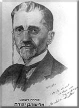

<h1 id="eliezer-ben-yehuda-and-the-revival-of-hebrew-1858-1922">Eliezer Ben-Yehuda and the Revival of Hebrew 
(1858-1922)</h1>

by <a href="#jack_footnote" title="click to see the footnote">Jack Fellman*</a>

In his pioneering work on language revivals and language revivers published in 1966, the American linguist Einar Haugen wrote: "It appears to be almost the rule that such movements can be traced back to a single devoted person, who gave focus to the prevailing dissatisfactions of his people. Having issued from the group whose language was neglected, such reformers often had more than a purely intellectual motivation for establishing the existence of their language. Theirs became one contribution to the general liberation of the group, a medium of revolt and a symbol of unity." For the Hebrew language revival, one of the truly outstanding socio-linguistic events of modern times, this characterization is eminently true of Eliezer Ben-Yehuda.

Eliezer Ben-Yehuda, was born Eliezer Yitzhak Perelman, in the  <a href="#luzhki_footnote" title="click to see the footnote"><strong>Lithuanian (!) village of Luzhky**</strong></a> on January 7, 1858. Like virtually all Jewish children of that time and place he began learning Hebrew from a very tender age as part of a thoroughly religious upbringing. He excelled in his studies and ultimately was sent to  <a href="#yeshiva_footnote" title="click to see the footnote">a talmudic academy (yeshiva)***</a> in the hope that he would become a rabbi. However, like many promising young Jews of the time in eastern Europe, he became interested in the secular world and ultimately exchanged the yeshiva for a Russian gymnasium, completing his studies as an external student in 1877. In the same year Russia proclaimed war on the Ottoman Empire to aid their fellow Slavs, the Bulgarians, to regain their independence from the Turks. Ben-Yehuda was captivated by the idea of restoring to the Bulgarians their rights and reviving the Bulgarian nation on its national soil. In the 19th century, several European nations had been so revived, perhaps the most celebrated being the Greeks, the heirs of Classical Athens, in 1829, and the Italians, the heirs of Classical Rome, in 1849. Ben-Yehuda was deeply influenced by such revivals and came to the conclusion that the European concept of national fulfilment should also be applied to his people, the Jews. He felt deeply that if the Bulgarians, who were not an ancient, classical people, could demand and obtain a state of their own, then the Jews, the People of the Book and the heirs of historic Jerusalem, deserved the same. True, Eretz-Israel, the land of the Jews, contained few Jews in the 19th century, and the language of the Jews, Hebrew, was virtually only a written language and not a spoken tongue, but he felt these obstacles were not insurmountable. The Jews must return to their land and begin anew to speak their own language.

Acting on these ideas, Ben-Yehuda determined that he himself should go to Palestine. He left  <a href="#russia_footnote" title="click to see the footnote">Russia****</a> in 1878, first going to Paris to study medicine, so as to be of future help to the Jewish community in Palestine. However, due to his own health problems (tuberculosis), Ben-Yehuda was unable to continue his studies, yet, to his eternal credit, he did not waver in his convictions, and in 1881 he arrived in Palestine with his revival plans for the Hebrew language intact. Indeed, while still abroad, he had pondered upon the revival question deeply, and had published several articles in various Hebrew periodicals on the triple question of the renaissance of the Jewish people, their land, and their language. Indeed, these early articles can be considered forerunners of modern political Zionism, for in them are included the basic elements pertinent to Jewish nationalism: settlement policy, the revival of the Hebrew language, literature, and culture in the national homeland. Ben-Yehuda settled in Jerusalem, where most Jews of Palestine lived in their various communities, planning to use the town as the base for spreading his revivalist ideas throughout Palestine and the Diaspora.

Ben-Yehuda adopted several plans of action. The main ones were three-fold, and they can be summarized as "Hebrew in the Home," "Hebrew in the School," and "Words, Words, Words."

As far as "Hebrew in the Home" was concerned, even before coming to Palestine, as a result of his first successful prolonged Hebrew conversation, Ben-Yehuda had decided to speak only Hebrew with every Jew he met. From what is known, this first conversation took place either with Getzel Zelikovitz or Mordechai Adelman, in a cafe on the Boulevard Montmartre in Paris. Since Ben-Yehuda had proved to himself that he could speak Hebrew successfully with friends and acquaintances, he wanted Hebrew to be his only language when he arrived in Palestine. It should be noted that this was not too difficult for him, except perhaps for a shortage of Hebrew words on certain topics. Indeed, Ben-Yehuda relates with great enthusiasm his first conversations in Hebrew when he and his wife disembarked from the boat in Jaffa, and he talked with a Jewish money-changer, a Jewish innkeeper, and a Jewish wagoneer, all in Hebrew. For here he had encountered simple people who could speak Hebrew, perhaps with mistakes, but still more or less naturally and freely. But Ben-Yehuda wanted the Jews in Palestine to speak Hebrew exclusively. Therefore, when his first son, Ben-Zion Ben-Yehuda (or, as he is more commonly known, Ittamar Ben-Avi), was born in 1882, Ben-Yehuda made his first wife Deborah promise to raise the boy as the first all-Hebrew speaking child in modern history.

According to Ben-Yehuda, this was a very important symbolic event for the future of the revival, because, with a child in the house, parents and visitors would have to speak naturally to him, and to converse on the most everyday topics, all in Hebrew. And when the child would finally begin to speak on his own, Ben-Yehuda would have living proof that a complete revival of the language was, indeed, possible.

As Ben-Yehuda wrote in the introduction to his dictionary, "If a language which has stopped being spoken, with nothing remaining of it save what remains of our language - (if there is such a language) can return and be the spoken tongue of an individual for all necessities of his life, there is no room for doubt that it can become the spoken language of a community."

Ben-Yehuda and his Hebrew-speaking family became a living legend, an embodiment of the revival for others to emulate.

And this is indeed what happened. Ittamar Ben-Avi, in his autobiography, describes (albeit somewhat over-romanticized), some of the drastic precautions taken by Ben-Yehuda to ensure his son would hear-and thus ultimately speak-only Hebrew. Thus, for example, when visitors came to the house who did not know Hebrew, Ben-Yehuda would send him to bed so that he would not hear their foreign languages. Similarly, he would not let the child listen to "the chirping of the birds and the neighing of horses, the braying of donkeys and the fluttering of butterflies, because even they are, after all, foreign languages, at any rate not Hebrew." Indeed, the child only began to speak at the relatively late age of four. His mother could not keep to Ben-Yehuda's demand, and speak to the child only in Hebrew. One day, when Ben-Yehuda was out of the house, she began absent-mindedly singing lullabies to the child in her native Russian. Ben-Yehuda had returned early and when he heard Russian being used inside his house, he rushed in and began shouting. Ittamar wrote about the bitter scene that followed: "It caused a great shock to pass over me when I saw my father in his anger and my mother in her grief and tears, and the muteness was removed from my lips, and speech came to my mouth."

The fact that there was a child in the house accentuated the need to find appropriate Hebrew words for the mundane things of everyday life. Thus, new Hebrew words were coined by Ben-Yehuda for objects such as doll, ice-cream, jelly, omelette, handkerchief, towel, bicycle, and hundreds more. As the child grew, so did Hebrew, both in vocabulary and in naturalness of expression. Indeed, Ben-Yehuda and his Hebrew-speaking family became a living legend, an embodiment of the revival for others to emulate.

He had dwelt on the way the Russian language had become rooted among the youth in Russia, even among those for whom it was not their mother tongue...

Of all the steps Ben-Yehuda took to revive Hebrew, the use of "Hebrew in the School" was clearly the most important, and Ben-Yehuda realized this. In his first articles, written while abroad, he had dwelt on the way the Russian language had become rooted among the youth in Russia, even among those for whom it was not their mother tongue, through being introduced as the language of instruction in schools. On the same principle, Ben-Yehuda preached that rabbis and teachers should use Hebrew as the language of instruction in the Jewish schools in Palestine, and for all subjects, both religious and secular. Ben-Yehuda understood that the revival could succeed especially, and perhaps only, if the younger generation would begin to speak Hebrew freely. Therefore, when Nissim Bechar, the principal of the Torah and Avodah School of the Alliance Israelite Universelle School in Jerusalem proposed to Ben-Yehuda in 1882 that he teach in his school, Ben-Yehuda seized the chance. Bechar understood the necessity of using Hebrew in the school, because, for the first time, children from several different Jewish communities would be studying in the same classroom, and they had no other common language which could be used. Bechar explained to Ben-Yehuda his method of teaching Hebrew through Hebrew, a direct system, with no translation into other tongues-a system which had already been used in teaching French and other languages. Bechar had already tried the system in Hebrew in the Alliance School in Istanbul, which he had headed before coming to Jerusalem. Ben-Yehuda was able to teach for only a brief period, due to health reasons, but his Hebrew teaching was successful. After just a few months, the children were able to chatter fluently in Hebrew on daily topics connected with eating and drinking, clothing, daily life and events inside and outside the home.

It was clear to Ben-Yehuda that herein lay the very future of the revival. If children could learn Hebrew from a young enough age in school, they would become virtually unilingual in Hebrew when they grew up. In his words: "The Hebrew language will go from the synagogue to the house of study, and from the house of study to the school, and from the school it will come into the home and... become a living language" (Hatzvi, 1886).

And thus it came to pass. Ben-Yehuda's personal example and his teaching success made a great impression on other teachers. True, teaching in Hebrew involved many problems: lack of trained teachers, lack of textbooks, lack of materials such as games or songs, lack of terminologies and so on. David Yudeleviz, an early teacher, wrote in 1928: "In a heavy atmosphere, without books, expressions, words, verbs and hundreds of nouns, we had to begin... teaching. It is impossible to describe or imagine under what pressure the first seeds were planted... Hebrew teaching materials for elementary education were limited... We were half-mute, stuttering, we spoke with our hands and eyes." Another prominent teacher, David Yellin, wrote in the same vein: "Every teacher had a French or Russian teaching book of his own, and he organized his Hebrew work according to it... Terms for teaching did not exist. Every village teacher was an Academy (of the Hebrew Language) member with respect to creating words according to his taste, and everyone, of course, used his own creations." However, as time went on, all these linguistic problems were ultimately solved, and a young all-Hebrew speaking generation did emerge and develop, thus ensuring beyond anything else that the revival would be a success.

Indeed virtually every Jew in Palestine at the end of the 19th century could read and understand a Hebrew newspaper without too much difficulty.

Besides teaching the youth, Ben-Yehuda also wanted to attract adults to his ideas. After writing for a few years in the local paper, Hahavatzelet, he began to publish his own newspaper Hatzvi, in 1884, to serve as an instrument for teaching adults, both via its content and its language. Newspapers in Hebrew were at that time still somewhat of a novelty, the first one having appeared in the mid-1850s (especially as the model Ben-Yehuda wanted to emulate was no less than Le Figaro of Paris). He foresaw a Hebrew paper that would treat all topics of interest to a people living on its own land, including international and local topics, weather bulletins, fashion, etc. And indeed virtually every (male) Jew in Palestine at the end of the 19th century could read and understand a Hebrew newspaper without too much difficulty. Ben-Yehuda believed that if he published a newspaper at a low price, people would become convinced of their ability to express everything they would want to in Hebrew, and that there would then be more readiness to use the language to convey their ideas. Ben-Yehuda also used his paper as a means to introduce new words which hitherto were missing, such as: newspaper, editor, telegramme, subscriber, soldier, fashion and many others. Jews being avid readers, Ben-Yehuda's paper did much to spread his ideas and his linguistic coinages, both in Palestine and in the Diaspora.

To help would-be speakers and readers of Hebrew, Ben-Yehuda began to compile a dictionary. Actually, he started the dictionary as an aid for himself when he was still in Paris, and at first it contained simply a short bilingual list in Hebrew and French written in the back of the notebook he used to write down his grocery lists. But, as Ben-Yehuda himself explains in the introduction to his dictionary, when he began speaking Hebrew daily, he became more aware of the lack of words in Hebrew, and his list grew longer, and he began publishing word lists in his newspaper, as aids for other would-be speakers with similar problems. But there were difficulties. As long as Ben-Yehuda spoke Hebrew at home or with his friends, he was able to use the language more or less as he wished. But if he wanted the entire society to use Hebrew, then the words would have to be precise and accurate, according to strict philological rules. Therefore, Ben-Yehuda became a scientific lexicographer. The results of his arduous labours, working sometimes 18 hours a day, are astounding, culminating in his 17-volume "A Complete Dictionary of Ancient and Modern Hebrew." It was completed by his second wife, Hemda, and his son after his death, and to this day is still unique in the annals of Hebrew lexicography.

To help him with his dictionary, and to solve various problems connected with the form and type of Hebrew - problems of terminology, pronunciation, spelling and punctuation, - in December, 1890, Ben-Yehuda founded the Hebrew Language Council. The Council was the forerunner of today's Hebrew Language Academy, the supreme arbiter and authority on all matters pertaining to the Hebrew language.

Thus, within a biblical generation, in the forty years between 1881-1921, a core of young, fervent Hebrew-language speakers was formed, with Hebrew as the unique symbol of their linguistic nationalism.

These were the main steps Ben-Yehuda took to implement his dream of the revival of Hebrew. Of course, he did not revive the language entirely on his own, as is often rather simplistically stated. Rather, he needed and relied on the support of the society around him. Besides the help of the local population (which was limited and at times even outright hostile), what helped Ben-Yehuda most of all in his linguistic crusade was that the year 1881, the same year he came to Palestine, also signalled the beginning of the early immigration waves of Jewish settlers to Palestine. The critical mass of these settlers were like Ben-Yehuda himself - young, educated, and idealistic. They came from similar east European Jewish socio-economic backgrounds, who, like him, had decided to begin their lives anew in the promised land of their forefathers. They were of great help to Ben-Yehuda because they were receptive to his novel ideas and were ready to speak Hebrew, as he insisted. Indeed, many could already speak Hebrew upon arrival in the country, while others were willing to improve their knowledge or begin learning the language. They passed on Hebrew to their children in the home, and in the kindergartens and schools they set up throughout the country. Thus, within a biblical generation, in the forty years between 1881-1921, a core of young, fervent Hebrew-language speakers was formed, with Hebrew as the unique symbol of their linguistic nationalism. This fact was acknowledged by the British mandate authorities, who on November 29, 1922, recognized Hebrew as the official language of the Jews in Palestine. The Hebrew revival was now complete, and Ben-Yehuda's lifelong dream had been fulfilled. Sadly, and perhaps significantly, only one month later, he succumbed to the tuberculosis which had stalked him ever since his Paris days.

As we have pointed out, one should not say (as is often done) that before Ben-Yehuda, Hebrew was a "dead" language and that he single-handedly and miraculously revived it. Indeed, the term "dead" as applied to Hebrew is actually a much abused term. As the philologist Chaim Rabin noted in 1958, "...it would hardly be an exaggeration to say that at the time of Ben-Yehuda's first article in 1879, over 50 percent of all male Jews were able to understand the pentateuch, the daily prayers, etc. and some 20 percent could read a Hebrew book of average difficulty, allowing for a much higher proportion in eastern Europe, north Africa and Yemen, and a very much lower one in western countries." This being the case, we note Cecil Roth's penetrating axiom on Ben-Yehuda's role in the revival: "Before Ben-Yehuda... Jews could speak Hebrew; after him they did."

Ben-Yehuda, then, was the prophet and propagandist, the theoretician and tactician, the sign and symbol of the revival. He himself wrote in 1908 in his newspaper, Hatzvi, "For everything there is needed only one wise, clever and active man, with the initiative to devote all his energies to it, and the matter will progress, all obstacles in the way notwithstanding... In every new event, every step, even the smallest in the path of progress, it is necessary that there be one pioneer who will lead the way without leaving any possibility of turning back." For the revival of the Hebrew language, that pioneer was Eliezer Ben-Yehuda himself.

Footnotes

* <strong>Jack Fellman</strong> was born in the United States in 1945 and studied linguistics, semantics and Middle Eastern studies at Harvard, earning his doctorate in 1971. He came to Israel in 1968 and is a senior lecturer in the Department of Hebrew and Semitic Languages at Bar-Ilan University. <a href="#jack1">Go back up</a>.

** Here Jack Fellman wrote <strong>"Lithuanian village of Luzhky"</strong>. This is such an unpleasant mistake! I guess that was a surprise to learn this "fact" for any reader who comes from Belarus. It is well-known that Luzhki (Л`ужкі) is a <strong>town in northern Belarus</strong>, not some obscure "Lithuanian village". So this should've been "Belarusian town of Luzhki". 
 
The reason for this mistake is quite clear though. Belarus and Lithuania share common history, for centuries we lived together in a multiethnical and multiconfessional state, the Grand Duchy of Lithuania. Vilnia (Vilnius) was truly a Belarusian capital. Now, at the time of Ben-Yehuda's birth Vilnia region and the rest of Belarus was occupied by the Russian Empire and Ben-Yehuda's birth place, the town of Luzhki, according to the Russian administrative division, was a part of "Vilenskaja gubernia" (Vilnia region). It is well-known that Vilnia historically has been a Belarusian capital, but Joseph Stalin gave it to Lithuanians. Still, the town of Luzhki remained a part of Belarus, and never has been a part of modern Lithuanian state. So, whichever way you look at it, saying "Lithuanian village" is wrong. 
 
Over all, this trend makes me very upset. Simon Peres was born and grew up in Belarus (village Vishnia and town of Valozhyn), Ariel Sharon's parents come from Belarus, Ben-Yehuda grew up in Belarus (in Luzhki and Polacak), Etgar Keret's parents come from Belarus (Baranavichy), the first prime minister of Israel comes from Belarus, Marc Chagall grew up and lived in eastern Belarus (Vitebsk), many-many other imminent Jews come from our lands, but somehow this is never acknoweledged by the American writers and researchers, who just say "comes from Russia", showing their "great knowledge" of Eastern European geography and "deep respect" for other cultures! Harvard education does not seem to be of any help either. <a href="#luzhki1">Go back up</a>.

*** This <strong>yeshiva</strong> was located in the city of Polacak (Polatsk) in the Northeast of Belarus. Nowdays there are plans to make Ban-Yehuda's museum there as joint Belarusian-Jewish project. <a href="#yeshiva">Go back up</a>.

**** Whenever Jack Fellman writes <strong>Russia</strong> on this and several other occasions, probably it would have been more appropriate to write "Russian Empire", because he actualy refers to Belarus, which was at that point occupied by the Russian Empire. <a href="#russia">Go back up</a>.

 
 

Note from pravapis.org: Upon reading this article one can not fail to notice the striking similarities between Ben-Yehuda's work on reviving Hebrew and the arduous work of Belarusian activists in modern-day Belarus on reviving the Belarusian language, that appears to be in danger after more than 200 years of intensive russification. Of course, the situation with Belarusian language is not so dire as it was with Hebrew of Ben-Yehuda's time. But the challenges and problems are often times strikingly similar. That's the chief reason why I've decided to publish this great article on this Belarusian language linguistic site (notwithstanding that Ben-Yehuda was born and grew up in Belarus).

