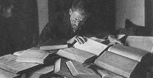

<h1 id="фэстываль-гэбрайскай-кнігі-ў-гонар-бэн-егуды-ben-yehuda">Фэстываль гэбрайскай кнігі ў гонар Бэн-Егуды (Ben Yehuda)</h1>

Вінцэсь Мудроў, Полацак. 23.11.2000

У Полацку адбыўся першы гарадзкі фэстываль гэбрайскай кнігі. Прысьвечаны фэстываль быў выдатнай постаці жыдоўскай культуры, сыну беларускае зямлі Эліэзэру Бэн-Егудзе – чалавеку, які вярнуў да жыцьця некалі амаль мёртвую мову іўрыт.

Бэн-Егуда – ад нараджэньня Лазар Пэрэльман – нарадзіўся ў сярэдзіне мінулага стагодзьдзя ў мястэчку Лужкі навачаснага Шаркаўшчынскага раёну. У 13 гадоў хлопец быў аддадзены ў Полацкі ешыбот, і менавіта тут, у сьценах духоўнай вучэльні душу ягоную апанавала старажытнагэбрайская мова, на якой была напісаная Тора.

Неўзабаве ягоны родны дзядзька, зразумеўшы, што рабіна з хлопца не атрымаецца, забраў Лазара да сябе – у мястэчка Глыбокае, каб далучыць да нейкай справы. Але хлопец нічым іншым, апрача вывучэньня іўрыту, не хацеў займацца.

І вось, апынуўшыся ў Парыжы, куды дзядзька адправіў яго вучыцца на лекара, Лазар Пэрэльман вызначыў дзеля сябе жыцьцёвую мэту: адрадзіць іўрыт, зрабіўшы яго мовай габрэйскай нацыі. Бо, як лічыў Лазар, менавіта мова зьяўляецца тым цэмэнтам, які лучыць народ у нацыю. Ён узяў сабе псэўданім Бэн-Егуда, што значыць “сын Іўдзеі”, і пачаў складаць слоўнік навачаснага іўрыту, грунтуючыся на слоўным матар’яле старажытнай Торы, пасьля чаго быў абвешчаны сябрамі і знаёмцамі “ціхім вар’ятам”.

Як сказаў у часе свайго выступленьня на фэстывалі пісьменьнік Аляксандар Чарніцкі, “у той час нават фанатычныя заўзятары адраджэньня габрэйскай дзяржавы не давалі веры адраджэньню іўрыту і лічылі такія спробы недарэчным дзівацтвам. Але менавіта дзякуючы такім апантаным людзям, як Элязэр Бэн-Егуда, і чыняцца ў сьвеце вялікія справы. І сёньня некалі мёртвая мова стала дзяржаўнай мовай Ізраілю.”

Аб неабходнасьці стварэньня музэя Бэн-Егуды на ягонай радзіме казаў у сваёй прамове краязнавец з Лужку Эдмунд Гірын. Праца такая, паводле сп.Гірына, ужо пачалася. А ягоная калега – краязнаўца Ада Райчонак – заклікала стварыць такі музэй агульным высілкам габрэяў і беларусаў.

<strong>English summary: Polacak (Polatsk), a city in the northeast of Belarus, hosted the first Jewish book festival in honor of Ben-Yehuda. Eliazar Ben-Yehuda, the "father of modern Hebrew", was born in a Belarusian town Luzhki, from age 13 he attended religious academy "yeshiva" in Polacak (Polatsk). Festival participants shared their plans to open Ben-Yehuda's museum in his birth place in Luzhki, which would become a joint Belarusian-Jewish cultural project.</strong>

© Radio Free Europe / Radio Liberty, Inc., All Rights Reserved.

See also / Гл. таксама: 
 
- <strong><a href="articles/art_hebrew1.html">Элязэр Бэн-Йегуда й адраджэньне іўрыту</a></strong> 
- <strong><a href="http://www.svaboda.org/today/2000/oct/23/mudr1023.html">Арыгінал артыкулу на сайце Радыё Свабода</a></strong> 
- <strong><a href="articles/art_benyehuda2.html">Eliezer Ben-Yehuda and the Revival of Hebrew</a></strong> 

<a href="gb_add.html?ref=http%3A%2F%2Fwww%2Epravapis%2Eorg%2Fart%5Fbenyehuda3%2Easp">Напішыце водгук // Write your comment</a>

