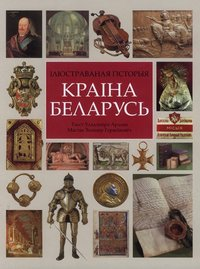
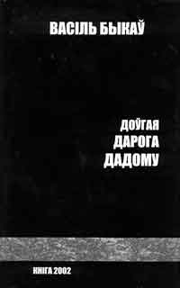
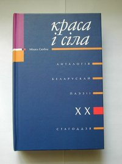
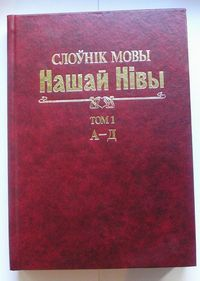
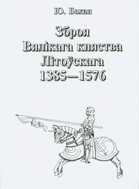
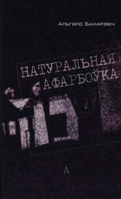
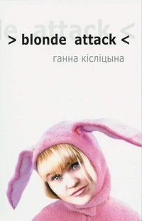

<a href="articles_by.html">вярнуцца да артыкулаў</a> 
<a href="#english">English summary below</a> 

<h1 id="best-books-найлепшыя-кнігі-2003">Best Books: Найлепшыя кнігі 2003</h1>

Падрыхтаваў Адам Воршыч (<a href="http://www.nn.by/">Nasza Niva</a>)

Каб вызначыць найлепшыя кнігі году, рэдакцыя "Нашай Нівы" зьвярнулася да адзінаццаці аўтарытэтных экспэртаў — крытыкаў, выдаўцоў і кнігагандляроў. Фаварытамі сталі густоўна выдадзеныя фаліянты ў цьвёрдых вокладках на добрай паперы. І кніга Быкава.

Зь вялікім адрывам найлепшай кнігай 2003 году прызнаная «Краіна Беларусь. Ілюстраваная гісторыя» Ўладзімера Арлова й Зьмітра Герасімовіча: яе згадвалі амаль усе экспэрты «НН», а Даніла Жукоўскі назваў «самай рэклямаванай кнігай году». «Яна далучыла да айчыннай гісторыі цэлы пласт нашага грамадзтва, а для чужаземцаў стала своеасаблівай візытоўкай краіны», — прызнае Зьміцер Санько.

На другое месца заканамерна выйшла апошняя прыжыцьцёвая кніга Васіля Быкава <a href="http://oz.by/books/more.phtml?id=107788&amp;partner=pravapis">«Доўгая дарога дадому»</a>. Прыемна, што перамаглі камэрцыйна пасьпяховыя выданьні. Чаго ня скажаш пра тамы, якія занялі наступныя пазыцыі ў сьпісе.

 Экспэрты высока ацанілі яшчэ адно падарункавае выданьне — анталёгію беларускай паэзіі ХХ ст. «Краса і сіла». Кур’ёзна, што яна выйшла дзякуючы гранту ад фонду, які ўзначальвае сьпікер расейскае Думы Генадзь Селязьнёў.

Разам з прызнанымі майстрамі Янкам Брылём, Уладзімерам Някляевым і Леанідам Драньком-Майсюком у «дзясятцы» — Альгерд Бахарэвіч. Гэта высокая ацэнка творчасьці маладога празаіка.

Сымптаматычна, што толькі адзін з экспэртаў (Зьміцер Серабракоў) адзначыў тыя кнігі, якія сёлета сапраўды «перадавалі прачытаць другому» і якія прачытала, напэўна, найбольшая колькасьць чытачоў. Маюцца на ўвазе «Нашэсьце» і «Выпадковы прэзыдэнт». Такія кнігі не ўспрымаюцца экспэртамі як «сур’ёзныя». Між тым, ужо сам факт, што ў дзясятку трапілі лічаныя арыгінальныя творы (якіх і выйшла лічаная колькасьць пры сымбалічных тыражах), тады як дамінуюць анталёгіі, энцыкляпэдыі і зборы выбранага, сьведчыць пра глыбокі крызыс і аўтараў, і выдаўцоў, і ўвогуле «тэрыторыі слова» ў нашай краіне. Гэты крызыс палітычна матываваны і грамадзтва, мякка кажучы, цікавіцца яго прычынамі. Таму выбар З.Серабракова падаецца, прынамсі, шчырым і адпаведным «чытацкім сымпатыям».

Кніжны год быў адзначаны завяршэньнем адных фундамэнтальных праектаў («Энцыкляпэдыя гісторыі Беларусі», «Гісторыя беларускай літаратуры ХХ ст.») і пачаткам ня менш грандыёзных: выдаюцца «Слоўнік мовы «Нашай Нівы», падрыхтаваны Інстытутам мовазнаўства, энцыкляпэдыя «Рэпрэсаваныя літаратары, навукоўцы, работнікі асьветы, грамадзкія і культурныя дзеячы 1794—1991» Леаніда Маракова. Д.Жукоўскі апошнюю кнігу, выдадзеную накладам 50 асобнікаў, ацаніў найвышэйшай адзнакай: «Калі праца будзе завершаная ў бліжэйшыя гады, мае шанцы зрабіцца кнігай дзесяцігодзьдзя».

У сьпіс найлепшых кніг патрапіла некалькі выданьняў, датаваных 2002-м годам, якія фактычна зьявіліся сёлета: «Аўтаманаграфія» Алеся Мары (Марачкіна) ды «Становление тоталитарной системы в БССР» Тацяны Процькі.

У рэйтынгу-2003 перамаглі кнігі невялікіх выдавецтваў або выдадзеныя прыватна па-за выдавецтвамі. Гэта нагода задумацца і «Мастацкай літаратуры», і буйным прыватным друкарам.

Падчас вызначэньня месца кнігі ў рэйтынгу ўлічвалася яе пазыцыя ў дзясятцы: першае месца — 10 балаў, другое — 9 і г.д. Выніковы сьпіс складаўся па суме балаў.

<h2 id="top-выніковы-рэйтынг">Top: Выніковы рэйтынг</h2>

<strong>1. Уладзімер Арлоў, Зьміцер Герасімовіч. Краіна Беларусь.</strong> — Менск: Салвія; 75 балаў. 
<strong>2. Васіль Быкаў. <a href="http://oz.by/books/more.phtml?id=107788&amp;partner=pravapis">Доўгая дарога дадому</a></strong>. — Менск: Таварыства «Кніга»; 33 балы. 
<strong>3. Краса і сіла: Анталёгія беларускай паэзіі</strong> / Укладальнік Міхась Скобла. — Менск: Лімарыюс; 32 балы. 
 
<strong>4.</strong> Зора і Вітаўт Кіпелі. Беларускі й беларусаведны друк на Захадзе. — Менск—Нью-Ёрк: БІНіМ; 
  Уладзімер Арлоў. Ордэн Белай Мышы. — Менск: Мастацкая літаратура; 24 балы. 
<strong>5.</strong> Леанід Маракоў. Рэпрэсаваныя літаратары, навукоўцы, работнікі асьветы, грамадзкія і культурныя дзеячы 1794—1991. Т.1—2. — Менск; 21 бал. 
<strong>6.</strong> Янка Брыль. Зь людзьмі й сам-насам. — Менск: Мастацкая літаратура; 18 балаў. 
<strong>7.</strong> Слоўнік мовы «Нашай Нівы». Т.1 / Пад. рэд. Валянціны Лемцюговай. — Менск: Тэхналёгія; 
  Антон Луцкевіч. Да гісторыі беларускага руху / Укладаньне, прадмова й камэнтары А.Сідарэвіча. — Менск: Беларускі кнігазбор; 
  Юры Бохан. Зброя Вялікага княства Літоўскага. — Менск: Беларусь; 17 балаў. 
<strong>8.</strong> Францішка Ўршуля Радзівіл. Выбраныя творы. — Менск: Беларускі кнігазбор; 
  Адам Міцкевіч. Выбраныя творы. — Менск: Беларускі кнігазбор; 15 балаў. 
<strong>9.</strong> Альгерд Бахарэвіч. Натуральная афарбоўка. — Менск: Логвінаў; 13 балаў. 
<strong>10.</strong> Леанід Дранько-Майсюк. Вершы. Каханьне. Проза. — Менск: Харвест; 
  Фадзей Булгарын. Выбранае. — Менск: Беларускі кнігазбор; 
  Алесь Гарун. Выбраныя творы. — Менск: Беларускі кнігазбор; 
  Уладзімер Някляеў. Лабух. — Менск; 12 балаў.

<strong>Генадзь Вінярскі, выканаўчы дырэктар выдавецтва «Беларускі кнігазбор»</strong> 
1. Краса і сіла. Анталёгія беларускай паэзіі. 
2. Францішка Ўршуля Радзівіл. Выбраныя творы. 
3. Уладзімер Арлоў, Зьміцер Герасімовіч. Краіна Беларусь. 
4. Адам Міцкевіч. Выбраныя творы. 
5. Васіль Быкаў. <a href="http://oz.by/books/more.phtml?id=107788&amp;partner=pravapis">Доўгая дарога дадому</a>. 
6. Антон Луцкевіч. Да гісторыі беларускага руху. 
7. Зора і Вітаўт Кіпелі. Беларускі й беларусаведны друк на Захадзе. 
8. Ян Станкевіч. Гістарычныя творы. 
9. Алесь Белакоз. Каб жыла Беларусь. 
10. Франсуа Жакмэн. Поры году; Янка Брыль. Зь людзьмі і сам-насам.

 <strong>Міхась Скобла, намесьнік старшыні Саюзу пісьменьнікаў Беларусі</strong> 
1. Янка Брыль. Зь людзьмі і сам-насам. 
2. Караль Вайтыла (Ян Павал ІІ). Рымскі трыпціх. 
3. Віктар Жыбуль. Дыяфрагма. 
4. Ніна Мацяш. Перабіраю самацьветы. 
5. Антон Луцкевіч. Да гісторыі беларускага руху. 
6. Мікола Шкялёнак. Беларусь і суседзі. 
7. Вацлаў Ластоўскі. Кароткая энцыкляпэдыя старасьвеччыны. 
8. Леанід Дранько-Майсюк. Вершы. Каханьне. Проза. 
9. Юрась Гарбінскі, Юры Туронак. Беларускі хрысьціянскі рух ХХ ст. 
10. Сяргей Рублеўскі. Азярод.

<strong>Даніла Жукоўскі, крытык</strong> 
1. Леанід Маракоў. Рэпрэсаваныя літаратары, навукоўцы, работнікі асьветы, грамадзкія і культурныя дзеячы 1794—1991. Т.1—2. 
2. Юры Бохан. Зброя Вялікага княства Літоўскага. 
3. Фадзей Булгарын. Выбранае. 
4. Мэтрыка Вялікага Княства Літоўскага. Кніга 43. 
5. Попіс войска Вялікага Княства Літоўскага 1528 году. 
6. Уладзімер Арлоў, Зьміцер Герасімовіч. Краіна Беларусь. 
7. Нацыянальны атляс Беларусі.

<strong>Віталь Скалабан, літаратуразнаўца і архівіст</strong> 
1. Энцыкляпэдыя гісторыі Беларусі. Т.6, кн.2. 
2. Гісторыя беларускай літаратуры ХХ ст. Т.4, кн.2. 
3. Уладзімер Арлоў, Зьміцер Герасімовіч. Краіна Беларусь. 
4. Краса і сіла. Анталёгія беларускай паэзіі. 
5. Митрофан Довнар-Запольский. История Белоруссии. 
6. Татьяна Протько. Становление тоталитарной системы в БССР. 
7. Попіс войска Вялікага Княства Літоўскага 1528 году. 
8. Райнэр Лінднэр. Гісторыкі і ўлада. 
9. Леанід Маракоў. Рэпрэсаваныя літаратары, навукоўцы, работнікі асьветы, грамадзкія і культурныя дзеячы 1794—1991. Т.1—2. 
10. Фадзей Булгарын. Выбранае.

 <strong>Зьміцер Санько, галоўны рэдактар выдавецтва «Тэхналёгія»</strong> 
1. Зора і Вітаўт Кіпелі. Беларускі й беларусаведны друк на Захадзе. 
2. Уладзімер Арлоў, Зьміцер Герасімовіч. Краіна Беларусь. 
3. Слоўнік мовы «Нашай Нівы». Т.1. 
4. Алесь Мара. Аўтаманаграфія. 
5. Вацлаў Ластоўскі. Кароткая энцыкляпэдыя старасьветчыны. 
6. Уладзімер Арлоў. Ордэн Белай Мышы. 
7. Міхась Чарняўскі. Ілюстраваная гісторыя старадаўняй Беларусі. 
8. Лявон Баршчэўскі. Літаратура ад старажытнасьці да пачатку эпохі рамантызму. Папулярныя нарысы.

<strong>Людміла Рублеўская, літаратурная аглядальніца газэты «Беларусь сегодня»</strong> 
1. Уладзімер Арлоў, Зьміцер Герасімовіч. Краіна Беларусь. 
2. Леанід Маракоў. Рэпрэсаваныя літаратары, навукоўцы, работнікі асьветы, грамадзкія і культурныя дзеячы 1794—1991. Т.1—2. 
3. Сучасная беларуская проза. Традыцыі і наватарства. 
4. Алесь Гарун. Выбраныя творы. 
5. Лявон Баршчэўскі. Літаратура ад старажытнасьці да пачатку эпохі рамантызму. Папулярныя нарысы. 
6. Ганна Кісьліцына. &gt;blond attack&lt; 
7. Адам Глёбус. Сшыткі. 
8. Леанід Дранько-Майсюк. Вершы. Каханьне. Проза. 
9. Літаратурны квартал. Паэтычны зборнік. 
10. Аксана Бязьлепкіна. Разам і паасобку. Таварыства «Тутэйшыя».

 <strong>Тацяна Вабішчэвіч, кніжная аглядальніца «НН»</strong> 
1. Зора і Вітаўт Кіпелі. Беларускі й беларусаведны друк на Захадзе. 
2. Слоўнік мовы «Нашай Нівы». Т.1. 
3. Уладзімер Арлоў, Зьміцер Герасімовіч. Краіна Беларусь. 
4. Краса і сіла. Анталёгія беларускай паэзіі. 
5. Нацыянальны атляс Беларусі. 
6. Анталёгія сучаснага беларускага мысьленьня. 
7. Альгерд Бахарэвіч. Натуральная афарбоўка. 
8. Адам Міцкевіч. Выбраныя творы. 
9. Уладзімер Някляеў. Лабух. 
10. Андрэй Хадановіч. Старыя вершы.

<strong>Зьміцер Серабракоў, літаратурны аглядальнік газэтаў «Згода» і «Навінкі»</strong> 
1. Уладзімер Някляеў. Лабух. 
2. Альгерд Бахарэвіч. Натуральная афарбоўка. 
3. Владимир Матикевич. Нашествие. 
4. Андрей Климов. Тот самый Климов. 
5. Светлана Калинкина, Павел Шеремет. Случайный президент. 
6. Изяслав Адливанкин. Нашествие. 
7. Ганна Кісьліцына. &gt;blond attack&lt;. 
8. Адам Глёбус. Сшыткі. 
9. Андрэй Хадановіч. Старыя вершы. 
10. Джэці (Вера Бурлак). За здаровы лад жыцьця.

<strong>Анатоль Бутэвіч, экс-міністар інфармацыі й культуры</strong> 
1—2. Васіль Быкаў. <a href="http://oz.by/books/more.phtml?id=107788&amp;partner=pravapis">Доўгая дарога дадому</a>; Уладзімер Арлоў, Зьміцер Герасімовіч. Краіна Беларусь. 
3. Краса і сіла. Анталёгія беларускай паэзіі. 
4. Янка Брыль. Зь людзьмі й сам-насам. 
5. Леанід Дранько-Майсюк. Вершы. Каханьне. Проза. 
6. Алесь Гарун. Выбраныя творы. 
7. Людміла Рублеўская. Сэрца мармуровага анёла. 
8. Фадзей Булгарын. Выбранае. 
9. Васіль Якавенка. Надлом. 
10. Юры Бохан. Зброя Вялікага Княства Літоўскага.

 <strong>Алесь Яўдаха, незалежны кнігараспаўсюднік (паводле вынікаў продажаў)</strong> 
1. Уладзімер Арлоў. Ордэн Белай Мышы. 
2. Васіль Быкаў. <a href="http://oz.by/books/more.phtml?id=107788&amp;partner=pravapis">Доўгая дарога дадому</a>. 
3. Ян Станкевіч. Гістарычныя творы. 
4. Уладзімер Арлоў, Зьміцер Герасімовіч. Краіна Беларусь. 
5. Антон Луцкевіч. Да гісторыі беларускага руху. 
6. Cяргей Астравец. Лісты да Хома Саветыкуса. 
7. Мікола Шкялёнак. Беларусь і суседзі.  
8. Уладзімер Арлоў. Адкусі галаву вароне. 
9. Адам Глёбус. Сшыткі.

<strong>Ірына Крэсік, таваразнаўца «Кнігарні пісьменьніка» (паводле вынікаў продажаў)</strong>: 
1. Уладзімер Арлоў, Зьміцер Герасімовіч. Краіна Беларусь. 
2. Уладзімер Арлоў. Ордэн Белай мышы. 
3. Васіль Быкаў. <a href="http://oz.by/books/more.phtml?id=107788&amp;partner=pravapis">Доўгая дарога дадому</a>. 
4. Юры Бохан. Зброя Вялікага Княства Літоўскага. 
5. Францішка Ўршуля Радзівіл. Выбраныя творы (сэрыя «Беларускі кнігазбор»). 
6. Адам Міцкевіч (сэрыя «Беларускі кнігазбор»). 
7. Уладзімер Дубоўка. О Беларусь, мая шыпшына! 
8. Вольга Іпатава. Альгердава дзіда. 
9. Статут Вялікага Княства Літоўскага. 
10. Там, дзе вежы Сафіі. Укл. Навум Гальпяровіч.

 <strong>English Summary</strong> 
The editors of  *Nasza Niva*  newspaper asked a dozen Belarusian book publishers, book critics and book distributors the following question: what were the best-selling or the most interesting books in Belarus in 2003? Each of them had to list up to 10 books. And here is the resulting top ten of the Belarusian-language books that were published in 2003: 
 
<strong>1. Country Belarus</strong> by Uładzimier Arłou, Zmicier Hierasimovič 
<strong>2. Long Way Home</strong> by Vasil Bykau 
<strong>3. Beauty and Power: An Anthology of Belarusian Poetry</strong> compiled by M. Skobła 
 
4. <strong>Belarusian Printing in the West</strong> by Zora and Vitaut Kipel 
  <strong>The Order of the White Mouse</strong> by Uładzimier Arłou 
5. <strong>Repressed literati, scientists, educators and activists 1794-1991.</strong> by Leanid Marakou 
6. <strong>Tet-a-tet with People</strong> by Janka Bryl 
7. <strong>"Nasza Niva" Dictionary</strong> 
  <strong>History of the Belarusian Movement</strong> by Anton Łuckievič 
  <strong>Weapons of the Grand Duchy of Lithuania</strong> by Jury Bochan 
8. <strong>Franciška Uršula Radzivił: Selected Works</strong> 
  <strong>Adam Mickievič: Selected Works</strong> 
9. <strong>Natural Color</strong> by Alhierd Baharevič 
10. <strong>Verses. Love. Prose</strong> by Leanid Dranko-Majsiuk 
  <strong>Selected works of Fadziej Bułharyn</strong> 
  <strong>Selected works of Aleś Harun</strong> 
  <strong>Labuch</strong> by Uładzimier Niaklajeu 

Copyright © Nasza Niva, 2003. Minsk, Belarus

