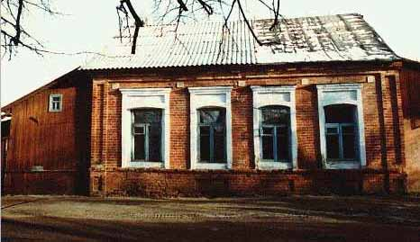
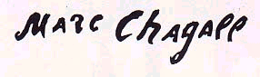

<h1 id="art-of-marc-chagall-марк-шаґал">Art of Marc Chagall (Марк Шаґал)</h1>

<strong>Marc Chagall</strong> (1887-1985) is a well-known Belarusian-born French painter and designer, distinguished for his surrealistic inventiveness. He is recognized as one of the most significant painters and graphic artists of the 20th century.

Chagall was born July 7, 1887, in Vitebsk, Belarus (Віцебск, Беларусь). The eldest of nine chidren in a poor Jewish family, Chagall passed his childhood steeped in Hasidic culture. With his mother's support, and despite his father's disapproval, Chagall pursued his interest in art. His first teacher was Belarusian-born Jewish painter Yehuda Pen.

Marc Chagall writes in his book <strong>My Life</strong>:  *"I learned about Pen when I was riding on a tram. I was crossing the Cathedral Square and I saw a signboard – white letters on blue: "Artist Pen's School." "What a cultured city is our Vitebsk," I thought.* "

Chagall pursued his interest in art, going to St. Petersburg in 1907 to study art with Leon Bakst. Influenced by contemporary Russian painting, Chagall's distinctive, child-like style, often centering on images from his childhood in Belarus, began to emerge.

In 1910, he moved to Paris, where he associated, among others, with Guillaume Apollinaire (a famous French poet who also has some Belarusian roots). It was during this period that Chagall painted some of his most famous paintings of the Jewish shtetl or village, and developed the features that became recognizable trademarks of his art. Strong and often bright colors portray the world with a dreamlike, non-realistic simplicity, and the fusion of fantasy, religion, and nostalgia infuses his work with a joyous quality. Animals, workmen, lovers, and musicians populate his figures; the "fiddler on the roof" recurs frequently, often hovering within another scene.

In 1914, before the outbreak of World War I, Chagall held a one-man show in Berlin. During WWI, he resided in Belarus, and in 1917, endorsing the revolution, he was appointed Commissar for Fine Arts in Vitebsk and then director of the newly established Free Academy of Art. He became involved in ambitious projects for a local academy, but he left after two and a half years in order to escape the revolutionary dictates of Malevich. After a stay in Moscow, where he worked in the Jewish theatre, then in Berlin, where he studied the technique of engraving, he returned to Paris in 1923.

He lived in France permanently except for the years 1941 - 1948 when, fleeing France during World War II, he stayed in the United States. In 1944 the artist's wife Bella died. During Chagall's exile in New York, he designed the costumes and stage decorations for a ballet performance of Igor Stravinsky's The Firebird. In 1946, the New York Museum of Modern Art had a huge retrospective exhibition of Marc Chagall's prints and paintings. The exhibition was a big success and was later shown in Chicago.

Chagall painted with a variety of media, such as oils, water colors, and gouaches. His work also expanded to other forms of art, including ceramics, mosaics, and stained glass. Among his most famous building decorations are the ceiling of the Opera House in Paris, murals at the New York Metropolitan Opera, a glass window at the United Nations, and decorations at the Vatican. Chagall received many prizes and much recognition for his work. He was also one of very few artists to exhibit work at the Louvre in their lifetime.

<h1 id="marc-chagall-timeline">Marc Chagall Timeline</h1>

1887. Born July 7 in Vitebsk, Belarus, into a poor Jewish family. 
1907. Begins to study painting under Yehuda Pen in Vitebsk. 
1907-1910. Studies painting in St.Petersburg, first at the Imperial Society for the Encouragement of the Arts, later at the School of Elizabeth Svanseva. 
1909. Meets Bella Rosenfeld. 
1910. Arrival in Paris and introduction into the city, and into a circle of contemporary poets and painters. 
1912. Discovery of the fauves and cubists; is briefly touched by futurism. Gets to know Braque, Picasso, Delaunay, Leger, Marcoussis, Segonzac, Archipenko, Sterenberg, Soffici, and Modigliani. Has his first studio in Rue de la Ruche and meets the poets Cendrars and Apollinaire. Exhibits for the first time at the Independants. 
1914. First personal show in Berlin, organized by Walden. Returns to Vitebsk at the outbreak of the war. 1915. Marries Bella Rosenfeld and settles in Vitebsk, Belarus. 
1916. Daughter Ida is born. 
1918. Belarus is taken over by Soviet Russia. Chagall is nominated Commissioner for Fine Arts in Vitebsk. 
1919. Appointed as a director of the Vitebsk Academy of Arts, in which Kazimir Malevich, the suprematist, also teaches. 
1919-1920. Invites M.Dobuzinsky, I.Puni,Y.Pen and A.Romm to work in the Academy in Vitebsk. 
1920. Resigns his position at the Vitebsk Academy and leaves for Moscow. Here he does stage decors and paints wall panels for the Jewish Theatre. 
1922. Writes "My Life" in French, assisted by Bella, making use of notes made earlier in Belarus and in Russia. Goes to Kouna (Kaunas) and then to Berlin, when life in USSR becomes unbearable (after being told that he was not suited to the realities of Marxist socialism). 
1923. Returns to France and meets the publisher Vollard, through whom he receives commissions to illustrate various publications. He meets Eluard, Ernst and Gala who want him to join the Surrealist movement. He refuses. 
1924. Illustrates Gogol's  *Dead Souls* , which is not published until 1948. 
1926. Again commissioned by Vollard, he starts a series of etchings for the Fables of La Fontaine, which were eventually published in 1952. 
1930. Begins a more private domestic style of life, moving to Villa Montmorency, near the Porte d'Auteuil. Travels frequently to Switzerland to rediscover countryside like that of Belarus. 
1931. Begins etchings for the Bible, which were finally published in 1956, and is invited to Palestine where he goes to seek inspiration for his Bible illustrations. 
1939. Receives the Carnegie Prize. 
1940. Vollard dies. Chagall meets Teriade. 
1941. Because of the war and racial discrimination he leaves France and embarks at Lisbon for the United States where he has been invited to settle. 
1942. The beginning of his American stay. He travels to Mexico and prepares the scenery and costumes for Aleko. 
1944. Bella dies. For nine months he does no work, occupying himself solely with bringing out Bella's writings under the title  *Lighted Lamps* . 
1945. Starts work again with scenery and costumes for Stravinsky's  *Firebird*  for presentation by the Ballet Theatre of New York. 
1946. Selected exhibition at the Museum of Modern Art, New York. 
1947. Exhibition at the Musee National d'Art Moderne, Paris. First colour lithographs. 
1948. Triumphant return to Paris. Renews contact with Teriade who from then on acts as his publisher. 
1950. Settles in Vence, Provence. First attempts at painting and modelling ceramics. 
1951. First stone sculptures. 
1952. Meets Valentine Brodsky (Vava) and marries her. Travels with her to Greece. 
1957. Executes his first mosaics. 
1958. Does scenery and costumes for the ballet Daphnis and Chloe for the Paris Opera. 
1960. Completes the windows (lancets and roses) for the Gothic cathedral of Metz. 
1961. Does the windows for Hadassah Synagogue, near Jerusalem. 
1963. Supplies the cartoons and follows the working of his first tapestries which are to decorate the Parliament of Israel in Tel Aviv. 
1964. At Malraux's invitation he paints the panels which are to be fixed to the Opera ceiling in Paris. 
1966. Executes two huge panels for the Lincoln Centre, New York. Moves from Vence to St Paul de Vence where he lived until his death. 
1967. Designs scenery and costumes for The Magic Flute. Has a vast exhibition at the Louvre. 
1969-70. A comprehensive exhibition opens at the Petit Palais of all of Chagall's work: paintings, gouaches, sculpture, ceramics, stained glass, tapestries and sketches for theatrical scenery and costumes. 
1973. Trip to Moscow and Leningrad. Exhibition in The State Tretyakov Gallery. 
1974. Exhibition in Berlin. Executes a stained-glass window for a cathedral in Rheims. 
1975. Illustrations to "Odissey" and lithographs to "Storm". 
1977. It is awarded with an award of the Honourable Legion. Works above stained-glass windows for Art institute in Chicago. 
1978. Exhibition in Palace Pitty in Florence. Executes stained-glass windows for churches in Florence and the Great Britain. 
1979. Exhibition in gallery Pierre Matiss in New York and in Geneva. 
1980. "Psalmy David's" exhibition in the Museum in Nice. Exhibition Graphics in Geneva. 
1981. Exhibition in galleries Meg in Paris and Zurich. End of work on stained-glass windows of a cathedral in Sent-Atienn. 
1982. Exhibitions in Stockholm and Denmark. An exhibition of the book in Geneva. 
1984. Exhibition in Centre Pompidu in Paris. An exhibition of stained-glass windows and sculptures in the Museum to Nice. Exhibitions in Rome and Basel. 
1985. March, 28 has died in Sen-Pol de Vence, France. 

Related Books: 
 
- <a href="http://www.amazon.com/exec/obidos/ASIN/0306805715/belarusianlan-20">My Life</a> by Marc Chagall - A lyrical memoir of the artist's early life with 50 illustrations by the author 
- <a href="http://www.amazon.com/exec/obidos/ASIN/0810946777/belarusianlan-20">Chagall</a>   - Value-priced monograph from Abradale Press, with 60 illustrations. 
- <a href="http://www.amazon.com/exec/obidos/ASIN/3822802123/belarusianlan-20">Marc Chagall</a> by Ingo F. Walther - Another Chagall monograph, from the always excellent Taschen series. 
- <a href="http://www.amazon.com/exec/obidos/ASIN/0791028070/belarusianlan-20">Chagall: My Sad and Joyous Village</a> by Jacqueline Loumaye - Beautifully designed book, for children ages nine through twelve. 
- <a href="http://www.amazon.com/exec/obidos/ASIN/1891024078/belarusianlan-20">Chagall: The Lithographs</a> by Christofer Conrad - An awesome catalogue of more than 1,000 Chagall lithographs. 
- <a href="http://www.amazon.com/exec/obidos/ASIN/0805208631/belarusianlan-20">Burning Lights</a> by Bella Chagall, Marc Chagall (Illustrator) - With illustrations by her husband Marc, Bella Chagall's memoir comes from the poignant brush strokes of childhood in Vitebsk. 

