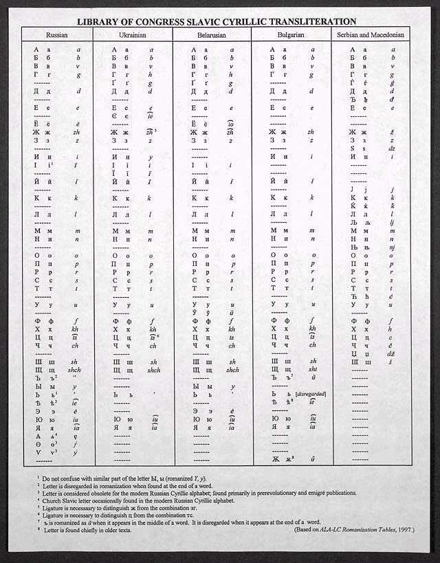

<table>
<tbody>
<tr class="odd">

<td>
<h1 id="slavic-cyrillic-transliteration">Slavic Cyrillic transliteration</h1>

This is the Slavic Cyrillic transliteration for Belarusian, Bulgarian, Macedonian, Russian, Serbian, Ukrainian used by the the Library of the U.S. Congress (the so called ALA-LC Romanization Table). 
 

See also: 
 
- <strong><a href="translator.html">Online Cyrillic Translator</a></strong> 
- <strong><a href="latin.html">Online Lacinka (Latin Script) Translator</a></strong> 
- <a href="articles/art_lac1.html">Introduction to Belarusian Latin Script</a>

<a href="gb_add.html?ref=http%3A%2F%2Fwww%2Epravapis%2Eorg%2Fart%5Fcyrillic%5Ftranslit%2Easp">- Write your comment</a>
</td>
</tr>
</tbody>
</table>
