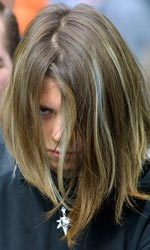
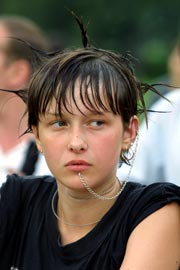
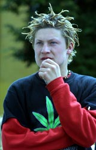

<table>
<tbody>
<tr class="odd">

<td>

<h1 id="фенечка-belarusian-hippie-slang">Фенечка [Belarusian Hippie Slang]</h1>

Кароткі слоўнік менскіх хіпі і панкаў канца 70-х і пачатку 80-х гадоў, 
скаладзены Адамам Глёбусам

 АДЦЯГН<strong>У</strong>ЦЦА – злавіць кайф, адпачыць – Пайшлі да Крыпі, адцягнемся. 
 
АСКАЦЬ – прасіць, клянчыць, зшыбаць грошы (звычайна, на алейках, у парках, на ваґзалах) – Есьці хочацца, пайшлі аскаць на стрыт… 
 
<strong>А</strong>ТАМ – выдатна, адвал, адвальна, клёва, кайфова – найлепшая якасьць чаго-небудзь – У Людкі штаны – атам! 
 
Б<strong>А</strong>БКІ – грошы; падняцца на бабкі – зарабіць грошы – Падруга, у цябе бабкі ёсьць? 
 
Б<strong>А</strong>ШЛІ (-НІ) – грошы – Швед, мне Баця павінен башлі, забярэш, а я звальваю. 
 
БАШЛ<strong>Я</strong>ЦЬ – фінансаваць, даваць грошы, плаціць – І колькі табе на рабоце башляюць? 
 
БА<strong>Я</strong>Н – шпрыц – Слухай, фуцах, на баяне граеш? 
 
БЯРЛ<strong>О</strong> – ежа, харч – Ну й бярло, проста рэстаран “Патсдам”. 
 
БЕРЛЯЦЬ – есьці, жэрці – Я з раніцы галодны, можа ёсьць паберляць. 
 
БУХ<strong>А</strong>РЫК – алькаголік, п’яніца, п’яны чалавек – Там на прыступках бухарык ляжыць, абсураўся ўвесь… – Добра, калі праз дваццаць гадоў будзем такія, а ня горшыя. 
 
БУХ<strong>А</strong>ЦЬ – піць алькагольныя напоі, кіраць, закладаць за каўнер (састарэлае, шырока ўжываецца беларускімі літаратарамі) – Перапынак, не бухаю, трапак (трыпэр). 
 
ВАЛАС<strong>А</strong>ТЫ – 1. Чалавек – мэн, які ўваходзіць у хіповую сыстэму, неабавязкова з доўгімі валасамі – Валасатыя больш не збіраюцца ля Пэнтаґона (Дома афіцэраў). 2. Хіпі, патлаты, хайраты – Прыходзіць да мяне валасаты абкураны ва ўмат. 
 
ВАЛ<strong>І</strong>ЦЬ – 1. Сыходзіць – Менты падрульваюць, ну мы й звалілі з алейкі. 2. Уцякаць – Звал!!! 
 
В<strong>Е</strong>РЗАЦЬ – 1. Спраўляць вялікую патрэбу – Пайду ў дабл, паверзаю. 2. Гадзіць, рабіць непрыемнае – Я да яго па-чалавечы, а ён, мудак, ня можа, каб не абверзаць. 
 
ҐЕРЛ<strong>А</strong> – дзяўчына, сяброўка, каханка – У Шведа адвальная ґерла, бюст дзявятага памеру. 
 
ГЛЮК<strong>А</strong>РНЯ – мейсца масавага глюканьня – У Сары на флэце – глюкарня. 
 
ГЛ<strong>Ю</strong>КІ – галюцынацыі, наркатычныя мроі, мульцікі – Такія глюкі, шызануцца можна. 
 
ГРЫЦ – мейсца тусоўкі, сквэр Янкі Купалы насупраць цырка (раней сквэр імя Грыцаўца), дзе зьбіраліся хіпі на канцы 60-х і ў 70-ыя гады – На Грыцы класна было. Конь казаў, што нават вербы свабоднай любові былі, іх мянты сьсеклі. 
 
ДАБЛ – прыбіральня – пакуль ты аддаблішся, я падгур здыму. 
 
ДЗЯРЖ<strong>Ы</strong>НКА – мейсца тусоўкі, алейка на вуліцы Камсамольскай, дзе стаіць бюст першага чэкіста краіны саветаў. Хіпі разам з пакамі зьявіліся там падчас другой хвалі, на пачатку 80-х гадоў. – На Дзяржынцы адныя малалеткі… Там нават Алекс каралём ходзіць. 
 
Д<strong>О</strong>ДЖЫК – 1. Пастаянная, найбольш аптымальная і правераная доза наркотыка – Мой доджык – пяць кубоў. 2. Порцыя алькаголя ці ежы, хаўкі – Доджык дрынкнем трэці раз, за тых, хто бараніў Каўказ. 
 
ДРУШЛ<strong>Я</strong>ЦЬ – спаць, кімарыць, храпсьці (састарэлае, але шырока распаўсюджанае сярод беларускіх байкапісцаў) – А я гадзінку падрушляю. 
 
ДУР – марыхуана – А ў мяне першы раз ад дуры толькі смочкі замерзьлі і больш нічога, ніякага кайфу, не дагнала. 
 
Д<strong>У</strong>РКА – вар’ятня, псыхіятрычная лякарня – Саід у дурцы, прасіў, каб ты кір прывёз. 
 
ДЫН<strong>А</strong>МІЦЬ – падманваць, падводзіць, пракідваць – Гэта? Я ёй стрэлку накінуў, а потым прадынаміў. 
 
Ж<strong>А</strong>БА – 1. Панкаўская дзяўчына – А жабы будуць? – Колькі хочаш, як гразі. 2. Жанчына – Ты гэту жабу атадраў? – Нафіг трэба. 
 
ЗАВЁРНУТЫ – 1. Моцна захоплены чым-небудзь – Шыма на рамане завярнуўся. Піша, потым патэлефануе: “Швед, я пра цябе напісаў!”, кідае трубку і зноў піша. 2. Звар’яцелы – Ад такіх наваротаў і завярнуцца можна. 
 
ЗАМАНДЗ<strong>Я</strong>ЧЫЦЬ – 1. Ударыць, улупіць, замачыць, шарахнуць – Не пасьпеў я слова сказаць, а ён як замандзячыць мне ў бараду. 2. Сказаць моцнае слова, пажартаваць – Гаварылі, гаварылі, і раптам Француз як замандзячыў пра Ірку, што яна шкура – пачаліся разборкі. 
 
ЗДЫМАЦЬ ПАДРУГ – знаёміцца зь дзяўчатамі – Падвальваем да лаўкі. Дзьве падругі кураць “Арбіту”. Мы і так, і гэтак, а яны нязьёмныя. Давялося прагнаць з Алейкі. 
 
КАЙФ – 1. Найвышэйшая ступень задавальненьня. – Бяз кайфу няма лайфу. 2. Наркотык – Алё, Швед, у цябе кайф ёсьць? У мяне ломка пачынаецца. 
 
КАЙФОВА – выдатна, клёва – Люблю Морысана, кайфовы музон. 
 
КАС<strong>І</strong>ЦЬ – прыкідвацца, часьцей за ўсё – касіць пад крызу: сымуляваць вар’яцтва дзеля вызваленьня ад службы ў войску ці замены турэмнага зьняволеньня на псыхіятрычную лякарню – Хац закасіў. Сапраўды, лепш год у крызе, чым пятнаццаць у Растоўскай турме. 
 
КАЦ<strong>І</strong>ЦЬ – атрымлівацца, атрымліваць прызнаньне – Ізноў рок ня коціць, адна папса. 
 
КІД<strong>А</strong>ЛАВА – 1. Крадзёж – Я ж казаў, што стопрацэнтовае кідалава. Яго і павязалі. 2. Падман – Больш ня прыйду, дамаўляўся не дамаўляўся – кідалава. 
 
К<strong>І</strong>НУЦЦА – памерці, загнуцца, адкінуцца, ласты склеіць, акачурыцца – Піт ад перадазняка кінуўся. 
 
КІСЬЛ<strong>Я</strong>К МАНДЗ<strong>Я</strong>ЧЫЦЬ – гнаць сумную цялегу, распавядаць нецікавую гісторыю – Малы, канчай кісьляк мандзячыць, вушы вянуць. 
 
КЛ<strong>Ё</strong>ВА – выдатна, кайфова – Клёвыя шузы. Дзе надыбаў? 
 
КЛЮЧ – канец, каюк, прыезд – Хай толькі сунецца і яму – ключ. 
 
КРУТН<strong>Я</strong>К – выбітнасьць, выдатнасьць –А ў Піцеры такія крутнякі, такія навароты. 
 
КРУТ<strong>Ы</strong> – магутны, нязломны, мэтанакіраваны – Я мэн круты… 
 
КРЫЗА – 1. Псыхіятрычная лякарня, дурка – Лепш крыза, чым салдаты. 2. Вар’ят, нястрыманы чалавек – Мамант зь мянтамі зачапіўся, крыза. 3. Вар’яцтва – На выставу Русавай хадзілі, крыза. 
 
КРЫША – дах, зьявілася ў 90-я гады. 1. Розум – Ад тваіх вершаў у мяне крыша паехала. 2. Галава – Нашто ж ты пад кулак крышу падстаўляў? 
 
КСІЎНІК – самаробная абгортка для ксівы (пашпарта), паходзіць ад кісета, бо шмат хто з хіпі зьбіраў недакуркі і складаў у кісет, які насіў на грудзях; зазвычай ксіўнік носяць на грудзях, аздабляюць яго значкамі і вышыўкаю – Сяджу, нікога не чапаю, ксіўнік вышываю. 
 
ЛОМ – непрыемнасьць – Мне ўсе твае разборкі ў лом. 
 
МАЖОРЫ – прыкінутая (модна апранутая) моладзь, звычайна, прыфарцаваная і элітарнага паходжаньня – На Паркавай тусуюцца мажоры. 
 
МАХАЛАВА (МАХАЧ) – бойка – Учора каля Ўнівэрсаму такое махалава было. Жах. Мянты траіх лохаў загасілі. 
 
МАШЫНА – шпрыц – Раніцай прыходжу, а на стале машына ляжыць. Сто разоў казаў, каб хавалі шпрыц. Давялося настукаць па рагах. Але малалеткі ёсьць малалеткі. Гнаць іх трэба. 
 
МУДОХАЦЬ – мучыць, біць – Канчай, ты ўжо ўсіх замудохаў. 
 
НАРКОТ – 1. Наркаман, які не ўяўляе зь сябе нічога цікавага – Не цікава, там адны наркоты. 2. Алькаголік – Каля піўзаводу наркоты тусуюцца. 
 
НІШЦЯК – 1. Добра, выдатна, клёва – Усё нішцяк! 2. Тое, што дастаецца бясплатна, “на халяву” – хаўка, напрыклад – У “Хвілінцы” піцу не даядаюць, можна пайсьці і захаваць нішцячок. 
 
ПАДЛ<strong>Я</strong>НА – подласьць, здрада – Кэт усім такую падляну кінула – забрала грошы і зваліла ў Львоў. 
 
ПАДПІС<strong>А</strong>ЦЦА – запрасіць, прапанаваць, угаварыць, заманіць, абавязаць, прымусіць – І я падпісаўся тую халтуру рабіць. 
 
ПАМ<strong>Ы</strong>ЙКА – бар у паўпадвале на рагу былога Ленінскага праспэкту і вуліцы Леніна, мейсца, дзе зьбіраліся менскія хіпі – Усе дарогі вядуць на Памыйку. – А ты што, цэнтравы? 
 
ПАТЛ<strong>А</strong>ТЫ – валасаты, хайраты, хіпі – У Памыйцы адні патлатыя. – Мастакі? – Вядома, з іх усё і пачынаецца. 
 
ПЭНТАҐОН – кавярня ў менскім Доме афіцэраў, мейсца, дзе зьбіраліся хіпі перад тым, як перайсьці на Памыйку – А мне Пэнтаґон ніколі не падабаўся, адно кір. 
 
ПЛАН – марыхуана, дур, гашыш, кайф – План ёсьць? – Планы ў камуністаў, а ў нас кайф. 
 
ПОДЗЬВІГУ НАРОДА – сквэр насупраць музэя Вялікай Айчыннай вайны, мейсца збору хіпі – А мы ўчора на Подзьвігу народа бутэльку вэрмута разьбілі. 
 
ПРАК<strong>І</strong>ДВАЦЬ – падводзіць, не зрабіць абяцанае, падманваць – Звал. – А Элка? – Пракінем, нефіг спазняцца. 
 
ПРЫК<strong>І</strong>Д – вопратка – Нішцяк прыкід. 
 
ПРЫКОЛ – непаразуменьне, жарт, сьмешны выпадак – Папоў паўшклянкі хіннай вады, што супраць перхаці, заглынуў і як стаяў, так і ляснуўся фэйсам аб асфальт. 
 
РАГ<strong>А</strong>ТЫ – тралейбус – Дабярэшся на рагатым №6. 
 
РАЗБОРКА – высвятленьне адносінаў – А мне вашыя разборкі да фені. 
 
РАСКЛАДЫ – сытуацыя, варыянт – Я ня ведаю раскладаў. 
 
РАТУША – пляц насупраць Дома ўраду, мейсца збору менскіх хіпі – Князя памятаеш? – З Ратушы? – Так. Сустрэў – ледзь пазнаў… 
 
СЫСТЭМА – арганізацыя хіпі, тусоўка – У Піцеры самая крутая сыстэма. – А мне падабаецца Львоўская. 
 
СКІПАЦЬ – уцякаць, звальваць, хавацца – На лета ў Паланґу трэба скіпаць. 
 
СТОПНІК – атлас аўтамабільных дарог – У мяне ў кішэні стопнік, я ня рокер і ня гопнік. 
 
СУРЛЯЦЬ – мачыцца, спраўляць малую патрэбу – Пайшлі пасурляем. 
 
СЬЦЁБ – 1. Павышэньне якасьці, пераўзыходжаньне – Дя я яго на раз засьцябаю. 2. Жарт, сьмех, сарказм – У “Мроі” класны сьцёб, мейсцамі. 
 
СЬЦЯБАЦЦА – 1. Прыставаць, ляпіцца – Ну што ты да курыц дасьцябаўся. 2. Жартаваць, насьміхіцца, іранізаваць – Канчай высьцёбвацца. 
 
СШЫБАЦЬ – прасіць, патрабаваць, звычайна цыґарэты і грошы – У мяне ёсьць капейка – пачатак, пайшлі на банец насшыбаем. 
 
ТАРЧОК – наркаман (жартоўнае) – Завал, адны тарчкі. 
 
ТАСК<strong>А</strong> – стан лёгкага наркатычнага ап’яненьня, лёгкае лунаньне, лёгкі кайф – І ад клея можна заташчыцца. 
 
ТРАВА – анаша – Дастаць травы. 
 
ТРАХАЦЬ – рабіць коітус, факаць – Ён цябе трахае? 
 
ТРЭСЬЦІ – прасіць, забіраць грошы і цыгарэты, тое што і шыбаць, аскаць – Я на ваґзале рублёў трыццаць магу натрэсьці за дзень. 
 
ТУСАВАЦЦА – 1. Хадзіць на тусоўкі – Ты ў Тарту на тусоўку паедзеш? – Трэба тусануцца. 2. Мець сувязі сярод тусоўшчыкаў – Ты з рокерамі тусуешся. 3. Кантактаваць – Ты тусуешся з гэтай прашмандоўкай? 
 
ТУСОЎКА – 1. Збор людзей – Не пакоціць, гэта камсамольская тусоўка. 2. Сыстэма, саюз, партыя, арґанізацыя – Люблю рокерскую тусоўку. 
 
УЗБУХАЦЬ – паўставаць, абурацца, выступаць – Жаба, канчай узбухаць. 
 
УМАТ (ВА ЎМАТ) – пад кайфам – Нагіш сёньня ва ўмаце. 2. Вялікая ступень чаго-небудзь – Абкураны ва ўмат. 
 
УМАТНЫ – 1. Свой – Алекса ўматны мэн. – Быў. 2. Выдатны – “Уліс” уматная каманда. – Была. 
 
УСПУХАЦЬ – выступаць не па справе (ня ў троп) – А Шуга ўсё ўспухае і ўспухае, задзёўб. 
 
ФАК – коітус, полавы акт – А мне факі ня ў кайф – Вядома, трапак. 
 
Ф<strong>А</strong>КАЦЦА (Ф<strong>А</strong>ЧЫЦЦА) – рабіць коітус, трахацца, маркітавацца, любіцца… – А ты, калі яе факаў у пад’езьдзе, станавіўся на прыступку вышэй? 
 
Ф<strong>Е</strong>НЬКА – 1. Любая маленькая рэч – Пакажы феньку. 2. Упрыгожаньні хіпі – Мне Ваўчыца ксіўнік падарыла. Клас фенька. 3. Маленькая гісторыя, показка – А мне Філ такую феньку расказаў… Гэты слоўнік таксама фенька. 
 
ФУЦАХ – хлопец, мэн, хіпар… – Ты, фуцах, пакуль я дайду да той вунь лаўкі, цябе на алейцы ня будзе. 
 
ФЭЙСОЎКА – бойка, мардабой – Учора Швед каля Памыйкі такую фэйсоўку наладзіў, умат. 
 
ХАЙР – валасы, доўгія валасы ў мужчыны – Хайр гэта ня проста патлы, гэта – наш сьцяг. 
 
ХАЙРАН<strong>У</strong>ЦЬ – пастрыгчы – На Грыцы мянты Маманта хацелі хайрануць. Ён вырваўся. І яму шыю нажніцамі прабілі. Кажуць – выпадкова. 
 
ХАЙР<strong>А</strong>ТНІК – стужка або раменьчык, які абвязваецца вакол галавы, каб валасы не траплялі ў вочы – Клёвы хайратнік, скураны… Дзе надыбаў? 
 
ХАЙР<strong>А</strong>ТЫ – даўгавалосы мужчына, звычайна хіпі – І на Ратушы хайратыя зьбіраюцца. 
 
ХАЎКА – ежа, харч – Клас хаўка. 
 
ХІПАН<strong>Ы</strong> – хіпі – Хіпаны, хіпаны… Тусоўка! Хіпаны, хіпаны… Вэрмут! Хіпаны, хіпаны… Кайф! 
 
ХІПАР’Ё – хіпі – На Грыцы адно хіпар’ё. 
 
ХІПАР<strong>Ы</strong> – хіпі – Я рыскага хіпара сустрэў, ён сказаў, што Шведа ў Львове бачыў. 
 
Х<strong>І</strong>ПІ – частка моладзі 60-80 гадоў ХХ стагодзьдзя, якая вызнавала пацыфізм – Мы, хіпі, кветкі жыцьця. 
 
ХІПОЎКІ – дзяўчаты хіпі – Мы хіпоўку за травой на Камароўку паслалі. 
 
ХІП<strong>У</strong>ШКІ – дзяўчаты хіпі – Я да Мароза зайшоў, а там адны хіпушкі. 
 
ХЛАМ – найвышэйшая ступень чаго-небудзь. (Часьцей за ўсё ап’яненьня і абкуркі) – Абпыхаліся, хлам. 
 
ХЛЕБНЫ ХАЙР – хайр, адрошчаны ў баку ад небясьпек, на бацькоўскіх харчах (зьняважлівы выраз) – Прыбярыце ад мяне хлебны хайр. 
 
ЦЫВ<strong>І</strong>ЛЬНЫ – афіцыйны, прыняты большасьцю – У яго нават фэйс цывільны. 
 
ЦЯГН<strong>У</strong>ЦЬ – трахаць, факаць, любіць… – Нармальная жаба, можна й працягнуць. 
 
ЧУМ<strong>А</strong> – 1. Вар’яцтва – Ты што, гэта ж чума! 2. Дзікая, ненармальная зьява – У мяне быў знаёмы, Шыма – чума.

This is a short slang dictionary of Belarusian (mostly Minsk) hippies and punks of the late 70's and early 80's collected and compiled by the Belarusian writer Adam Hlobus.

See also / Гл. таксама: 
 
- <strong><a href="articles/art_minsk1.html">Minsk Slang (альтэрнатыўная ґеаґрфія нашай сталіцы)</a></strong> 
- <strong><a href="articles/art_netspeak.html">Netspeak - Жывая мова беларускага сеціва</a></strong> 
- <strong><a href="articles/art_top100.html">The Forgotten Slang - 100 словаў забытага беларускага слэнгу</a></strong> 

<a href="gb_add.html?ref=http%3A%2F%2Fwww%2Epravapis%2Eorg%2Fart%5Fhippie%5Fslang%2Easp">Напішыце водгук // Write your comment</a>
</td>
</tr>
</tbody>
</table>
