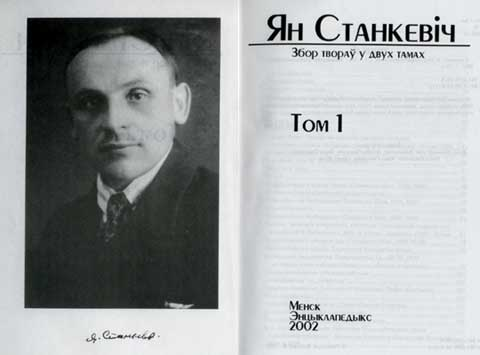

<table>
<tbody>
<tr class="odd">

<td>
<h1 id="янка-спадар-станкевіч">Янка "Спадар" Станкевіч</h1>

Адам Воршыч

Двухтамовік працаў Янкі Станкевіча, які нядаўна пабачыў сьвет, абудзіў вялікую цiкавасьць да асобы гэтага беларускага мовазнаўцы і да ягоных твораў. Кніга імкліва прабіваецца ў сьпіс беларускіх бэстсэлераў: прадаўцы менскіх кнігарняў кажуць, што распрадаецца збор твораў вельмі хутка. Рэдактар двухтомніка Валеры Булгакаў зазначае, што за тры тыдні прадалося каля 300 асобнікаў. Адным зь першых пакупнікоў кнігі, паводле неафіцыйнай інфармацыі, быў Аляксандар Фядута.

Пра Янку Станкевiча расказвае навуковы кансультант збору твораў Юрась Бушлякоў: “Станкевіч — маштабная фігура ў беларускiм руху ХХ ст., сымбаль і галоўны ідэоляг беларускага моўнага пурызму. Ён пражыў 85 гадоў і доўгую частку свайго жыцьця (год 60) аддаў дасьледаваньню беларускай мовы. Станкевiча можна параўнаць з такімі выдатнымі дзеячамі ў гісторыі станаўленьня літаратурных моваў, як Ёсаф Добраўскi ў Чэхii ці Вук Караджыч у Сэрбіі”.

“НН”: У чым сутнасьць Станкевічавага погляду на мову?

Юрась Бушлякоў: Станкевiч iмкнуўся “вывесьцi ў сьвет” найдрабнейшыя адметы жывой народнай мовы. Пры магчымасьцi выбару ён аддаваў перавагу словам і канструкцыям, адсутным у блiзкароднасных мовах. Ён даваў шанец праявiцца ў лiтаратурным ужытку шматлiкiм фанэтычным зьявам, граматычным формам, сотням словаў, не засвоеных беларускай пiсьмовай традыцыяй. Так, ён адстойваў формы зь цьвёрдым [л] перад суфiксамi -ц-, -ств- i -к- (колца, салца, палцы, круцелства, прыяцелка, зашпiлка) i крытыкаваў Тарашкевiча за iгнараваньне iх у “Беларускай граматыцы”. Папаўняў лексычны фонд мовы, прапануючы варыянты нават для найбольш частотных словаў (пераз ‘праз’, бодка ‘пункт, кропка’, жарало ‘крынiца’, кулёк ‘куртка’, супар ‘супернiк’, укульмiцца ‘засяродзiцца’ i г.д.).

І ўсё ж Станкевічаў пурызм нельга прызнаць за максымальны. Дасьледчык ня вёў, як пурысты вугорскiя, iсьляндзкiя цi iранскiя, барацьбы з агульнаўжывальнымi iнтэрнацыяналiзмамi, дапускаў i сам уводзiў паасобныя калькi. Калькуючы, найчасьцей браў за ўзор словы з заходнеславянскiх моваў (так зьявiлiся, да прыкладу, самагук ‘галосны’, сугук ‘зычны’, паранец ‘сасiска’, даймо ‘ўражаньне’ i паймо ‘панятак’).

За сваё доўгае жыцьцё Станкевiч здолеў сёе-тое прышчапiць беларускай мове. Прыкладам, ягонымi стараньнямi нормаю новаклясычнага правапiсу стала з 1930-х пазначэньне мяккасьцi ў прыназоўнiках на -з перад мяккiмi зычнымi: зь неба, бязь месца, празь яго. Шмат якiя папулярызаваныя ім словы ўвайшлi ў лексычны фонд лiтаратурнай мовы ў мiжваеннай Заходняй Беларусi, ужывалiся рэгулярна ў мове паваеннай эмiграцыi, нарэшце, апошнiя 10—15 гадоў памалу замацоўваюцца ў мове мэтраполii (меншыня, гаспадарства, задзiночаньне, зацемка, конадзень, собскi i г.д.).

“НН”: У 30-я Станкевіча ў беларускім друку часьцяком называлі “Янка-спадар”. Вядома, што менавіта Станкевіч увёў слова спадар у карыстаньне...

Юрась Бушлякоў: Пошукі формы ветлага звароту актыўна вялiся ў нас у першай трацiне ХХ ст. Былi пан i панi, але за імi ішло “клясавае” значэньне. Маглi прэтэндаваць на ўнiвэрсальны статус i васпан з васпаняй, i ягомасьць або ягамосьць, але не займелi шырокай падтрымкi. Бяз вынiку засталiся й спробы эсэраў унiвэрсалiзаваць формы грамадзянiн i грамадзянка. Саветы прыладзiлi былi пад дыстанцыйны зварот даўняе слова таварыш — праз гэта ў БССР пашырэньне нейкай з гiстарычных нацыянальных формаў сталася немагчымае. У 1920-я ў Заходняй Беларусi была яшчэ тэндэнцыя ажыўляць у ролi звароту слова гаспадар. Вацлаў Ластоўскi схiляўся да гаспадара, дапускаючы, праўда, пры гэтым i форму спадар. Станкевiч зрабiў адназначную стаўку на спадара, спадарыню, спадарычну ды спадарства. З 1925 г. узяўся ён папулярызаваць спадара — апрабоўваў зварот у прыватным лiставаньнi, з тым самым Ластоўскім. Адначасна вывучаў факты ўжываньня зваротаў у старабеларускай мове, спрабаваў разьмежаваць значэньнi словаў гаспадар i спадар.

Заходнебеларуская публiка першым часам не прыняла спадара. Станкевiч умеў стаяць на сваiм — так i нажыў сабе мянушку. Максім Танк прыпамінаў у “Лісткох календара”, як у 1930-я гады ў Вiльнi сустракаўся з Станкевічам. У Танкавым тэксьце таксама ёсьць гэтае “Янка-спадар”… Але да канца 1930-х слова спадар пачало ўспрымацца ў Заходняй Беларусi як нешта магчымае для агульнанацыянальнага ўжытку. У 1940-я ў несавецкай маўленчай, пiсьмовай практыцы спадар, спадарыня, спадарства прынялiся.

“НН”: У чым яшчэ значнасьць Станкевіча як філёляга?

Юрась Бушлякоў: Ён аспрэчваў культываваны ў СССР тэзыс пра зыходнае дыялектавае адзiнства ўсходнiх славянаў, казаў пра выдзяленьне беларускай мовы беспасярэдне з праславянскае. Каштоўныя ягоныя працы зь лiнгвагеаграфii — дасьледаваньнi межаў беларускай моўнай прасторы. Адным зь першых у ХХ ст. узяўся Станкевiч вывучаць мову кiтабаў — расшыфраваў i адкамэнтараваў “Аль-Кiтаб” ХVІІ cт., знойдзены Іванам Луцкевiчам паблiзу Вiльнi. Станкевiч арыгiнальна iнтэрпрэтаваў нашыя антрапонiмы. “Хрышчоныя ймёны вялiкалiтоўскiя (беларускiя)” — яго найважнейшая праца ў гэтай галіне. Нястомны ён быў таксама лексыкограф — пачынаў у гэтай дзялянцы, дапамагаючы Максiму Гарэцкаму рыхтаваць да друку “Невялiчкi беларуска-маскоўскi слоўнiк”. А як не сказаць, што Станкевiч — найпатрабавальнейшы аналiтык айчыннай моватворчасьцi ХХ ст.: надзвычай цiкавая, прыкладам, ягоная рэцэнзiя на граматыку Тарашкевiча.

Паводле маiх падлiкаў, ён — аўтар каля 40 кнiжных выданьняў i звыш 100 артыкулаў. Умовы, у якіх Станкевічу давялося жыць і працаваць, найчасьцей скіроўвалі яго на папулярызацыйную дарогу. Найважнейшае было — папулярызаваць беларускі матэрыял. І ён рабіў гэта ўтрапёна.

“НН”: Якім чынам ішла тая папулярызацыя?

Юрась Бушлякоў: Праз артыкулы ў газэтах, праз даступныя i шкаляру, i работнiку, выдаваныя часта за свае грошы брашуркi, праз “зборкi дзеля чысьцiнi беларускае мовы”, якiя Станкевiч вёў у 1930-х у Вiльнi, а ў 1950-х — у Нью-Ёрку.

У 1918 г. на бачынах вiленскага “Гоману” ён заклiкаў суайчыньнiкаў культываваць беларускiя формы тапонiмаў, гiдронiмаў, пiсаць Менск, Горадня, Слуцак, Нёман, унiкаючы формаў калянiяльнага часу. Каб не Станкевiч, няведама, колькi б яшчэ трымаўся Мiнск у тагачасных беларускiх выданьнях…

Папулярызацыйная Станкевiчава практыка працягвалася i ў часопісе “Родная мова”, які выдаваўся ў 1930—31 г. у Вільні. Гэта было першае беларускае спэцыялізаванае мовазнаўчае выданьне, аўтарскі праект Янкi Станкевiча. Аўтар жменямi падаваў у часопiсным “Слоўнiчку” сьвежыя словы, абгрунтоўваў iх правы на шырэйшы ўжытак.

У эмiграцыйную пару добрую магчымасьць папулярызаваць новыя формы й словы Станкевiч меў дзякуючы “Кутку мовы” ў мюнхенскiм тыднёвiку “Бацькаўшчына”. Янку спрыяў ягоны пляменьнiк Станiслаў Станкевiч, рэдактар “Бацькаўшчыны”.

“НН”: Як на эміграцыі ўспрымалася моватворчая дзейнасьць Станкевіча?

Юрась Бушлякоў: Па-рознаму. У яго былі як адкрытыя прыхільнікі, так і непрыяцелі. Нярэдка яму пярэчылi, былi выпадкi, калi папросту iгнаравалi, ён жа вёў справу свайго жыцьця так, як лiчыў гэта патрэбным. У 1970-м, маючы пад 80 гадоў, кiнуў клiч аб стварэньнi на эмiграцыi мовазнаўчага часопiсу. Клiч застаўся без адказу. А праз тры гады пасьля гэтага Станкевiч сам вярнуў да жыцьця выдаваную ў 50-х “Веду” — каб быў-такi часопiс пра мову. Палемiзавалi зь iм публiчна Юрка Вiцьбiч, Масей Сяднёў, Леанiд Галяк. Далёка не заўсёды салiдарызаваўся з Станкевiчам Антон Адамовiч, хоць моватворчыя канцэпцыi iхныя былi вельмi блiзкiя. Вiтаўт Кiпель у кнiзе “Беларусы ў ЗША” прызнаў, што яны абодва, Станкевiч i Адамовiч, зрабiлi найбольшы ўплыў на ўстанаўленьне нормаў мовы эмiграцыйнага друку. Прыкметная ўвага была i з боку ўкраiнцаў. Станкевiча ня раз рэцэнзаваў прафэсар Панцеляймон Кавалёў. Зрабіў нават агляд выдадзенага ў Рэгенсбурзе ў 1947 г. “Падручнiка крывiцкае (беларускае) мовы”. У тым падручніку — рэглямэнтаваныя Станкевічам нормы паводле стану на 1947 г.

“НН”: А чым адметны ягоны пераклад Сьвятога Пісьма?

Юрась Бушлякоў: Станкевiчава “Сьвятая Бiбля” — першы поўны беларускi тэкст Бібліі ў ХХ ст., перакладзены ім разам з пастарам Масеем Гітлінам. У тэксьце вельмi актыўна выкарыстаная старабеларуская i рэгiянальная лексыка. Найперш за лексыку i крытыкавалi пераклад у эмiграцыйным грамадзтве. Асаблiва гнеўна — архiмандрыт Леў Гарошка. Затое, кажуць, Станкевiчаву “Бiблю” любіў Уладзімер Караткевіч: яго якраз цешылі тыя адметныя беларускія формы.

© газэта "Наша Ніва", 2002

See also / Гл. таксама: 
 
- <strong><a href="http://nn.knihi.com/2002/19/18.htm">Арыгінал артыкулу на сайце Нашай Нівы</a></strong> 
- <strong><a href="articles/art_kitab1.html">Кітабы — унікальная зьява ў беларускай мове</a></strong> 
- <strong><a href="articles/art_jan_stankevich2.html">Інтэрвію з Валерам Булгакавым з нагоды выхаду двухтамовіка Янкі Станкевіча</a></strong> 

<a href="gb_add.html?ref=http%3A%2F%2Fwww%2Epravapis%2Eorg%2Fart%5Fjan%5Fstankevich1%2Easp">Напішыце водгук // Write your comment</a>
</td>
</tr>
</tbody>
</table>
