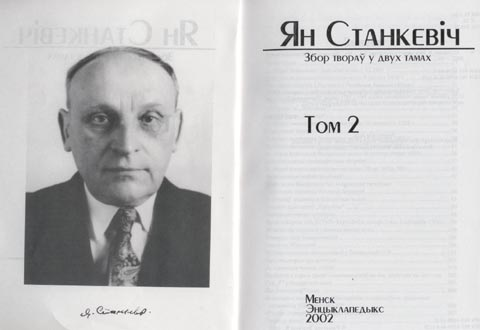

<h1 id="ян-станкевіч-у-менску-у-двух-тамох-збору-твораў">Ян Станкевіч у Менску: у двух тамох Збору твораў</h1>

Віктар Корбут

Днямі ў Менску ў выдавецтве "Энцыкляпэдыкс" выйшаў Збор твораў Яна Станкевіча ў двух тамох. Ян Станкевіч - ведамы заходнебеларускі й эміграцыйны філёляг, гісторык, грамадзкі дзяяч. Ягоныя толькі мовазнаўчыя - і далёка ня ўсе - працы зьмясьціліся на больш як тысячы старонках. Кніга выйшла накладам 500 ас. Тым, хто цікавіцца гісторыяй беларускае мовы, імя Яна Станкевіча вядомае, а вось працы ягоныя доўгі час былі недаступныя. Цяпер яны сабраныя у двух тамох. Пра жыцьцё, творчасьць і асобу Яна Станкевіча Віктар Корбут гутарыць з адным з аўтараў ідэі выданьня Збору твораў і адным з укладальнікаў Станкевічавага двухтомніка - Валерам Булгакавым.

Валер Булгакаў: - Найбольшую вядомасьць, найбольшы ўплыў на беларускае грамадзтва Ян Станкевіч здабыў у якасьці моваведа. Гэтаксама ён досыць плённа працаваў і ў іншых навуковых дзялянках - перадусім як гісторык. І калі зьберці разам усе ягоныя гістарычныя працы, то выйдзе агромністы том пад тысячу старонак (на жаль, зборам Станкевічавых гістарычных працаў дагэтуль аніхто не займаўся). Таксама ў пэўныя часы Станкевіч быў досыць уплывовым беларускім палітыкам. З 1928 да 1930 году ён быў дэпутатам польскага Сэйму ад Лідзкае акругі. Усё сваё сьвядомае жыцьцё ён браў удзел у розных беларускіх арганізацыях, але - асабліва калі браць эміграцыйны пэрыяд ягонага жыцьця, які пачаўся разам з прыходам Чырвонае арміі на беларускія землі ў 1944 годзе, - удзел ягоны ў гэных структурах можна ацэньваць дваяка, бо нацыянальная вага беларускіх арганізацыяў была даволі нізкая. Гэткім чынам, у асобе Яна Станкевіча маем перадусім лінгвіста, знаходкі, дасягненьні, распрацоўкі й вынаходкі якога замацаваліся ў сучасным беларускім моўным дыскурсе, пачынаючы ад слова "спадар" і канчаючы фактычна ім прапанаваным - як цяпер высьвятляецца - варыянтам назову беларускае сталіцы "Менск", а ня "Мінск" (Збор твораў пачынаецца з публікацыі 1917 году, дзе Ян Станкевіч прапаноўвае ўжываць форму "Менск", а ня "Мінск").

RR: - У чым сымбалічнасьць выхаду Збору твораў Яна Станкевіча, чаму ён выйшаў менавіта цяпер?

Валер Булгакаў: - Пра сымбалічнасьць можна казаць зь вялікаю нацяжкаю. Сымбалічна было б, калі б мы пасьпелі выдаць Збор твораў летась - на 110-ю гадавіну з дня народзінаў Станкевіча. Нагадаю для тых, хто ня ведае: Ян Станкевіч нарадзіўся 26 лістапада 1891 году ў сяле Вурняняты (ці паводле цяперашняе беларускае вэрсіі - Арляняты) цяперашняга Смургонскага раёну, г. зн. на самым узьмежку Беларусі й Літвы: ад ягонае сялібы, дзе ён зьявіўся на сьвет, да беларуска-літоўскае мяжы - колькі дзясяткаў кілямэтраў. ...На "круглую" дату мы не пасьпелі выдаць Збору твораў, але наагул ёсьць сымбалічнасьць у тым, што маладзейшае пакаленьне беларусаў, якое я таксама ўвасабляю, нарэшце зьвяртаецца да незапатрабаваных рэсурсаў беларускае нацыянальнае спадчыны. Творчасьць Яна Станкевіча была значна недаацэненая, незапатрабаваная. Пад час яго жыцьця ягоныя сучасьнікі часта паддавалі Станкевіча астракізму, ягоныя моўныя распрацоўкі выклікалі насьмешкі й зьдзек. І толькі цяпер, калі ўжо больш як трыццаць гадоў Яна Станкевіча з намі няма, нам нарэшце становіцца зразумелым сапраўдны маштаб яго постаці.

RR: - З кім яшчэ паводле маштабнасьці можа параўнаць постаць Яна Станкевіча?

Валер Булгакаў: - Хіба з Антонам Адамовічам, спадчына якога дагэтуль ня выдадзеная ў Беларусі, творчасьць якога дагэтуль аддадзеная забыцьцю, які ёсьць адною з вызначальных постацяў беларускага нацыянальнага жыцьця ХХ ст. Тут ёсьць пэўны сымбалізм. Ян Станкевіч сымбалізуе сялянскую культуру: ён нарадзіўся ў сяле, ягоныя сваякі былі сялянскага паходжаньня (прынамсі, найбліжэйшыя). І тым ня менш, здабыўшы ў Чэхіі, у Празе, вышэйшую асьвету, ён здолеў зрабіцца досыць прыкметным навукоўцам, якога згадвалі на розных міжнародных канфэрэнцыях. Антон Адамовіч - гэта карэнны месьціч, ягоная матка нарадзілася ў Вільні. Адамовіч ува ўмовах Менску пачатку ХХ ст. стаў актыўным носьбітам нацыянальных вартасьцяў. І Ян Станкевіч, і Антон Адамовіч - вызначальныя постаці нашае гісторыі. Трагізм сытуацыі палягае ў тым, што калі зь Янкам Станкевічам цяпер вядзецца нейкая праца - парадкуюцца ягоныя творы, то Антон Адамовіч фактычна не прысутнічае ў постсавецкай Беларусі. Калі мы выдама ўсяго Янку Станкевіча (перад намі стаіць заданьне выдаць усю ягоную публіцыстыку, а таксама, магчыма, гістарычныя творы, ёсьць звышзаданьне выдаць пераклад Бібліі, выкананы Станкевічам), - давядзецца брацца за Антона Адамовіча.

RR: - Часам Станкевіча паводле значнасьці ставяць у адзін шэраг з Вацлавам Ластоўскім...

Валер Булгакаў: - Станкевіч і Ластоўскі не былі людзьмі аднаго й таго ж пакаленьня. Станкевіч быў троху маладзейшы за Вацлава Ластоўкага й, у адрозьненьне ад Ластоўскага, быў не дылетант у мовазнаўстве, а быў чалавекам, які атрымаў па тых часох вельмі значную асьвету. Натуральна, пэўныя паралелі можна правесьці. Станкевіч актыўна супрацоўнічаў з выдаваным Ластоўскім часопісам "Крывіч". Сам Станкевіч вельмі пазытыўна ацэньвае ролю Ластоўскага ў беларускай культуры, але хутчэй насоўваецца, на мой пагляд, паралель ня з Вацлавам Ластоўскім, а з Браніславам Тарашкевічам. І той, і другі прэтэндавалі на кадыфікацыю беларускае мовы, і той, і другі ў 1918 годзе выдалі свае граматыкі беларускае мовы, але воляю лёсу так сталася, што паўсюдна першым кадыфікатарам беларускае літаратурнае мовы лічыцца Браніслаў Тарашкевіч, хоць Ян Станкевіч у меру сваіх магчымасьцяў аспрэчваў гэты статус у Тарашкевіча.

RR: - Хто рыхтаваў Збор твораў Янкі Станкевіча?

Валер Булгакаў: - Праект стартаваў у 1998 годзе. Пачаўся, як ні дзіўна, дзякуючы нефармальнай размове між мною й беластоцкім гісторыкам беларускага паходжаньня Алегам Латышонкам. Пад час аднаго з сваіх прыездаў у Менск Алег Латышонак сказаў, што было б вельмі цікава зрабіць Збор твораў Яна Станкевіча. Я яго горача падтрымаў. Пасьля гэтага мы скантактаваліся з Станкевічавымі сынамі, якія дагэтуль жывыя й здаровыя - і дай бог ім здароўя й удачы! - зь Вячкам, Юркам і Багушом. Выданьне не было б магчымым без руплівае дапамогі Генадзя Сагановіча, які таксама шмат чаго карыснага зрабіў, шмат аддаў свайго вольнага часу, каб запачаткаваць гэты праект. Таксама шмат спрэчных момантаў дыскутавалася зь Сяргеем Шупам і Сяргеем Дубаўцом у Вільні. Таксама мушу згадаць ідэйнага пасьлядоўніка Янкі Станкевіча - Юрася Бушлякова, які найбліжшым часам абароніць кандыдацкую дысэртацыю на тэму моўнае творчасьці Яна Станкевіча. Без кансультацыяў і парадаў Юрася Збор твораў Станкевіча проста не зьявіўся б на гэты сьвет.

© copyright Радыё Рацыя, 2002

