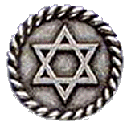

<table>
<tbody>
<tr class="odd">

<td>
<h1 id="слоўнік-свабоды.-жыды">Слоўнік Свабоды. Жыды</h1>

Сяргей Шупа

У канвэнцыях клясычнага правапісу («тарашкевіцы») і ў жывой беларускай мове дасавецкага часу гэтае слова было адзіным назовам народу, лёс якога за стагодзьдзі супольнага жыцьця цесна пераплёўся зь беларускім. У гэтым сэнсе Беларусь належала таму самаму эўрапейскаму арэалу, што й Польшча, Літва ды іншыя краіны Ўсходняй Эўропы, дзе словы <em>Zyd</em>, <em>Zydas</em> ня маюць ніякага абражальнага або адмоўнага адценьня.

Гвалтоўная русыфікацыя падсавецкай Беларусі надала беларускаму слову <em>жыд</em> зусім іншае гучаньне — у расейскамоўным кантэксьце яно ўспрымаецца гэтаксама як і адпаведнае расейскае, безумоўна абразьлівае, слова.

Апошнімі дзесяцігодзьдзямі вяртаньне да клясычнага, несавецкага варыянту беларускай мовы зноў паставіла пытаньне аб статусе слова жыд — аб тым як вярнуць яго ва ўжытак, ня крыўдзячы самых прадстаўнікоў гэтага народу. Праблемай найчасьцей паўставала тое, што апошні раз замена савецкага яўрэй на несавецкае жыд адбылася ў надзвычай трагічны для нашых народаў час Другой сусьветнай вайны, што не магло не выклікаць у сёньняшніх людзей балючых асацыяцыяў. З другога боку ўспрыманьне гэтага слова залежыць і ад таго, кім лічыць нас, беларусаў — асобным усходнеэўрапейскім народам (як палякі або літоўцы), або нейкімі «малодшымі братамі» расейцаў і мову нашую — толькі адгалоскам расейскай з усімі яе сэнсавымі асацыяцыямі.

Гэтая дылема, аднак, дагэтуль застаецца нявырашаная, а прыхільнікі клясычнага правапісу часта, каб пазьбегнуць канфрантацыі, ужываюць словы гэбрай, гэбрайскі. Слова жыд загінула ў полымі Галакосту, слова яўрэй — на руінах савецкай імпэрыі.

«Вы ўскрэсьнеце, Жыды, усьлед за Беларусяй», - спадзявяўся Янка Купала ў 1919 годзе. Гэтаму прароцтву не было наканавана збыцца. Другая сусьветная вайна ў Беларусі забрала ў нябыт цэлы культурны кантынэнт беларускага жыдоўства (задумаемся, чым рэальна напоўненая вядомая ўсім формула «кожны чацьверты»). Гэты кантынэнт зьнік як Атлянтыда. Ягонымі спадкаемцамі застаемся мы ўсе.

<a href="gb_add.html?ref=http%3A%2F%2Fwww%2Epravapis%2Eorg%2Fart%5Fjew%5Fbelarusian%2Easp">Напішыце водгук // Write your comment</a>
</td>
</tr>
</tbody>
</table>
