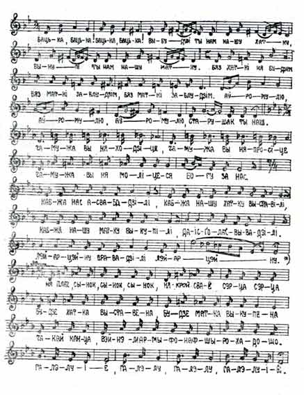

<table>
<tbody>
<tr class="odd">

<td>
<h1 id="жыдоўскія-рэлігійныя-песьні-па-беларуску">Жыдоўскія рэлігійныя песьні па-беларуску</h1>

Др. Янка Станкевіч

Крыніца: "Гадавік Беларускага Навуковага Таварыства ў Вільні". Вільня, 1933. Кніжка І. Стар. 185-186.

English summary: The article <strong>"Jewish religious songs in Belarusian"</strong> was published in 1933 in the "Annals of the Belarusian Scientific Society in Vilnia." Our revolutionary linguist doctor Janka Stankievic provides the lyrics and the notes of one Jewish song in Belarusian language which he recorded in the village Dauhinava, in Vilejka district. Stankievic writes that during 15-17th centuries, when Belarusian culture was in its "Golden Age", Jews of Belarus would translate scientific works and the Bible from Hebrew into Belarusian, which would then be used in synagoges. Based on the data from several sources, the author also conculdes that during 14-15th centuries the Jews of Belarus used Belarusian languiage as the chief means for communication between themselves, and that in the last quarter of the 16th century the many newcomer Jews from Germany would bring to Belarus the superior culture and the German language, which was from that point on gaining dominance among the Belarusian Jews and would later become a variant of Yiddish. The author provides a quote from one rabbi's letter, which was written in 1687: "...because these traditions are deep-rooted, and majority of brothers of our faith there [in Belarus] speak Ruthenian language... If God gives them enough wisdom, they will all speak the same language - German..." In the concluding paragraph the author urges linguists and ethnographers in Belarus to record other similar Jewish songs in Belarusian language, before it's too late.

Ад рэдактара pravapis.org: Я поўнасьцю захаваў артаграфію гэтага невялікага артыкулу, хаця, шчыра кажучы, вельмі карцела нешта падрэдагаваць. Наагул, я заўжды з прыемнасьцю чытаю прыгожую жывую мову нашага рэвалюцыйнага мовазнаўцы Янкі Станкевіча. І хаця яна мейсцамі моцна адрозьніваецца ад сучаснай беларускай мовы, асабліва ад наркамаўскага варыянту, але відавочна, што выбар таго ці іншага слова, той ці іншай граматычнай канструкцыі ў Янкі Станкевіча зусім не выпадковы. За кожным такім "нестандартным" выразам я бачу рацыянальны выбар таленавітага мовазнаўцы. Наагул, я думаю, калі б не рэформа 1933 г. і агульная палітыка русыфікацыі краю, то гэтак магла-б выглядаць наша сучасная літаратурная мова...

<strong>Д</strong>рукаваная гэтта жыдоўская рэлігійная песья ў беларускай мове запісана мною ад Вульфа Сосенскага з м. Даўгінава Вялейскага пав. Ноты гэтае песьні ад таго-ж В. Сосенскага запісаў В. Багдановіч. Няма ведама, ці апрача друкаванае тут песьні ё яшчэ запісаныя іншыя жыдоўскія рэлігійныя песьні ў беларускай мове. Затое ведама, што таковыя песьні яшчэ дагэтуль запісваць магчыма, бо некаторыя старыя жыды беларускія іх умеюць. Як мне расказваў В. Сосенскі, цяперака іх пяюць не ў сынагогах, але на вясельлях і іншых сямейных сьвятах, калі пачынаюць успамінаць старыну.

<strong>Я</strong>кая была прычына паўстаньня жыдоўскіх рэлігійных песьняў у беларускай мове і калі яны паўсталі? Каб адказаць на гэтыя пытаньні, трэба зьвярнуць увагу на колькі зьявішчаў з гісторыі беларускіх жыдоў і адначасна з гісторыі беларускае культуры. Ня толькі ў жыдоў былі рэлігійныя песьні пабеларуску, але з часу красаваньня беларускае культуры (XV-XVI вв.) маем навуковыя творы, перакладзеныя жыдамі з гэбрэйскае мовы на беларускую ("Тайна тайных", "Лёгіка" і інш.) У XV стаг. маем беларускія пераклады Бібліі, зробленыя жыдамі з мовы гэбрэйскае. Бібліі гэтыя прытарнаваны для ўжываньня ў сынагогах.<a href="#spasylki">1</a> 

<strong>П</strong>аводле некаторых дадзеных можна думаць, што ў стаг. XVI, XV і раней моваю беларускіх жыдоў быў язык беларускі; па-беларуску гаманілі яны ня толькі з беларусамі, але й між собку.<a href="#spasylki">2</a>  Каротка кажучы, справа выглядала-б гэтак: Спачатна беларускія жыды гаманілі вылучна пабеларуску і адно некаторыя з інтэлігенцы зналі апрача таго гэбрэйскую мову. Апошнія й былі перакладчыкамі сьвецкіх твораў і Бібліі з языка гэбрэйскага на беларускі. У гэтым часе мусілі зьявіцца ў жыдоў рэлігійныя песьні пабеларуску. <a href="#spasylki">3</a>  Вылучнае панаваньне беларускага языка сярод жыдоў у Беларусі трывала пэўне моцна да апошняе чвэрці XVI стаг., калі ў Беларусь пачынаюць наплываць жыды з Нямеччыны. Вышэй стоячы з боку культурнага, матар'яльнага і, хіба, пераважаючы колькасна, нямецкія жыды робяць уплыў на жыдоў нашых і памалу перадаюць апошнім сваю нямецкую мову, ператворанаю з часам у цяперашнюю жыдоўскую. Перамога нямецкае мовы над беларускаю ў жыдоў у Беларусі сталася не адразу, хоць ёй прыяў сход беларускае культуры. У XVII ст. яшчэ было нямала беларускіх жыдоў, што ня зналі іншае мовы апрача беларускае. Аб гэтым сьведчыць адзін рабінскі адказ з XVII в. (Seejloth ut'shuvoth. G'vurath aanashim (Пытаньні й адказы. Сіла людзкая). Dessau 1687, бал.<a href="#spasylki">4</a>  22b). Тамака знаходзім: "Бо гэты звычай укараніўся, што нашыя сувернікі, жывучыя сярод нас (у Беларусі) у большасьці гамоняць рускім языком (-- беларускім, бо гэтак зваўся тады беларускі язык)... Калі дасьць Бог зямля напоўніцца мудрасьцяй, усе гаманіць будуць аднэй моваю -- нямецкай."<a href="#spasylki">5</a> 

 <strong>П</strong>адаючы кароценькую зацемку аб беларушчыне ў нашых жыдоў, хачу зьвярнуць увагу на гэтую цікавую праблему; мо яна знойдзе сваіх дасьледвальнікаў. А зьбіраць жыдоўскія рэлігійныя песьні ў беларускай мове трэба ўсім, бо яшчэ крышку часу і будзе зусім позна.

Др. Я. Станкевіч

<strong>Тэкст і ноты песьні</strong>

Бацька, бацька! Бацька, бацька! 
Выбудуй ты нам нашу хатку, 
Выкупі ты нам нашу матку. 
Бяз хаткі ня будзем, 
Бяз маткі заблудзім, 
Бяз маткі заблудзім. 
Аўромулю, Аўромулю! 
Аўромулю, старушак ты наш. 
Чаму-жа вы ня ходзіце, 
Чаму-жа вы ня просіце, 
Чаму-жа вы ня моліцеся 
Богу за нас. 
Каб-жа нас асвабадзілі, 
Каб-жа нашу хатку выставілі, 
Каб-жа нашу матку выкупілі, 
Даісголатвывадзілі. 
Лэйарцэйну правадзілі, Лэйарцэйну.<a href="#spasylki">6</a>  
Ня плач, сынок, сынок, сынок, 
Ня крой сваё сэрца, сэрца 
Будзе хатка выставена 
Будзе матка выкупена 
Чакай канца, вэйнэмармыфонафшырохадошо 
галэлуіе, галэлу, галэлу, галэлуіе.<a href="#spasylki">7</a>  

 
<strong>Спасылкі / Footnotes</strong> 
 
1) Гл. Яўхім Карскі, Белорусы, III-2, юал. 17-21, 54, 59 і інш. <a href="#FOOTNOTE1">вярнуцца / back</a> 
 
2) Прыр. працу А. Гаркаві аб славянскіх мовах у жыдоў, надрукаваную ў "Трудахъ Восточ. Отд. Имп. Рус. Археогр. Общества" 1865 г.<a href="#FOOTNOTE2">вярнуцца / back</a> 
 
3) Нашага пагляду на паходжаньне менаваных песьняў ё Гольдбэрг у "Часапісе для дасьледваньня чўрэйскае гісторыі, дэмографіі etc." Том II-III. Менск, 1928. Менаваны часапіс выдаваў Жыдоўскі Сэктар Інстытуту Беларускае Культуры.<a href="#FOOTNOTE3">вярнуцца / back</a> 
 
4) (зацемка рэдактара pravapis.org) бал. - аўтарскі скарот ад слова "балонка" (старонка, бачына, аркуш).<a href="#FOOTNOTE4">вярнуцца / back</a> 
 
5) Цытую павдоле арт. Др. М. Альтбаўэра, O bledach ortogr. i gram. w zadaniach polskich Zydow. "Jez. polski", 1929 г., бал. 107. З этага-ж артыкулу бяру да свае зацемкі і некаторыя іншыя ведмасьці й думкі.<a href="#FOOTNOTE5">вярнуцца / back</a> 
 
6) Па гэтых словах маем у тэксьце песьні два звароты - да Ісаака ("Ісхакулю, дзядулька ты наш") і да Якава ("Якавулю, татулька ты наш") з аднолькавымі як да Абрагама просьбамі. Звароты гэтыя, як маючыя тую самую мэлёдыю, што й зваротт да Абрагама, не паўтораны ў запісаных нотах.<a href="#FOOTNOTE6">вярнуцца / back</a> 
 
7) Зрусыфікаваны варыянт гэтае песьні знаходзім у кніжцы "Еврейскія народныя песни въ Россіи". Собраны и изданы С. М. Гинзбургомъ и П. С. Маркомъ. СПБ, 1901. № песьні 14.<a href="#FOOTNOTE7">вярнуцца / back</a>

See also / Гл. таксама: 
 
- <strong><a href="articles/art_jew_belarusian.html">Слоўнік Свабоды. Слова "Жыд". С.Шупа</a></strong> 
- <strong><a href="articles/art_jan_stankevich1.html">Інтэрвію з Юрасем Бушлаковым з нагоды выхаду двухтамовіка Янкі Станкевіча</a></strong> 
- <strong><a href="articles/art_jan_stankevich2.html">Інтэрвію з Валерам Булгакавым з нагоды выхаду двухтамовіка Янкі Станкевіча</a></strong> 
- <strong><a href="articles/art_hebrew1.html">Элязэр Бэн-Йегуда й адраджэньне іўрыту</a></strong> 
- <strong><a href="articles/art_benyehuda2.html">Eliezer Ben-Yehuda and the Revival of Hebrew (in English)</a></strong> 

<a href="gb_add.html?ref=http%3A%2F%2Fwww%2Epravapis%2Eorg%2Fart%5Fjewish%5Fbelarus%2Easp">Напішыце водгук // Write your comment</a>
</td>
</tr>
</tbody>
</table>
