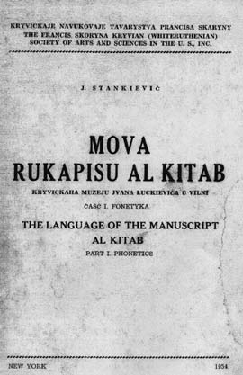
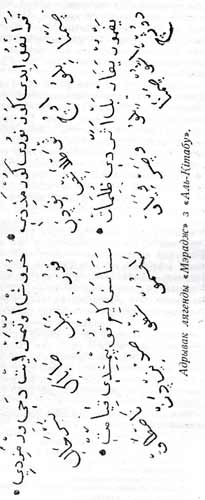
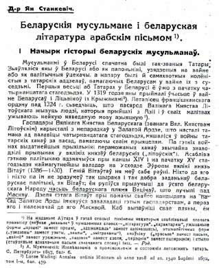

<h1 id="kitabs-the-unique-highlight-of-the-belarusian-language">Kitabs, the unique highlight of the Belarusian language</h1>

by Niesciarovich, from the "Encyclopedia of the Belarusian language"

 Kitabs are the books written <strong>in Belarusian language using Arabic script</strong>. They were written mostly in the 16th century by the Tatars that lived in Belarus, the Grand Duchy of Lithuania, since 14-15th centuries and have gradually forgotten their native language. In order to preserve their religion they had to translate  *Koran*  and other sacred Islamic books into Belarusian language, but preserving the Arabic script.

 *Kitabs*  contain Oriental legends, fables, adventure stories, description of rituals, the so called "Meradj" (a poem about Muhammed ascending to heaven), narratives for youth about moral and ethical behavior (respect for parents, guests, beggars, orphans, neighbors, etc.), fortune telling on Koran letters, interpretation of dreams. Apart from  *kitabs*  there also other related books:  *tefsirs*  (Koran with line-by-line commentary in Belarusian and Polish),  *tejvijs*  (the rules of Koran reading),  *hamails*  (special prayer books).

Starting from the 14th century Tatars started moving into Belarus, some as prisoners of war, others voluntarily, in search of better life. For a certain period of time they had preserved their own tradition, but gradually have been joining the Belarusian cultural context, forgetting Tatar language and learning Belarusian. By 16-17th centuries the great majority of Grandlithuanian Tatars already forgot the Tatar language. We can learn from  *Risale-i-tatar-i leh*  (the report from an unknown Tatar traveler made for the Turkish sultan Suleiman regarding the Tatar-immigrants in Belarus and Lithuania) that Tatar language was used only by the Tatars who moved to the Grand Duchy recently. For those who didn't speaks Tatar language it was advised:  *"kali chto pa-tatarsku nie umieje, to pa-rusku niachaj abrakajecca"*  (for those who don't know Tatar, you should speak Ruthenian). This is an extract from a text that was written in the first half of the 18th century, and of course Ruthenian means Old Belarusian in this context. This peculiarity obliged Tatars to translate Islamic literature into Belarusian, preserving the overall appearance, including the alphabet.

The studies of  *Kitabs*  begin in the 19th century. Their discovery is attributed to the well-known orientalist, the professor of Petersburg University Mukhlinsky, who published the excerpts from  *Kitabs*  in his work "The research on the Origin and State of the Lithuanian Tatars" (Saint-Petersburg, 1857), noting that "it's worth making a small library from those books." After professor's death (in 1877) there was a disruption in the research of the  *Kitabs* . They came into light again in the beginning of the 20th century (Janka Stankievic, I.I.Luckievic, J.Karski, I.Kraczkouski and others have been studying them at that time). A.K. Antanovicz have researched the texts thouroughly. In his book "Belarusian texts in Arabic script" (1968) he looked into 24 original texts (including 8  *Kitabs* ), gave detailed linguistic evaluation, made some extimates about the time of writing and the geographic origin of each book, studied the graphical aspect of the alphabet and the special letters that were used by Tatars to reflect the Belarusian phonetics, published many transliterated excerpts.

 *Kitabs*  are written from right to left, not left to right as, of course, customary in Belarusian texts.  *Kitabs*  vary in size: from 70 up to 1000 pages. Each row in a book forms one unbroken string, without the breaks between the words. There are also no capital letters or punctuation. The word breaks according to a single rule: each row should have the same width as the previous one. A new chapter begins with the word  *bab*  (chapter, new story) or  *hikajet*  (story, fable). Sometimes these words are missing but instead the initial words of the story (the first "sentence") are copied to the margins to indicate the beginning of the new story.

 
An extract from Meraj. 
This is written in Belarusian!

The language of the  *Kitabs*  is different from the language of other Old Belarusian literary artefacts, but it's close to the simple language of the people, which is evident from the vocabulary ( *spreczka, zaranak, prysmaki, zhoda, hadavac* ), phraseology ( *jak vokam mlihnuc, jak slova skazac, na sviet puscic, na paznohac, szliub brac* ), syntactical features ( *pajszou pa prarockuju duszu, dziakavac tavaryszu* ). By using the Arabic script, a little bit altered to reflect the Belarusian phonetical features, some phonetical traits are expressed even better in the Arabic script rather than in Cyrillic texts of that time: the so called "dziekannie" and "cekannie" (soft "d" becoming "dz" and soft "t" becoming "c"), palatalization of "s", "z", "d", "t". E.g.  *s'viecie, z'vieczara, z'nik, viernas'c', dz'viery* .

Here are some transliterated sample from the Kitabs: 
 
 *Siulejman kazal sobi palac vusoki zbudava[c]i... ale ryba odna morom plynie i stala... rekla: - "Hospodaru Siulejmanie... pan Boh kazal mni u [c]iebie jes'[c]i pici prosi[c]'. Siulejman rek: - Mila ryba. Prauda. Oto majesz szto jes'[c]i b pici*  (a sample from the 17th century Kitab); 
 
 *Potym jeszcze varota adczynilisie... tam vidzieu adzin polk z^anok... - Szto hetyje na s'viecie czynili? Anhiel rek: Malako svaje predavali. U jich usich svaje dzieci byli, svaje pakinuuszy, czuz^yje mamczyli"*  (a sample from the 18th century Kitab); 
 
 *Szto pras son pabaczysz. Kali sonca upatuchu baczyc', hultajom budzie. Kali jezdzic na karabli, abierniecca, hosc budzie."*  (a sample from the 19th century Kitab).

Kitabs contain certain specifically Islamic words which refer to various religious rituals and practicies. For example,  *selam (salam)*  - the Muslim greeting, like in the idiomatic expression  *dac' selam* ; also  *vasijat* ,  *djanaze* , and many others. Most of those words were truly incorporated into the language (the nouns decline like other Belarusian nouns, verbs conjugate like typical Belarusian verbs). Some Oriental words have changed their forms under the influence of Belarusian language. For example, the word  *dua*  (prayer, request, call) has been used with a dimunitive suffix  *duajka* . The Arabic word  *kiafir*  (infidel) was used as a basis to create other word forms  *kiafiry*  (plural),  *kiafirski*  (adjective),  *kiafiranie* . Some Arabic specialists, for example U. Dziamidczyk, believe that those words must not be translated. They are the international words among the Muslims, and there is more to it than a simple meaning of the word, it's a sign that those people believe in the same God. There is a ritual aspect to using those words. And although they too have experienced the influence of Belarusian language, they could not possibly enter into the Belarusian language for that simple reason that those writings were essentially inaccessible for the Belarusian people: Belarusians neither had physical access to it, nor understood the writing system.

Nowdays  *Kitabs*  are being preserved in the libraries of the <a href="http://www.ac.by">Academy of Science of Belarus</a>, Academy of Science of Lithuania, Vilnia (Vilnius) University, Petersburg and Kazan University, Vilnia (Vilnius) History and Ethnography Museum, as well as private libraries.

Reference:

<ul>
<li>Janka Stankievic. Mova rukapisu Al Kitab. Casc I. Fonetyka. New York 1954</li>
<li>Д-р Ян Станкевіч. Беларускія мусульмане і беларуская літаратура арабскім пісьмом. Гадавік Беларускага Навуковага Таварыства ў Вільні. Вільня. 1933. Кніжка І. (Другі малюнак з урыўкам тэкста ўзяты з гэтага артыкулу)</li>
<li>Луцкевіч І. Ай-Кітаб-Кіцёп. "Беларускае жыцьцё". 1920. №6</li>
<li>Луцкевіч І. Ай Кітаб. Зб. "Наша Ніва". Вільня, 1920</li>
<li>Карскі Я. Ф. Беларуская мова арабскім пісьмом. Вести Нар. коммисариата просвещенияя ССРБ. 1922. №1\3</li>
<li>Шлюбскі А. Беларуская мова арабскай транскрыпцыяй. "Наш Край" 1926. №6-7</li>
<li>Вольскі В. Асноўныя прынцыпы арабскай транскрыпцыі беларускага тэксту ў "Кітабах". "Узвышша" 1927. №6</li>
<li>Вольскі В. Аб асаблівасьцях жывой мовы беларускіх татар і арабскай транскрыпцыі "Алькітабаў". "Наш Край" 1927, №8-9</li>
<li>Антонович А.К. Белорусские тексты, писанные арабским письмом, и их графико-орфографическая система. Вильня, 1968</li>
</ul>

