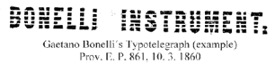
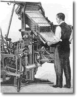

<h1 id="belarusian-language-in-20th-century-vostraja-brama-mova-2000">Belarusian Language in 20th Century 
Vostraja Brama: Mova-2000</h1>

Сяргей Дубавец

Калеґа неяк згадаў, што бачыў у адным амэрыканскім музэі факс 1918 году. Гэта акурат таго часу, калі рэвалюцыйны матрос у Расеі браў тэлеґраф, каб дабрацца да доўгіх папяровых стужак і тэлеґрафаваць Леніну. А ў Амэрыцы, бачыце, ужо пасылалі факсы.

А яшчэ мне давялося ў рэдакцыі ґазэты “Washington Post” бачыць лінатып канца 19 ст. - такі самы, на якім яшчэ ў 80-я гады рабіліся ў нас усе ґазэты. Цалкам магчыма, што і сёньня застаўся дзе-небудзь такі - у раённай ці заводзкай шматтыражцы.

Лінатып - гэта друкарская наборна-адлівачная машына, помнік тэхнічнай цывілізацыі, робат з рукамі, страўнікам і ротам... Вось балванка сплаву апускаецца ў кацёл, тымчасам клявіятура набірае латунныя літаркі-матрыцы ў радок. Матрыцы зь лязгатам лятуць аднекуль зьверху, з барабанаў. І вось радок сабраны. Жалезная рука засоўвае яго ў пашчу лінатыпу, дзе радок адліваецца ў мэтал. Нешта сярэдняе паміж робатам-цацкай і робатам-касьмічным прыхаднем. Адно што перасоўвацца самі лінатыпы ня ўмелі. Можа з-за гэтага і вымерлі. Як дыназаўры навукова-тэхнічнага праґрэсу. Разам зь імі выйшла з ужытку і іхнае імя.

А пачаў я з факсу і лінатыпу - гэтых сымбаляў цывілізацыі, каб сказаць, што ХХ стагодзьдзе ў беларускай мове не адлюстравалася, не ўвайшло сваімі рэаліямі і зьявамі ў яе тканіну і кантэкст. Усе здабыткі цывілізацыі, якіх за мінулыя сто гадоў была процьма, мы называем запазычанымі словамі, чужымі нам паводле духу і літары. Гэтыя словы не належаць мове. Яны ёсьць, а могуць і ня быць, бо яны ёсьць і ў іншых мовах - у расейскай, празь якую да нас прыйшлі, або ў ангельскай ці нямецкай, у якіх, як правіла, нараджаліся. Але аб'ём такой незасвоенай лексыкі ў беларускай мове расьце, нібы тое чужароднае цела выцясьняючы ўсё астатняе, сваё. Бо расьце вакол нас колькасьць новых цывілізацыйных выгодаў. Усё большая частка моўнага цела замяняецца пратэзамі.

Так адбываецца зусім не таму, што беларускія навукоўцы нічога не далі сусьветнаму навукова-тэхнічнаму прагрэсу. З гэтым якраз праблемаў няма, пачынаючы яшчэ зь ХІХ ст., калі ўвогуле не зь сярэднявечча і сканчаючы сёньняшнім днём. Але мова праґрэсу ні тады, ні цяпер - не беларуская. І ў гэтае зьявы прычына ўжо чыста палітычная. А менавіта русіфікацыя, у яе самых глыбінных падступных праявах, пра якія мы пагаворым у сёньняшняй перадачы.

Пачнем са слоўніка, які дасьць нам магчымасьць увачавідкі агледзець лексычную карціну. З артаґрафічнага школьнага слоўніка беларускай мовы, у якім ХХ ст. не адлюстравалася амаль ніводным беларускім словам.

Ёсьць, праўда, хрэстаматыйныя выключэньні, але іх, здаецца, усяго два. Гэта слова  *цемрашал* , якім Кандрат Крапіва пераклаў расейскага  *мракобеса*  і слова  *хмарачос* , якім не без насьмешкі пераклалі расейскіх  *небаскрёбаў*  - найперш амэрыканскую на той час зьяву. Праўда, са зьяўленьнем леґальных праамэрыканскіх настрояў у беларускамоўнай публіцы зьявіўся і больш лагодны, паэтычны нават тэрмін. Хмарачосы сталі называць небасягамі.

У школьным артаґрафічным слоўніку маю ўвагу прыцягнулі тэрміны, якія пачынаюцца з "электра". Вось электрапыласос. Цікава, мы ніколі яго так не называлі. Магчыма, існавалі і нейкія іншыя пыласосы - мэханічныя, напрыклад, ці пнэўматычныя. Нехта надзімае мяхі, а нехта другі соўгае шчоткай па падлозе. Або - электрапрайгравальнік. Я так разумею - гэта пра вінілавыя адаптары, якія сыйшлі ў нябыт, на масавым, прынамсі, узроўні. Беларуская мова нават не пасьпела ўсё гэта засвоіць, а яно ўжо і зьнікла. Электракамбайн, электралямпа, электратранспарт - проста заварожвала нашых людзей гэтае  *электра* - яшчэ ў сямідзясятыя. Падобна як сёньня заварожвае прыстаўка  *эўра* -: эўрарамонт, эўрашыбы, эўрадзьверы... Ажно тая заварожанасьць зьнікла кудысьці, саступіўшы месца іншым страхоцьцям з будучыні. І яшчэ раз пацьвердзіўшы, што навукова-тэхнічны праґрэс - гэта толькі вонкавая праява, інфраструктура, якая не зьмяняе і ня зьменіць сутнасьці чалавека. Ажно мова, што ні кажы, мусіць засвойваць тэрміналёґію гэтага самага праґрэсу.

Вось цяпер - усеагульная кампутэрызацыя. Гэта ці не кампутары мы яшчэ ўчора называлі ЭВМ - электронна-вылічальная машына? Які-небудзь файл палякі называюць  *плік* , а мы кажам -  *файл* . Пры гэтым можна заўважыць, што амаль усе праґрамы ў менскіх карыстальнікаў - як правіла, рускамоўныя. Што  *Ўіндаўз* , што  *Інтэрнэт Эксплорэр* , што  *Ўорд* . Хоць уласна расейскага ў іх няшмат. Кажуць: ты працуеш на  *пісі* , а я на  *макінтошы* . Што тут расейскага? А вось што - добраахвотны выбар. Бо калі няма свайго, чаму не карыстацца арыгіналам - ангельскімі праґрамамі? Спытайцеся пра гэта, і вам хто-небудзь абавязкова адкажа рытарычным лукашэнкаўскім "А зачэм?"

Што ЭВМ, што ВЦСПС у школьным слоўніку выглядаюць аднолькава, як рэчы аджылыя, забытыя, а ўжо цяперашняму школьніку і незразумелыя.

Ці можам мы суцяшацца тым, што празь дзясятак гадоў забудзецца і ўсё гэта? А можа і яшчэ раней. Давайце падумаем. Можа, захаваць мову на ўзроўні спрадвечнай лексыкі і не псаваць яе новатворамі. Урэшце, тое, што не зьмяняецца, не разьвіваецца, ніколі і не памірае.

У афіцыйную, «дэкарацыйна-сувэнірную» беларускую мову фактычна ўсе слоўныя навіны стагодзьдзя аўтаматычна пераносіліся з мовы расейскай, таму складаньне тэрміналяґічных слоўнікаў часта ператваралася ў практыкаваньне ў фанэтыцы.

А можа, гэта значыць, што тэхнічная цывілізацыя не прыняла нас? Ці што мы не прынялі яе? І яшчэ: ці трэба культуры засвойваць тое, што прамінае з часам? Магчыма, наша беларуская бязьдзейнасьць у гэтай справе дасьць нам нейкія дывідэнды ў будучыні?

Каб адказаць на гэта, я абраў два шляхі. Па-першае, ёсьць такія сфэры жыцьця, дзе культура і тэхналёгія непасрэдна сутыкаюцца і ўзаемадзейнічаюць. Іншымі словамі, тэхнічная тэрміналёґія і паэтычнае слова тут часта тоесныя. Да прыкладу, у архітэктуры. Сяргей Харэўскі на маю просьбу падвёў вынікі шуканьня беларускага архітэктурнага стылю і адпаведнае лексыкі ў ХХ ст.”.

(Сяргей Харэўскі: ) “ХХ стагодзьдзе блізу не кранула беларускі лексыкон будаўнікоў і дойлідаў. За цэлае стагодзьдзе беларусы не пасьпелі стварыць сваю нацыянальную школу архітэктуры.

Між тым, на самым пачатку стагодзьдзя такая задача ўважалася за адну зь першых мэтаў нацыі. Яшчэ ў 1910-м годзе ў ананімным артыкуле, прысьвечаным нашай архітэктуры, "Да чытачоў" у  *Kwartalniku Litewskim*  прагучаў, да прыкладу, гэткi красамоўны заклiк: "Узораў i тэмаў да працаў будзем чарпаць найперш у нашай мiнуўшчыне, бо там ёсьць адзiна чыстыя i сьвежыя крынiцы Душы..." Мо тады й была закладзеная прынцыповая памылка, бо заклік у мінуўшчыну зьвярнуў позіркі дойлідаў назад, а не наперад. У гэтым сэнсе паказальнае прызнаньне менскага архітэктара Краснапольскага. Ён пiсаў у  *Tygodniku illiustrowianym* , за 1912 год:

"Марачы аб стварэньнi арыґiнальнай нацыянальнай архiтэктуры, я iду шляхам нямецкiх мадэрнiстаў, аднак, толькi ў тым сэнсе, што не кампiлюю з гатовымі стылямi, а ператвараю зьнешнюю форму, iмкнуся зразумець i захаваць Душу старажытных пабудоваў... Так я ствараю свае замкi i касьцёлы".

Натуральна, ідучы "шляхам нямецкіх мадэрністаў", самі дойліды былі яшчэ далёкія ад моваторчасьці, ад прыдумляньня ўласных тэрмінаў. Аднак, яны паволі рухаліся ў слушным накірунку, усё часьцей згадваючы першаснасьць Душы. Менавіта яна, Душа Народа, а не эпіґонства стыляў мінуўшчыны, падказала, нарэшце, кірунак. Архітэктар Вітан-Дубейкаўскі, які выканаў першы праект касцёлу ў "беларускiм" стылi, пісаў:

"Заданьне было даволi цяжкае, бо ў лiтаратуры анi тэхнiчнай, анi архiтэктанiчнай пра беларускi стыль не было нiякiх згадак. Але як рабіць - то рабіць. Глыбака ўдумаўся я ў заданьне й запраектаваў касьцёл у беларускім стылю. Не зусiм тут, праўда, мая заслуга - галоўна дапамаглi думы-думы з Душы Нашага Народа".

Дубейкаўскi распрацоўваў і ўласную будаўнічую тэрміналёґію й сыстэматызаваў сваю тэорыю беларускага стылю ў кнізе "Рэформа беларускага дзераўлянага дойлідзтва".

Тымчасам у Коўне, у 20-30-я гады, працаваў над беларускай тэрміналёґіяй слынны беларускі дойлід Дуж-Душэўскі. Ён рэдагаваў і выдаваў за свае грошы часопiс "Тэхнiка i гаспадарка". А таксама выдаў беларускія падручнiкі па будаўнiцтву й архiтэктуры. Але й ягоныя высілкі паглынуў нябыт... Бо да Бацькаўшчыны яны не дайшлі. У Менску таксама рабіліся спробы стварыць новую беларускую тэрміналёґію, вывучаць нацыянальнае дойлідзтва. Тэрміналяґічная камісыя пры Інбелкульце рыхтавала й асобны слоўнічак. Але ў ім адпала патрэба разам з канцом беларусізацыі. Адзіная, да вайны, кніга па-беларуску, якая тычылася дойлідзтва, выйшла ў 1928 годзе. Гэта быў першы том "Нарысаў зь гісторыі беларускага мастацтва" Шчакаціхіна. Наступная ж кніга на гэтую тэму выйшла амаль праз паўстагодзьдзя, толькі ў 1973 годзе. Гэта кніга Чарняўскай пра архітэктуру Магілёва. Заўважу, што Шчакаціхіна і Чарняўскую лучыць ня толькі любоў да беларускае архітэктуры, але й тое, што яны родам з Масквы.

Сваіх дойлідаў у Беларусі пачалі навучаць толькі з 1952 году, на сьціплым будаўнічым факультэце ў Палітэхнічным інстытуце. Натуральна, чужыя выкладчыкі. Да гэтага ж часу цэнтры беларускіх гарадоў ужо былі дашчэнту перабудаваныя савецкімі архітэктарамі з Масквы й Ленінграду. Ідучы па Скарынаўскім праспэкце, які запраектавалі тыя самыя спэцыялісты з Расеі, а пачалі будаваць палонныя немцы, я зноў згадваю тых, хто заклікаў выдумляць беларускі стыль з Душою Народа. Самыя буйныя архітэктурныя ансамблі ХХ стагодзьдзя ў Беларусі нічога супольнага з той Душою так і не займелі. Што такое "беларускі стыль" няведама й дасюль. Бо, перадусім, як прарочыў Багушэвіч, мова ёсьць адзежа Душы”.

Галоўным клопатам моватворцаў заўсёды было супрацьстаяць уплыву пануючай на працягу стагодзьдзяў культуры — нямецкай у чэхаў, польскай і расейскай — у літоўцаў, нямецкай і расейскай — у эстонцаў.

(Сяргей Дубавец: ) “Ці трэба культуры засвойваць тое, што прамінае з часам? Сяргей Харэўскі даў на гэтае пытаньне станоўчы адказ, агледзеўшы беларускую архітэктурную тэрміналёґію, якая адначасова культурная і тэхнічная. Яшчэ адзін спосаб адказу на пастаўленае пытаньне - гэта агляд моўнае практыкі і моўнага досьведу нашых суседзяў. Такі агляд я папрасіў зрабіць Сяргея Шупу”.

(Сяргей Шупа: ) “Галоўным клопатам моватворцаў заўсёды было супрацьстаяць уплыву пануючай на працягу стагодзьдзяў культуры — нямецкай у чэхаў, польскай і расейскай — у літоўцаў, нямецкай і расейскай — у эстонцаў. Сродкі ўжываліся розныя. Найперш актывізаваліся ва ўжытку старыя і даўно забытыя словы, пераглядаліся багацьці народных гаворак, а таксама ўтвараліся новыя словы ад наяўных каранёў. Так, прыкладам, чэская мова займела шмат сваіх спэцыфічных словаў, якіх няма ў іншых мовах. (Памятаю, як аднойчы зь сябрамі мы спрабавалі адкаркаваць бочку з чэскім півам, але ня здолелі разабраць інструкцыі, дзе ўсе словы былі спрэс славянскія. Давялося прапароць бочку нажом і абліцца півам з ног да галавы.) Чэхі няшчадна перакладалі й перакладаюць звыклыя нам інтэрнацыяналізмы: «цэнтральны камітэт» — «ustredni vybor», «патрыёт» — «vlastenec», «радыё» — «rozhlas», «нумар» — «cislo», «кампутар» — «pocitac», «файл» — «soubor».

Моўная камісія рэкамэндуе замест чужынскіх «гамбургер» і «гот-дог» ужываць наватворы «mesainis» і «desrainis», што па-нашаму больш-менш гучала б як «мясень» і «каўбасень».

У польскай мове хваля пурызмаў была меншая, аднак, прыкладам, цалкам спольшчаная некалі была ўся тэхнічная тэрміналёгія, у якой амаль не знайшлося месца нямецкім, францускім ці ангельскім тэрмінам, якія, прыкладам, прыжыліся ў расейцаў, дзе пурызм заўсёды лічыўся нечым непрыстойным. Вось жа «дроссель» у палякаў — «dlawik», «парашут» — «spadochron», «танк» — «czolg», а «шарыкападшыпнік» — «lozysko kulkowe».

Літоўская мова дагэтуль спрабуе супрацьстаяць наплыву барбарызмаў, і адмысловая моўная камісія пры Літоўскім Сойме, прыкладам, рэкамэндуе замест чужынскіх «гамбургер» і «гот-дог» ужываць наватворы «mesainis» і «desrainis», што па-нашаму больш-менш гучала б як «мясень» і «каўбасень». Прыгожае слова прыдумана для гелікоптэра — «malunsparnis», «млынакрыл».

Самыя дзівосныя рэчы адбываліся ў эстонскай мове, дзе на пачатку ХХ стагодзьдзя актыўна ўжываўся самы рэдкі спосаб словатворчасьці — стварэньне каранёў зусім з галавы. Так узьніклі звычайныя сёньня словы «relv» — «зброя» ці «laip» — «нябожчык». А ў 60-я гады Таварыства Эстонскай Мовы пачало нават рэґулярна абвяшчаць конкурсы на стварэньне новых словаў, у якіх бяруць удзел самыя шырокія колы грамадзтва. Што самае цікавае — шмат якія з прыдуманых словаў прыжываюцца, накшталт «teabe» — «інфармацыя», або «raal» — «ЭВМ». Апошняе слова, дарэчы, таксама ўзята з галавы. Проста гучыць прыгожа і па-эстонску”.

(Сяргей Дубавец: ) “Сяргей Шупа распавядае пра моватворчасьць у нашых суседзяў. З пункту гледжаньня самое грамадзкае атмасфэры ў сёньняшняй Беларусі гэта справа неабавязкова, калі нават ня лішняя. Але бяруся сьцьвярджаць, што менавіта ў такіх клопатах чалавечая асобіна ператвараецца ў чалавека. Зрок робіцца танчэйшым, адчуваньне свайго, найбольш адэкватнага сабе робіцца вастрэйшым, зьяўляецца ўменьне цаніць абстрактныя, быццам бы, інтэлектуальныя каштоўнасьці. Гэтак найбольш дарагой выглядае кніга, ахайна дагледжаная ў вясковай хаце. Адваротны прыклад - калі кажуць, што дармаеды-пісьменьнікі ядуць хлеб працоўнага народа. На жаль, у цяперашняй Беларусі пашыраецца якраз адваротны прыклад.

Паводле прынцыпу «абы не па-расейску», пачалі запускацца слоўцы накшталт «пляшка» замест «бутэлька», «гаўбец» замест «балкон», «лейцар» замест «штопар», «крама» замест «магазін», «чыюк» замест «папугай»

З сказанага зразумела, чаму так істотна разгледзець прэцэдэнты беларускае моватворчасьці, якія ў сваіх зародках былі нічым ня горшыя, чым у суседзяў. Сяргей Шупа працягвае:

(Сяргей Шупа: ) “Якім было ХХ стагодзьдзе ў беларускай мове, відаць, доўга тлумачыць ня трэба. За выняткам 20-х гадоў, калі палітыка і мова ў нас ішлі больш-менш поплеч і адбываліся падобныя да апісаных вышэй працэсы, беларуская мова не жыла паўнакроўным жыцьцём дзяржаўнай мовы нацыянальнай дзяржавы. Яе ў шматлікіх функцыях замяніла расейская, і ў штодзённым жыцьці беларусы назіралі за расейскімі працэсамі новага называньня. У афіцыйную, «дэкарацыйна-сувэнірную» беларускую мову фактычна ўсе слоўныя навіны стагодзьдзя аўтаматычна пераносіліся з мовы расейскай, таму складаньне тэрміналяґічных слоўнікаў часта ператваралася ў практыкаваньне ў фанэтыцы —трэба было толькі запісаць расейскае слова па-беларуску.

Калі ў 70-80-х гадох літаратурная, гарадзкая беларуская мова зноў рэальна зажыла ў новых жывых беларускіх колах, пачалася і моватворчасьць, прадыктаваная патрэбамі штодзённага жыцьця. Так, паводле прынцыпу «абы не па-расейску», пачалі запускацца слоўцы накшталт «пляшка» замест «бутэлька», «гаўбец» замест «балкон», «лейцар» замест «штопар», «крама» замест «магазін», «чыюк» замест «папугай» ды шмат чаго іншага. Словы «сьвятар», «спадар», «выканкам», «тэлефанаваць» ад тых часоў пачалі гучаць нават у афіцыйных радыё і тэлевізіі ды нават трапілі ў слоўнікі. У ранейшых слоўніках такіх словаў або не было зусім або яны пазначаліся абласнымі, састарэлымі, прастамоўнымі.

Аднак моваабнаўленьне ХХ стагодзьдзя ў беларускай мове так і не рэалізавалася поўнасьцю. Лексычнае наватарства не спынілася і магло б стацца цікавай тэмай культурнага дыскурсу. Колькі прадметаў і паняцьцяў нашага штодзённага побыту яшчэ чакаюць свайго прыдатнага беларускага найменьня — усе гэтыя «батарэі ацяпленьня», «унітазы», «пад'езды», «лесьвічныя пляцоўкі». Аднаўленьне сусьвету ў беларускай мове — прыгожая справа для новага тысячагодзьдзя”.

(Сяргей Дубавец: ) “У школе першым прыкладам нэаляґізму называлі  *касманаўта* . Маўляў, разам са зьяўленьнем новых рэаліяў зьяўляюцца і новыя словы. Гэта так, але ўсе, бадай, без выключэньня нэаляґізмы ў беларускай мове былі нэаляґізмамі расейскай мовы, безь якой-кольвек істотнай адаптацыі. Больш таго, узятыя зь піетэтам да расейшчыны. Згадайма, што словы  *большэвік*  або  *совет* , альбо  *комунізм*  сьпярша так і пісалі па-беларуску - праз "о". Гэта значыць, што засваеньня або адлюстраваньня ў мове новых рэаліяў жыцьця папросту не было. Люстэрка мовы было ў ХХ ст. завешанае, як завешваюць люстэрка ў хаце, у якой ёсьць нябожчык.

Як бачым, і палякі, і літоўцы па крупіцах лепяць сучасны вобраз сваіх моваў, імкнуцца ўводзіць гэтыя мовы і ў кампутар, і на біржу - балазе паўсюль гэта рэґлямэнтуецца і законамі аб мове. У Эстоніі конкурсы нэаляґізмаў праводзяцца з шасьцідзясятых гадоў. А ў Польшчы гадоў пяць таму велізарны конкурс праводзіла "Ґазэта Выборча". Высьвятлялі, да-прыкладу, як можа па-польску гучаць  *сэкс-шоп* . Для беларускай рэальнасьці такія ўсенародныя ініцыятывы выглядаюць, згадзіцеся, дзіўнавата. Чаму?

Адказ знаходзім у іншым баку. Дзіўнавата гэта ўсё выглядае і ў расейскай рэальнасьці. Ад спробы ўводзіць нэаляґізмы ў пачатку стагодзьдзя засталіся хіба што анэкдоты пра лапці-макраступы. У цэлым жа Расея традыцыйна бярэ заходнеэўрапейскую лексыку, ня надта яе перарабляючы. Прычына гэтага ва ўсьведамленьні велічы нацыі і дзяржавы. А гэтая веліч спараджае сон душы. Заклапочаны ў такой сытуацыі толькі невялікі, якому праз усю гісторыю стаіць праблема выжываньня. Безумоўна, гэтаксама як літовец або чэх мусіў бы паводзіць сябе і беларус. Але беларус - у полі расейскага сну.

Гэтай расслабленасьцю, якая прыйшла да нас з русіфікацыяй тлумачыцца, дарэчы, ня толькі стаўленьне да сваёй мовы, але й да гісторыі, і, калі хочаце, да палітыкі, гаспадаркі. Урэшце да сябе самога. У вялікім і малым. Можа быць, якраз гэта і ёсьць самая сапраўдная русіфікацыя - паралюш волі і жаданьняў”.

Copyright © 2003. RFE/RL, Inc. Reprinted with the permission of Radio Free Europe/Radio Liberty, 1201 Connecticut Ave., N.W. Washington DC 20036. www.rferl.org

See also / Гл. таксама: 
 
- <strong><a href="articles/art_software_localization.html">software localization на беларускую мову</a></strong>; 
- <strong><a href="articles/art_netspeak.html">netspeak - жывая мова беларускага сеціва</a></strong>; 

<a href="gb_add.html?ref=http%3A%2F%2Fwww%2Epravapis%2Eorg%2Fart%5Flanguage2000%2Easp">Напішыце водгук // Write your comment</a>

