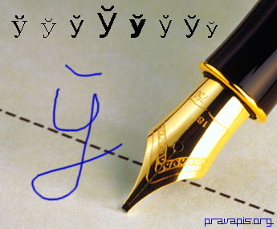

<a href="articles_by.html">вярнуцца да артыкулаў</a> 
<a href="#english">English summary</a>

<h1 id="у-полацку-будзе-помнік-ў">У Полацку будзе помнік Ў</h1>

U. Katkouski, паводле BelaPAN

Полацкія гарадзкія ўлады вырашылі ўстанавіць у найстарэйшым месьце Беларусі помнік у гонар літары Ў, гэтай унікальнай беларускай літары, якой няма ў іншых мовах сьвету, але толькі ў кірылічным беларускім альфабэце. Эскіз гэтага незвычайнага помінку ўзяўся зрабіць галоўны мастак Полацку Ігар Куржалаў.

Ідэя ўшанаваць нашу ўнікальную літару была ўхваленая на паседжаньні Рэспубліканскага арґкамітэту, што адказны за правядзеньне ў Полацку гэтак званага Дню беларускай пісьменнасьці, а старшынёй арґкамітэту зьяўляецца віцэ-прэм'ер Беларусі Ўладзімір Дражын. Сёлета ў верасьні гэтае сьвята беларускага пісьменства будзе сьвяткавацца ў дзясяты раз, і адкрыцьцё помніка плянуецца акурат на юбілей. Першапачатковая ідэя помніку належыць беларускаму каліґрафу прафэсару Паўлу Семчанка, які шмат гадоў вывучае мастацкія шрыфты.

Полацкае гарадзкое ўпраўленьне архітэктуры і будаўніцтва цяпер павінна адшукаць для помніку адпаведнае мейсца, а фірма "Вадалей" - зрабіць уласна скульптуру з выявай гэтай беларускай літары. Паводле віцэ-прэм'ера Дражына, падчас сьвяткаваньняў Дню беларускага пісьменства ў верасьні паспалітай публіцы будуць прадстаўленыя адразу два помнікі: Сімеону Полацкаму і літары Ў.

У інтэрвію аґенцтву навінаў Interfax дырэктар Інстытуту мовазнаўства Акадэміі навук Беларусі Аляксандар Падлужны заявіў, што "у нескладовае зьяўляецца лішняй літарай у беларускім альфабэце". Паводле яго, "гэтая літара ўзьнікла каля 1870 году, калі ўпершыню расейскай мовай пачалі запісваць беларускі фальклёр." Дырэктар Інстытуту мовазнаўства А. Падлужны лічыць, што "адкрыцьцё помніку ў Полацку ў гонар літары-паразыта ёсьць у пэўнай ступені кур'ёзам".

<h1 id="the-monument-for-the-belarusian-letter">The Monument for the Belarusian Letter</h1>

English summary: The city authorities of the oldest Belarusian city Polack (or  *Polacak* ) have decided to make a monument of the unique Cyrillic Belarusian letter <strong>Ў</strong> (Non-syllable U). The original idea came from the calligraphy professor Paval Siemchanka, who has been studying Belarusian fonts for many years. The members of the  *ad hoc*  committee responsible for the so called "Days of Belarusian Literacy" in Polack, which is headed by the vice prime minister Uladzimir Drazhyn, have decided that the monument in honor of the famous Belarusian letter will be opened this September, during the 10th annivessary of the "Days of Belarusian Literacy" celebration.

