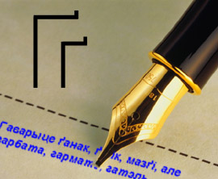

<table>
<tbody>
<tr class="odd">

<td>
<a href="articles_by.html">вярнуцца да артыкулаў</a> 
<a href="#">раздрукаваць 
</a><a href="#english">English summary</a>

<h1 id="the-letter-is-back-вяртаньне-літары">The Letter Is Back! 
Вяртаньне літары!</h1>

Паводле артыкулаў В.Мухіна і А.Дубіны

3 студзеня 2000 году нашы вядомыя мовазнаўцы<a href="#foot1">1</a> сабраліся ў Менску, каб абмеркаваць праблемныя пытаньні клясычнага правапісу. Апрача дзясяткаў іншых нявырашаных праблемаў, нашы мовазнаўцы вярнуліся да статусу літары <strong>ґ</strong> для выбухнога гуку (<em>ґуру</em> альбо <em>гуру</em>), і найбольшыя спрэчкі разгарнуліся якраз вакол гэтай літары <strong>ґ</strong>.

Праект пастановы пра літару <strong>ґ</strong>, прыняты на Праскай нарадзе ў 1998 годзе<a href="#foot2">2</a>, радзіць не выкарыстоўваць літары <strong>ґ</strong> у агульнай лексыцы, але прыпусьціць ува ўласных найменьнях у спэцыяльных і навуковых выданьнях. Слоўнік, рыхтаваны С.Дубаўцом і С.Шупам, які даступны ў он-ляйн вэрсіі (slounik.hypermart.net і <a href="download_by.html">pravapis.org/download_by.html</a>), прапануе пісаць з <strong>ґ</strong> вялікую колькасьць словаў, напрыклад <em>лёґіка.</em>

На думку П.Канавальчыка, ужываньне літары <strong>ґ</strong> трэба абмежаваць іншамоўнымі ўласнымі назовамі й словамі <em>ґанак</em>, <em>ґузік</em> ды іншымі даўно засвоенымі іменьнікамі. П.Канавальчык лічыць, што ўжываньне літары <strong>ґ</strong> мае быць факультатыўнае, як у расейскай мове — ужываньне літары <strong>ё</strong> (паводле новых правілаў расейскае артаграфіі літара ё наагул будзе скасавана).

З.Саўка прапанаваў прыпусьціць выкарыстаньне літары <strong>ґ</strong> ува ўласных іншамоўных імёнах, дзе гук <strong>[ґ]</strong> гучыць у арыгінале.

На думку Ю.Бушлякова, праблема літары <strong>ґ</strong> надуманая, бо за паўтара дзесяцігодзьдзя актыўнага карыстаньня клясычным правапісам гэты графічны знак не зафіксаваны ў масавым друку (вынятак – некаторыя нумары часапісу “Фрагмэнты”, рэдагаваныя В.Булгакавым), няма гэтае літары й у азбуцы. Ю.Бушлякоў перакананы, што літара <strong>ґ</strong> ня мае й сэнсаадрознае функцыі.

В.Вячорка запярэчыў – маўляў, як адрозьніваць: <em>ганак</em> дзяўчат і <em>ґанак</em> дому; прыродны <em>газ</em> і <em>ґаза</em> (карасіна), страляніна ў сэктары <em>Ґаза</em>?

Прыняцьцё канчальнай фармулёўкі адкладзенае да наступнага паседжаньня. Літара <strong>ґ</strong>, напэўна, будзе ўведзена ў азбуку. Прапануецца абмежаваць ейнае выкарыстаньне іншамоўнымі неславянскімі словамі ў энцыкляпэдыях, навуковай і спэцыяльнай літаратуры (у даведніках словы, што пачынаюцца літараю <strong>ґ</strong>, не павінны вылучацца ў асобны разьдзел).

Андрэй Дубіна, магістар факультэту нэафілялёгіі Варшаўскага ўнівэрсытэту, напісаў нашым мовазнаўцам наступны адказ:

Што да праблемы выбухнога <strong>[ґ]</strong> і фрыкатыўнага <strong>[г]</strong>, ужо цягам прынамсі пяцёх стагодзьдзяў беларуская мова, пазычаючы словы зь іншых, захоўвае выбухное <strong>[ґ]</strong>. У старабеларускім пісьменстве яно перадавалася галоўным чынам праз спалучэньне <strong>кг</strong> (гл., прыкладам, Баркалабаўскую кроніку). У ХХ ст. для перадачы гэтага гуку выкарыстоўвалі літару <strong>ґ</strong>.

Тое, што ў маўленьні вялікай колькасьці беларускамоўных людзей зьнікае выбухны <strong>[ґ]</strong>, гэта, як ні парадаксальна, беспасярэдні вынік русіфікацыі і ўплыву зрусіфікаванае наркамаўкі.

Вяртаньне яе ў беларускую абэцэду, такім чынам, згоднае зь пісьмовымі традыцыямі. На гэта можна было б запярэчыць, што гэты гук зьнік з народнага маўленьня. Можна было б... калі б гэта было праўдай. Маёй сьв. памяці заходнебеларускай бабулі нават да галавы б не прыйшло, што з фрыкатыўным <strong>[г]</strong> можна вымавіць словы <em>маґазын, ваґон</em> альбо назву ейнага ўлюбёнага напою: <em>ґазвада</em>. У вымове маёй усходнебеларускай матулі, для якой усё, што на захад ад Слуцку, — Польшча, і <em>ґанак</em>, і <em>ґвалт</em>, і <em>ґузік</em>, і нават <em>Ґена</em>.

Ды што спасылацца на ўласны досьвед, калі можна, да прыкладу, узяць “Слоўнік беларускіх гаворак паўночна-заходняй Беларусі і яе пагранічча”, выдадзены свайго часу Інстытутам мовазнаўства АН БССР, і выпісваць словы з выбухным <strong>[ґ]</strong> ня тое што тузінамі, а ледзь ня сотнямі. Тое, што ў маўленьні вялікай колькасьці беларускамоўных людзей зьнікае выбухны <strong>[ґ]</strong>, гэта, як ні парадаксальна, беспасярэдні вынік русіфікацыі і ўплыву зрусіфікаванае наркамаўкі.

Рэч у тым, што ў расейскім вусным стандарце няма карэляцыі <strong>[г] —</strong> <strong>[ґ]</strong>. Менавіта таму ў наркамаўцы таксама няма гэтае карэляцыі, але вынік уніфікацыі адрозны: замест паўсюднага выбухнога (як у расейскай) распаўсюдзіўся паўсюдны фрыкатыўны. Няўжо мы нават у тарашкевіцы маем захаваць вынік асыміляцыі? Няўжо трэба адмовіцца ад сыстэмы перадачы запазычаньняў, якой ужо з паўтысячы гадоў, толькі таму, што некаму здаецца, што “праблема літары <strong>ґ</strong> надуманая”?

Вельмі добра, што свайго часу сп.Вячорка надрукаваў праект правапісу, што дало штуршок дыскусіі над яго удасканаленьнем. Вельмі добра, што нарэшце зрушыла зь месца справа нармалізацыі тарашкевіцы й яе дастасаваньня да цяперашніх патрэбаў. Ёсьць ужо й пазытыўныя вынікі (прыкладам, замацаваньне пераходу <strong>і</strong> ў <strong>й</strong> пасьля галосных). Аднак трэба памятаць, што праца энтузіястаў мае як плюсы, гэтак і мінусы. З аднаго боку — шчырасьць у працы, з другога, на жаль, — непазьбежная ў такім выпадку партызаншчына, пра якую ў інтэрвію Радыё Рацыя казаў сёлетняй вясной праф.Падлужны.

Шкада, што такія выдатныя постаці, як праф.Падлужны, чые працы з фанэтыкі наркамаўскага варыянту беларускае мовы застаюцца неперасягненым узорам беларускага мовазнаўчага дыскурсу, ды ўвогуле “дзяржаўнае” мовазнаўства не цікавяцца праблемай нармалізацыі несавецкага правапісу й праблемай існаваньня дзьвюх сыстэмаў беларускае мовы...

Колькі прыкладаў са слоўніка "Нашай Нівы": 
 
<strong>Ґґ (Gg):</strong> аґент, аґрэсар, Банґалор, Банґкок, ваґон, Ґаґен, ґаз, ґазэта, Ґальфстрым, ґамбіт, ґанак, ґарант, ґардэроб, ґастрыт, ґатунак, ґвалт, ґвардыя, ґеаґрафія, ґеалёґія, ґеамэтрыя, ґен, ґенацыд, ґеній, ґенэрал, Ґётэ, ґіґант, ґільдыя, ґімназія, ґітара, Ґлазґа, ґлябальны, ґмах, ґотыка, ґравітацыя, ґрафіка, ґруґан, Ґрунвальд, Ґрыґ, ґрып, ґузік, ґубэрня, Ґулівэр, доґма, ёґурт, іґнараваць, іґрэк, маґазын, Маґдэбурґ, маґія, маґніт, Мадаґаскар, мазґі, орґія, піґмэнт, цыґарэта, Шаґал, эґаіст, Эґіпэт, яґуар. 
 
<strong>Гг (Hh):</strong> Агаё, агмень, агонь, Багдад, Багдан, Багемія, бог, габрэй, галава, Галівуд, галіна, Галяндыя, Гамэр, гандаль, Ганібал, Гановэр, Гарвард, гармата, гарэлка, гаўно, Генры, геатыт, Герадот, герой, герб, Гермэс, гетэрасэксуал, гідкі, гідрант, гіена, гімн, гіпноз, гіпотэза, гісторыя, Гішпанія, гледзішча, глузд, грамада, грошы, грыб, голад, голас, Гомель, горад, госьць, Грэцыя, гук, гульня, гумар, Гусоўскі, гуцул, дагавор, Ігнатоўскі, кагал, Лагойск, магіла, нагода, пагарда, Пагоня, Югаславія, ягада, Яўген. 
 
Абедзьве літары ў адным слове: Гааґа, Гамбурґ, Геґель, Гемінґуэй, гіґіена, гідроґраф, Гюґо.

<strong>Footnotes:</strong> 
 
1. Апрача ўласна Вінцука Вячоркі, узялі ўдзел Зьміцер Санько з выдавецтва “Тэхналёгія”, Юрась Бушлякоў з філфаку БДУ, Паўлюк Канавальчык з газэты “Навінкі” і Зьміцер Саўка з Радыё Рацыя. Наступнымі паседжаньнямі маюць далучыцца пісьменьнік Уладзімер Арлоў, Валерка Булгакаў з часопісу <em>“Arche”</em>, Мікола Раманоўскі з “НН”, мовазнаўца Пятро Садоўскі ды іншыя. <a href="#footnote1">back to top</a>. 
 
2. 5-6 сьнежня 1998 г. у Празе адбылася канфэрэнцыя, што мела на мэце абмеркаваць праект, надрукаваны ў “Спадчыне”. Запачаткаваная ў Празе работа працягвалася й у Менску на адмысловых зборках мовазнаўцаў. <a href="#footnote2">back to top</a>.

 <strong>English summary:</strong> 
 
The letter Ґґ (Gg) was abolished in Belarusian language by the Soviet reform of 1933. That reform was aimed at brining Belarusian language closer to the official language of the Soviet empire, Russian. Among the victims of that reform was our letter Ґґ. According to the Soviet linguistis, it was not needed because most Belarusian speakers are capable of pronouncing only fricative Гг (Hh) and thus don't need an extra letter Ґґ (Gg). The above text is a compilation of two articles that were published in Nasza Niva newspaper last year. Our contemporary linguists defend the banned letter and discuss the possibilities of returning it back to the alphabet. Andrej Dubina provides historical and linguistic evidence that the letter is indeed an important part of our language and should find its way to mainstream usage. Other linguists say that the letter should be used if not in high schools, at least, in the etymological dictionaries and in the specialized linguistic literature. Unfortunately, the current government could not care less about the development of the national language, so these proposals will probably be ignored by the linguists in the Academy of Science because they are not interested in reforming their old Soviet ways.

See also / Гл. таксама: 
 
- <strong><a href="download_by.html#kbdbe">Мадыфікаваны Windows KBD драйвэр з новай літарай!</a></strong> (KBD for Windows'95 and Windows'98, DLL for Windows'2000 and Windows XP) 
- <strong><a href="articles/art_language_reform1.html">Кірыла Пазьняк. Правапіс трохі абеларусіцца.</a></strong> 
- <strong><a href="articles/art_orthography_opinion.html">Апытаньне Arche. Наркамаўка і клясычны правапіс.</a></strong> 

<a href="gb_add.html?ref=http%3A%2F%2Fwww%2Epravapis%2Eorg%2Fart%5Fletter%5Freturns%2Easp">Напішыце водгук // Write your comment</a>
</td>
</tr>
</tbody>
</table>
