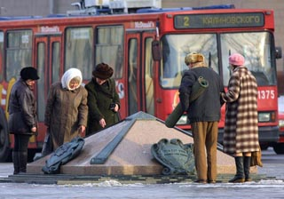

<h1 id="менск-слэнгавы">Менск слэнгавы</h1>

Алеська, <a href="http://www.studumka.com/">Студэнцкая Думка</a>

<strong>Любое месца мае афіцыйны назоў. Адылі ня кожнае зь іх мае гонар насіць яшчэ другое імя. Каб быць такім чынам ушанаваным, месца мусіць мець нейкую адметнасьць. Гэтая спэцыфіка часта замацоўваецца ў слэнгавых назовах.</strong>

Можна вылучыць некалькі пазыцыяў, па якіх магчыма клясыфікаваць менскі тапанімічны слэнг:

<ul>
<li>Незвычайная архітэктура будынку. Напрыклад, дамы з назвамі "Даляр", "Падкова", "Шайба", "Туліпан", "Кукурузы".</li>
<li>Даўгія і замежнага паходжаньня назовы маюць тэндэнцыю да скароту: "Конса", "Філа", "Макдон".</li>
<li>Надпіс на доме можа стаць ягоным назовам: "Цэнтар", "Подзьвіг", "Народ", "Эўропа".</li>
<li>Нарэсьце, любое тусовачнае месца (кавярні, пляцоўкі, бары, крамы, сталоўкі) мае слэнгавую назву.</li>
</ul>

 Ёсьць таксама назовы, якія ужываюцца дагэтуль, нягледзячы на зьмены, архітэктурныя перабудаваньні і г.д. Але народная памяць захоўвае найбольш трапныя найменьні нават зьніклых аб'ектаў. Таму гістарычны агляд таксама можа быць цікавым.

<strong>Цэнтар, Пятачок перад Макдонам.</strong> Назоў утварыўся ад надпісу на ўнівэрсаму "Цэнтральным", а таксама з-за блізкасьці да рэальнага цэнтру горада. Тут зьбіраюцца панкі, скінгеды, анархісты, юпі й тыя, каму папросту няма чаго рабіць. Гэткі зрэз "залатой моладзі".

<strong>Макдон, ДаблДональдс.</strong> Неафіцыйныя назвы самай папулярнай у сьвеце рэстарацыі "МакДональдс". Макдон - скарачэньне назову. Частка другой назвы "Дабл" паказвае на тое, што ў народзе гэтую ўстанову ўважаюць за ўсясьветную сетку найтаньнейшых прыбіральняў.

<strong>Памойка</strong>  *(некаторыя назовы мы адмыслова не перакладалі на беларускую - дзеля любові да народнай творчасьці. Тым болей што, бывае, і не разьбярэш, якою ж моваю "ахрышчоны" той ці іншы аб'ект, а пры перакладзе часам губляецца этымалёгія назоваў - заўв. рэд.).*  Кавярня пад Макдонам. Кажуць, што назва пайшла з-за якасьці згатаванае ежы. Існуе таксама назоў <strong>Гадзюшнік</strong> - ніжні паверх былой кавярні, а <strong>Пад Слонікамі</strong> - верхні. На тым будынку колісь стаялі пінакліі - дэкаратыўныя вежачкі, якія атрымалі назву "слонікі". Слонікі -асацыяцыя з малапатрэбнымі фігуркамі слонікаў, якія ў 40-50 г.г. стаялі на камодзе, шафе, піяніна ў кожнае сям'і.

<strong>Вежа сьвятога Лаўрэньція.</strong> Бэльвэдэр на будынку КГБ. Лаўрэнціем быў ня толькі Бэрыя, але й ягоны намесьнік на Беларусі Цанава.

<strong>Саркафаг, Маўзалей.</strong> Доўгабудоўлю Палац Рэспублікі, што на Кастрычніцкай плошчы, нарэсьце скончылі будаваць. І перад нашымі вачыма паўстала нешта. Ніводнага дрэўца, ані клюмбы, ані травы навакол. Слова  *маўзалей*  паходзіць ад грэцкага  *mausōleion*  - манумэнтальнае пахавальнае збудаваньне. Маўзалеі будаваліся ў Старажытным Рыме, Сярэдняй Азіі. Слова  *саркафаг*  паходзіць ад грэцкага  *sarkopfagos*  (літаральна  *мясажэр* ) - манумэнтальная, парадна аформленая труна. Саркафагі пачалі будаваць у Старажытным Эгіпце, Старажытных Грэцыі і Рыме. У Беларусі яны зьявіліся з прыняцьцём хрысьціянства, а канкрэтна гэты - за камуністамі. Сюды водзяць экскурсіі - у асноўным замежнікаў. Хто яго ведае, можа па начох ён і жарэ мяса...

<strong>ЖФ.</strong> Жалезны Фэлікс. Помнік часоў КГБ, да якога Славамір Адамовіч ускладаў моркву (паставіў да ўзножжа).

<strong>Ля Фэлікса, Квас.</strong> Раней піўнуха ля помніку Фэліксу мела назоў "Квас" (хоць налівалі ўсё адно піва).

(Ісьці, спаткацца) на Грыцаўца (Грыцацуева). Помнік лётчыку-герою зьбірае сяброў, якія даўна ня бачыліся, аматараў моцных напояў ды іншых цікаўных.

<strong>Пуп, Пуп зямлі.</strong> Цэнтар-помнік на Кастрычніцкай плошчы, адкуль ідуць усе дарогі. "Via est vita," - напісана на ім. Гэта значыць: "Дарога - гэта жыцьцё" (ну як не пагадзіцца!). Тут пазначаны й ініцыятар усталяваньня помніку: "Знак адліку кілямэтражу аўтамабільных дарог устаноўлены зь ліпеня 1998 году па ініцыятыве Камітэту па аўтамабільных дарогах пры падтрымцы Менскага гарвыканкаму" (напісана па-беларуску!!!). Вакол Пупа зьбіраюцца цікаўныя, разглядаюць надпісы...

<strong>Нёман.</strong> Дырэктарам былой рэстарацыі "Нёман" калісьці быў нехта Нёма. Зараз на гэтым месцы знаходзіцца рэстарацыя "Гішпанскі куток".

<strong>Труба.</strong> Пераход пад Скарынаўскім праспэктам на станцыі мэтро "Кастрычніцкая-Купалаўская". Тут заўсёды ажыўлена. Тусуюцца прадстаўнікі многіх сучасных моладзевых кірункаў, але ў асноўным скінгеды (з голенымі галовамі). <strong>Вялікая Труба</strong> - ужо ў самім мэтро - пераход на "Купалаўскую", <strong>Малая Труба</strong> - на "Кастрычніцкую". Падзел тлумачыцца тым, што прыступкі - гэта вялікі праход, а лесьвіца, якая рухаецца, малы.

<strong>Кішка.</strong> Пераход, які злучае пасярэдзіне станцыі мэтро "Кастрычніцкая" й "Купалаўская". Тусавацца тут немагчыма, бо пасажыры рухаюцца зь вялікай хуткасьцю.

<strong>Панікоўка.</strong> Сквэр ля Прэзыдэнцыі і Купалаўскага тэатру. Назва паходзіць ад фантану, дзе можна пабачыць хлопчыка зь лебедзем. Народная фантазія праасыцыявала хлопца з Панікоўскім, а лебедзя з гусём. Тут зьбіраецца моладзь зь півам ды бабкі-ботлхантэры.

<strong>Прэзыдэнцыя.</strong> Такі назоў атрымаў будынак Адміністрацыі прэзыдэнта. Хто там знаходзіцца, зразумела. А тусуюцца побач з прэзыдэнцыяй міліцыянты.

<strong>Нацыяналка.</strong> Гэта зусім ня дзеўчына з нацыяналістычнымі поглядамі, а Нацыянальная бібліятэка Беларусі (раней Бібліятэка імя Леніна - <strong>Ленінка</strong>). Абыгрываецца таксама слова " *naz* i". Назва бібліятэкі набывае зусім ужо злавеснае гучаньне: нацы, назі, нацыкі.

<strong>Тытанік.</strong> Круглая заля ў Нацыянальнай бібліятэцы (навукова-тэхнічная). Месца, дзе звычайна прызначаюць сустрэчы асьпіранты й іншая "навуковая" моладзь (і ня толькі). Сёньня назоў страчвае сваю актуальнасьць, бо вялізныя вокны, якія надаюць залі падабенства да рубкі карабля, завешаныя фіранкамі-жалюзі.

<strong>Мутнае Вока.</strong> Кавярня ў Доме Мастака (пазьней перайменаваным у Дом Актора, а яшчэ пазьней зноў у Дом Мастака). Кавярня ёсьць улюбёным месцам збору актораў, мастакоў, то бок артыстычнае "багемы". На маё пытаньне: "А чаму ж вока мутнае?", мне адказалі: "А хто там цьвярозы быў?"

<strong>Стомэтроўка.</strong> Частка Скарынаўскага праспэкту ад цырку да плошчы Перамогі. Увечары тут працуюць дзевачкі й іхныя сутэнэры. Прыстойным дзяўчатам хадзіць рэкамэндуецца да 22-х гадзін, а пасьля гэтага тэрміну ў суправаджэньні сэк'юрыці.

<strong>Круглая плошча.</strong> Плошча Перамогі мае хутчэй авальную форму. Круг даўна перабудавалі, а назва засталася.

<strong>Подзьвіг.</strong> Калі стаяць тварам да помніку на плошчы Перамогі, то ўперадзе, зьлева і справа, бачым два аднолькавыя жоўтыя будынкі, падобныя як блізьнюкі. На левым зьверху напісана "Подвиг народа", а на правым "Бессмертен". Гэтыя надпісы і далі назву будынкам. Пад "Подзьвігам" і "Бясьсьмерцен" прызначаюць спатканьні закаханыя, студэнты Лінгвістычнага ўнівэрсытэту і камуністы, якія накіроўваюцца ў Дом 1-га зьезду РСДРП. Крама ў "Подзьвігу" мае такую ж назву. Трэба адзначыць, што ў "Бясьсьмерцен" функцыянуе неблагая кавярня "Бярозка", якая сама па сабе зьяўляецца арыенцірам.

<strong>Раён пыжыкавых (андатравых) капелюшоў, Царскае сяло.</strong> Раён за плошчай Перамогі паміж вуліцамі Захарава й Пуліхава. Раней тут жыла партыйная намэнклятура. Час камуністаў даўна мінуў. Пыжыкавыя капелюшы даступныя ўсім без вынятку клясам і перасталі быць прывілеяй партыйных дзеячоў. Кватэры панабывалі людзі зь вялікімі грашыма. Але назва раёну захавалася. Такая вось іронія лёсу.

<strong>Гастраном "пад шпілем".</strong> На перакрыжаваньні вуліц Краснай і Камуністычнай ёсьць крама, якая атрымала назву "пад шпілем", таму што наверсе будынка можна пабачыць шпіль з зоркаю.

<strong>Р *ы* га насарога.</strong> Кавярня "Лета" на вуліцы Першамайскай. Без камэнтароў.

<strong>Чарнільніца.</strong> А гэта - Палац мастацтва, які знаходзіцца ля плошчы Перамогі. Атрымаў назву ад свайго бэзава-чарнільнага колеру, у які пафарбаваны. Сюды ходзіць інтэлігенцыя з вышэйшай адукацыяй паглядзець выставы.

<strong>Казлабродзкая.</strong> Так завуцца вуліцы Казлова і Даўгабродзкая (адна ёсьць лягічным працягам другой). Атрымалася гэткае вось спалучэньне назваў.

<strong>Філ *а* ра, філ *а* .</strong> Пляцоўка перад філярмоніяй. Тут зьбіраюцца аматары клясычнае музыкі да пачатку канцэртаў, нэтчыкі, фідошнікі, наведвальнікі чатаў і йншая прасунутая моладзь.

<strong>Камяні.</strong> Месца за філярмоніяй, дзе любяць зьбірацца ралевікі - сябры клюбу ралявых гульняў.

<strong>Кукурузы, Кукурузьнікі.</strong> Так называюцца некалькі дамоў, што на вуліцы Веры Харужай. А атрымалі яны сваю назву з-за незвычайнага плянаваньня: яны круглыя, з круглымі ж гаўбцамі. Усё разам нагадвае кукурузны пачатак.

<strong>Зьвёздачка.</strong> Унівэрсам "Звёздный" насупроць Кукурузаў.

<strong>Бардак Пятра Іванавіча.</strong> Так па першых літарах расшыфроўвалася былая назва Беларускай дзяржаўнай палітэхнічнай акадэміі (раней акадэмія была інстытутам - БПІ). А Пётар Іванавіч Яшчарыцын - адзін з былых яе рэктараў.

<strong>Тэлевізар.</strong> З усіх бакоў шкляная кавярня "Батлейка".

<strong>Акадэмка.</strong> Гэткі назоў маюць адразу тры аб'екты: Акадэмічная бібліятэка, станцыя мэтро"Акадэмія навук" і крама "Акадэмкніга".

<strong>Тыща свалачэй.</strong> На плошчы Калініна ёсьць крама "1000 мелочей", а побач, справа, кветкавая крама. Казалі: "Налева - тыща мелачэй, направа - тыща свалачэй".

<strong>Эўропа.</strong> Каб беларусам так жа ж лёгка было ўвайсьці ў Эўропу, як яны ўваходзяць у краму "Эўрапэйскую"!

<strong>Дам *ы*  з "малюнкамі"</strong> (каля станцыі мэтро "Ўсход"). Гэта чатыры дамы, з фасаду якіх бачныя незвычайныя мазаікі.

<strong>Падкова.</strong> Дом на Каліноўскага, 48. Мае форму падковы (усё вельмі проста).

<strong>Кулёк.</strong> Неафіцыйная назва Беларускага дзяржаўнага ўнівэрсытэту культуры. Тут тусуюцца выкладнікі; здараецца, што БДзУК наведваюць і студэнты. Вельмі спадабалася яшчэ адна назва - <strong>Інстытут культуры і адпачынку</strong> (унівэрсытэтам установа стала называцца ўзважна нядаўна).

<strong>Рыгалаўка.</strong> У будынку, дзе зараз знаходзіцца "Папараць-кветка", была забягалаўка "Фабрыка-кухня". Гэта была даступная, танная сталоўка для люмпэн-пралетарыяту, і яе назоў кажа сам за сябе. Так яшчэ, кажуць, называліся ўсе студэнцкія сталоўкі.

<strong>Плесень.</strong> Назва піўбара "Ясень", што знаходзіўся на пустыры з правага боку ад былога кляштару бэрнардынцаў (сёньняшняга архіву музэю літаратуры і мастацтва) на пляцы Волі.

<strong>Жураўлі.</strong> Былая рэстарацыя "Журавінка" на вуліцы Я. Купалы. Гэта было месца, куды хадзілі есьці комплексныя абеды й піць чэскае піва "Пілізно".

<strong>Чорныя Скалы.</strong> Назва "Тэатральнай кавярні", што на вуліцы Багдановіча, ля Сувораўскае вучэльні. Існуе легенда, што калісьці даўна навучэнцы-сувораўцы ў чорнай форме ўтварылі грандыёзную бойку ў кавярні і зрабілі кучу малу, ды такую, што зьнешне яна нагадвала высокія скалы.

<strong>Ля Ск *а* ла.</strong> Кавярня "Уют" на рагу Чычэрына і Камуністычнай. Назва паходзіць, відаць, ад частых наведнікаў - супрацоўнікаў Опэрнага тэатру, які месьціцца побач.

<strong>Крама генэральская.</strong> Знаходзіцца насупроць расейскае амбасады на Камуністычнай вуліцы (генэралы-камуністы-расейцы - нехта мудра ўсё аб'яднаў). Назва пайшла ад жыхароў дома - вайскоўцаў. Крама за савецкім часам хавала ад простых сьмяротных харчовыя дэфіцыты. А цяпер гэта выдатнае месца, дзе часам хаваюцца несанкцыяваныя пікетоўнікі.

<strong>Масоны.</strong> На пляцы Волі быў калісьці дом, у якім, па паданьнях, зьбіраліся масоны. Цяпер засталіся толькі разваліны, але ў народнай памяці захавалася назва гэтага месца.

<strong>Конса, Кансэрва.</strong> Назва кансэрваторыі - Беларускай акадэміі музыкі.

<strong>Сасіскі.</strong> Ля Консы ў чырвоным цагляным доме, дзе знаходзіцца кавярня "Пінгвін", была крама, куды студэнты вышэйзгаданае ўстановы хадзілі есьці вышэйзгаданую ежу. Зараз там прадаюцца торты й г. д.

<strong>Мастакі.</strong> Сквэр насупроць Консы, дзе мастакі гандлююць прадуктамі сваёй творчасьці. Знаўцы кажуць, што тут часам патрапляюцца неблагія творы.

<strong>Панэль.</strong> Месца побач з Мастакамі.

<strong>Дом Мусінскага.</strong> Дом на "Нямізе". Мусінскі - архітэктар гэтага дома.

<strong>Прастуда.</strong> Піўная "Прохлада" на Нямізе.

<strong>Пяньк *і* .</strong> Былы дом культуры заводу "Луч", які вырабляе абутак. Знаходзіцца на Нямізе насупроць МакДональдсу. "Пянькі" слаўныя тым, што тут гралі біт, калі яго ня гралі амаль нідзе.

<strong>Шайба.</strong> Клюб "West World". Будынак перад гасьцёўняй "Беларусь" формаю нагадвае звычайную хакейную шайбу гіганцкіх памераў.

<strong>Павучыньне.</strong> Кавярня "Ромашка" на праспэкце Машэрава. Верагодна, назоў пайшоў ад складанага перапляценьня лесьвіцаў. Ёсьць і йншы варыянт паходжаньня: павучыньне раскладалі хлопцы для наіўных дзяўчат.

<strong>Юбілейка.</strong> Каля гасьцёўні "Юбілейная" тусуецца шмат замежнікаў. Тут працуюць "начныя бабачкі".

<strong>Гарбаты мосьцік.</strong> Мост за Траецкім прадмесьцем.

<strong>Старажоўка.</strong> Старажоўскага рынку ўжо даўна няма, а назва месца захавалася.

<strong>Бухенвальд.</strong> Сталоўка БПІ на Сурганава. Як кармілі, маўляў, так і называлася (існуе яшчэ адна вэрсія паходжаньня гэтага назову - заўв. рэд.).

<strong>Унівэр.</strong> Гэта неафіцыйная назва Беларускага дзяржаўнага ўнівэрсытэту. Студэнты, якія вучацца на спэцыяльнасьці "прыкладная матэматыка", называюцца "прыматы", а радыёфізыкі - "рафікі". Раней філязофскі і эканамічны факультэты мелі адзін дах і адну назву - ФЭФ, якая расшыфроўвалася як "факультэт эратычных фантазіяў".

<strong>ПНУ.</strong> Расшыфроўвалася як "Піўная Насупроць Унівэрсытэту".

<strong>Гай.</strong> Адна зь філіяў унівэру знаходзіцца ў гаі (дарэчы, гэткі ж назоў мае і прыпынак электрычкі), што за кальцавой дарогай. Там вучацца радыёфізыкі, біёлягі, тамсама знаходзяцца й інтэрнаты. Калісьці тут плянаваўся паўнавартасны студэнцкі гарадок, але пляны покуль засталіся толькі на паперы.

<strong>Куб *і* нка.</strong> Так называлася звычайная сталоўка на вуліцы Валадарскага, не даходзячы да Рускага тэатру. У 70-я гады ва ўнівэрсытэце зьявілася шмат кубінскіх студэнтаў. Відаць, кубінкі асядалі менавіта ў гэтай таннай сталоўцы.

<strong>Валадарка.</strong> Вязьніца на вуліцы Валадарскага, дзе калі-небудзь зьявяцца мэмарыяльныя дошкі знакамітых вязьняў.

<strong>Бранетанкавы, Танк, Пэдун.</strong> Беларускі дзяржаўны пэдагагічны ўнівэрсытэт імя М. Танка мае вельмі калярытную назву. На слэнгу абыгрываецца як слова "танк", так і прыналежнасьць да пэдагагічнае галіны. Студэнты БДзПУ завуцца "танкістамі".

<strong>Даляр.</strong> Такую назву мае дом №15 па вуліцы Кульман. Калі глядзець на яго зьверху, то можна заўважыць, што ён мае форму даляра. Лічыцца вельмі прэстыжным, да таго ж кватэры ў ім надта дарагія. Відаць, трэба шмат зялёных купюраў, каб набыць такую.

<strong>"На Розачкі".</strong> Так кажуць людзі, якія жывуць на вуліцы Розы Люксэмбург. Нагадаю, што гэтая дзяячка была адным з заснавальнікаў камуністычнай партыі Нямеччыны. Дарэчная назва для беларускае вуліцы!

<strong>Аэрапік, порт.</strong> Аэрапорт "Мінск-1".

<strong>Умань.</strong> Скарочаная назва вуліцы Ўманскай.

<strong>Тульпан, Рамонак.</strong> Назва выстаўнага павільёну БелЭКСПА на Машэрава, 14. Атрымаў такі назоў з-за арыгінальнай архітэктуры, якая нагадвае рамонак альбо тульпан пялёсткамі дадолу.

<strong>Берасьцейская крэпасьць, Бастылія.</strong> Даўгі чырвоны дом на вуліцы Танкавай (раней вуліцы М. Танка) нагадвае чырвоную цэглу фартэцыі-героя. А няроўны верх дома - разбураныя пабудовы крэпасьці. А Бастылія - таму што гэта таксама знакамітая крэпасьць.

<strong>Камс *а* .</strong> Папросту Камсамольскае возера.

<strong>Аўтаз.</strong> Назва Менскага аўтамабільнага заводу, што ля Партызанскага праспэкту. Выпускае: грузавыя аўтамабілі, аўтасамазвалы, аўтамабілі-лесавозы й аўтапрычэпы. Моц!

<strong>Шарыкі.</strong> Раён ля шарыкападшыпнікавага заводу. Вырабляе шарыкі й падшыпнікі. Тусуюцца працоўныя й іхнае кіраўніцтва.

<strong>У народ.</strong> Каля будучае станцыі мэтро "Ангарская" калісьці на дамах быў надпіс "Народ и партия едины". Адзін з будынкаў меў краму, у якую хадзілі "Ў народ". На жаль (а, можа, наадварот, на шчасьце, навошта эўрапеізаваным беларусам  *такія*  лёзунгі), надпіс зьнялі.

<strong>Даліна маньякоў.</strong> У Пятроўшчыне, насупроць мэдінстытуту, ёсьць даліна, вядомая тым, што там здараліся выпадкі, як у фільмах жахаў. Даліна ёсьць месцам дзеяньня дзіцячых страшылак. Вядома, гэта найчасьцей чуткі й дзейкі, чымся рэаліі, але, відаць, гэтае месца моцна прыцягвае маньякоў. У іх там адбываюцца ўсесаюзныя зьлёты (навучаньне з практычнаю часткаю).

<strong>Ангар *а* .</strong> Раён вуліцы Ангарскай.

<strong>Сухар *ы* .</strong> Раён Сухарава.

<strong>Курас *ы* .</strong> Раён Курасоўшчына.

<strong>Ждан *ы* , Жд *а* нікі.</strong> Ждановічы.

<strong>Камар *ы* .</strong> Раён Камароўкі.

<strong>Ракас *ы* .</strong> Праспэкт Ракасоўскага.

<strong>Карч *ы* .</strong> Танцпляцоўка ў лесапарку паміж трактарным і аўтазаводам у парку 50-годзьдзя Кастрычніка.

<strong>Лужок.</strong> Гэта - не пра Лужкова, а пра раён Зялёны Луг.

<strong>Лазьня.</strong> Сярод студэнтаў Лінгвістычнага ўнівэрсытэту "хадзіць у лазьню" значыла зусім не хадзіць мыцца, а піць гарэлку ў бары ля лазьні на Мар'еўскай вуліцы (знаходзіцца недалёка ад вышэйзгаданае ВНУ). Кажуць, піва там было таннае, а гарэлку дазвалялася прыносіць з сабой.

<strong>Сасок.</strong> Піўбар "Аліварыя" на вуліцы Кісялёва. Сярод заядлых тусоўнікаў тут заўважаныя студэнты Лінгвістычнага, кансэрваторыі. Плюс розныя там яшчэ...

<strong>Чэйндж.</strong> Паходзіць, як вы, напэўна, здагадаліся, ад ангельскага change. Так завецца пункт прыёму шклатары на заводзе "Аліварыя". Прасьцей кажучы, тут можна пустыя пляшкі зьмяняць на поўныя.

<strong>Дзібілдзінг.</strong> У Лінгвістычным унівэрсытэце корпус Д (былы інтэрнат), што знаходзіцца за будынкам ВНУ, насупроць ТБМ. Вось такі  *D-building*  на беларускі манэр. Яшчэ адзін варыянт паходжаньня -  *deep knowledge building*  (пабудова глыбокіх ведаў), прычым  *deep knowledge*  скарацілася да "дзі"... Наколькі глыбокія веды ў насельнікаў дадзенага будынка, вырашайце самі, але з гумарам у іх усё ў парадку.

<strong>Фэля, Фэлікс, Пад Гадзіньнікам.</strong> Назвы піўбару, які зараз завецца "Узвышшам". Побач стаіць жалезная постаць Фэлікса Дзяржынскага. Наверсе дома, дзе месьціцца бар, можна бачыць гадзіньнік. Існуе павер'е: хто пачынае піць піва ў гэтым бары, мусіць ускласьці кветкі да злавеснага пастамэнту Фэлі.

<strong>Чэлюсьці.</strong> Так ахрышчаны парк Чалюскінцаў. Нагадаю, што чалюскінцы - удзельнікі савецкай палярнай экспэдыцыі 30-х гадоў мінулага стагодзьдзя. Параход "Чалюскін" быў скаваны крыгамі, але пацярпелых выратавалі. Гісторыя, безумоўна, гераічная. Але якое дачыненьне яна мае да менскага парку - загадка.

<strong>Сьцякляшка.</strong> У раёне кінатэатру "Перамога" ёсьць бар "Ілюзіён". Дык вось, побач было летняе памяшканьне пад назваю Сьцякляшка. Тут любіла зьбірацца апазыцыйна настроеная моладзь, інтэлігенцыя - дысыдэнты, так бы мовіць. Гэта, відаць, было адной з прычынаў таго, што памяшканьне зьнесьлі. Сьцякляшкамі таксама завуцца пітныя ўстановы ля стадыёну "Дынама". Там сядзяць зазвычай гандляры з кірмашу, а ўвечары трапляюцца і студэнты БДУ, што жывуць побач у інтэрнатах.

<strong>Сухар *а* ва.</strong> Зьмена націску ператварае назоў у нешта японскае. Празрысты намёк на тое, што раён знаходзіцца чорт ведама дзе. Хаця й некаторыя аб'екты ў цэнтры таксама "япанізуюцца": як вам падабаецца назва вуліцы Сурган *а* ва з націскам на перадапошнім складзе?

<strong>Капейка.</strong> Інтэрнат гістфаку БДУ на Сьвярдлова, 34.

<strong>Мат *у* га.</strong> Неафіцыйны назоў Менскае авіятэхнічнае вучэльні (абрэвіятура па-расейску - МАТУ), што ў Чыжоўцы.

<strong>Пцічнік.</strong> Раён Курасоўшчына. Частка назвы - "кура" (птушка такая).

<strong>Асьліныя Вушы.</strong> На рагу вуліцаў Сурганава і Акадэмічнай стаяць два высокія аднолькавыя будынкі. Адзін зь іх належыць Акадэміі Навук, другі - факультэту міжнародных стасункаў БДУ. Цікава, хто гэта асацыюецца з жывёлінамі: навукоўцы ці элітарныя студэнты?

<strong>Пэнтагон.</strong> Так называецца штаб Беларускай вайсковай акругі, што месьціцца каля крамы "Пад шпілем".

Каракаціца.  **  Яшчэ адна назва выстаўнага павільёну БелЭКСПА на пр. Машэрава,14. Відаць, надта ўжо ня ўпісваецца хвалістая архітэктура будыніны ва ўрбаністычны ляндшафт.

<strong>Партызаны.</strong> Жыхары Партызанскага праспэкту.

<strong>Маякоўка.</strong> Вуліца Маякоўскага. Хоць ён і рускі савецкі паэт, але адзначыўся бунтарскаю дзейнасьцю. Гнеўна пратэставаў. Патасна высьмейваў. Выкрываў антычалавечую прыроду капіталістычнага сьвету. І г.д...

<strong>Мнімск.</strong> Гэты варыянт назову сталіцы прыдумаў цікавы фотамастак Баразна, па сумяшчальніцтве прарэктар Акадэміі мастацтва. Абыгрываецца расейскае слова "мниться" - гораду, маўляў, няма.

<strong>Бамбук.</strong> Суперніцтва дзьвюх "мастацка-культурніцкіх" ВНУ - БАМу (Беларускай акадэміі мастацтва) і БУКу (Беларускага ўнівэрсытэту культуры, цяпер, да таго ж, яшчэ й дзяржаўнага) - пэрыядычна нараджае чуткі пра тое, што варта было б аб'яднаць іх пад адным дахам. Лёгіка назвы - элемэнтарная: БАМ+БУК="бамбук".

<strong>Нямецкі цэнтар.</strong> Цэнтар ІВВ на Паўднёвым Захадзе (быў бы на Поўдні - наагул назвалі б "Паўднёвым цэнтрам").

<strong>Сучасьнік.</strong> Музэй сучаснага і выяўленчага мастацтва.

<strong>Тры багатыры.</strong> Тры велічэзныя дамы на вуліцы Каліноўскага, 54 (карпусы, адпаведна, 1,2 і 3).

<strong>Скрыня.</strong> Палац мастацтваў. Таму што занадта квадратны.

Школка.  **  Беларускі дзяржаўны пэдагагічны ўнівэрсытэт імя М.Танка ідзе на першым месцы па колькасьці нефармальных назваў. Відаць, назва гэтай ВНУ ёсьць крыніцаю для адмысловае творчасьці.

Труна.  **  Палац Рэспублікі, што на Кастрычніцкай плошчы, асацыюецца ў народу паспалітага чамусьці зь нечым злавесным (нагадаю ўжо друкаваныя ў "СD" назовы - Саркафаг, Маўзалей). Усе тры назвы зьвязаныя зь ня надта прыемнымі для чалавека рэчамі. А сама плошча, як кажуць, - гэта своеасаблівая рэтраспэктыва гісторыі мастацтва: ёсьць Палац прафсаюзаў, збудаваны a la Парфэнон, ёсьць маленькая эгіпэцкая пірамідка - цэнтар-помнік пачатку ўсіх дарог. Ёсьць і Палац Рэспублікі, таксама ў эгіпэцкім стылі.

P.S. Аўтарка вельмі ўдзячная ўсім тым, хто дапамог у зборы матэрыялаў і не казаў, што заняты.

<a href="gb_add.html?ref=http%3A%2F%2Fwww%2Epravapis%2Eorg%2Fart%5Fminsk1%2Easp">Напішыце водгук // Write your comment</a>

