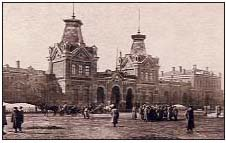

  
<a href="articles/art_minsk_guide.html">па-беларуску</a> 

<h1 id="minsk-guide-1930">Minsk Guide 1930</h1>

summary by Uladzimir Katkouski

temporary under reconstruction not ready still to be done. temporary under reconstruction not ready still to be done. minsk, belarus. temporary under reconstruction not ready still to be done. temporary under reconstruction not ready still to be done. minsk, belarus. temporary under reconstruction not ready still to be done. temporary under reconstruction not ready still to be done. minsk, belarus.

<strong>СПАДАРОЖНІК ПА МЕНСКУ</strong> 
Выданьне Менгарсавету і рэдакцыі газ. "Рабочий" 
1930 г. 
АГУЛЬНЫЯ СПРАВАЧНЫЯ ВЕСТКІ 

Ґазэты
Часопісы

</tr>
<tr class="even">

"Зьвязда" 
"Рабочий" 
"Савецкая Беларусь" 
"Orka" 
"Піонэр Беларусі" 
"Раўдонасіс артояс" 
"Юнгэр арбэтэр" 
"Юнгэр ленінец" 
"Іскры Ільліча" 
"Чырвоная Зьмена" 
"Акцябр" 
"Беларуская вёска" 
"Беларускі батрак" 
"Беларускі гандлёвы бюлэтэнь" 

"Паляўнічы Беларусі" 
"Беларуская работніца і сялянка" 
"Соцыялістычнае будаўніцтва" 
"Чырвоная Беларусь" 
"Полымя" 
"Маладняк" 
"Узвышша" 
"Бальшавік Беларусі" 
"Комуністычнае выхаваньне" 

 У 1930 годзе нават камуністы пісалі зь мяккімі знакамі! "Спадарожнік" напісаны па-беларуску клясычным правапісам, але ўважлівы чытач адразу ж убачыць, што мова "Спадарожніку" мае шэраг асаблівасьцяў і трохі адрозьніваецца ад сучаснай мовы "Нашай Нівы" ці іншых выданьняў, якія карыстаюцца клясычным правапісам сёньня, праз семдзесят тры гады. Гэтыя дробныя адрозьненьні як балючыя ўколы ігліцы напамінаюць нам, што ў нас усё яшчэ няма адзінага сучаснага стандарту "тарашкевіцы". Але ж гэта тэма для асобнага артыкулу. Тут я стаўлю за мэту проста пералічыць, падсумаваць асаблівасьці мовы гэтага тэксту.

These are the excerpts from the rare edition of Minsk city guide "Spadarozhnik pa Miensku" that was published in 1930.

Language
Total
Share

</tr>
<tr class="even">

Belarusian
20
<strong>61%</strong>

</tr>
<tr class="odd">

Yiddish/Hebrew
8
<strong>24%</strong>

</tr>
<tr class="even">

Russian
3
<strong>9%</strong>

</tr>
<tr class="odd">

Polish
2
<strong>6%</strong>
<a href="gb_add.html?ref=http%3A%2F%2Fwww%2Epravapis%2Eorg%2Fart%5Fminsk%5Fguide2%2Easp">Напішыце водгук // Write your comment</a>

