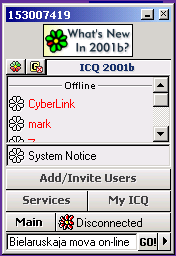

<table>
<tbody>
<tr class="odd">
<td>
</td>
<td>
<h1 id="netspeak---жывая-мова-нашага-сеціва-беларуская-мова-ў-інтэрактыўным-он-ляйне">Netspeak - Жывая мова нашага сеціва 
(Беларуская мова ў інтэрактыўным он-ляйне)</h1>

<a href="mailto:rydel23@yahoo.com?subject=netspeak">Rydel N23</a>

Я ўпершыню ўбачыў сусьветнае павуціньне яшчэ ў 1993 годзе і з таго часу актыўна ўдзельнічаю ў размаітых он-ляйн форумах і чатах. Напачатку беларускага інтэрнэту як такога не існавала наагул (былі толькі адзінкі-карыстальнікі, звычайна беларусы ў замежжы). Але паступова экспансія беларушчыны дасягнула інтэрнэту: беларусы стваралі сабе паштовыя скрынкі, усталёўвалі ICQ ці Yahoo Messenger, рабілі ўласныя вэб-старонкі ці цэлыя вэб-праекты. Я пакрысе пачаў заўважаць, што жывая мова нашага сеціва шмат у чым адрозьніваецца ад паўмёртвай і штучнай мовы БТ ці іншых афіцыёзных крыніцаў. Нават ад больш жывой і "сучаснай" мовы недзяржаўных выданьняў накшталт "Нашай Нівы", часопісаў pARTisan, Farba.Net ці Arche яна таксама адрозьніваецца.

Вядома, што на расейскіх чатах мова вельмі далёкая ад пушкінскай ці тургенеўскай, але падобна і беларуская мова ў жывым он-ляйне досыць далёкая ад стандартаў літаратурнай мовы Купалы ці Багдановіча. Як актыўны ўдзельнік я пачаў разумець, што стаў сьведкам народзінаў новага дыялекту - нашага беларускага <strong>netspeak</strong>. Дадзены артыкул - напэўна першая спроба задукамэнтаваць гэтую цікавую зьяву.

Каля 80% матэрыялу для гэтага артыкулу сабраныя ў выніку маніторынгу каналаў #mova, #belarus і #mensk на IRC (Internet Relay Chat) сэрвэры <a href="http://irc.dal.net/">irc.dal.net</a> цягам прыкладна трох тыдняў з 25 студзеня да 15 лютага 2002 году. Апрача гэтых каналаў IRC мае крыніцы ўлучаюць размаітыя он-ляйн чаты ("У Старога Язэпа", Нашаніўскага, былога чата "Чарнобыльскага Вожыка" ды інш.), форумы (<a href="http://dt.home.by/forum.php3">"Вэрбальны фронт"</a> дзеда Талаша, <a href="http://draniki.com/guestbook/default.html">"кухня"</a> Дранікаў), а таксама мае прыватныя размовы ў ICQ і Yahoo Messenger.

Як паказвае мой досьвед на гэтых чатах і форумах, жывым беларускім netspeak'ам звычайна карыстаюцца людзі, якія адчуваюць сябе ўпэўнена ў ведах сваёй мовы, і якія сьвядома дазваляюць сабе ўсялякія моўныя вольнасьці, а той, хто не надта добра валодае беларускай, звычайна трымае сябе ў жорсткіх рамках літаратурнай мовы і пазьбягае "ненарматыўных" словаў, бо баіцца, што ягоныя вольнасьці будуць трактаваныя слабым веданьнем беларускай.

Я пакуль устрымаюся ад аналізу самога фэномэну, і проста выкладу сьпіс словаў і выразаў, а таксама распавяду пра некаторыя граматычныя асаблівасьці "інтэрнэтнага маўленьня". У бальшыні выпадкаў я падаю рэальную цытату з прыкладам ужываньня (курсівам) і, дзе-нідзе, невялікі камэнтар. Таксама прашу заўважыць, што мая клясыфікацыя ўмоўная ды спрошчаная і для больш сур'ёзнага дасьледваньня патрабуе грунтоўнага перагляду. Enjoy.

<h2 id="скароты">Скароты</h2>

Скарачэньне словаў - гэта напэўна самы папулярны мэтад словаўтварэньня ў чатах, дзе гэта выклікана жаданьнем эканоміць час пры наборы тэксту. Усё ж большасьць людзей набіраюць тэкст павольней, чым размаўляюць і жаданьне "размаўляць" хутчэй (каб было, як у "рэале") ёсьць цалкам натуральным.

<table>
<colgroup>
<col style="width: 33%" />
<col style="width: 33%" />
<col style="width: 33%" />
</colgroup>
<thead>
<tr class="header">
<th>слова</th>
<th>пераклад</th>
<th>тлумачэньне, цытата</th>
</tr>
</thead>
<tbody>
<tr class="odd">
<td>дзяк</td>
<td>дзякуй</td>
<td>Пэўна, самы папулярны скарот. Параўнайце з ангельскай (thanks - thx - 10x) ці чэскай мовай (dekuju - dik) 
<em>- я зрабіў табе рахунак на лінуксе 
- дзяк</em></td>
</tr>
<tr class="even">
<td>мо</td>
<td>можа</td>
<td>Таксама вельмі папулярны скарот. 
<em>- працуе? 
- мо і працуе, але тут з гэтым праектам нічога не чуваць</em></td>
</tr>
<tr class="odd">
<td>шчэ</td>
<td>яшчэ</td>
<td><em>- шпіён! =) 
- але ж мне шчэ очань даляко да дзядзі Шцірліца :)))</em></td>
</tr>
<tr class="even">
<td>ё</td>
<td>ёсьць</td>
<td>У нас слова "ёсьць" у бальшыні выпадкаў можна наагул апускаць, але ў тых выпадках, калі яно ўжываецца ў інтэрнэтных размовах яно часта ператвараецца ў "ё". (Параўнайце з украінскай - "е") 
<em>- ці ё ў цябе Матрыца на DVD? 
- ё.</em></td>
</tr>
<tr class="odd">
<td>ма</td>
<td>няма</td>
<td>Гэты знаёмы ўсім прыклад "дзіцячага" слэнгу таксама прыжыўся і ў он-ляйне. 
<em>- у цябе няма сёмага Photoshopу? 
- ма :(</em></td>
</tr>
<tr class="even">
<td>шо</td>
<td>што</td>
<td>Гэта хутчэй прыклад "жывога маўленьня", якое перададзенае на пісьме, а не скарот, але ўсё ж скарачэньне на адну літару адбываецца. 
<em>- я цябе трохі паляпаю стронгай 
- шо??</em></td>
</tr>
<tr class="odd">
<td>трэ</td>
<td>трэба</td>
<td>Вельмі папулярны скарот. 
<em>- злы, бо нехта мой нік узяў 
- дык зарэгіць трэ было</em></td>
</tr>
<tr class="even">
<td>нат</td>
<td>нават</td>
<td><em>- яго ў Навінкі паклалі 
- я нат ня ведаў</em></td>
</tr>
<tr class="odd">
<td>зара</td>
<td>зараз</td>
<td><em>- стронгу трымае напагатове. зара пачне ляпаць</em></td>
</tr>
<tr class="even">
<td>гэт</td>
<td>гэта, гэты</td>
<td><em>- гэт' ты пра каго? 
- пра жвіра канечне</em></td>
</tr>
<tr class="odd">
<td>до</td>
<td>досыць! годзе!</td>
<td><em>- до' ўжо пра гэта... прытаміў... 
- ок, апошні раз</em></td>
</tr>
<tr class="even">
<td>у.н.</td>
<td>усяго найлепшага</td>
<td>форма разьвітаньня. 
<em>- мне трэба ісьці =( 
- у.н.</em></td>
</tr>
<tr class="odd">
<td>кл</td>
<td>калі ласка</td>
<td><em>- дай сваё мыла кл</em></td>
</tr>
<tr class="even">
<td>чк</td>
<td>чакай, пачакай</td>
<td><em>- давай я табе кіну мп3 з новым гітом 
- чк, я зара даўнлоўд раблю</em></td>
</tr>
<tr class="odd">
<td>супраца</td>
<td>супрацоўніцтва</td>
<td><em>- пагаворым аб супрацы 
- няма пра што размаўляць.</em></td>
</tr>
<tr class="even">
<td>зарэгіць, рэгіць</td>
<td>зарэгістраваць</td>
<td><em>- я новы канал зарэгіў, усіх запрашаю, дам аўтаопа</em></td>
</tr>
<tr class="odd">
<td>клява</td>
<td>клявіятура</td>
<td><em>- У Краоля клява не фурычыць. Як бяз рук, блін :)</em></td>
</tr>
<tr class="even">
<td>мяно</td>
<td>мянушка, найменьне</td>
<td><em>- З такім мяном прылюдна паказвацца нельга, гыгыгы</em></td>
</tr>
<tr class="odd">
<td>шахі</td>
<td>шахматы</td>
<td><em>- Куды ты зара? 
- На games.yahoo ў шахі пагуляюся трохі</em></td>
</tr>
</tbody>
</table>
Трэба адзначыць, што словы <em>мо, шчэ, трэ, до, нат, гэт</em> зрэдчасу пішуцца з апострафам, які пазначае скарачэньне: <em>мо', 'шчэ, трэ', до', на'т, гэт'</em>.

<h2 id="маўленьне">Маўленьне</h2>

Вельмі шырокая зьява ў беларускіх чатах - імітацыя жывой гутаркі "ў рэале", паказваючы асаблівасьці маўленьня на пісьме, ужываньне размоўных, слэнгавых выразаў.

<table>
<colgroup>
<col style="width: 33%" />
<col style="width: 33%" />
<col style="width: 33%" />
</colgroup>
<thead>
<tr class="header">
<th>слова</th>
<th>пераклад</th>
<th>тлумачэньне, цытата</th>
</tr>
</thead>
<tbody>
<tr class="odd">
<td>шо</td>
<td>што</td>
<td>Таксама зрэдчасу ўжываецца і "шта", але пераважна у нейкім парадыйным кантэксьце.</td>
</tr>
<tr class="even">
<td>трэйці</td>
<td>трэці</td>
<td><em>- дык маем шанец пазмагацца за трэйцяе мейсца</em></td>
</tr>
<tr class="odd">
<td>мейсца</td>
<td>месца</td>
<td>Зьяўляецца дадатковае "й" аналягічна як у папярэднім выпадку.</td>
</tr>
<tr class="even">
<td>лядзець</td>
<td>глядзець</td>
<td><em>- палядзі, ці ты маеш гэты плагін? 
- угу</em></td>
</tr>
<tr class="odd">
<td>ніхвіга; хвігець</td>
<td>ніфіга; фігець</td>
<td>У старабеларускай мове "ф" наагул адсутнічала і ў запазычаных словах вымаўлялася як "п" альбо "хв". Цяпер беларусы навучыліся вымаўляць гук "ф", але дзеля стылістыкі ён захоўваецца ў некаторых словах. 
<em>- На ТБМ удвая даражэйшы 
- ніхвіга сабе!</em></td>
</tr>
<tr class="even">
<td>скуль</td>
<td>адкуль</td>
<td><em>- скуль ён наогул? 
- здаеццаз Турэччыны</em></td>
</tr>
<tr class="odd">
<td>дзюрка</td>
<td>дзірка</td>
<td><em>- заўтра іспыт, блін, у мяне прадчуваньне, што будзе мяне прафэсар мудохаць ва ўсе дзюркі :(</em></td>
</tr>
<tr class="even">
<td>рогліфы</td>
<td>ерогліфы</td>
<td><em>- дык там халера зразумееш - усё рогліфамі напісана</em></td>
</tr>
<tr class="odd">
<td>шлюхаць</td>
<td>слухаць</td>
<td>Наколькі я зразумеў гэта ўжывалася наўмысна з намёкам на "гульню словаў". 
<em>- а я зара Дэпэша шлюхаю</em></td>
</tr>
<tr class="even">
<td>зырыць</td>
<td>глядзець</td>
<td>Гэтае дваровае слэнгавае слова прыжылося і ў павуціньні. 
<em>- Учора зырыў супэрскі фільм - жыцьцё Брайна</em></td>
</tr>
<tr class="odd">
<td>вулка</td>
<td>вуліца</td>
<td><em>- дык калі мы на вулку выйшлі, дык яны ўжо ўцяклі.</em></td>
</tr>
<tr class="even">
<td>фурычыць</td>
<td>працаваць, функцыянаваць</td>
<td><em>- У яго клява не фурычыць, ён на яе каву праліў ггг 
- Цяпер як сабака: вочы разумныя, а напісаць ніц ня можа :-)</em></td>
</tr>
<tr class="odd">
<td>інцярфейс (ці іньцярфейс)</td>
<td>інтэрфэйс</td>
<td>"Вымаўленьне" замежных словаў (асабліва кампутаровых тэрмінаў) у стылі a la trasianka. Напэўна ў такіх выпадках мілагучансьць нашай трасянкі асабліва ўражвае. 
<em>- мне ў новым нэтшкапе інцярфейс зусім не спадабаўся.</em></td>
</tr>
<tr class="even">
<td>інцярнет (ці іньцярнет)</td>
<td>інтэрнэт</td>
<td>Такcама як у папярэднім выпадку. 
<em>- але ж я ў інцярнет праз дайлап хаджу</em></td>
</tr>
<tr class="odd">
<td>альбум</td>
<td>альбом</td>
<td><em>- увесь альбум шчэ ня слухаў</em></td>
</tr>
</tbody>
</table>
Апрача гэтага я заўважыў некаторыя іншыя своеасаблівасьці жывой мовы сеціва:

<ol>
<li>Дзеясловы ў першай асобе множнага ліку з канчаткам <em>-ма, -мо</em>, напрыклад: <em>будзьма, дамо, будуема.</em> 
<em>- Збудуема вэб-старонку, а потым палядзім...</em></li>
<li>Дзеясловы ў другой асобе адзіночнага ліку з канчаткам <em>-сі, -сься</em>, напрыклад: <em>дасі, ясі, клапоцісься, рыхтуесься.</em> 
<em>- Пашто табе арабская? Ты для ЦРУ перакладаць рыхтуесься?</em></li>
<li>Значна больш шырокае ўжываньне клічнага склону, напрыклад: <em>браце, беларусе, сынку, Рыдлю, Ясю.</em></li>
<li>Ужываньне дадатковага суфіксу <em>-ака</em> ў некаторых словах: <em>тутака (тут), нямашака (няма), цяперака (цяпер).</em></li>
<li>Больш шырокае ўжываньне слова "гэны" ("той"), які стварае пару: <em>гэты - гэны.</em></li>
</ol>

У размове, не заціснутай у строгія рамкі "правільнай" мовы, часта зьяўляюцца замежныя запазычаныя словы, якія не фіксуюцца сучаснымі слоўнікамі. У маёй калекцыі такіх словаў назьбіраліся палянізмы, украінізмы, "трасянканізмы", англіцызмы ды інш.

<h2 id="замежныя-палянізмы-а-таксама-ўкраінізмы">Замежныя (палянізмы, а таксама ўкраінізмы)</h2>
<table>
<colgroup>
<col style="width: 33%" />
<col style="width: 33%" />
<col style="width: 33%" />
</colgroup>
<thead>
<tr class="header">
<th>слова</th>
<th>пераклад</th>
<th>тлумачэньне, цытата</th>
</tr>
</thead>
<tbody>
<tr class="odd">
<td>рок</td>
<td>год</td>
<td>Слова "рок" таксама можна разглядаць як украінізм. 
<em>- у кітайцаў сяньня новы рок, пайду ў "чырвоны цмок" бо яны зьніжкі 50% абяцалі</em></td>
</tr>
<tr class="even">
<td>места</td>
<td>горад</td>
<td>Гэта слова таксама мажліва разглядаць як украінізм альбо наагул можна ўважаць "места" нашым беларускім словам, бо яно досыць шырока ўжывалася ў мінулым і цяпер таксама сустракаецца досыць часта ў беларускіх тэкстах. 
<em>- ці ты калісьці быў у Празе? 
- ну так! файнае места!</em></td>
</tr>
<tr class="odd">
<td>скрыдлы</td>
<td>крылы</td>
<td><em>- зрабіла паскудзтва, а цяпер анёлам прыкідваецца, толькі скрыдлаў не хапае!</em></td>
</tr>
<tr class="even">
<td>цо</td>
<td>што</td>
<td>Звычайна ў нейкім парадыйным кантэксьце, калі падкрэсьліваецца "замежнасьць", чужынскасьць тэмы. 
<em>- у спалучэньні з азотнай кіслатой гэты ангідрыд дае патрэбнае рэчыва, паняў? 
- цо???</em></td>
</tr>
<tr class="odd">
<td>барзьдзей</td>
<td>хутчэй</td>
<td><em>- я барзьдзей сам зраблю, чым яму даручу</em></td>
</tr>
<tr class="even">
<td>ніц</td>
<td>нічога</td>
<td><em>- ну і шо ты атрымаў за гэны вэбпраект? 
- ніц! абсалютна ніх%я не далі... пракінулі =(</em></td>
</tr>
<tr class="odd">
<td>ніж</td>
<td>чым</td>
<td><em>- а ў мяне было ў два разы лепш, ніж у яго.</em></td>
</tr>
<tr class="even">
<td>фахоўца</td>
<td>спэцыяліст, адмыслоўца</td>
<td><em>- Фахоўца? Першы раз чую. 
- Звычайны палянізм. Мне ў вуха трохі ткнула, але сьцярпеў.</em></td>
</tr>
<tr class="odd">
<td>вміць</td>
<td>умець</td>
<td>Дзякуючы ўкраінскай пародыі на Матрыцу ў беларускім сеціве стала папулярнай фраза "я вмію літаті" (і ейныя варыяцыі)</td>
</tr>
<tr class="even">
<td>ё</td>
<td>ёсьць</td>
<td>Напэўна, таксама можна разглядаць як украінізм (бо па-ўкраінску - "е") 
<em>- у цябе няма нокіі 8210? 
- ё. аддам нядорага...</em></td>
</tr>
<tr class="odd">
<td>тылькі</td>
<td>толькі</td>
<td><em>- я ж тылькі зара прачнуўся</em></td>
</tr>
</tbody>
</table><h2 id="замежныя-расейскія">Замежныя (расейскія)</h2>

Асабіста ў мяне расейскія словы, запісаныя ў беларускім маўленьні, ствараюць уражаньне гэткай прыемнай для вуха нашай натуральнай трасянкі (але калі без злоўжываньня), хаця гэта маё прыватнае меркаваньне. Вось толькі некаторыя словы, якія я заўважыў у беларускіх чатах (а насамрэч іхная колькасьць абмяжоўваецца толькі слоўнікавым багацьцем самой расейскай мовы):

<table>
<colgroup>
<col style="width: 33%" />
<col style="width: 33%" />
<col style="width: 33%" />
</colgroup>
<thead>
<tr class="header">
<th>слова</th>
<th>пераклад</th>
<th>тлумачэньне, цытата</th>
</tr>
</thead>
<tbody>
<tr class="odd">
<td>шчас</td>
<td>зараз</td>
<td><em>- ты для мяне гэта зробіш? 
- ну шчас!</em></td>
</tr>
<tr class="even">
<td>граць</td>
<td>гуляць</td>
<td><em>- дзе зьніклі, блін?? 
- у більярд граліся</em></td>
</tr>
<tr class="odd">
<td>замурочкі</td>
<td>заморочки (рас)</td>
<td><em>- трэба запоўніць яшчэ тры формы 
- што за замурочкі такія?</em></td>
</tr>
<tr class="even">
<td>гэта дзела</td>
<td>у гэтай справе</td>
<td><em>- між іншым сёньня ў яе дзень народзінаў 
- дык гэта дзела трэба адмеціць :))</em></td>
</tr>
<tr class="odd">
<td>очань дажа</td>
<td>нават вельмі</td>
<td><em>- табе ён спадабаўся? 
- очань дажа ;)</em></td>
</tr>
<tr class="even">
<td>нічаво</td>
<td>нічога</td>
<td><em>- прабач, калі пакрыўдзіла 
- нічаво, я зусім не пакрыўдзіўся</em></td>
</tr>
<tr class="odd">
<td>нізьзя</td>
<td>нельга, ня можна</td>
<td><em>- можна мне яму пароль да твайго FTP даць? 
- нізьзя!</em></td>
</tr>
<tr class="even">
<td>пязьзец</td>
<td>пізьдзец</td>
<td>а таксама іншыя варыяцыі.</td>
</tr>
<tr class="odd">
<td>магёш</td>
<td>можаш</td>
<td>узятае з размоўнай расейскай. 
<em>- у яго Nokia 3210 заблякаваная. магёш яе разлочыць</em></td>
</tr>
<tr class="even">
<td>цясьціраваць</td>
<td>тэставаць, правяраць, спраўджваць</td>
<td><em>- а я зараз адзін скрыпт цясьцірую 
- але чамусьці не працуе :(</em></td>
</tr>
</tbody>
</table><h2 id="замежныя-ангельскія-кампутаровыя">Замежныя (ангельскія кампутаровыя)</h2>

Такіх ангельскіх кампутаровых тэрмінаў, якія проста шляхам трансьлітэрацыі ўваходзяць у нашу мову, напэўна, ужо некалькі тысячаў, але тут я прыводжу толькі найбольш папулярныя, якія сапраўды прыжыліся ў нашым сеціве.

<table>
<colgroup>
<col style="width: 33%" />
<col style="width: 33%" />
<col style="width: 33%" />
</colgroup>
<thead>
<tr class="header">
<th>слова</th>
<th>пераклад</th>
<th>тлумачэньне, цытата</th>
</tr>
</thead>
<tbody>
<tr class="odd">
<td>інэт, нэт</td>
<td>(i-net) інтэрнэт, сеціва</td>
<td><em>- ты праз што ў інэт ходзіш? 
- дайл-апам беспарольным.</em></td>
</tr>
<tr class="even">
<td>юзаць</td>
<td>(to use) карысатацца, ужываць</td>
<td><em>- ты зараз у асьцы? 
- дык я юзаю Трыліян, бо там усё разам</em></td>
</tr>
<tr class="odd">
<td>кул</td>
<td>(cool) файна, крута</td>
<td><em>- у Менску сонца - кул!</em></td>
</tr>
<tr class="even">
<td>гакер</td>
<td>(hacker)</td>
<td>я думаю, калі вы хоць трохі сутыкаліся з кампутарамі, то агульнае разуменьне слова "гакер" у вас ёсьць. 
<em>- які ж ён гакер? самы звычайны ламэр!</em></td>
</tr>
<tr class="odd">
<td>ламэр</td>
<td>(lamer)</td>
<td>чалавек, які ня ўмее карыстацца кампутарам. 
<em>- у мяне капс-лок быў націснуты. якая ж я ламэрка!</em></td>
</tr>
<tr class="even">
<td>гэймэр</td>
<td>(gamer)</td>
<td>фанат кампутаровых гульняў. 
<em>- мяне гэныя гэймэры дасталі - немагчыма вольны камуптар знайсьці у лабах з-за іх</em></td>
</tr>
<tr class="odd">
<td>спам</td>
<td>(spam)</td>
<td>масавая інтэрнэт-рэкляма, якая дасылаецца людзям, што яе не прасілі, бяз іхнага дазволу. 
<em>- мне на тую скрынку пачаў спам прыходзіць.</em></td>
</tr>
<tr class="even">
<td>спаміць</td>
<td>(to spam)</td>
<td>дасылаць масавую рэкляму-спам 
<em>- ідзі лепш он-ляйнэр спаміць, а то да мяне прычапіўся =))</em></td>
</tr>
<tr class="odd">
<td>крак</td>
<td>(crack)</td>
<td>пірацкая (узламаная) вэрсія праграмы. 
<em>- а ты для яго краку ня маеш?</em></td>
</tr>
<tr class="even">
<td>кракнуць</td>
<td>(to crack)</td>
<td>узлом ліцэнзійнай вэрсіі праграмы. 
<em>- слухай, а ты яе кракнуць не магёш?</em></td>
</tr>
<tr class="odd">
<td>варэз</td>
<td>(warez)</td>
<td>пірацкія неліцэнзаваныя праграмы. 
<em>- дык ты на варэз сайты схадзі, пашукай</em></td>
</tr>
<tr class="even">
<td>даўнлоўд</td>
<td>(download)</td>
<td>зьліў, загрузка праграмы на лякальны кампутар з сэрвэру. 
<em>- я зараз даўнлоўд раблю, але дужа павольна ідзе :(</em></td>
</tr>
<tr class="odd">
<td>аська</td>
<td>(ICQ = I seek you)</td>
<td>папулярная праграма для зносінаў празь сеціва. 
<em>- нешта я цябе ў асьцы зусім ня бачу 
- на аську няма часу, працы да халеры...</em></td>
</tr>
<tr class="even">
<td>баніць</td>
<td>(to ban)забараніць</td>
<td>забараніць для ўваходу на канал IRC. 
<em>- трэба яго забаніць, дастаў ён ужо</em></td>
</tr>
<tr class="odd">
<td>кікбаніць</td>
<td>(to kickban)</td>
<td>адной камандай выкінуць юзэра з каналу IRC і адразу ж забараніць яго. 
<em>- за такое адразу ж кікбан</em></td>
</tr>
<tr class="even">
<td>кікаць</td>
<td>(to kick)</td>
<td>выкінуць юзэра з каналу IRC. 
<em>- а ён мяне кікнуў за гэта. ты ўяўляеш?</em></td>
</tr>
<tr class="odd">
<td>сайбэрпанк</td>
<td>(cyberpunk) кібэрпанк</td>
<td>новы жанар у літаратуры</td>
</tr>
<tr class="even">
<td>смайлік</td>
<td>(smiley)</td>
<td>Спалучэньне ASCII-сымбаляў, якія фармуюць невялічкі псэўда-твар для дэманстрацыі нейкай эмоцыі. 
<em>- шо гэта было?? 
- гэта ў мяне такі смайлік зашыфраваны :)</em></td>
</tr>
<tr class="odd">
<td>рэал</td>
<td>(real)</td>
<td>рэчаіснасьць, рэальнае жыцьцё 
<em>- а ў рэале ты кім працуеш?</em></td>
</tr>
<tr class="even">
<td>комп, компік</td>
<td>(computer) кампутар</td>
<td><em>- удома на компе мусіць быць, я пашукаю.</em></td>
</tr>
<tr class="odd">
<td>спэлчэкер</td>
<td>(spellchecker)</td>
<td>праверальнік артаграфіі 
<em>- трэба ж спэлчэкерам праверыць, а тож памылкі ў кожным сказе.</em></td>
</tr>
<tr class="even">
<td>нэтшкап</td>
<td>(Netscape)састарэлы браўзэр</td>
<td><em>- я для нэтшкапа аптымізацыю не рабіў, бо няма сэнсу час губляць на гэта</em></td>
</tr>
<tr class="odd">
<td>сабж</td>
<td>(subject) тэма</td>
<td>тэма, прадмет размовы; спасылка на прадмет размовы 
<em>- хто можа дапамагчы з сабжам?</em></td>
</tr>
<tr class="even">
<td>хоўмпага</td>
<td>(home page) хатняя старонка</td>
<td>Таксама, некаторыя ўжываюць слова "хамяк". 
<em>- rydel.cjb.net - гэта мая хоўмпага, там і знойдзеш гэны артыкул</em></td>
</tr>
<tr class="odd">
<td>крэатыў</td>
<td>(Creativity or Kreativ in German)</td>
<td><em>- ці ты чытаў ягоны аповед? 
- так. вось гэта запраўды крэатыў</em></td>
</tr>
<tr class="even">
<td>канэкт</td>
<td>(connect) злучэньне</td>
<td><em>- нешта канэкт у мяне зусім паганы 
- паспрабуй празь беспарольку</em></td>
</tr>
<tr class="odd">
<td>мыла</td>
<td>(mail) пошта</td>
<td><em>- табе гэта патрэбна? 
- так. кінь мне на мыла, калі ласка</em></td>
</tr>
<tr class="even">
<td>юзэр</td>
<td>(user) карыстальнік</td>
<td><em>- а ён кажа: адмінскі пароль юзэрам не дам =(</em></td>
</tr>
</tbody>
</table>
Усе словы, што сабраныя ў гэтым разьдзеле, - прадукт трансьлітэрацыі ангельскіх кампутаровых тэрмінаў. Бальшыня гэтых словаў стала ўвайшлі ў лексыкон нашых кампутаршчыкаў. Аднак некаторыя мовазнаўцы да гэтай зьявы ставяцца вельмі адмоўна і прапануюць ствараць уласныя беларускія адпаведнікі. Час ад часу адмыслоўцы прапануюць наватворы для некаторых кампутаровых тэрмінаў. Але гэта зазвычай нейкія прыватныя ініцыятывы, у гэтай справе няма ніякай сыстэмы, няма арганізацыі, і адпаведна плёну пакуль няма. Я магу ўзгадаць літаральна пару словаў, якія сапраўды пасьпелі прыжыцца. Па-першае, гэта слова "сеціва" (якое, здаецца, упершыню ўвёў ва ўжываньне Сяргей Шупа). Таксама, словы "гартач" (browser), "гузік" (button), "тэчка" (folder). Але хацеў бы падкрэсьліць, што ніякіх стандартаў у перакладзе інтэрнэтных тэрмінаў пакуль не існуе.

<h2 id="розныя">Розныя</h2>

Яшчэ колькі словаў, якія я напаткаў у беларускім он-ляйне і ня змог дакладна клясыфікаваць.

<table>
<colgroup>
<col style="width: 33%" />
<col style="width: 33%" />
<col style="width: 33%" />
</colgroup>
<thead>
<tr class="header">
<th>слова</th>
<th>пераклад</th>
<th>тлумачэньне, цытата</th>
</tr>
</thead>
<tbody>
<tr class="odd">
<td>лацініць</td>
<td>пераводзіць у лацінку</td>
<td><em>- ты кірыліцай пісала? 
- так. трэба будзе гэта ўсё лацініць</em></td>
</tr>
<tr class="even">
<td>па-наску</td>
<td>па-нашаму</td>
<td><em>- прывітаньне, агапі му! 
- а як гэта будзе па-наску?</em></td>
</tr>
<tr class="odd">
<td>пячорны</td>
<td>ламэр</td>
<td>Напэўна, гэта скарот ад выразу "пячорны чалавек" 
<em>- як прынтар падлучыць да ноўтбука? 
- эх, ты, пячорны!</em></td>
</tr>
<tr class="even">
<td>люстра</td>
<td>люстэрка-копія вэб-сайту</td>
<td><em>- ці ты маеш люстра для свайго сайту? 
- пашто мне люстра?</em></td>
</tr>
<tr class="odd">
<td>байнэт</td>
<td>беларускае сеціва</td>
<td>Пераклад-калька з расейскай, дзе ўжываецца аналягічнае слова "рунет" (расейскае сеціва - RUssian NETwork) 
<em>- яны напісалі, што толькі сайты байнэту бяруць для ўдзелу...</em></td>
</tr>
<tr class="even">
<td>белнэт</td>
<td>беларускае сеціва</td>
<td>Альтэрнатыва папярэдняму тэрміну (байнэт). 
<em>- У белнэт нешта зусім ціха 
- а што ж ты чакаў? калі будуць грошы, будзе і "дзьвіжэньне" ;)</em></td>
</tr>
<tr class="odd">
<td>пляткарня</td>
<td>чат</td>
<td><em>- сяньня ўдвая больш пасьпеў, чым звычайна 
- вось як бывае, калі па пляткарнях не сядзець увесь час!</em></td>
</tr>
<tr class="even">
<td>шрайбаць, нашрайбаць</td>
<td>пісаць</td>
<td>Напэўна, запазычанае слова, але цяжка сказаць зь якой мовы, бо падобны корань ёсьць шмат у якіх індаэўрапейскіх мовах. 
<em>- трэба чарговы выпуск шрайбаць, юзэра чакаюць</em></td>
</tr>
<tr class="odd">
<td>дабранак</td>
<td>форма разьвітаньня</td>
<td>Разьвітаньне, калі твой суразмоўца ідзе спаць а 4-5 гадзіне раніцы. 
<em>- усё, хутка сонца ўстане, я ў ложак.. 
- дабранак! ;)</em></td>
</tr>
</tbody>
</table>
Трэба дадаць, што ўсе пададзеныя ў гэтым артыкуле словы сустракаюцца ня толькі ў кірылічнай абэцэдзе, але і лацінкай. Гэтаму нечаканаму ааднаўленьню лацінкі мы мусім падзякваць інтэрнэту (дзе напачатку падтрымлівалася толькі лацінская абэцэда), а потым мабільнай сувязі, дакладней, сэрвісу SMS (Short Messages Service). А зараз трохі пра смайлікі...

<h2 id="эматыконы-смайлікі">Эматыконы, смайлікі</h2>

Эматыконы (emoticons) альбо смайлікі (smiley) - гэта спалучэньне ASCII-сымбаляў, якія фармуюць невялічкі псэўда-твар для дэманстрацыі нейкай эмоцыі. Іх ужо некалькі сотняў, і нават створаныя слоўнікі з тлумачэньнямі для кожнага. Вось самыя папулярныя і простыя смайлкі, якія сустракаюцца на беларускіх чатах:

<strong>:)</strong> - звычайная ўсьмешка 
<strong>:))</strong> - падвойная ўсьмешка 
<strong>%)</strong> - вар'ят(-ка), вар'яцкая ўсьмешка 
<strong>:_(</strong> - плач 
<strong>:(</strong> - незадаволены, сумны 
<strong>:((</strong> - удвая больш незадаволены ці сумны 
<strong>=)</strong> - шчасьлівы, радасны 
<strong>=/</strong> - злы, раззлаваны 
<strong>=(</strong> - сумны, маркотны 
<strong>ггг</strong> - імітацыя рогату, сьмеху 
<strong>гыгыгы</strong> - тое самае, што і ггг (таксама магчымыя розныя варыяцыі: гагага, гігігі і г.д.) 

<h2 id="англамоўныя-акронімы---сецявы-жаргон">Англамоўныя акронімы - сецявы жаргон</h2>

Таксама як і смайлікаў гэтых замежных кампутаровых скаротаў ужо некалькі сотняў (магчыма нават тысячаў). Тут я прыводжу толькі тыя, што (паводле маіх нядоўгіх назіраньняў) ужываюцца і беларусамі. Вось найбольш папулярныя ангельскія скароты, якія прыжыліся ў нас:

<table>
<thead>
<tr class="header">
<th>скарот</th>
<th>па-ангельску</th>
<th>пераклад</th>
</tr>
</thead>
<tbody>
<tr class="odd">
<td><strong>2u2</strong></td>
<td>To You To</td>
<td>Табе таксама</td>
</tr>
<tr class="even">
<td><strong>404</strong></td>
<td>I have no clue</td>
<td>Ня ведаю. Ня маю ўяўленьня.</td>
</tr>
<tr class="odd">
<td><strong>afaik</strong></td>
<td>As Far As I Know</td>
<td>Наколькі я ведаю</td>
</tr>
<tr class="even">
<td><strong>afk</strong></td>
<td>Away From Keyboard</td>
<td>Я зараз не за клявіятурай</td>
</tr>
<tr class="odd">
<td><strong>aka</strong></td>
<td>Also Known As</td>
<td>Таксама вядомы як</td>
</tr>
<tr class="even">
<td><strong>asap</strong></td>
<td>As Soon As Possible</td>
<td>Як мага хутчэй</td>
</tr>
<tr class="odd">
<td><strong>asl</strong></td>
<td>Age Sex Location?</td>
<td>Узрост, пол, месцазнаходжаньня</td>
</tr>
<tr class="even">
<td><strong>b4</strong></td>
<td>Before</td>
<td>Перад, раней</td>
</tr>
<tr class="odd">
<td><strong>b4n</strong></td>
<td>Bye For Now</td>
<td>Разьвітваюся</td>
</tr>
<tr class="even">
<td><strong>bbl</strong></td>
<td>Be Back Later (I shall be back in a while)</td>
<td>Вярнуся пазьней (праз пэўны час)</td>
</tr>
<tr class="odd">
<td><strong>brb</strong></td>
<td>be right back, I shall be back very soon.</td>
<td>Зараз вярнуся (у хуткім часе)</td>
</tr>
<tr class="even">
<td><strong>btw</strong></td>
<td>By the Way</td>
<td>Між іншым, дарэчы</td>
</tr>
<tr class="odd">
<td><strong>cu</strong></td>
<td>See You</td>
<td>Пакуль, пабачымся</td>
</tr>
<tr class="even">
<td><strong>faq</strong></td>
<td>Frequently Asked Questions</td>
<td>Часта задаваемыя пытаньні</td>
</tr>
<tr class="odd">
<td><strong>fyi</strong></td>
<td>For Your Information</td>
<td>Да вашага ведаму</td>
</tr>
<tr class="even">
<td><strong>g2g</strong></td>
<td>Got To Go</td>
<td>Трэба ісьці</td>
</tr>
<tr class="odd">
<td><strong>gg</strong></td>
<td>Good Game</td>
<td>Добра згуляў</td>
</tr>
<tr class="even">
<td><strong>gl</strong></td>
<td>Good Luck</td>
<td>Удачы</td>
</tr>
<tr class="odd">
<td><strong>h&amp;k</strong></td>
<td>Hugs &amp; Kisses</td>
<td>Абдымкі ды пацалункі</td>
</tr>
<tr class="even">
<td><strong>hth</strong></td>
<td>Hope This Helps</td>
<td>Спадзяюся, што дапамог</td>
</tr>
<tr class="odd">
<td><strong>ic</strong></td>
<td>I See</td>
<td>Я разумею</td>
</tr>
<tr class="even">
<td><strong>ilu</strong></td>
<td>I Love You</td>
<td>Я цябе кахаю</td>
</tr>
<tr class="odd">
<td><strong>imho</strong></td>
<td>In my humble opinion</td>
<td>На маю сьціплую думку</td>
</tr>
<tr class="even">
<td><strong>irl</strong></td>
<td>In Real Life</td>
<td>У рэальным жыцьці</td>
</tr>
<tr class="odd">
<td><strong>jj</strong></td>
<td>Just Joking</td>
<td>Проста жартую</td>
</tr>
<tr class="even">
<td><strong>kbd</strong></td>
<td>Keyboard</td>
<td>Клявіятура</td>
</tr>
<tr class="odd">
<td><strong>l8r</strong></td>
<td>Later</td>
<td>Пазьней</td>
</tr>
<tr class="even">
<td><strong>lol</strong></td>
<td>laughing out loud, lots of laughter</td>
<td>Гучна сьмяюся, рагачу</td>
</tr>
<tr class="odd">
<td><strong>motd</strong></td>
<td>Message of the day</td>
<td>Дзённае паведамленьне</td>
</tr>
<tr class="even">
<td><strong>np</strong></td>
<td>No Problem</td>
<td>Няма праблемы</td>
</tr>
<tr class="odd">
<td><strong>plz, pls</strong></td>
<td>Please</td>
<td>Калі ласка</td>
</tr>
<tr class="even">
<td><strong>ppl</strong></td>
<td>People</td>
<td>Людзі</td>
</tr>
<tr class="odd">
<td><strong>rotfl, rofl</strong></td>
<td>rolling on the floor laughing, that was very funny</td>
<td>катаюся па падлозе ў прыступе рогату</td>
</tr>
<tr class="even">
<td><strong>rulez</strong></td>
<td>rules</td>
<td>вельмі файна</td>
</tr>
<tr class="odd">
<td><strong>sux</strong></td>
<td>sucks</td>
<td>пагана, паскудна</td>
</tr>
<tr class="even">
<td><strong>sup</strong></td>
<td>What's up?</td>
<td>Як маесься?</td>
</tr>
<tr class="odd">
<td><strong>sysop</strong></td>
<td>System Operator</td>
<td>Сыстэмны апэратар</td>
</tr>
<tr class="even">
<td><strong>thnx, thx, 10x</strong></td>
<td>Thanks</td>
<td>Дзякуй</td>
</tr>
<tr class="odd">
<td><strong>ty</strong></td>
<td>Thank You</td>
<td>Дзякую</td>
</tr>
<tr class="even">
<td><strong>u</strong></td>
<td>You</td>
<td>Ты</td>
</tr>
<tr class="odd">
<td><strong>u2</strong></td>
<td>You Too</td>
<td>Ты таксама, табе таксама</td>
</tr>
<tr class="even">
<td><strong>ur</strong></td>
<td>Your</td>
<td>Твой, ваш</td>
</tr>
<tr class="odd">
<td><strong>w/</strong></td>
<td>With</td>
<td>З</td>
</tr>
<tr class="even">
<td><strong>w/o</strong></td>
<td>Without</td>
<td>Без, бяз</td>
</tr>
<tr class="odd">
<td><strong>w8</strong></td>
<td>Wait</td>
<td>Чакай, пачакай</td>
</tr>
<tr class="even">
<td><strong>w8am</strong></td>
<td>Wait A Minute</td>
<td>Пачакай адну хвілю</td>
</tr>
<tr class="odd">
<td><strong>y?</strong></td>
<td>Why?</td>
<td>Чаму?</td>
</tr>
<tr class="even">
<td><strong>zzz</strong></td>
<td>sleeping, bored, tired</td>
<td>Пакзвае, што чалавек сьпіць альбо яму сумна.</td>
</tr>
</tbody>
</table>
Дасылайце свае парады на наступную адрэсу: <a href="mailto:rydel23@yahoo.com?subject=netspeak">Rydel N23</a>

<a href="gb_add.html?ref=http%3A%2F%2Fwww%2Epravapis%2Eorg%2Fart%5Fnetspeak%2Easp">Напішыце водгук // Write your comment</a>
</td>
</tr>
</tbody>
</table>
