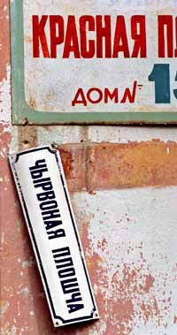
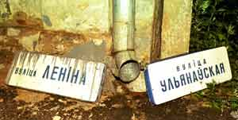

<table>
<tbody>
<tr class="odd">
<td>
</td>
<td>
<h1 id="saying-nyet-to-russian">Saying <em>Nyet</em> To Russian</h1>
<h2 id="beyond-the-motherland-the-language-is-on-the-wane">Beyond the Motherland, the language is on the wane</h2>

by Eve Conant

 Hardly anyone these days has a good word for the language of the former Soviet Union. Teenagers in Central Asia say they hate it; thousands have taken to the streets of Moldova and <strong>Belarus</strong> to protest it; former Soviet governments have deleted it from their mandatory-education programs, and some countries, like Latvia, have passed discriminatory laws against those who speak it. A Russian visitor to rural Moldova or Uzbekistan might have a fine conversation with a person over 35—but a 20-year-old will greet him with blank stares. “If before more than 90 percent of the people in the Soviet territories spoke Russian, now less than half do,” says Vladimir Neroznyak, a Moscow linguist who helps advise the Russian government on language policy. Within the decade, he predicts, that figure will have fallen to one in 10.

What a change. Not long ago the language rivaled English as a lingua franca of empire. Then came the revolutions of the early 1990s, when the former republics began promoting local languages as a symbol of independence. Anti-Russian “affirmative action” programs sprang up, rewarding those who spoke the local tongue with coveted university jobs and government positions. Meanwhile, Russian-language schools lost funding or were shut down. Small-scale linguistic scuffles in Ukraine led to such extremes as a proposed ban on Russian pop music and the formation of ultranationalist “Ukrainization teams” to harass sellers of Russian music and literature. Last April a Russian-language radio station in Latvia lost its license for violating laws limiting the Russian “content” of its broadcasts to 25 percent or less.

The results are evident everywhere. The number of schools that conduct classes solely in Russian has dropped by 71 percent in Turkmenistan, 65 percent in Moldova, 59 per-cent in Kazakhstan and 47 percent in Uzbekistan. Leaders of many newly independent states are pleased. “For decades we couldn’t even think in our own language,” says Moldovan parliamentarian Stefan Cekareanu, whose party earlier this year helped organize demonstrations against a communist-backed initiative to reintroduce compulsory Russian in Moldovan schools. “If Russian were to somehow become official again, other Soviet habits would start to creep back.”

Russian is under assault even within Russia itself. As many as 10,000 foreign words, such as bucksi, voucher, biznesmen and bizneslunch, have entered the language within the past decade—the opposite of what takes place in “A Clockwork Orange,” where Russianisms like moloko and droog invade English. “Whether we like it or not, half of Russian business is conducted in English,” says Neroznyak, who is lobbying to introduce language-purity laws as strict as those of the French.

Within the decade only 1 in 10 will speak Russian on the former Soviet territories. What about Belarus?

The Kremlin is on his side. Over the past two years President Vladimir Putin has more than doubled the amount of money appropriated for the protection of the language. Russian “must be preserved as a language of international discourse,” he said soon after being elected, if only so that the former Soviet states will be “able to compete” in the world at large. Putin’s wife, Ludmilla—a linguist by education—has become the Kremlin’s spokeswoman for the campaign. Across the former Soviet territory, she can be found opening Russian-language centers and attending Russian-language “Olympiads” where students compete in grammar drills.

Clearly, there are benefits to being able to speak the tongue of Mother Russia. For one thing, much of the literature available across the former Soviet Union is still mostly in Russian—few former republics have had the finances to publish new translations. Others say Russian should be kept alive so the countries of the former Soviet bloc, like those of the European Union, will be able to communicate with each other, as Putin points out. Last year Kyrgyzstan broke the mold and granted Russian official status alongside Kyrgyz. Tajikistan is considering following suit. Vyacheslav Belayusov, a professor at Moscow’s Linguistic University, explains that the past decade’s “euphoria of independence” is at last beginning to fade: “People are starting to realize that hiding in their nationalist corners won’t get them anywhere.”

 Perhaps so, but there’s an undeniable generational divide when it comes to speaking Russian. Visit Karakalpakstan, the poorest region of Uzbekistan, and you can see. At a small museum and cultural center at the heart of town, a group of grandmothers, all products of the Soviet regime and fluent Russian speakers, pay at least a third of their monthly pensions to bring their grandchildren to Russian classes. “I think in Russian. It’s in my blood,” says one, Clara Hojametova. But two teenage girls sauntering into the city’s newly modeled Progress language center, not far away, see the world differently. A little more than a decade ago they, too, would have been polishing their Russian and preparing for work somewhere in the far reaches of the Soviet empire. Now they carry English grammar and computer manuals. “English is easy, it’s interesting and it’s new,” says 14-year-old Adele Setjanova. “Russian has been around for ages.” Even those who are less ambitious feel similarly. As 12-year-old Shalgasbai Shuotkanov puts it, contemplating a life living where he is now, “We’re not going anywhere, so why bother learning Russian?”

Russia has won some improbable allies in the fight to save its language. Both NATO and the European Union have pushed Baltic countries to drop what critics say are discriminatory laws. Among those countries is Latvia. To run for political office there, candidates have been required to speak fluent Latvian—despite the fact that Russian speakers make up 30 percent of the population. Last April one Russian-speaking woman from Latvia who was barred from a parliamentary race won her case before the European Court for Human Rights. In February, NATO Secretary-General George Robertson told the Latvian Parliament that its language laws might affect NATO’s decision to invite Latvia into its ranks. Reason: the issue is a contentious point with Moscow. “It’s not in our interest to admit countries that don’t have good relations within their borders or with their neighbors,” one NATO official explains.

Will the combined forces of Putin, NATO and the EU be enough to rescue Russian from the mausoleum? Optimists say the language has withstood assaults before. At the beginning of the 19th century, upper-class Russians spoke only French at home, and the Westernizing reforms of Peter the Great brought an invasion of various European words. But this time around, Russia has faced a challenge not only to its language but to its power. In 1904 Joseph Chamberlain proclaimed: “The day of small nations has long passed away. The day of empires has come.” Unfortunately for the Russian language, today’s motto is: all empires must crumble.

© 2002 Newsweek, Inc 
"...non-commercial use only, provided you keep intact all copyright and other proprietary notices." 
The URL of the original article - http://www.msnbc.com/news/771082.html?cp1=1 
This article appeared in July 1 issue of <em>Newsweek International</em>. 

See also: 
 
- <strong><a href="articles/art_goujon1.html">"Language, nationalism, and populism in Belarus" by Alexandra Goujon</a></strong> 

<a href="gb_add.html?ref=http%3A%2F%2Fwww%2Epravapis%2Eorg%2Fart%5Fno%5Frussian%2Easp">- Write your comment</a>
</td>
</tr>
</tbody>
</table>
