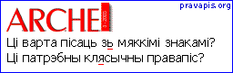

<table>
<tbody>
<tr class="odd">
<td>
</td>
<td>
<a href="articles_by.html">вярнуцца да артыкулаў</a> 
<a href="#">раздрукаваць артыкул</a> 

<h1 id="orthography-клясычны-правапіс-vs.-наркамаўка">Orthography: Клясычны правапіс vs. Наркамаўка</h1>

<em>Апытаньне часапіса Arche: Ці добра ўчынілі адраджэнцы канца 80-х, зрабіўшы выбар на карысьць “тарашкевіцы”?</em>

<strong>Юры Тарасевіч, 
праграміст, Горадня</strong>

 Не было “пераходу на тарашкевіцу”, бо “тарашкевіцы” не існуе. Арыгінальнаю ня пішуць, меркаваньні 1926 году трапілі ў “наркамаўку”, сучасная рэінкарнацыя не адбылася. Што ў нашым друку называюць “клясычным правапісам” — сымуляцыя. Мо так называюць вяртаньне да запраўдных нормаў беларускай мовы? Не відно, па-за асобнымі ізаляванымі ініцыятывамі. Найбольшым дасягненьнем застаўся мяккі знак (яшчэ “выбухное ґ”). Слоўніка — няма. Сур’ёзных прапановаў для школьніцтва і навукі — вобмаль. Узяліся мяняць сьвет і не паклапаціліся пра найгалоўнейшы інструмэнт, які наагул можа мець нацыя. Патрацілі пятнаццаць гадоў на пагоню за мітам, на змаганьне з адзіным, бадай што, рацыянальным унёскам у мову, які зрабілі саветы. Нават з палітычнага гледзішча гэта было шаленства: падзялілі і без таго малалікіх прыхільнікаў, самі сабе падкапалі глебу пад нагамі. Каму было патрэбнае гэта? Бо пэўна, што не на нашу карысьць... А залатога дзесяцігодзьдзя ўжо ня вернеш. Памылка, памылка, адно не разумеем яшчэ, якая фатальная.

 

<strong>Уладзіслаў Яндзюк, 
праграміст, Прага</strong>

Na žal, u tym časie abrać łacinku nichto nie advažyŭsia, tamu, naturalna, taraškievica była adzinym vybaram. Novaja biełaruskaja dziaržava musić jak najchutčej “legalizavać” łacinku a spryjać jejnamu pašyreńniu.

 

<strong>Юры Пацюпа, паэт, 
выкладчык Гарадзенскага ўнівэрсытэту 
імя Янкі Купалы, Горадня</strong>

Адкажу пытаньнем на пытаньне: <em>а ці быў у нас выбар?</em> “Адраджаць” “наркамаўку” — гэта тое самае, што прапагандаваць Петруся Броўку. Для адраджэньня мовы патрэбен адпаведны эмацыйны стан, кожны яе носьбіт павінен стаць суб’ектам, творцам, а не затурканым вучнем, які з-пад палкі зубрыць “дзеравенскі язык”. Нічога паступальнага, рамантычнага “наркамаўка” прапанаваць не магла.

На жаль, 1995 год скруціў мазгі некаторых з нас так, што ад гора бедалагі сталі клясьці Пазьняка, а ў АГП бачыць незалежніцкую сілу. (Гэтак шалёны сабака ад болю кусае сваіх.) У мове ж некаторыя ўжо гатовыя кадыфікаваць хоць “трасянку”, абы нешта ўратаваць. Але так паводзяцца слабыя, спадзеючыся выпрасіць у ката палёгкі, а насамрэч выракуючы сябе на няўхільную павольную ды пакутніцкую сьмерць.

Калі глядзець праўдзе ў вочы, дык трэба шчыра прызнацца, што адраджэньне і сьцьверджаньне беларускае мовы — гэта цяжкі рэжым самадысцыпліны, гэта складаная сыстэма прадуманых і няпростых дзеяньняў. Бальшыня з нас проста стаміліся і махнулі рукой: <em>будзь як будзе!</em> Простыя носьбіты мовы, пагадзіўшыся ўрэшце з “наркамаўкаю”, незаўважна для саміх сябе прызналіся, што ніколі добра ня ведалі мовы і не знайшлі ў сабе сілаў яе вывучыць. Мовазнаўцы таксама тым самым прызналіся, што ня маюць і ніколі ня мелі яснае канцэпцыі моўнага будаваньня, што ня здольныя нічога прапанаваць паспалітаму беларусу, апроч лёзунгу “Гаварыць на роднай мове”. <em>Толькі ня трэба, спадарове, рабіць мову закладніцаю ўласнае творчае імпатэнцыі!</em>

На гэтым можна было б паставіць кропку і годзе. Але ўзьнятае пытаньне не такое простае і, як падаецца, мае двайное дно. Найперш хочацца ўдакладніць: што такое “тарашкевіца”? Калі сьледаваць беспасярэдняму значаньню слова, дык “тарашкевіца” — гэта правапіс. Ці варта дзеля правапісу падымаць такі вэрхал?

І ўсё ж ужываньне гэтага слова паказвае: пад “тарашкевіцаю” даўнімаецца нешта большае, чым правапісныя нормы. Дылетанты нават маюць гэткае цьмянае ўяўленьне, быццам існуе нейкі ідэальны адменьнік беларускае мовы, аднойчы скадыфікаваны Браніславам Тарашкевічам, адкуль мы чэрпаем усё найлепшае і ня можам сягнуць дна. Постаць аўтара сьціплае граматыкі для школ у іх вырастае да абсягаў тытана і дэміюрга. Хоць насамрэч ніякае кадыфікацыі мовы Тарашкевіч ніколі не рабіў. Жаднае “тарашкевіцы” як мовы няма і ніколі не было. У гэтым пляне такія пісьменьнікі, як Янка Купала, Якуб Колас, або аўтары слоўнікаў браты Гарэцкія, Байкоў, Некрашэвіч, кожны паасобку, для кадыфікацыі мовы зрабілі куды больш. Я ўжо не кажу пра Яна Станкевіча, які ў Заходняй Беларусі, а потым на эміграцыі адзін рабіў для мовы, для моўнае практыкі больш, чым уся савецкая Акадэмія навук за ўсю яе гісторыю існаваньня.

Тое, што ня правапіс, а мову называюць “тарашкевіцай”, вельмі кепскі сымптом. Ён паказвае: <em>моўнае мысьленьне замяняецца правапісным.</em> Веданьне запраўднае, “несавецкае” мовы дасягаецца зусім простым “магічным” спосабам: ужываньнем мяккага знаку, адумысным вымаўленьнем замежных слоў ды “джэнтэльмэнскім наборам” модных і абсалютна недарэчных (тут я пагаджаюся з Шубам і Падлужным) украінізмаў ды палянізмаў: <em>падчас</em> (замест <em>у час</em>), <em>напрыканцы</em> (замест <em>у канцы</em>, <em>пад канец</em>), <em>прыгадаць</em> (замест <em>успомніць</em>), <em>распавядаць</em> (замест <em>расказваць</em>) і г.д. Гэты ўбогі узус, гэтая птушыная гамонка, у астатнім на 99% складзеная з русіцызмаў ды расейскіх кáлек, выдаецца — брат ты мой! — за “тарашкевіцу”, а не абы-што... Я чытаў некаторыя нашыя друкаваныя выданьні, пісаныя нібы на “тарашкевіцы”, а насамрэч — проста з ужываньнем мяккага знаку. Мова “Звязды” ў параўнаньні зь імі — вяршыня дасканаласьці, “супэртарашкевіца”.

Калі ж не зважаць на падмену мовы правапісам і ўсё ж гаварыць пра мову, то альтэрнатывы ў нас няма. Або мы адродзім запраўдную беларускую мову (“тарашкевіцу”, як кажуць тыя самыя дылетанты), або наагул уся гэтая гульня ня вартая сьвечак. Хто не разумее таго — той, хутчэй за ўсё, сам ня ведае беларускае мовы. За свае словы я гатоў адказваць. Мне пашчасьціла да школы гадавацца ў дзеда на хутары. Беларуская мова для мяне родная не намінальна. Я яе ведаю ня з кніжак і таму не баюся ў нечым пахібіць, ужыць дыялектызм. Пазьней, заглыбіўшыся ў старабеларускія тэксты, у тэксты старой “Нашае Нівы”, эмігранцкія працы, я зразумеў, што “наркамаўка” (карыстаюся недакладным паспалітым тэрмінам) — гэта не беларуская мова, а яе імітацыя. Проста перакручаная расейская.

Ня варта цэлы этнас напружваць дзеля гэтай брыдоты. Ня варта дурыць людзям галовы. Мне “наркамаўка” агідная настолькі, што я ёй зычу сьмерці ў кожным разе. Калі не “тарашкевіца” — тады лепш расеізацыя. Тады ў РНЕ можна запісвацца. А яшчэ лепш — поўная і незваротная палянізацыя. Перафразуючы расейскага клясыка, скажу: няхай “славянские ручьи сольются в польском море”. Перад наступам глябалізацыі чаму не зрабіцца панславістам? Але, дзякуй Богу, такой альтэрнатывы няма. І ёсьць яшчэ порах у парахаўніцах! І мы яшчэ пазмагаемся за беларускасьць. Бо неімітаваная беларуская мова, “тарашкевіца”, ня мае сабе роўных у сваіх мажлівасьцях. Чым больш я яе вывучаю, тым больш зьдзіўляюся яе сыстэмнасьці, багацьцю і хараству.

Разумею, што многіх, асабліва пісьменьнікаў старэйшага пакаленьня, якія пачыналі за савецкім часам, мая катэгарычнасьць абурыць. Яны ж пачуваюцца зьвязанымі з “наркамаўкаю”. Але ня варта сьпяшацца з высновамі. Я нікога не зьбіраюся скідаць з “параходу сучаснасьці” і ніколі не рабіў гэтага раней. Рэч у тым, што беларуская мова вершаў і мастацкае прозы ў асноўным ляжыць па той бок памянёнае альтэрнатывы. Першае: бальшыня нашых пісьменьнікаў выйшла зь вёскі, дзе бытавала жывая народная гаворка. Другое: мастацкая мова абымае такія пласты лексыкі, якія ў савецкія часы менш за ўсё падпадалі пад расеізацыю. Хутчэй нашае — і маладзейшае за нас — пакаленьне ня здольнае авалодаць жывой гутарковаю моваю і вартае быць выкіненым на сьметнік. Чаму мы раптам спачувальна загаварылі пра “наркамаўку”? Бо ўсё менш ведаем беларускую мову. Усё часьцей моўнае мысьленьне замяняем правапісным. І вось, знайшлі просты спосаб зымітаваць беларусізацыю — вярнуцца да “наркамаўкі”.

Пад канец хацелася б прытачыць шэраг парадоксаў нашае моўнае сьведамасьці, якія я доўно ўжо назіраю.

<em>Парадокс-1: “дэмагог” (палітычны).</em> Змагаемся за пашырэньне беларускае мовы, але ня дбаем пра яе якасьць. (Пашыраны сярод палітыкаў і іншых “актывістаў”.)

<em>Парадокс-2: “сава” (ідэалягічны).</em> На расейскай ці няякаснай, зрасеізаванай беларускай мове лаем усё расейскае, як тая сава, што лучыла ў цень арла. (Пашыраны сярод “нацыяналістаў”.)

<em>Парадокс-3: “кляпан” (гнасэалягічны).</em> Паблажліва ставімся да асобных расеянізмаў, але адразу выкрэсьліваем незразумелае для нас беларускае слова. (Пашыраны сярод рэдактараў газэт.)

<em>Парадокс-4: “шызафрэнія” (эстэтычны).</em> Шукаем патрэбнае чыста беларускае слова, але, як толькі дасьведчаны чалавек падказвае нам яго, кажам, што гэта нешта ня тое. (Пашыраны сярод “спэцыялістаў”, якія спрабуюць карыстацца беларускаю мовай.)

<em>Парадокс-5: “кастрацыя” (сыстэмны).</em> Так пнемся пазбыцца расеянізмаў, што ладны абсяг нармальных беларускіх слоў не ўжываем. (Пашыраны сярод “пурыстаў”.)

Усё тое, што я тут пасьпеў сьпешна і хаатычна накідаць, сьведчыць пра адну страшную рэч: у нас склалася дзьвюхмоўе, якое Леў Шчэрба назваў <em>адна мова з двума тэрмінамі</em>. У запраўднасьці ўжо няма беларускае мовы. Ёсьць адна, расейская, — з расейскім і беларускім тэрмінамі. А адраджаць мову варта як асобную сыстэму мысьленьня. Мова, якая існуе толькі намінальна, — самападман, яе не павінна быць. Але ня варта апускаць рукі. Мы жывем у глябалізаваным сьвеце, дзе пад пагрозай усе мовы. Калі мы можам зьнікнуць сёньня, летувісы — заўтра, а французы — пазаўтра, дык няма вялікай розьніцы. І ўсё ж, я думаю, людзі рана ці позна нацешацца палітычнаю гігантаманіяй, як нацешыліся асушэньнем балот, цаліной і камунізмам. А тады адзінаю альтэрнатываю стане сыстэма культурных манадаў — мноства аўтаномных, а неізаляваных культурных асяродкаў, якія будуць станавіць сабою альтэрнатыўныя мадэлі існаваньня й мысьленьня.

 

<strong>Васіль Быкаў, 
народны пісьменьнік Беларусі, 
Менск</strong>

Даўно было відавочна, што беларуская мова, апроч зьнешняй пагрозы, перажывае ўнутраны крызыс — як наступства русіфікацыі, саветызацыі, бюракратызацыі — катастрафічнае зьмяншэньне моўна-нацыянальнай ідэнтычнасьці. Наркамаўскі правапіс 1933 году, а затым і выданьне акадэмічных працаў пад рэдакцыяй акадэміка-паслухмянца Крапівы ўсё набліжалі мову да апошняй мяжы. Таму, мабыць, натуральна, што адраджэнцы, ня маючы магчымасьці паўплываць на гэты катастрафічны працэс, зьвярнуліся да старой граматыкі Браніслава Тарашкевіча. Але бяда ў тым, што граматыка Тарашкевіча ўжо для свайго часу была ня надта прыстасаваная, а праз 50—60 год, вернутая да жыцьця ў іншы гістарычны пэрыяд, у многіх адносінах стала анахранічнай. Для жывой мовы было б вельмі хваравіта — раптоўны пераход з канца ХХ стагодзьдзя ў стан, уласьцівы мове на пачатку стагодзьдзя. Як на маю думку, дык трэба было б тую апэрацыю рабіць болей ашчадна, выбарачна, ці што. З улікам выдатнага і адмоўнага, што было ў Браніслава Тарашкевіча. Найперш, безумоўна, узаконіць правапіс мяккага знаку і “я” перад націскам, а пасьля ісьці паступова, а галоўнае, у духу традыцыйнага беларускага маўленьня. І вядома ж, з улікам агульнапрызнанай асновы сучаснай беларускай літаратурнай мовы, якую заклалі Янка Купала і Якуб Колас. Раптоўны, за адзін раз, зварот да “тарашкевіцы” не апраўданы і дэструктыўны. Ён болей пабурыў, чым стварыў. Цяпер мы маем становішча, калі бальшыня беларусаў усіх узростаў проста аказаліся непісьменнымі, бо ня ведаюць, як пісаць і як мовіць. Улады адступацца ад “наркамаўкі” ня хочуць, а беларусы паўсюдна прыняць “тарашкевіцу” ня могуць. Народ і будзе ўсё больш зьвяртацца да расейскай мовы, дзе існуе шматгадовы моўны “парадак”, па якім гэтак сумуе народ.

 

<strong>Ян Максімюк, 
палітычны аналітык, Прага</strong>

У 80-я гады “тарашкевіца” зьявілася ў беларускім адраджэнскім руху разам з нанава распаленым “хаценьнем людзьмі звацца” і з нанава адкрытымі бел-чырвона-белым сьцягам і Пагоняй. Несумненна, што “тарашкевіца” ў той час была неадлучным атрыбутам жывой антысавецкай беларушчыны (ёю ж зусім натуральна карысталася заакіянская эміграцыя!), таму яна ніякім чынам не магла выпасьці з нацыястваральнага “праекту” адраджэнцаў. І яна давала ейным карыстальнікам дадатковае пачуцьцё свабоды, разьняволеньня з прыгону савецкай беларушчыны. Таму магчыма нават сказаць, што гэта “тарашкевіца” знайшла адраджэнцаў, а не яны яе.

Для мяне асабіста выбар паміж “наркамаўкай” і “тарашкевіцай” паўстаў з усёй вастрынёй у пачатку 90-х, калі я быў акунуўся з галавою ў пераклад “Уліса” Джэймса Джойса і шукаў адэкватнай “моўнай прасторы”, у якую можна было б зьмясьціць лінгвістычна-стылістычныя вычварэнствы гэтае кніжкі. “Тарашкевіца” тады ўявілася мне перш за ўсё як раскаваная моўная сыстэма, якая дала шырокі прастор і магутны імпульс для перакладніцкіх пошукаў новага слова і фразы — а ня толькі як асобны ад савецкага правапіс. Гэтага погляду, дарэчы, я не зьмяніў і да сёньня. Інакш сказаўшы, наркамаўскі правапіс мяне не інсьпіруе ні да пісаньня, ні да чытаньня па-беларуску. Зь цягам часу, чытаючы “адраджэнскую літаратуру” 90-х, я дайшоў да высновы, што так або неяк падобна думае бальшыня маіх улюбёных аўтараў. У іхных тэкстах было ня толькі больш “ь” і “э” ў параўнаньні з наркамаўскімі, але і больш сьвежага ды цікавага. Я думаю, што перш за ўсё вяртаньню “тарашкевіцы” ў беларускае прыгожае пісьменства мы абавязаны тым, што гэтае пісьменства не загнулася назусім, а абнавілася і працягвае намацваць сабе шляхі ў трэцім тысячагодзьдзі. Зусім сур’ёзна.

Хоць і даўно ўжо я не наведваўся ў Менск, ды ўсё ж адчуваю, што хто-ніхто там спрабуе зрабіць “тарашкевіцу” — разам з Пазьняком з аднаго боку і Лукашэнкам з другога — віноўніцай у правале “беларускага адраджэньня”. Маўляў, настваралі мы БНФаў і напрыдумлялі новых словаў, але толькі для сябе, бо народ нас не разумее і абыходзіцца “бяз нас”. Значыць, давайце рабіць так, як і народ, што вывучае белмову ў школах у савецкім правапісе. Магчыма, у гэтым ёсьць свая палітычная слушнасьць, нават неаспрэчная. Ды толькі да выжываньня мовы гэтая слушнасьць ня мае вялікага дачыненьня. Жывучасьць беларускай мовы на сёньня, па-мойму, вызначае ня колькасьць людзей, якія на ёй гавораць, а колькасьць тых, якія ў гэтай мове нешта істотнае кажуць. У гэтым сэнсе я пакуль што ня бачу за “наркамаўкай” нейкай сьвятлейшай будучыні.

Мяркуючы з досьведу ірляндцаў і нарвэжцаў, якія ўжо больш за сто гадоў (з выдатнай і непахіснай дапамогай дзяржаўнага апарату і бюджэту) беспасьпяхова адкопваюць свае вясковыя мовы з-пад каляніяльных завалаў (ірляндзкую — з-пад англійскага, а нованарвэскую — з-пад дацкага), ня толькі хібная “адраджэнская стратэгія” і байструкаватасьць дзяржаўнай улады вінаватыя ў працяглым заняпадзе беларускай мовы ў беларускай краіне. Хутчэй за ўсё, тут ёсьць яшчэ нешта страшнейшае, безназоўнае. Гэта яшчэ адзін аргумэнт, што “тарашкевіца” тут можа быць зусім ні пры чым. З другога ж боку, зусім магчыма, што гэты заняпад і ёсьць такой фатальнай і непазбыўнай акалічнасьцю, якая дазваляе беларускай мове выжываць, то бок ейным карыстальнікам казаць усё яшчэ нешта істотнае. Інакш кажучы, мы ўсё яшчэ хочам змагацца...

 

<strong>Сяргей Абламейка, 
літаратар, журналіст, Прага</strong>

Не, няправільна. З вышыні сёньняшняй веды ўжо можна сказаць, што — не. Сам я застаюся прыхільнікам “тарашкевіцы”, не прымаючы савецкага гвалту над мовай. Я нават ня ўмею пісаць на наркамаўцы — развучыўся за апошнія 18 гадоў, бо з 1985 году яе не ўжываю. Ужываньне “тарашкевіцы” тады было формай антысавецкага пратэсту, непрыманьня савецкіх рэаліяў. Быў і яшчэ адзін аспэкт. Літаратурная мова ў Эўропе традыцыйна фармуецца на падставе сталічных гаворак — гэта значыць тых, што існуюць вакол сталіцы дзяржавы ці народу. “Тарашкевіца” стваралася на падставе віленскіх гаворак — у ваколіцах Вільні і сёньня так гавораць, чыстую “тарашкевіцу” можна і цяпер пачуць, напрыклад, у вёсках Мядзельскага раёну. Таму ўжываньне “тарашкевіцы” ў 80-я гады было і формай непрызнаньня перадачы Вільні літоўцам у 1939 годзе. Але падабаецца гэта нам ці не, сёньня сталіца Беларусі — Менск...

Таму як журналіст, як вядучы, які да таго ж некалькі гадоў працаваў рэдактарам інтэрнэт-выпуску Беларускай службы радыё «Свабода», — адным словам, як практык, я бачу і праблемы, якія паўстаюць праз нарматыўны і граматычны разнабой у беларускіх галовах. Пры гэтым ня трэба забывацца, што моладзь разам з “тарашкевіцай” у 80-я гады завяла і традыцыю ўжываньня пэўнага пласту словаў, на якія ў савецкай і постсавецкай Беларусі людзі забыліся (ці іх прымусілі забыцца). А любоў да “тарашкевіцы” ў нэафітаў часта пераходзіць у словатворчасьць — у выніку нараджаюцца словы-пачвары, а іх аўтары забываюцца на стыль і густ. Адзін малады прыхільнік “тарашкевіцы” ня ведаў слова “паморак” і напісаў “згіненьне жывёлы”... А пра сынтаксычныя хібы і гаварыць ня варта. Таму я заўсёды раю (вядома, тым, хто здольны прымаць парады) больш чытаць Гарэцкага, Кузьму Чорнага, Брыля і Адамчыка. А сам сёньня ўжо разумею, што ў 80-я гады дастаткова было абмежавацца мяккім знакам і “я” пераднаціскным — быў бы шыкоўны кампраміс. Але не было таго, хто б парадзіў...

 

<strong>Аліса Бізяева, 
аглядальніца газэты “Человек и Интернет”, 
стваральніца рэсурсу litara.net, Менск</strong>

Мне падаецца, што іх выбар быў даволі просты: граматыка Тарашкевіча адпавядала большасьці абраных сымбаляў, была бліжэйшая да каранёў, не сапсаваная русіфікацыяй. А цяпер складана адказаць на пастаўленае мне пытаньне. З аднаго боку, граматыка Тарашкевіча лепей перадае мілагучнасьць беларускае мовы, больш адпавядае яе фанэтыцы. Але “тарашкевіца” ня стала агульнапрынятым правапісам, і рознасьць напісаньняў стала яшчэ адным выяўленьнем рознасьці поглядаў на нацыянальнае адраджэньне. І без таго рэдкае, беларускае слова, напісанае “тарашкевіцай”, у акадэмічных і грамадзкіх інстытутах часта ўспрымаецца значна горш, чым пададзенае па-расейску.

Калі я вучылася на журфаку, пісала свае курсавыя “наркамаўкай” і чытала «ARCHE» “тарашкевіцай”. У крытычных творах вельмі шанаванага мною Пятра Васючэнкі не было мяккіх знакаў, а ў творах ня менш шанаванага Ігара Бабкова — былі. Людзям, якія сапраўды хочуць захаваць нацыянальную мову любымі сродкамі, няма патрэбы спрачацца з-за правапісу. Яны абралі беларускую мову і часта гатовыя карыстацца тым правапісам, якога вымагае сытуацыя.

 

<strong>Ільля Глыбоўскі, 
супрацоўнік фундацыі «Чалавек у нядолі», 
Прага</strong>

Chutčej nie, byŭ jinšy, bolš prahresiŭny šlach (dyj ciapier jašče nia pozna jim pajści). Dla mianie hałoŭnaje pytańnie nie ŭ hramatycy, a ŭ hraficy. Pry vykarystańni łacinki źnikaje prablema miakkaha znaku, vakoł jakoj nia pieršaje dziesiacihodździe jduć pustyja sprečki. Spraščajecca tranślitaracyja imionaŭ ułasnych, vizualna pieradajucca “h” i “g”. Na hety šlach stali nia tolki bolšaść słavianskich narodaŭ, ale j małdavanie, tatary. Adnyja tolki vyhody ŭ sfery sučasnych technalohij i kamunikacyj adrazu na niekalki hod napierad pasunuć naš narod. Łacinka moža papravić i niekatoryja kompleksy biełarusaǔ.

 

<strong>Павал Жук, 
бізнэсовец, Менск</strong>

Некарэктна гаварыць пра выбар: выбару не было. У канцы 80-х гадоў мінулага стагодзьдзя была пачатая справа пабудовы новай Беларусі, адраджэньня нацыі. Мова — яе асноўны атрыбут, які фармуе мэнтальнасьць, ідэнтыфікуе нацыю. Савецкая беларуская мова ня магла і ня можа выконваць гэтыя задачы. Як тады, так і цяпер праблема ў мове, а не ў правапісе. У той, ужо далёкі, час вярнуліся да забытай моўнай базы, якую паспрабаваў фармалізаваць у правілы правапісу Тарашкевіч і якая давала шанец адарвацца ад савецкай белмовы. Усе дакумэнты тае эпохі, прамовы і г.д. пісаліся адраджэнцамі на “тарашкевіцы”. Тады ўжо стала зразумела, што гэтая аснова недастатковая і яе трэба дарабляць, адаптоўваць да рэаліяў. Навуковага асэнсаваньня і абгрунтаваньня ня зроблена да гэтага часу. Былі спробы выданьня слоўнікаў, у асноўным спэцыялізаваных, але гэта былі высілкі энтузіястаў. Таксама і мова незалежнай прэсы, ад “Навінаў БНФ”, потым “Свабоды”, “Нашай Нівы”, грунтавалася на палкім жаданьні адарвацца ад “саўка”. Аднаго жаданьня было мала. “Савок” перамог. Пакуль. Мара пабудовы Краіны Беларусі застаецца і павінна рэалізавацца. Бо нацыя, якая вучыць мову па трасянкавых слоўніках, чытае творы, напісаныя беларускай савецкай мовай, асуджаная на марудную, а значыць, больш небясьпечную асыміляцыю. Асабіста я спрабую дасканаліць сваё ўжываньне “тарашкевіцы”.

 

<strong>Уладзімер Каткоўскі, 
праграміст, стваральнік інтэрнэт-рэсурсу pravapis.org, 
Франкфурт-на-Майне</strong>

Гэта быў абсалютна правільны выбар, у якім было два аспэкты: сымбалічны і практычны. Галоўны сымбалізм у тым, што мы адмяжоўваліся ад нежывой, сувэнірнай мовы БТ і радыёкропкі. Сымбалізм быў і ў тым, што мы адмовіліся ад бальшавіцкай рэформы 1933 году. Гэта значыць “два ў адным”: і ад камунізму, і ад непатрэбнай русіфікацыі.

Практычны аспэкт, я думаю, зразумелы. Па-першае, стандартная, але зацьвярдзелая і зьмярцьвелая сыстэма “наркамаўкі” не дае мове разьвівацца. Фактычна, “наркамаўка” праспала ХХ стагодзьдзе і працягвае спаць у ХХІ-м. Па-другое, “наркамаўка” вельмі адмоўна ўплывае на вымаўленьне тых, хто вывучае беларускую мову ў школе як другую, хоць быццам бы і “родную” мову.

Выбар быў цалкам правільны, але вялікая памылка і найвялікшая праблема палягае ў тым, што не было зроблена “сучаснай нармалізацыі”, якую нам спадар Вячорка абяцаў вельмі даўно. Гэтая сытуацыя зрабіла з прыхільнікаў клясычнага правапісу нейкіх моўных анархістаў і вельмі папсавала імідж “мяккім знакам”. Я зь вялікім нецярпеньнем чакаю на новы стандарт клясычнага правапісу. (Гл. таксама <a href="http://www.livejournal.com/users/rydel23/155068.html">http://www.livejournal.com/users/rydel23/155068.html</a>)

 

<strong>Сяржук Сокалаў-Воюш, 
паэт, Прага—Нью-Ёрк</strong>

Адраджэнцы канца 80-х ніякага выбару не рабілі. Пэрсанальна перада мной ніколі не паўставала пытаньне пераходу на “тарашкевіцу”. Проста аднойчы я даведаўся, што яна ёсьць, і адразу ж пачаў яе ўжываць.

Гэта прыкладна тое самае, што з гісторыяй. Вывучаў у школе савецкую і савецкі варыянт беларускай, а потым, калі зразумеў, што ўсё гэта хлусьня, пачаў шукаць адпаведную літаратуру й вывучаць тое, што лічыў праўдзівым і сапраўдным.

Ці правільна зрабілі адраджэнцы... А ці правільна зрабілі марскія жывёлы, стаўшы земнаводнымі, сухапутнымі? Ці правільна робіць дрэва, калі чапляецца каранямі за скалу, а іншае — за глебу на раўніне?

Пытаньне “тарашкевіцы” — гэта пытаньне натуралёвасьці, якая дазваляе выжыць і жыць, пытаньне гармоніі.

Па-мойму, сам факт узьнікненьня такіх пытаньняў сьведчыць пра грамадзтва, у якім мы жывём. Рэфарматары скажуць, што падобнае грамадзтва трэба рэфармаваць, а я думаю, што перад тым трэба чалавеку даць магчымасьць зразумець самога сябе і стаць самім сабою. Тады пытаньня, які правапіс ужываць, папросту ня ўзьнікне.

Вы можаце запытацца, што было б, калі б адраджэнцы не пачалі ўжываць клясычнага правапісу... Ня ведаю. Напэўна, я быў бы адзіным, хто трымаўся б яго.

 

<strong>Сяргей Шупа, 
лінгвіст, Прага—Вільня</strong>

На самое пытаньне я адказваць ня буду, бо ў самім ім ужо закладзеная ідэя супрацьстаяньня двух варыянтаў літаратурнай беларускай мовы. Я выкажуся наконт самой гэтай ідэі.

Ніякай праблемы “супрацьстаяньня” “наркамаўкі” і “тарашкевіцы” няма. Уяўная “ўнармаванасьць” “наркамаўкі” і “неўнармаванасьць” “тарашкевіцы” — гэта ўсё фікцыя. Беларуская мова — адна і адзіная. З гледзішча культуры мовы яна можа быць добрая і дрэнная. І як добрую мову ніяк не сапсуе “наркамаўка”, гэтак і дрэнную ніяк не ўратуе “тарашкевіца”. “Наркамаўка” ніяк не абмяжоўвае творчасьці, гэтак сама як “тарашкевіца” не дае <em>carte blanche</em> на безагляднае саматужніцтва.

Міжусобныя антаганісты — ворагі адпаведна “наркамаўкі” і “тарашкевіцы” — гэта ў пераважнай сваёй большасьці недастаткова пісьменныя ў беларускай мове людзі, якія падсьвядома сваю малапісьменнасьць адчуваюць і спрабуюць схавацца за папрокі — маўляў, “наркамаўка” зрусіфікаваная або на “тарашкевіцы” ніхто ня ведае, як правільна пісаць. Трэба проста павышаць культуру мовы, тады ўсялякія “мухі” наконт “супрацьстаяньня” зьнікнуць самі сабою.

Істотнай розьніцы паміж “наркамаўкай” і “тарашкевіцай” няма. Вымаўленьне накшталт [<em>сьвет</em>] ці [<em>ня быў</em>] аднолькавае і там, і там. Розьніца ў напісаньні — справа густу. Розьніца ў напісаньні мае абсалютна сыстэмны характар, і пераключэньне туды-сюды ніякіх праблем не стварае. Што да ўсялякіх філолагаў/філёлягаў, сыстэмаў/сістэмаў — дык абодва варыянты аднолькава беларускія. Таксама справа густу.

Магчыма, існаваньне аднаго варыянту шмат што спрасьціла б. Ідэалам быў бы сынтэз “наркамаўкі” і “тарашкевіцы”, напрыклад: узяць “наркамаўку”, вярнуць туды мяккія знакі, “ня”, безь вялікага фанатызму падгладзіць правапіс запазычаньняў. Разьвітацца зь фі<em>лёля</em>гамі і <em>сы</em>стэмамі, але захаваць А<em>мэ</em>рыку і Б<em>эр</em>лін. Што да “тарашкевічнай” лексыкі (Нямеччына, тэлевізія і падобнае), дык яна гэткая самая “тарашкевічная”, як і “наркамаўская”. Аднак, на жаль, афіцыйныя мовазнаўцы ня дбаюць пра далейшы лёс мовы і адмаўляюцца ісьці насустрач тым, хто ўжывае “тарашкевіцу”, тым самым падтрымваючы надалей існаваньне двух варыянтаў літаратурнай мовы, — пра сынтэз у імя еднасьці Інстытут мовазнаўства ня дбае.

Ну й тае бяды. Няхай жыве разнастайнасьць :)

 

<strong>Максім Шчур, 
філёзаф, паэт, Прага—Стакгольм</strong>

На пачатку 90-х гадоў “рэпрэсаваны правапіс” стаўся адным з сымбаляў змаганьня за зьмену палітычнай эліты — і гэтым ператварыўся з пытаньня моўнага ў палітычнае (прыгадайма паэму Сержука Сокалава-Воюша “Мяккі знак”, адмысловы маніфэст адраджэнскага руху). Адраджэнцы абралі “тарашкевіцу” перадусім з палітычных меркаваньняў і пачалі ёю карыстацца спантанна ды часам вельмі адвольна. Зразумела, што тыя, хто выступаў за нацыянальную эмансыпацыю, з захапленьнем успрынялі “новую” тэндэнцыю ў мове: “пераадкрыцьцё” “тарашкевіцы” пазбавіла дзяржаву, а значыцца, і Камуністычную партыю фактычнай манаполіі на беларускую мову, абудзіла ў людзях хвалю цікавасьці да яе й разбурыла міт аб спрадвечнай нязьменнасьці расійска-беларускіх стасункаў, у тым ліку і ў галіне мовы. Усё гэта сьведчыла аб перамене палітычнага клімату ў краіне. Аднак у цэлым адраджэнцы тады пераацанілі псыхалягічную й ідэалягічную падрыхтаванасьць беларускага народу да прыняцьця вялікай колькасьці радыкальных зьменаў адначасова.

Ільга сказаць, што з палітычнага гледзішча “тарашкевіца” нічым не нашкодзіла адраджэнцам, але й нічым не дапамагла, аднак эмацыйна падтрымала рух, бо стварыла ўражаньне, быццам на ягоным баку веданьне нейкай адмысловай праўды. На жаль, гэтае ўражаньне не было праўдзівым. Як паказала далейшае разьвіцьцё сытуацыі, празьмерная палітызацыя нацыянальнага пытаньня ў той час была няўдалым і заўчасным крокам. У той час я таксама быў “з прынцыпу” паспрабаваў пісаць у школе “зь мяккімі знакамі” — і адразу ж атрымаў за дыктоўку двайбан. Прыблізна тое самае сталася з нашымі “дарослымі” адраджэнцамі: іхную “радыкальнасьць” у гэтым рэчышчы льга ўспрымаць як адну з праяваў нясьпеласьці ўсяго тагачаснага руху. Галоўнае — ня як пісалася, а што пісалася.

Напэўна, замест крайняй палітызацыі моўнага пытаньня й адкрытай канфрантацыі з афіцыйным правапісам варта было найбольш значныя навуковыя й літаратурныя творы, напісаныя й выдадзеныя да 1933 году (перадусім літаратурную клясыку — Купалу, Коласа, Гарэцкага, а таксама творы аўтараў-эмігрантаў), мэтаскіравана перавыдаць у арыгінальным правапісе, а не ў такім выглядзе, у якім яны былі вядомыя бальшыні з савецкіх часоў.

Зразумела, што, каб у той час быў дазволены выхад “сучаснай” кніжкі, надрукаванай “несучасным” правапісам, трэ было ўмець паразумецца ня толькі з тагачаснымі ўладамі, але й зь беларускімі рэдактарамі “савецкай школы”, якія традыцыйна належаць да самых кансэрватыўных і пільных у сьвеце й практычна ня ведаюць, чым рэдактура адрозьніваецца ад цэнзуры. Таксама ясна, што ў краіне з адсутнасьцю ўяўленьня аб прыватнай уласнасьці й ня толькі аўтарскіх, але й іншых правох чалавека растлумачыць гэтае адрозьненьне цяжка яшчэ й сёньня. У Савецкім Саюзе добра ведалі, што цэнзуру найлепш маскаваць менавіта пад рэдактурай. Рэдакцыі ўяўлялі сабой адно з адгалінаваньняў улады, надзеленае паўнамоцтвамі ідэалягічнага кантролю, <em>былі</em> гэтай уладай у дачыненьні да тэкстаў і іхных аўтараў. Прычым так паводзілі сябе ня толькі рэдактары, але й перакладчыкі. Даходзіла да сьмешнага: гэтак, напрыклад, у чэскім перакладзе “Чорнага замку Альшанскага” бракуе (сярод многіх іншых пасажаў) апошняй фразы, “О, жыцьцё!” — толькі таму, што перакладалі з “удасканаленага” расійскага перакладу, надрукаванага ў “Нёмане” ў 1980—1981 гадох. Чый гэта быў пераклад, не нагадаеце?

Наагул, ідэалягічны кантроль за культурай з боку дзяржавы магчымы праз матэрыяльную несамастойнасьць гэтай культуры ды фактычную адсутнасьць прыватных выданьняў. Ён і сёньня застаецца такой самай праблемай, як і калісь.

Улучэньне ў правапісную норму неабходных і найбольш жыцьцяздольных элемэнтаў “тарашкевіцы” сталася б магчымае й патрэбнае толькі тады, калі “прыватнае” карыстаньне імі настолькі распаўсюдзілася б, што пытаньне пераходу на новы варыянт правапісу на дзяржаўным узроўні зрабілася б мэтазгодным. Пры такім разьвіцьці падзеяў сёньня мы ўжо рэгулярна сутыкаліся б калі не з “тарашкевіцай”, дык зь відочна “тарашкевізаванымі” варыянтамі “наркамаўкі” ў друку — хаця ў школе, магчыма, усё яшчэ вучыліся б “па-наркамаўску”. Але зноў-такі — якіх гадоў пяць—дзесяць, ня болей. З улучэньнем у школьныя праграмы ўзгаданых клясычных тэкстаў рана ці позна паўстала б пытаньне новай нормы.

 

<strong>Сяргей Дубавец, 
рэдактар, Вільня</strong>

Пытаньне і некарэктнае, і бескарыснае, і недакладнае (пра канец 80-х). А праблема тут чыста маральная. Гэта праблема ацэнкі сталінізму і русіфікацыі ў Беларусі. Пакуль такое ацэнкі ня будзе хоць бы з боку беларускае інтэлігенцыі, два правапісы будуць суіснаваць, адзін — як увасабленьне антыбеларускага і прасавецкага курсу аўтарытарнае ўлады, як вобраз прыгнёту, другі — як вобраз незалежнае беларушчыны.

Наяўнасьць двух правапісаў, вядома, замінае. Але ў нашым гістарычным часе безь вяртаньня да клясычных нормаў нават тое адраджэньне, якое ёсьць сёньня (прыток моладзі ў беларушчыну), было б немагчымае. Сымболіка каляніялізму неспалучальная з эстэтыкай адраджэньня. Гэта выбар паміж мёртвым і жывым.

 

<strong>Івонка Сурвілла, 
Старшыня Рады Беларускай Народнай Рэспублікі, 
Атава</strong>

Абсалютна правільна. Не магу сабе і ўявіць іншага выбару. 
 

<em>Апытваў Алесь Пяткевіч, Прага</em>

Copyright © 2003 Arche (arche.home.by). Reprinted with permission.

See also / Гл. таксама: 
 
- <strong><a href="articles/art_language2000.html">Mova'2000</a></strong> - Што новага зьявілася ў беларускіх слоўніках у дваццатым стагодзьдзі; 
- <strong><a href="articles/art_letter_returns.html">Litara G</a></strong> - Вяртаньне літары Ґґ у беларускую мову; 
- <strong><a href="articles/art_language_reform1.html">Рэформа наркамаўкі</a></strong> - Правапіс трохі абеларусіцца; 

<a href="gb_add.html?ref=http%3A%2F%2Fwww%2Epravapis%2Eorg%2Fart%5Forthography%5Fopinion%2Easp">- Write your comment</a>
</td>
</tr>
</tbody>
</table>
