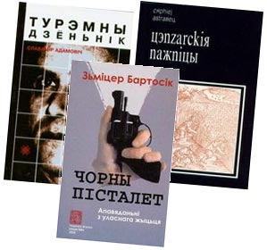

<h1 id="belarusian-language-publishing-or-perishing">Belarusian Language: Publishing or Perishing</h1>

Jan Maksymiuk, RFE/RL, Prague

Even President Alyaksandr Lukashenka's Belarus – a country generally believed to be deeply immersed in the Soviet era in terms of its political regime and socioeconomic environment – offers its citizens many liberties that were utterly unthinkable in the days of the Belarusian Soviet Socialist Republic. To name just a few: people may travel abroad freely (provided they have the finances), opponents of the ruling regime may take their discontent to the streets (provided they are unafraid of spending a dozen days in jail), journalists may write what they choose (provided they work for a non-state publication and are unafraid of spending a couple of years in an "open-type corrective-labor institution" for "defaming the president"), and individuals may give interviews to RFE/RL correspondents without the risk of losing their jobs in the public sector (especially if they do so on condition of anonymity). And Belarusian writers may publish what they wish, provided they can find a publisher.

Freedom of expression in Soviet Belarus posed a similar problem as that faced by authors in other Soviet republics or former communist countries in Eastern Europe. However, in contrast to the situation in Russia or Ukraine, let alone Poland, Belarusian writers of the Soviet era produced only a negligible number of publications that could be designated by the internationalized Russian word "samizdat." The reasons for this were many; but one is of particular interest, as it presents a good angle from which to view Belarus's unique cultural and linguistic situation. For Belarusian writers, writing in their mother tongue was (and still is) not only an outlet for releasing their creative potential and expressing themselves, but also (or, perhaps, first and foremost) a noble mission of saving the Belarusian language and Belarus's indigenous culture from total oblivion. Thus, the political and ideological curbs imposed by Soviet censors on the literary process in Belarus were of much less importance to participants in this process than the very fact of being published in Belarusian.

The situation in which the government intended to destroy the national identity of its citizens while writers sponsored by the same government intended to save it was nothing more than a typical Orwellian dichotomy.

Naturally, it remains an open issue whether the ideologically tainted Belarusian literature of the Soviet era could actually erect a tangible barrier on the methodical path of the cultural and linguistic Russification of Belarusians pursued by the government in the 1960's and 1970's. On the other hand, however, the situation in which the government intended to destroy the national identity of its citizens while writers sponsored by the same government intended to save it was nothing more than a typical Orwellian dichotomy. Thus, even writers of younger generations who debuted in post-Soviet Belarus are not eager to assert that their older colleagues were merely conformists when they followed some Communist Party precepts in their works in order to get published. From today's perspective, it seems that financial support for literature in the Belarusian language was the most significant contribution of Belarus's Soviet-era regime to maintaining the Belarusian national identity as distinct from the Russian one.

The 1990's, with its numerous market-economy shocks and surprises for the citizens of postcommunist countries, have radically corrected cultural policies pursued by postcommunist governments. Suddenly, ideological concerns in cultural policies gave way to economic calculation. Writers en masse were denied public money for publication and told to look for non-state sponsors or to write books that would sell just like any other commodity and bring financial profits for themselves and their publishers. A similar policy was adopted in post-USSR Belarus, although in the pre-Lukashenka period (1991-94) this policy was not as severe as nowadays. The publication of books in Belarusian has fallen dramatically, particularly following the 1995 referendum, which gave Russian the status of an official language alongside Belarusian. That referendum has buried the hope awakened in Belarus in the early 1990's that an appropriate government policy might significantly contribute to preserving the mother tongue of Belarusians and making it a full-fledged means of communication in the independent state.

For Belarusian writers, writing in their mother tongue was ... a noble mission of saving the Belarusian language ... from total oblivion.

However, even under Lukashenka's rule, the state continued to finance the publication of a few literary periodicals in Belarusan. Such a situation lasted until mid-2002, when the government established the Office of Literature and Art to manage the publication of four literary monthlies and one weekly, which had been operated until then by the Union of Belarusian Writers (SBP), an organization independent of the government. The Ministry of Information appointed writers loyal to government policies to head those periodicals in what was generally perceived as a step toward the imposition of stricter ideological controls on cultural and literary life in the country. The government subsequently tried and failed to replace the SBP leadership with a more compliant one that could provide a sort of intellectual support to the ruling regime. The union defended its political independence but simultaneously lost any lingering hope of state financing. It seems that it was only in 2002 that Belarusian writers actually became divorced from the idea that it was possible to pursue different national ideals than those followed by the government and publish books for government money at the same time.

As exemplified by the plight of the Irish language in Ireland, state sponsorship is insufficient to revive a native language if natives cease to be interested.

All of the above refers primarily to older-generation writers who remember both the harsh ideological controls over their work and lavish royalties paid to them by Soviet-era publishers. The Belarusian writers who reached their creative maturity after the collapse of the Soviet Union harbored few illusions about state sponsorship, and started to publish their books and periodicals outside the SBP publishing system and for money obtained from non-state sponsors both at home and abroad. From the very start, they preferred creative freedom to self-imposed censorship, which was a  *sine qua non*  for gaining state sponsorship. This independent literary process, which somewhat resembles the Soviet-era "samizdat" in its unimpressive circulation figures, now remains the only hope of those Belarusians who have not yet abandoned the dream of one day seeing a revival of the Belarusian language and culture in their country. After all, as exemplified by the plight of the Irish language in Ireland, state sponsorship is insufficient to revive a native language if natives cease to be interested. Judging by the tortuous course of Belarusian literature over the past decade, some Belarusian natives still derive interest and amusement from the artful use of their mother tongue. And this provides the grounds for some historical optimism -- particularly since history has repeatedly taught us that dictators and dictatorships are not immortal.

 *Copyright © 2003. RFE/RL, Inc. Reprinted with the permission of Radio Free Europe/Radio Liberty, 1201 Connecticut Ave., N.W. Washington DC 20036. www.rferl.org. Reprinted from www.rferl.org/pbureport — Poland, Belarus and Ukraine Report* 

