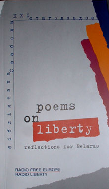

<table>
<tbody>
<tr class="odd">
<td>
</td>
<td>
<h1 id="poems-on-liberty.-reflections-for-belarus-translators-notes">"Poems on Liberty. Reflections for Belarus" 
Translator's Notes</h1>

Vera Rich, London 25.X.2003

...even I Regain'd my freedom with a sigh. 
Byron, The Prisoner of Chilian

<em>Pravapis.org editor's note: This is a preface from the book "Poems on Liberty. Reflections for Belarus," a bilinguial English-Belarusian collection of poems published by <a href="http://www.svaboda.org/">RFE/RL Belarus Service</a> in 2004 (ISBN 0-929849-05-1), the translator notes.</em>

When someone picks up a book of translations from a language he or she does not know, various questions may spring to mind. Firstly, perhaps, 'How far does this version reproduce the words of the original?' but then – on being assured that this is, indeed, a fair rendering: 'How far do those words mean to me, the reader, what the author intended them to mean to the reader?' For words carry for more than their basic meaning, and come to us with a whole penumbra of connotations and allusions, which may be vastly different in different cultures. In European tradition, dragons are beasts of ill-omen, devastating the land and devouring the innocent, until a hero – Beowulf, Siegfried or St George – comes forth to slay the monster. But in Chinese tradition, dragons symbolise good fortune and prosperity. Quite a knotty problem therefore for the translator working in either direction across such a culture gap! However, the rendering of penumbral and subliminal connotations is as important in the translation of a work of literature as is the accurate rendering of the basic sense; a good translation should present the readers not only with words corresponding to those of the original but should evoke in them the same emotional and imaginative 'atmosphere' as that experienced by readers of the original. All the more so with a book such as this which reflects the joys – and sometimes traumas – of a country newly emerged on to the map of modern Europe as seen through the eyes of more than 100 of its most perceptive citizens – the poets. For, as Byron reminds us, freedom has its 'sighs' – no less than its songs.

The translator working from Belarusian into English (or, indeed, any European language) is fairly fortunate in this respect, being able to tap into a common source of images and allusions. In particular, Belarus shares in the heritage of 'European culture', including Graeco-Roman mythology, and the Bible. (In view of the official atheism of the 70 years of communist rule the latter is particularly noteworthy; however, the poets represented here clearly feel that their audience will understand and respond to such symbols as Lucifer, Eve, Noah's flood, the Tower of Babel, Barabbas, or St Peter the 'Gate-keeper'.) Other shared images in this collection – and which may derive either from our common cultural tradition or perhaps are inherent in the human psyche – include the 'River' (= death) and the cawing of ravens as an omen of doom (cf. the margins of the Bayeux Tapestry, also 'Macbeth', Act 1, v. lines 39-41, The raven himself is hoarse/That croaks the fatal entrance of Duncan/Under my battlements.').

Likewise, the symbolic use of the diurnal and annual cycles of nature is perhaps common to all cultures outside the tropics: night/winter (= oppression) versus dawn/spring (= freedom, independence), though in Belarus, the coming of spring has an additional significance – it was on 25 March, traditionally the first day of spring, that in 1918 the (alas, short-lived) independent Belarusian National Republic was proclaimed. Similarly, the word <em>'adradzennie' –</em> 'rebirth', 'renaissance', often associated in these poems with the ideas of 'dawn' and 'spring' for a Belarusian will inevitably call to mind the 'Belarusian Popular Front <em></em> Adradzennie', the largest and most significant of the 'informal' citizens' associations which sprang up in the final years of Soviet power, and which spearheaded the drive for democracy, independence and the revival of Belarusian language and culture.

There are, however, in these poems several recurring symbols and images, whose full significance may be less obvious to the reader unfamiliar with things Belarusian. Foremost among these are the traditional flag – three horizontal stripes of white, red and white, and the coat of arms of the <em>Pahonia</em> (the Pursuing Knight), white, on a red ground. These symbols have been traditional to the area over many centuries – indeed, the <em>Pahonia</em> (under its Lithuanian name – <em>Vytis)</em> is now the state coat of arms of neighbouring Lithuania. Both flag and Pahonia were anathema to the Soviet ideologists, who condemned them as symbols of 'bourgeois nationalism'. In September 1991, they were adopted as the symbols of the newly independent Republic of Belarus, and remained so until May 1995, when they were replaced by a 'new' flag and coat of arms, based on those of Soviet times. Nevertheless, the white-red-white flag and the <em>Pahonia</em> and evocations of them (red blood on white snow, a galloping knight, a white horse) are a frequent motif in this collection.

Other historical and topographical symbols will be explained in the notes to individual poems. One recurring allusion which may seem strange to the reader new to things Belarusian is the importance of the city of Vilnia – or to give it its Lithuanian name, Vilnius. For this city is now the capital of neighbouring Lithuania, and it may seem strange that the Belarusians should have this emotional attachment to what is now a foreign city. It should be remembered, however, that for centuries the lands that are now Lithuania and Belarus formed a single state the Grand Duchy of Lithuanian-Rus and, indeed, an early form of Belarusian was the official language of that state. More recently, under the rule of the Russian Tsars, Belarus and Lithuania formed the 'North-West Territory' of that Empire and it was in Vilnia that the Belarusian literary and cultural revival of the early 20th century began. Another foreign city of major symbolic importance to Belarusians is Prague, since it was there, in 1517, that the Belarusian scholar <a href="articles/art_skaryna1.html">Francisak Skaryna</a> produced the first ever printed book in the Belarusian language – a Psalter.

However, translation is not only a matter of connotation, but also of the words themselves. And in this particular collection of poems, two words are all-important: <em>'svaboda'</em> and <em>'vola'.</em> These are, at first glance, near-synonyms – and fortunately, English can also provide two near-synonyms: 'freedom' and 'liberty'. But in neither language are the two words exact equivalent – indeed, one poem in this collection (that of Ales Cobat) actually focuses on the difference between <em>'svaboda'</em>and <em>'vola'.</em> Looking at the etymology of the two words, one finds in the first the Indo-European root <em>sva–</em> meaning 'self, while <em>'vola'</em> has a second meaning 'will'. Turning to that arbiter of the English language, the <em>Oxford English Dictionary,</em> we find among the many meanings listed for 'liberty': '3.a. The condition of being able to act in any desired way without hindrance or restraint; faculty or power to do as one likes.' Moreover, states the OED, the root meaning of the word is 'desire', cf. the cognate Sanskrit <em>lub-dhas</em> 'desirous'. For 'freedom', on the other hand, the OED definitions include: '1. ...personal liberty... 4.a. The state of being able to act without... restraint... liberty of action... 5. The quality of being free from the control of fate or necessity; the power of self-determination...' Moreover, freedom derives from a postulated Indo-European root *pri (cf. Sanskrit 'pri' to delight or endear) and is hence cognate with Modern English 'friend'. Although these definitions tend to overlap, they served to reinforce what was, from the beginning, my intuitive feeling – that <em>'svaboda'</em> should be rendered as 'freedom' and <em>'vola' as,</em> 'liberty'. This, in the main, I have done. In one or two cases, however, this was simply not possible, without going counter to terminology already accepted in English: the Prague-based radio station called <em>'Radyjo Svaboda' in</em> Belarusian is in English 'Radio Liberty', and the famous painting by Delacroix is traditionally called in English 'Liberty leading the people'.

Another cluster of words which raise particular problems in the context of this collection are the various terms for homeland <em>'Radzima', 'Backauscyna', 'Ajcyna'. 'Radzima'</em> being connected with the verb <em>'radzic'</em> – to give birth, is most appropriately rendered 'Motherland'; the other two are derived from alternative words for 'father'. However, 'Fatherland' in English carries connotations not of one's own country, but rather of the German <em>'Vaterland',</em> with, alas, the negative overtones still persisting from Prussian militarism and two World Wars. The alternative – 'Land of our Fathers' – is, to British ears, associated first and foremost with Wales; however, it does at least have more congenial and appropriate overtones – those of a small nation which has fought valiantly to preserve its identity, language and culture. The demands of prosody, and, indeed, the varying styles of the poets featured here have, however, demanded some fluidity and variation, rather than adopting one single rendering throughout.

For translating an anthology is a somewhat more complex task than rendering the works of a single author. For with one author, in spite of the variations in style and vocabulary demanded by different genres and subjects or associated with increasing maturity, one is dealing, basically, with a single idiom. In this collection, however, we have more than 100 poets, ranging from the most eminent in contemporary Belarusian literature down to those who would hardly claim to be poets at all – but who, in the name of freedom, were inspired to try their hand. If one believes, as I do, that in translating poetry one should try to render not only the sense, but also the style, then with every poem one has to make new assessments as to what the poet's own stylistic criteria were and how they should be rendered; whether the language is formal or colloquial, whether there are conscious 'poeticisms' or archaisms, current slang, or even on occasion lapses into 'politically correct' jargon.

Likewise, if one aims (as I do) to preserve the verse-form of the original, one needs to analyse the authors own style to decide what compromises may have to be made – and whether they can be justified. In general, I have tried not only to preserve the rhyme-scheme of the original, but also the distinction between 'masculine' (single-syllable) and 'feminine' rhymes. However, in some cases, there have been other, overriding considerations. Thus, in the poem of Antanina Chatenka, 'I accept Thy will, O God', it seemed more important to preserve the permutations of the opening line as it is repeated throughout the poem – even if some of the feminine rhymes of the original had to be replaced by masculine. Rhyme is, indeed, one of the major technical problems in working from Belarusian. Luckily, both English and Belarusian are amenable to 'half-rhymes' and assonances, although working on a different principle. The English ear will readily respond to a near-rhyme where the consonants agree (a prime example being the numerous hymns which 'rhyme' <em>'Lord'</em> and <em>'Word') –</em> in Belarusian, provided the <em>vowels</em> are exact echoes of each other, there is considerable latitude regarding the consonants. In these translations, I have used half-rhymes of both type – and, indeed, found the Belarusian convention particularly useful – granted that of the two key words of this collection, 'freedom' rhymes <em>exactly</em> only with the Biblical 'Edom' and 'liberty' only with 'flibberty' (as in 'flibberty-gibbet') neither of which have much relevance to the task in hand!

Other poetic 'ornaments' – alliteration, internal echoes – to say nothing of the repeated RA-syllables of Viera Burlak's poem – I have also tried to reproduce, feeling, as I do, that these effects are intrinsic to the poems. At the same time, these versions are basically line-for-line with the original, and as close as may be to the original sense. Certainly, some words are not always rendered in the same way – indeed, to do so would fail to convey the impact of the original. Consider the Belarusian word <em>'kasciol'.</em> This has the specific meaning of a Roman Catholic church. But to translate it so on every occasion would be not only clumsy, but would lose the intended impact of the original. For in Janka Lajkou's poem 'Do not weep...' <em>'kasciol' is</em> used in juxtaposition to <em>'carkva'</em> (Orthodox church) to symbolize the whole range of Christian faiths, as opposed to the 'pagoda', representing the non-Christian faiths. The best equivalent, it seemed to me, would be the traditional English contrast of 'church' and 'chapel'. On the other hand, in Michalina's poem, the <em>'kasciol'</em> referred to – that of St Anne in Vilnia – for a Belarusian immediately evokes the image of a particular jewel of Gothic architecture – and it seemed more important here to stress the building's artistic impact than its denominational allegiance. Again, in Alena Siarko's poem, with its mysterious moon-lit cemetery and the figures vanishing into the shadows: to render <em>'kasciol'</em> by 'church' would tend to give the impression that the graveyard is relatively small – like those still found beside old parish churches in England. But the <a href="http://en.wikipedia.org/wiki/Kalvaryja">Kalvaryja</a> is an extensive urban cemetery. To preserve the author's vision, therefore, it seemed better to render <em>'kasciol'</em> by the term one would use for the analogous building in an English city cemetery, namely 'chapel' – even though, due to the post-Soviet shortage of church buildings in Miensk, the <em>'kasciol'</em> in the <a href="http://en.wikipedia.org/wiki/Kalvaryja">Kalvaryja</a> is in fact being used as a Catholic parish-church. Perhaps the above discussion of a single word may seem over-lengthy and pedantic. I hope, however, that it will serve to illustrate yet again the fact that translation is – or should be – an art. Not, perhaps, as great an art as the creation of original literature, but nevertheless, not a mere mechanical reproduction.

Finally, to end on a personal note... Belarus, even now, remains largely <em>Terra Incognita</em> to most inhabitants of the British Isles – apart for the occasional appearance of Belarusian sportspersons or teams on our TV screens. Half a century ago, it was even less known (in my school geography book, as 'White Russia', it was allotted half a page!) So when, on 25 October, 1953, I first came into contact with the Belarusian community in London, it was, for me, the discovery of a new country – a country which, however, it seemed then that I would never see, except through the eyes of its writers... During those thirty eight years of what we should now term 'virtual exploration' and even more so through frequent visits during the past twelve years, Belarus, its people, and its literature have become one of the main threads in my life's tapestry...

Chaj zyvie svaboda! Chaj zyvie Bielarus!

&gt; <em>Reprinted from "Poems on Liberty: Reflections for Belarus." - Radio Free Europe / Radio Liberty, 2004. - 312 pp. Translation - Vera Rich. Editor - Alaksandra Makavik. Art Director - Hienadz Macur. Project Coordinator - Valancina Aksak. ISBN 0-929849-05-1.</em>

&gt; <em>About the book: It is an anthology of original poems broadcast on RFE/RL Belarus Service in 2001. The music of Giuseppe Verdi accompanied the voices of authors and translators as, each evening for 365 consecutive days, they wove into verse their unique and very personal insights into the meaning of liberty at the dawn of the 21st century. Poets from Belarus and five continents, ranging in age from 10 to 92, among them Nobel prize winners and artists forcd into exile, submitted their works for broadcast. This anthology consts of 122 selected poems from the original broadcasts.</em>

<a href="gb_add.html?ref=http%3A%2F%2Fwww%2Epravapis%2Eorg%2Fart%5Frich%5Ftranslators%5Fnotes%2Easp">- Write your comment</a>
</td>
</tr>
</tbody>
</table>
