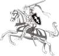

<h1 id="auld-guid-white-ruce-white-russia-the-amazing-parallels-between-belarus-and-scotland">AULD GUID WHITE RUCE (White Russia) 
The amazing parallels between Belarus and Scotland</h1>

by Ales Biely, © 1996

Belarus (in word for word translation, the White Russia or White Ruthenia) seems to be absolutely new entity on today's map of Europe. Its very existence had scarcely reached the ears of those abroad until sudden emergence of the New Independent States in 1991. It has, however, own glorious though dim history. Both in the cultural and the geographical sense, what is now known as Belarus represented a vast area of transition between Europe and Muscovy (modern Russia), an area of deep, external penetration and of weak local resources and identity. It was neither Polish nor Russian, but has never in its long career been able to determine its own destiny. Its Slav population had little sense of belonging except to the "Christian souls of these parts."

Polatsk was the most frequently mentioned Slavonic city in Icelandic sagas.

The first embryonic Belarusian state was early medieval principality of Polatsk, Belarus's oldest city, first mentioned in 862. It is believed to be founded by Norwegian Vikings to control the route to Byzantium by Western Dzvina (Dvina) and Dniapro (Dnieper) rivers and it was the most frequently mentioned Slavonic city in Icelandic sagas. The first known Prince of Polatsk, Rognvald (Rohvalad), presumably Norwegian, established a local dynasty in the end of 10th century. Shortly after that, Polatsk was conquered by Kievan prince Vladimir, famous for converting pagan Slavonic tribes of Kiev, Polatsk and Novgorod into Eastern Christianity. Nevertheless, Rohvalad dynasty most of time ruled independently of Kiev. Some members of the family were married on various European rulers, in particular, on Comnens of Byzantium, so that even Queen Elizabeth II seems to be a distant descendant of Rohvalad. Another was St Euphrosinia of Polatsk (the saint of both Orthodox and Catholic churches which was almost impossible after the Great Schism of 1054), the patron saint of Belarus. The most precious national relic was the Euphrosinia's Cross made by Polatsk jeweller Lazar Bogsza in 1161, which vanished during Nazi occupation in 1941.

Unity of Lithuanians and Belarusians implied not only common statehood but also common culture.

In 13th-14th centuries Belarusian appanage principalities were gradually taken over by Lithuanian dukes. Some contemporary historians maintain that they were not conquered by the Lithuanians, but the latter were rather mercenaries at the service of Slavic princes. Whichever is true, the unification of the Slavs and the Balts in one state - the Grand Duchy of Lithuania - was no less important for the cultural development of the latter than annexation of Lothian in 1018 for Scotland.

Unity of Lithuanians and Belarusians implied not only common statehood but also common culture. Since the middle of the 13th century, for five and a half centuries the statehood of present Belarus and its cultural life have been associated with the names  *Litva*  and  *Litvin*  (Lithuanian). Oddly enough, the names Belarus and Belarusians became fully accepted only in the second half of the 19th century. Before that only the eastern part of the country bore this name, and the whole country and people were called Lithuania ( *Litva*  in Slavic languages). It was the common name both for today's Lithuania and Belarus, as both of them used to constitute the Grand Duchy of Lithuania. The Belarusian and the Baltic Lithuanian peoples were an integrated whole.

The Belarusian language never ceased to exist, even after ban of its official use in 1699 and decades of Soviet era oblivion.

The Belarusian language allegedly originates from the same source as Russian and Ukrainian, i.e. Old East Slavic, being descended from a western form of it. However, it also contains a great many words of German, Polish and Lithuanian origin. By the early 16th century, not unlike the Scottish language, it diverged from the Old East Slavic well enough to become a separate language. What now is called "Old Belarusian" was the official language of the Grand Duchy up to the end of the 17th century and it was referred to as now Lithuanian, then Russian (Ruthenian), while present Baltic Lithuanian had no literature of its own till the end of 16th century. Official status of Old Belarusian, unprecedented extent of religious tolerance and political liberties of nobles and gentry were consolidated by the Third Lithuanian Statute (1588), which is considered to be acme of medieval Belarusian culture and is called sometimes "first written constitution in Europe." Many Poles and Russians, however, still consider Belarusian a dialect of their tongues. In some respects they are right, since a large deal of today's population of Belarus speak a strange mixture of parlances, while standard literary Belarusian is rather an attribute of intellectual elite. The percentage of people who use it in everyday life is by no means bigger than that of Gaelic-speaking community in Scotland. But it never ceased to exist, even after ban of its official use in 1699 and decades of Soviet era oblivion.

Seeking support against Russia, the Grand Duchy signed a Union of Lublin with Poland (1569), forming the Polish-Lithuanian Commonwealth.

From the very beginning, the Grand Duchy had to defend itself against strong enemies. From the West, it warded off Northern Crusades of Teutonic Knights supported by all European nations. Chaucer's perfect knight that was fighting in  *Lettow and Ruce*  testifies to the medieval unity of Lithuanians and Belarusians. From the East, the new state repelled the Mongolian conquerors who totally devastated the Russia proper where later the Muscovian state emerged. Until the end of the 18th century the border between the two relative Slavic states was the frontier between the East and the West. Seeking support against Russia, the Grand Duchy signed a Union of Lublin with Poland (1569), forming the Polish-Lithuanian Commonwealth.

In the reign of the Grand Duke Alexander (1492-1506) when incessant wars between the GDL and the Muscovy resumed after some 40 years of peace, old-fashioned Lithuanian army proved unable to resist mighty eastern neighbour, and Lithuanians were forced to hire mercenaries from all Europe. Many of them were Scots. In 1502 a scheme was laid to settle Scots, known as strong warriors, in the Belarusian and Ukrainian castles on Dnieper, devastated by the war - to defend the country from Muscovites and Turks. About the same time the first Scots appeared in the Muscovian army. From then on they fought for both sides, very frequently changing their master to the higher bidder. Famous poet of 19th century, Mikhail Lermontov, "Russian Byron," was a descendant of Scottish mercenary George Learmont who change his sides several times in wars between Polish-Lithuanian Commonwealth and Russia until he finally settled in Moscow ca. 1613.

Scottish immigration to the Grand Duchy was encouraged because in the second half of the 16th century most of influential magnates as well as many merchants and educated townspeople of the Grand Duchy became Calvinists. They hoped to oppose Reformed church both to the Catholic Poland and to Orthodox Muscovy. In a short time over 300 zbors (calvinist churches) were erected. Many young nobles studied in Amsterdam or Geneva. Later this attempt of Reformation failed, but initially it caused strengthening of relations with Switzerland, the Netherlands and Scotland.

Medieval archives contain many complaints lodged by Grand Duchy's townspeople against Scotch peddlers who came to take their trade from them. Scottish trade, however, was prosperous. A collective word for haberdashery and some other goods in the Grand Duchy was "Scotch goods." Thus, all towels and gloves, cutlery and brooms, combs and thimbles, either they were produced in Holland, Silesia or Venice, were considered "Scotch." The very word "Scot" (pronounced here as "Shot") became a synonym for peddler or petty monger in Poland and Lithuania. Nicholas Radziwill "The Orphan" who abandoned the religious stance of his family and turned into Catholicism wrote in his diary in 1583 about the Turkish peddlers whom he met during his pilgrimage to the Holy Land that they were as numerous as  *our Shots* . John Webster wrote in his play "The White Devil" (1610) of the  *fourtie thousand [Scottish] pedlars in Poland* .

Quite often they changed their names in local manner - so that, for instance, in the register of merchants of the town of Pinsk (c. 1620) four "Shots" with typically Belarusian names were listed: Tomilo Oleshkovich, Petr Shimkovich, Oleshko Okhremovich and Luca Litvinovich. Thriving Scotch colony of Slutsk was the core of local Reformist community headed by Prince Yanush Radzivil and his son Bahuslav who  *had a lyfe company all or most Scottismen* .

Scottish Romanticism of 18th century inspired many local poets, including Adam Mickiewicz.

Bagpipes until recently used to be Belarusian national peculiarity and inherent property of Belarusian folk. According to Maksimov, the Russian ethnographer of the 19th century, "they assert they began to play it in those times when their faith has changed. And as it happened at least thrice (from paganism to Orthodoxy, then to Uniate, then to Catholicism) nobody knows when did it happen." Indeed, it's hard to say exactly where did bagpipes come from. They appeared here about the 16th century and it might well have been Scots who brought them.

Scottish Romanticism of 18th century inspired many local poets, including Adam Mickiewicz, the greatest Polish poet who wrote some of his poems in Belarusian. Francisk Kniaznin, the descendant of an old Belarusian noble family, was one of the first translators of McPherson's  *Works of Ossian* . Another Belarusian, Jazep Siankouski wrote first Robert Burns biographical essay in Russian empire.

After a series of partitions of Polish-Lithuanian Commonwealth in 1772-1795 its territory has been divided between Austria, Prussia and Russia. Belarus, like Poland, Western Ukraine and  *Lithuania proper*  was seized by Czars. Four large-scale uprisings against Russian rule (1794, 1812, 1830-31, 1863-64) were ruthlessly oppressed. Many patriots had to emigrate. One of them was Felix Yanevich (his name should should originally have been spelt as "Janewicz" but he have changed the initial letter when he came to Britain in order to avoid mispronunciation), born in Vilnia about 1762, settled in Edinburgh in 1815. In that time he was almost the only professional musician in Scotland. His position was strengthened by his noble origin which meant something even in the eyes of Edinburgh Whigs. Both his daughters were musicians as well - one played piano, and another harp. Some historians say that musical parties which were held in Yanevich's house - then the only regular musical event in the whole Scotland - were the archetype of the Edinburgh music festival...

See also: 
 
- <strong><a href="articles/art_white_russia.html">Why is the Russia White</a></strong> by Ales Biely 
- <strong><a href="articles/art_belarus_nation.html">Belarus: real or fictious nation</a></strong> by Ales Biely 
- <strong><a href="articles/art_belarusian_adjective.html">"Belarusian" and "Belarusan"</a></strong> by Uladzimir Katkouski 
- <strong><a href="articles/art_belarus_name.html">21 Names of Belarus</a></strong> (How internet users misspell this name) 
- <strong><a href="articles/art_brit.html">Britannica Stumbling</a></strong> (The most scandalous blunders in Britannica's entry on Belarusian language) 

<a href="gb_add.html?ref=http%3A%2F%2Fwww%2Epravapis%2Eorg%2Fart%5Fscotland%5Fbelarus%2Easp">- Write your comment</a>

