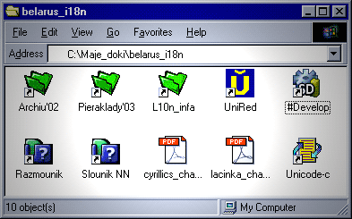

<table>
<tbody>
<tr class="odd">
<td>
</td>
<td>

<a href="articles_by.html">вярнуцца да артыкулаў</a> 
<a href="#">раздрукаваць артыкул</a> 
<a href="#english">English summary</a>

<h1 id="software-localization-in-belarus-беларуская-кампутарная-і-інтэрнэтная-тэрміналёгія">Software Localization in Belarus: 
Беларуская кампутарная і інтэрнэтная тэрміналёгія</h1>

Сяргей Шупа, Прага

Падставай для выбару тэмы стала <a href="http://www.mova.org/lists-archives/i18n/">абмеркаваньне</a>, якое ўжо ня першы месяц вядзецца ў дыскусійнай групе “і18n” – так у асяродзьдзі прыхільнікаў open source (адкрытага зыходнага коду) скарочана азначаецца паняцьце “інтэрнацыяналізацыя” – пераклад рэсурсаў на розныя мовы сьвету.

Праблемы, зь якімі сутыкаюцца стваральнікі беларускай тэрміналёгіі, я абмеркаваў з удзельнікамі дыскусіі. Мой першы суразмоўца – менскі праграміст Віталь Хілько: 
 
(Шупа: ) “Вы як прадстаўнік супольнасьці Linux акунуліся ў тэрміналягічныя спрэчкі, і якія галоўныя праблемы ўзьнікаюць?” 
 
(Хілько: ) “Менавіта стыхійна. Працэс ідзе ня зьверху, а зьнізу, натуральным чынам.

Перш за ўсё – падзяленьне грамадзтва. Гэта нават не адносіцца непасрэдна да тэрміналёгіі, але ўплывае на яе вельмі моцна. Гэта – крыніца ўсіх праблем цяпер у Беларусі. Пачынаючы ад палітычнага такога падзяленьня грамадзтва да падзяленьня паводле моўнага прызнаку – ня тое, што расейскамоўныя/беларускамоўныя, а беларускамоўныя, якія адносяць сябе да плыні клясычнага правапісу, і тыя, хто адносіць сябе да наркамаўкі. Хаця тут як бы справа ўся ў правапісе, але ідзе і значна далей. Справа не ў саміх мяккіх знаках, справа ў тым, што адны лічаць, што прыйшоўшы ў мову, яны ствараюць сабе як бы моўны палігон – бульдозэрам ідуць па мове як па нежывой істоце, хоць насамрэч мова – жывая істота і адкрытая сыстэма. 
 
Ну, скажам, калі ўзяць і ствараць свае асобныя тэрміны, не аглядаючыся ніякім чынам на іншыя мовы, то мы прыйдзем да таго, што проста ізалюем сябе звонку”. 
 
(Шупа: ) “Я паспрабую сфармуляваць, калі я слушна Вас зразумеў – прыхільнікі наркамаўкі азіраюцца на нейкія стандарты, выпрацаваныя нейкімі афіцыйнымі ўстановамі, на афіцыйныя слоўнікі і ня лічаць магчымым умешвацца ў тое, што ўжо створана зьверху, афіцыйна, а прыхільнікі клясычнага правапісу проста адчуваюць за сабой права самім ствараць мову – тое, што “наркамаўцы” дазволіць сабе ня могуць?” 
 
(Хілько: ) “Ну, не зусім так. Мне б хацелася, каб і тыя, і тыя нарэшце аб’ядналіся і зразумелі, што мова – гэта жывая істота. Паколькі мы жывем у двухмоўнай краіне, на нас вельмі моцна ўплывае расейская мова. Гэта трэба таксама ўлічваць. І калі ў гэтых умовах ствараць нейкія свае новыя тэрміны, прычым часам зусім абсурдныя, то гэта прывядзе да таго, што цябе проста ня будзе разумець іншая частка, палова, таксама беларусаў, і мы будзем гэтую мяжу паміж намі толькі паглыбляць”. 
 
(Шупа: ) “Але, спадзяюся, Вы не прыхільнік таго, каб проста беларускімі літарамі перапісваць расейскія тэрміны. А які рацыянальны шлях запрапанавалі б Вы?” 
 
(Хілько: ) “Ну, я думаю, перш за ўсё – гэта запазычаньні. Але не з азіраньнем толькі на расейскі бок ці толькі на ангельскі ці проста трансьлітэрацыя. Гэта мусіць быць у роўных прапорцыях, абдумана. А вось ужываньне ўласна сваіх тэрмінаў павінна быць толькі ў рэдкіх выпадках, калі гэта сапраўды запатрабавана. Там, дзе чалавек прайшоў – там і мусіць быць дарога. Якое слова чалавек ужывае – такое і мусіць быць. Ня мусіць быць штучнасьці”.

Гэтак лічыць Віталь Хілько. Віталь лічыць, што трэба назіраць за рэальным жыцьцём, у якім так або іначай ужываюцца кампутарныя тэрміны, і фіксаваць тое, што не выклікае пярэчаньняў. Зь ім ня згодны іншы ўдзельнік дыскусіі – Юры Тарасевіч, кампутарны спэцыяліст з Горадні. На ягоную думку, беларусы могуць і павінны стварыць сваю арыгінальную тэрміналёгію, пры гэтым моўныя пошукі мусяць быць не адвольныя і хаатычныя, а грунтавацца на добрым сыстэмным веданьні сэмантычных і словаўтваральных мадэляў беларускай мовы. Гаворыць Юры Тарасевіч:

i18n + l18n +l10n + mova.org 
Software Localization in Belarus

(Тарасевіч: ) “Спачатку павінны быць вядомыя правілы. І толькі тады можна брацца за асэнсаваньне ангельскіх тэрмінаў і за перавод іх у беларускую форму. Найперш павінна мецца сыстэма. І толькі тады можа адбывацца свабодная творчасьць масаў”. 
 
(Шупа: ) “Добра, я Вам такі прыклад прывяду: у Літве над тэрмінамі працуюць афіцыйныя ўстановы, на ўзроўні ўраду, і пасьля гэтыя тэрміны зацьвярджаюцца Камісіяй Літоўскай Мовы. Нядаўна быў прыняты шырокі сьпіс кампутарных тэрмінаў, прадпісаных для ўжытку. З гэтых тэрмінаў усе літоўскія кампутаршчыкі сьмяюцца і ніхто не зьбіраецца іх ужываць, таму што яны для іх выглядаюць абсурдна. А яны пабудаваныя абсалютна рэгулярна паводле лінгвістычна вывераных правілаў пабудовы тэрміналёгіі, значэньня, адчуваньня той сыстэмнасьці, пра якую Вы казалі. І яны абсалютна непрыдатныя для ўжытку, бо людзі ўжо ўжываюць тое, што ўжываюць. Чыста літоўскія абсалютна правільныя, дакладныя тэрміны, і ... яны выглядаюць сьмешна”. 
 
(Тарасевіч: ) “Нават у тым выпадку, калі б гэта было ім сьмешна, у нас усё роўна сытуацыя вельмі катастрафічна іншая. Такога масіву, такой колькасьці носьбітаў мовы, у тым ліку прафэсійных, прафэсіяналаў, прадметнікаў у нас усё роўна няма. Нам, як кажуць, няма ніякага значаньня – ці будзе з нас хто сьмяяцца, ці не. Лепш сказаць – пытаньне пра тое, ці будзе з нашых тэрмінаў хто сьмяяцца, ці не – яно наагул не стаіць. Таму што па-за тымі, хто зараз займаецца, бадай што гэтая тэма нікога і не цікавіць. А так званы гіпатэтычны карыстальнік – напрыклад, у дзяржаўнай або навучальнай установе – ён ня будзе сьмяяцца, ён або будзе карыстацца, або не”. 
 
Мой наступны суразмоўца – актыўны насельнік беларускага Інтэрнэту Ўладзімер Каткоўскі, сярод іншага – гаспадар вядомага сайту <a href="http://www.pravapis.org/">pravapis.org</a>, прысьвечанага пытаньням беларускай мовы. 
 
(Шупа: ) “Вы ўжо гадоў дзесяць назіраеце за Інтэрнэтам наагул – як выглядае дынаміка пашырэньня беларускай мовы ў Інтэрнэце? Што наагул можна сказаць пра асаблівасьці беларускай мовы – хоць бы пра тое, які варыянт беларускай мовы ўжываецца – тарашкевіца, наркамаўка – у якіх прапорцыях гэтыя варыянты суіснуюць у Інтэрнэце?”

(Каткоўскі: ) “У мяне такое адчуваньне, што беларуская мова ў Інтэрнэце існуе ў значна большай ступені ў сваім клясычным правапісе. Маладымі людзьмі, якія размаўляюць па-беларуску, наркамаўка разглядаецца як старая, нягнуткая сыстэма, ненатуральная можа нават, а як жывая мова, нешта такое вельмі натуральнае – гэта якраз клясычны правапіс Тарашкевіча. 
 
З другога боку, ёсьць і цэлы шэраг праблем. Ужо доўгі час нам абяцаюць, што будзе сучасная, нармалізаваная граматыка тарашкевіцы, але пакуль яе няма і таму тыя, хто цяпер карыстаецца тарашкевіцай – яны фактычна свайго кшталту анархісты. Кожны думае, што можа выдумляць свае ўласныя словы ці выкопваць нейкія вельмі старыя словы і ўводзіць іх ва ўжытак, ужываць нейкія цікавыя незвычайныя формы. Таму з праграмным забесьпячэньнем, зь Інтэрнэтам атрымваюцца дзьве супрацьлеглыя групы – адныя вельмі старыя стандарты, калькі з расейскай, але ўсё паводле правілаў, усё нармалізавана – гэта наркамаўка, а з другога боку – тыя, хто любіць займацца словатворчасьцю, любіць нешта арыгінальнае, нешта такое незвычайнае – гэта тая група, што карыстаецца тарашкевіцай”. 
 
(Шупа: ) “І які тады аптымальны шлях стварэньня тэрміналёгіі – кампутарнай, інтэрнэтнай – з улікам усіх гэтых розных пазыцыяў, часам супярэчных адна адной?” 
 
(Каткоўскі: ) “Самае галоўнае ўсё ж – стварыць менавіта слоўнік. І сапраўды неістотна – зь мяккімі знакамі ці без, будзе наркамаўскі слоўнік ці тарашкевічны – галоўнае, каб была гэтая тэрміналёгія. Гэта вялікая праца і гэта галоўная праца, зь якой трэба пачынаць”. 
 
(Шупа: ) “Але як гэтую базу фармаваць? Адкуль браць словы? Прыдумляць з галавы, ці браць тое, што ўжываецца рэальна? Ці запазычваць?” 
 
(Каткоўскі: ) “Ёсьць людзі, якія гэта ўвесь час абмяркоўваюць, так што ёсьць рэчы, якія сапраўды ўжо ўжываюцца і прыжыліся. Патрэбны інтэгральны падыход. Так што ў першую чаргу гэтыя рэчы браць, потым – калі магчыма стварыць добрыя беларускія словы, якія сапраўды будуць зразумелыя людзям – то калі ласка. Калі ёсьць, напрыклад, вельмі натуральнае слова, якое зразумее кожны беларус, то калі ласка, карыстайцеся гэтым словам. Хоць яно і будзе абсалютна новае, хоць яно і будзе створанае ў 2003 годзе”. 
 
(Шупа: ) “Супраць запазычаньняў нічога ня маеце?” 
 
(Каткоўскі: ) “Асабіста я – не, але я лічу, што гэта ня вельмі пазытыўная зьява, так што калі можна іх пазьбягаць, то лепш іх пазьбягаць. А то гэта атрымоўваецца фактычна такая псэўдаангельская мова, арго, слэнг праграмістаў, які разумеюць толькі яны”. 
 
Усіх праблем, зьвязаных з тэрміналёгіяй, мы сёньня, вядома ж, нават не пасьпелі б і пералічыць. Аднак адна зь іх відавочна стрымвае разьвіцьцё тэрміналёгіі – гэта праблема супрацьстаяньня правапісных сыстэмаў беларускай мовы. Як засьведчыла нядаўняе прыняцьце Акадэміяй Навук удакладненяў да афіцыйнага беларускага правапісу, да пагадненьня суперных бакоў у гэтым пытаньні яшчэ далёка. А тым часам жыцьцё ідзе далей, мы працуем з кампутарамі, выходзім у Інтэрнэт і нейкім чынам усё называем і пры гэтым разумеем адзін аднаго.

English summary: This is a review article about software localization issues in Belarus. RFE/RL journalist Siarhiej Shupa has interviewed three developers involved with some localization projects in Belarus: Vital Khilko, Jury Tarasievic and Uladzimir Katkouski. The major problem which was mentioned by all participants of the discussion is, of course, the absence of the standardized computer-specific terminology in modern Belarusian language. Also the conflict between the two orthographies (classical form and the reformed Soviet version) has caused a major division among Belarusian software localization specialists. The three approaches to creating new computer vocabulary are: to create new original words based on linguistic principles, to use more loan words (predominantly English or English via Russian), to identify those words that are already used by the Belarusian-speaking computer users. There is no agreement as to which strategy would be optimal for the Belarusian language.

Copyright © 2003. RFE/RL, Inc. Reprinted with the permission of Radio Free Europe/Radio Liberty, 1201 Connecticut Ave., N.W. Washington DC 20036. www.rferl.org

See also / Гл. таксама: 
 
- <strong><a href="articles/art_netspeak.html">netspeak</a></strong> - жывая мова беларускага сеціва; 
- <strong><a href="http://www.svaboda.org/programs/internet/2003/04/20030413142242.html">svaboda.org/internet...</a></strong> - арыґінальны артыкул з сайту РС; 
- <strong><a href="http://www.i18nfaq.com/">i18nfaq.com/</a></strong> - i18n FAQ (in English); 
- <strong><a href="http://belarussoft.euro.ru/">belarussoft.euro.ru</a></strong> - 50+ кампутарных праґрамаў па-беларуску; 
- <strong><a href="http://softblr.narod.ru/">softblr.narod.ru</a></strong> - таксама софт па-беларуску; 
- <strong><a href="http://www.google.com/webhp?hl=be">google.com/?hl=be</a></strong> - інтэрфэйс Google па-беларуску; 
- <strong><a href="http://mova.org/lists/listinfo/i18n">mova.org/lists/listinfo/i18n</a></strong> - рассылка i18n. 

<a href="gb_add.html?ref=http%3A%2F%2Fwww%2Epravapis%2Eorg%2Fart%5Fsoftware%5Flocalization%2Easp">Напішыце водгук // Write your comment</a>
</td>
</tr>
</tbody>
</table>
