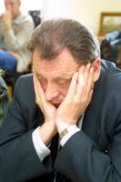

<table>
<tbody>
<tr class="odd">
<td>
</td>
<td>

<a href="articles_by.html">вярнуцца да артыкулаў</a> 
<a href="#">раздрукаваць артыкул</a> 

English summary: According to the independent linguists the new 3rd edition of the Soviet Krapiva's Belarusian-Russian dictionary which came out in 2004 is virtually identical to the second edition (1989). The first edition came out back in 1962. For political reasons the third edition does not include such widespread, well-known words as "fatel" (armchair), "viecharyna" (party), "impreza" (organized event, party, performance). The word "spadar" (mister) is also not included into this Soviet dictionary. The official linguists of the Belarusian Academy of Sciences seem to be stuck in another era, 50 years ago.

<h1 id="беларуска-расейскі-слоўнік-крапівы-3-е-выданьне">Беларуска-расейскі слоўнік Крапівы, 3-е выданьне</h1>

Валянціна Аксак

 "Замацаваньне савецкасьці беларускае мовы", — менавіта так ацэньваюць мовазнаўцы, навукоўцы і практыкі, новае перавыданьне беларуска-расейскага слоўніка, якое днямі зьявілася ў кнігарнях краіны.

“Беларуска-рускі слоўнік. Рэдактар акадэмік АН Беларусі К.К. Атраховіч (Кандрат Крапіва). Выданьне 3-е, папраўленае і дапоўненае. Пад рэдакцыяй акадэміка НАН Беларусі А.І.Падлужнага”. Так складальнікі і выдаўцы рэпрэзэнтуюць выданьне, якое некаторыя журналісты ўжо пасьпелі ацаніць як значную прагрэсіўную працу акадэмічных мовазнаўцаў, якія, маўляў, улічылі ўвесь новы лексычны набытак роднае мовы за апошнія 15 гадоў, зьвязаных з усталяваньнем Беларусі як сувэрэннае самастойнае краіны.

А вось як дух і літару перавыдадзенага слоўніка ўспрыняў знаны мовазнаўца, аўтар папулярнае кнігі “Культура мовы” прафэсар Гарадзенскага ўнівэрсытэту Павал Сьцяцко:

(Сьцяцко: ) “Дык там паказана, што паводле выданьня 1988–89 гадоў, якое было другім. Гэта трэцяе выданьне — першае было ў 1962-м. Трэцяе паводле другога. Нічога ў ім не зьмянілася, толькі дабаўлена, што трэцяе выданьне пад рэдакцыяй акадэміка Падлужнага. Ну дык пры чым тут Падлужны, калі захавалася ўсё тое, што было і пры Крапіве?”

Дзеля ілюстрацыі свайго меркаваньня пра замацаваньне слоўнікам саветызаванае ў мінулым лексыкі беларускае мовы прафэсар Сьцяцко прыводзіць шмат канкрэтных прыкладаў, некаторыя зь якіх выглядаюць проста анэкдатычна:

(Сьцяцко: ) “Я паглядзеў: там і “бяседа”, і “субяседнік” — усё тое, што было. У нас жа цяпер субяседнік — гэта сабутэльнік, а не суразмоўца”.

Перавыданьне ня спраўдзіла спадзяваньняў і практыкаў. Вядомы перакладнік кандыдат філялёгіі старшыня Беларускага ПЭН-Цэнтру Лявон Баршчэўскі кажа, што беларуска-расейскі слоўнік патрэбны тым, хто імкнецца пашырыць беларускую літаратуру ў асяродках расейскамоўных чытачоў. Аднак, карыстаючыся гэтым слоўнікам, яны ня змогуць ня толькі якасна перакласьці твораў сучасных беларускіх пісьменьнікаў на расейскую мову, але часам нават і зразумець іх.

(Баршчэўскі: ) “Спадар Падлужны спэцыфічна разумее мову і ейныя працэсы. І гэта, адчуваецца, ягоная рука, калі ён у прадмове напісаў, што яны сьвядома не ўключалі ў слоўнік такіх словаў як “фатэль”, “вечарына”, “імпрэза”. Я дадам ад сябе — няма там слова “спадар” і іншых сучасных актыўных словаў. Маўляў, яны не падабаюцца самому спадару Падлужнаму. Ну, але мне вельмі цяжка ўявіць, як будзе перакладаць расейскі перакладчык творы Ўладзімера Арлова, Андрэя Хадановіча і шмат каго іншых, у якіх гэта звычайныя словы, якія пастаянна ўжываюцца. І ў гэтым сэнсе я лічу, што гэта палітызаваны падыход да мовы. Для акадэміка мовазнаўства гэта нават неяк і непрыстойна”.

Спадар Сьцяцко параўновае гэтае выданьне акадэмічнага інстытуту зь яшчэ адным, якое аналягічна замацоўвае савецкія моўныя рэаліі:

(Сьцяцко: ) “Гэта тое самае, што яны зрабілі ў гэтым аднакнігавым тлумачальным слоўніку. Ну, унесьлі сучасныя новыя словы, якія супольныя з расейскай мовай. Але ў астатнім там яны паўтарылі ўсё савецкае, усе савецкія моўныя рэаліі”.

Таму, гаворыць прафэсар Сьцяцко, незалежныя мовазнаўцы павінны шукаць шляхоў для хутчэйшага выданьня альтэрнатыўнага беларуска-расейскага слоўніка, складаньнем якога займаецца група навукоўцаў. Але такі слоўнік — не асноўны цяпер клопат. На думку спэцыялістаў, сучасны стан беларускае мовы вымагае ад навукоўцаў зусім іншае працы і іншых падыходаў да сучасных моўных працэсаў. Суцэльнае панаваньне расейскае мовы ва ўсіх амаль сфэрах жыцьця краіны вымагае ў першую чаргу выданьняў, скіраваных на беларусізацыю грамадзтва, — гаворыць прафэсар Сьцяцко.

(Сьцяцко: ) “Я думаю, што трэба нам выдаваць якраз не беларуска-расейскі, а расейска-беларускі слоўнік. У тым сэнсе, што людзі будуць ісьці ад расейскай мовы і будуць бачыць сучасныя адпаведнікі беларускія. З гэтага, я думаю, пачынаць трэба, з гэтага варыянту. Найбольш карыстаюцца гэтым варыянтам, а потым глядзяць, як там будзе: “узбудзіць крымінальную справу” ці “завесьці крымінальную справу”, ці што іншае ў перакладзе з расейскае “возбудить” штосьці”.

Старшыня ПЭН-Цэнтру Лявон Баршчэўкі гаворыць пра яшчэ адзін неадкладны клопат беларускіх мовазнаўцаў:

(Баршчэўскі:) “У маленькай Літве, у якой чатыры мільёны жыхароў, усё ж яны рэгулярна кожны год выпускаюць чарговы том капітальнага слоўніка літоўскай мовы. Слоўніка, у які ўключаны без аўтарытэтаў, без прэфэрэнцыяў пэўных там людзей з інстытуту мовазнаўства ўсё, што на літоўскай мове зафіксавана, — дыялектныя словы, навуковая тэрміналёгія і іншае. І нашаму інстытуту мовазнаўства трэба было б распачаць выпуск капітальнага слоўніка беларускае мовы, які б ахапіў паўмільёну ці нават мільён словаўжываньняў. Калі гэтага цяпер не пачаць, то гэта ніколі й ня будзе скончана. Я разумею, што гэта праца вялікая, разумею, што трымаюць на галодным пайку гэты інстытут, але не рыхтаваць гэтай працы нельга, бо гэта не апраўдвае існаваньня самога Інстытуту мовазнаўства”.

А яшчэ Лявон Баршчэўкі гаворыць, што сучасным беларусам, асабліва моладзі, вельмі не хапае капітальных ангельска-беларускага і беларуска-ангельскага слоўнікаў. Бязь іх выхад на Захад любое галіны незалежнага беларускага жыцьця немажлівы. Ня кажучы ўжо пра пераклады на ангельскую мову найлепшых твораў сучаснае беларускае літаратуры. Пра тое, аднак, у акадэмічным інстытуце ніхто цяпер ня дбае. Прыярытэты там ня тыя.

<em>Copyright © 2004. RFE/RL, Inc. Reprinted with the permission of Radio Free Europe/Radio Liberty, 1201 Connecticut Ave., N.W. Washington DC 20036. www.rferl.org. Reprinted from www.svaboda.org - Belarusian Service RFE/RL</em>

See also / Гл. таксама: 
 
- <strong><a href="articles/art_language_reform1.html">"Правапіс трохі абеларусіцца"</a></strong> - Кірыла Пазьняк 
- <strong><a href="articles/art_letter_monument.html">У Полацку будзе помнік Ў</a></strong> - паводле BelaPAN 

<a href="gb_add.html?ref=http%3A%2F%2Fwww%2Epravapis%2Eorg%2Fart%5Fsoviet%5Fdictionary%2Easp">Напішыце водгук // Write your comment</a>
</td>
</tr>
</tbody>
</table>
