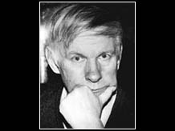
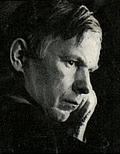

<table>
<tbody>
<tr class="odd">

<td>
<h1 id="vasil-bykau.-rip">Vasil Bykau. RIP</h1>

<strong>19.06.1924 – 22.06.2003</strong>

<strong>Y</strong>esterday evening I received tragic news from Minsk. Vasil Bykau passed away. His heart stopped at 20:10 on June 22, 2003.

Vasil Bykau was considered by many to be the greatest living writer of Belarus, and according to the Nobel Committee members, Bykau's candidacy was at some point considered for the Nobel Prize in literature. In spite of the pressure from the Lukashenka's regime, many journalists even in the state-run media still referred to him as <em>"conscience of the nation."</em> Precisely because of this pressure from the regime Vasil Bykau had to leave his native Belarus. For several years, he's been living in different countries in Europe: first in Finland, then in Germany and in Czech Republic.

He was born on June 19th, the same day as me. I've been aware of the coinciding date ever since I was a teenager, but with every passing year, as I was growing up, this coincidence was becoming ever more important and dear to me. I would always raise my second toast for Vasil Bykau (the first one being reserved for my parents), and deep inside I would think that I wanted to be just like him.

There is something deeply and mysteriously symbolic in the date of his death. Most of his life he was writing about World War II, and he died on June 22nd, the day when Nazi Germany attacked Belarus and USSR. This is the date that Russians consider the starting date of the Great Patriotic War.

It is also deeply symbolic that he died in Belarus, on his native land, not somewhere in a refuge. Last year, after living for quite a while in Germany, Vasil Bykau was invited personally by Vaclav Havel to come live in Czech Republic. He moved to Prague and there Czech doctors diagnosed him with cancer and performed surgery to remove cancer from the stomach, but the fatal disease had already spread to other organs, including the liver. Shortly after being released from the hospital Vasil Bykau made the decision to return back to Belarus. I was told he had a return ticket to Prague for the 6th of July, but I have this suspicion that he was returning to Belarus to die. Upon return to Minsk he was staying in Baraulany, a cancer treatment facility in the Minsk suburbs. My friends have attempted to visit him on the day of his birthday, just three days before his death, but the relatives have not let the visitors in, only the closest friends or famous fellow-writers that came to say the last farewells.

To my regret, I have never seen Vasil Bykau in person, but I had a telephone conversation with him over a year ago (on 2002-05-05 20:20:00 according to my blog). Invited by the German PEN-Center, Vasil Bykau was staying in Frankfurt-am-Main, and at that point I was also working there. That was his last day in Frankfurt, and he was going to a small town near Berlin the next morning. So I was very lucky, catching him home literally at the last moment. This was such a nice conversation! I have told him, perhaps, not very coherently and too excitedly, that I am a great fan of his work and that I've read virtually everything. Then we talked a bit more personally, about his recordings at the Radio Free Europe in Prague, where I used to work for a little while. I've asked him for a permission to make him a website in the future, he did not mind it at all. Unfortunately, I have never done that, and today it only makes me feel more unworthy and distressed.

Belarusian version of Radio Free Europe's website (www.svaboda.org) was updated on Sunday, which has never happened before. Late yesterday night the journalists called Bykau's friends and fellow-writers. Valancin Taras, writer and translator, was one of the very last visitors. He said: <em>"I don't know where to start. I am suffocating with tears. The sorrow is suffocating me. The only relief in this is the knowledge that it's not only my sorrow, but the sorrow of all of Belarus... He told me to translate into Russian his last book "Long Way Home." I will do this, I will do this with all my might, I will do the best job any translator can possibly do. Eternal honor and remembrance to Vasil Bykau!"</em>

Uladzimir Arlou, fiction writer and historian, said: <em>"I can't remember when I first learned Vasil Bykau's name. It seems it has been forever known to me. But I have truly discovered Bykau after reading "Sign of Misfortune," one of the most significant works in modern Belarusian literature. ...I have last talked with Bykau in the beginning of June, when he returned to Belarus. I was truly amazed how much he still read, and how sharp his brain was, and that his heart was still beating for Belarus, until the last day. I asked him the permission to renovate his house in the village of Uszaczy, but he said - don't do it because they will burn it down. I really hope that our prophet was wrong on this last prophecy. Now I really want to make sure that this house turns into a beautiful memorial place... Right this very moment, I have an open book on my table - "Long Way Home" by Vasil Bykau - on page 283. And that's when I learned that his way home is over. This is painful and sad that it did not happen later. But it is symbolic that he died on his native soil. The fact that the Belarusian soil has claimed him back is more important than any formal awards."</em>

There were many other prominent figures who today remember Vasil Bykau. Even president Lukashenka, quite unexpectedly, made a short speech in commemoration of Vasil Bykau and forwarded a personal letter to the relatives. Besides, even Ministry of Defense issued a special statement. Belarusians abroad are also shocked by his death. Vitaut Kipel, prominent Belarusian activist in New York, said: <em>"...Our immigration called him "conscience of the nation," and we really meant it, it was not a cliche. He was the man who went through the whole war, and was capable of seeing positive and negative on the both sides, he saw people on each side of the front line, and that's why he ended up where he did."</em> Ivonka Survila, BNR president of our government-in-exile, said: <em>"Twice I've met him in Prague, and both times I was so excited by meeting him! It was really painful to receive the news of his death... I've lost the person whom I loved and respected deeply. We lost the most prominent Belarusian writer of the 20th century. The Belarusian nation is now left orphan. We will always remember you."</em>

Accidentally, the last interview of Vasil Bykau was also for the Radio Free Europe, and his last words of that interview were: <em>"Treba zmahacca za rodnuju movu."</em> (You have to fight for your native language.)

His first story was published in 1951 and was called <em>Smierc czalavieka</em> (The Man's Death). Since the very beginning the soldiers of the World War II became the main antagonists of his works. In the 1960's and 1970's his war books were popular all over the former Soviet Union: <em>Trejciaja raketa</em> (The Third Rocket), <em>Alpijskaja balada</em> (The Alpine Ballad), <em>Sotnikau</em> (Sotnikov), <em>Vouczaja zhraja</em> (Pack of Wolves), <em>Miortvym nie balic</em> (Dead Ones Feel No Pain), <em>Dazyc da svitannia</em> (Live until Dawn). Millions of copies were sold all over former USSR.

Since he turned to anti-Bolshevik themes in 1990's, the government of Lukashenka started building up pressure on him. The collection of short stories <em>Sciana</em> (The Wall) about the war and Stalin's repressions was banned from publishing in a state publishing house, and was later published privately after the readers donated the money for its publication. His last published book was <em>Vauczynaja jama</em> (The Wolfe's Hole) a tragic story about the life of a runaway soldier in the no man's land, the forbidden 30-km Chernobyl zone.

Several weeks ago Vasil Bykau has finished writing his last book <em>Douhaja daroha dadomu</em> (Long way home), an autobiography.

Although his books were translated in many languages, I think he never was fully understood by the foreign reader, perhaps, not even the Russian readers. Why? Bad translations. I believe, the most important reason why Vasil Bykau never got a Nobel Prize, is the mediocre translators. Most of the English translations that I've seen were done by the Soviet translators, and not even from the original in Belarusian, but from Russian translations. No wonder, there is very little available offline and online. If you browse through the largest online bookstore <a href="http://www.amazon.com/exec/obidos/redirect-home/belarusianlan-20">amazon.com</a> - you will see that there are very-very few of his books available, and even those that are listed there are often times marked as "out of print", "not available", "out of stock", "limited availability." (you can see the list below, of what I could find after an exhaustive search). What's even more alarming – the two major online bookstores in Minsk (oz.by and rodina.by) offer only <a href="http://oz.by/books/more105936.html?partner=pravapis">Russian</a> version of his books, and nothing in the original language.

This is a sad day for Belarus.

by Uladzimir Katkouski 
23.06.2003

 Some of his books in English: 
 
- Vasil Bykau <a href="http://www.amazon.com/exec/obidos/ASIN/0898640490/belarusianlan-20">Sign of Misfortune</a>, Hardcover, price from $7.11 
- Vasil Bykau <a href="http://www.amazon.com/exec/obidos/ASIN/0690041144/belarusianlan-20">Pack of Wolves</a>, Hardcover, price from $3.90 
- Vasil Bykau <a href="http://www.amazon.com/exec/obidos/ASIN/0525171959/belarusianlan-20">The Ordeal</a>, Unknown binding, price from $9.00 
- Vasil Bykau <a href="http://www.amazon.com/exec/obidos/ASIN/0525171924/belarusianlan-20">Ordeal</a>, Hardcover, price from $7.99 
- Vasil Bykau <a href="http://www.amazon.com/exec/obidos/ASIN/0702216054/belarusianlan-20">His Battalion &amp; Live Until Dawn</a>, Hardcover, price from $129(?) 
- Vasil Bykau <a href="http://www.amazon.com/exec/obidos/ASIN/2226001131/belarusianlan-20">Sotnikov</a>, Unknown binding, Out of Print (?) 
- L. Lazarev <a href="http://www.amazon.com/exec/obidos/ASIN/5050006856/belarusianlan-20">V. Bykov on Craftsmanship</a>, Unknown binding, Not available 

Related links: 
 
- <a href="http://bykau.by.ru/">bykau.by.ru</a> - Website devoted to Vasil Bykau (in Belarusian, English, Russian); 
- <a href="http://archive.tol.cz/apr00/lynchlang.html">tol.cz/apr2000...</a> - "The Lynching of a Language" interview with Vasil Bykau from 2000; 
- <a href="http://www.belarus-misc.org/writer/bykau-kipel.htm">belarus-misc.org/bykau</a> - Translating Bykau's works into English and other languages; 
- <a href="http://txt.knihi.com/bykau/rana-eng.html">knihi.com/bykau/rana</a> - Vasil Bykau "An Unhealing Wound"; 
 

<a href="gb_add.html?ref=http%3A%2F%2Fwww%2Epravapis%2Eorg%2Fart%5Fvasil%5Fbykau%2Easp">- Write your comment</a>
</td>
</tr>
</tbody>
</table>
