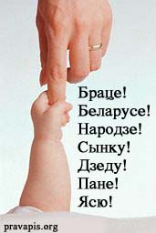

<h1 id="клічны-склон-у-беларускай-мове">Клічны склон у беларускай мове</h1>

паводле А.І.Наркевіча

 ** 

Вашай увазе прапануюцца вытрымкі з артыкула Аркадзя Наркевіча, які быў надрукаваны ў энцыкляпэдыі "Беларуская Мова" (Менск:1994). Гэтая он-ляйн вэрсія трохі скарочаная. Адзіная істотная розьніца палягае ў тым, што паводле клясычнай традыцыі мы разглядаем клічную форму як поўнавартасны склон, а не нейкую асаблівую форму дзеяслову ў "клічнай форме", як гэта падаецца ў наркамаўскіх падручніках ды энцыкляпэдыях. Таксама выкасаваны сказ, дзе Наркевіч разважае пра неіснуючы "агульнарускі пэрыяд усходнеславянскіх моваў".

Уладзімер Каткоўскі

Клічная форма — гэта асобная склонавая форма назоўніка, якая захавалася ў сучаснай беларускай мове і ўжываецца для выражэньня асобы пры звароце. Ва ўсходнеславянскіх мовах яна чатскова выцясьнялася назоўным склонам. У расейскай літаратурнай мове клічная форма амаль не захавалася, і толькі ў паасобных гаворках сустракаюцца формы кшталту  *Ванько, папо, старче*  альбо адпаведныя энклітычныя ўтварэньні кшталту  *мам, Мань, пап* . Што датычна беларускай ды ўкраінскай моваў, то гэтая форма сустракаецца ня толькі ў дыялектах, але і ў літаратурных творах. Напрыклад:  *"Гэй, гэй, <strong>хлебаробе</strong> мазольны, пан сошкі, і коскі, і поля!"*  (Янка Купала);  *"Лепш змагацца вольным, <strong>браце</strong>, чым цярпець і гнуцца"*  (Якуб Колас). Параўнайце аналягічныя прыклады з украінскай мовы:  *"Яка ж ти красна, яка велична, <strong>земле</strong> моя!"*  (А. Даўжэнка);  *"<strong>Учителю</strong>, стою перед тобою малий, вчарований до німоти"*  (Дз. Паўлычка).

Зь іншых славянскіх моваў клічная форма захавалася ў польскай (panie, boz*e, chlopcze, czlowiecze, sasiedzie, gosciu, matko, glowo, ziemio), чэскай (pane, kluku, hrade, kvitku, muz^i, chlapc^e, z^eno), сэрба-лужыцкай (knjez*e, holc^e, dubo, kluc^o), баўгарскай (докторе, професоре, сестрице, гражданино, Иване, соколе, брате, народе, вълко, бабо, мамо, приятелю, коню), сэрбахарвацкай (народе, жено, судиоэ) ды іншых мовах. 

У сучаснай беларускай мове ў клічнай форме пераважна выступаюць уласныя й агульныя асабовыя назоўнікі мужчынскага роду, радзей назоўнікі, якія абазначаюць іншых істотаў — жывёлаў, птушак, насякомых, паўзуноў (часьцяком у фігуратыўным сэнсе), а таксама неадушаўлёныя назоўнікі ў сваім непасрэдным значэньні альбо калі яны ўжытыя ў значэньні адушаўлёных. Напрыклад:  *"Мой <strong>дружа, Чэсю,</strong> верны дружа мой"*  (А.Зарыцкі);  *"А скажы мне, <strong>дзеду</strong> любы, чаму так на сьвеце стала, што адным даецца мала, а другому — аж да губы?"*  (Якуб Колас);  *"Сьмялей, <strong>беларусе</strong>-араты! Сьмялей уздымай к сонцу вочы"*  (Янка Купала);  *"Папаўся, <strong>жучку</strong>, у панскую ручку"*  (Кандрат Крапіва);  *"<strong>Гаю</strong>, мой, <strong>гаю, гаю</strong> зялёны, што ж ты ня йграеш?"*  (К.Буйло).

У залежнасьці ад характару асновы назоўнікаў клічная форма можа сканчвацца на розныя галосныя. Так, пры аснове на цьвёрдыя зычныя альбо на ў нескладовае клічная форма скончваецца звычайна на <strong>-у (-ю)</strong> альбо <strong>-е</strong> з чаргаваньнем адпаведных цьвёрдых і мяккіх канцавых зычных асновы ( *дзеду, саколю ці саколе, Іване, Ігнаце, Вацлаве, сыне, браце, пане, голубе, громе, лесе* ), пры асновах на зацьвярдзелыя ды заднеязычныя — галоснымі <strong>-у, -а</strong>, альбо <strong>-о</strong>, нярэдка з чаргаваньнем зычных у аснове ( *гаспадару, званару, грабару, ветру, вужу, чытальніку, сынку, каханку, дударыку, жучку, хлопчыку, нябожа, чалавеча, бядача, казача, малойча, украінча, хлопча ці хлапчо, Пятро* ), пры аснове на мяккія зычныя і j [й] кароткае — галоснымі <strong>-ю, -е</strong> ( *Чэсю, Ясю, Мікалаю і Мікалае, дабрадзею, коню, гаю, краю, вынятак князь — княжа* ). Напрыклад:  *"Узьнімайся, <strong>народзе</strong> мой, на вялікую расплату!"*  (Янка Купала);  *"Эх, лес цёмнакудры, мілы мой <strong>лесе</strong>, удумныя дрэвы, зялёныя шаты, мой брат ты!"*  (Якуб Колас);  *"На твой зоў магутны цеснай грамадою хутка ўсе зьбяруцца... Не прасьпі, <strong>званару</strong>!"*  (Цішка Гартны);  *"Зайграй, зайграй, <strong>хлопча</strong> малы, і ў скрыпачкі, і ў цымбалі"*  (Паўлюк Багрым);  *"Ты ляці, ляці, <strong>саколе</strong>, здабываць радзіме волю, у бой ляці, казача"*  (К. Буйло);  *"<strong>Ясю</strong> мой, з вайны вяртацца час"*  (А. Зарыцкі);

У пэўных беларускіх гаворках, пераважна паўднёва-заходняга моўнага арэалу, адзначаюцца выпадкі ўжываньня клічнай формы пры выражэньні звароту ў назоўніках жаночага роду і агульнага роду на -а, -я. Напрыклад: мамо, Сашо, Марыно, Манё (ва ўсіх пералічаных выпадках з націскам на першы склад).

У мове твораў мастацкай літаратуры клічная форма выкарыстоўваецца звычайна з мэтай стылізацыі ды адыгрывае моўна-выяўленчую ролю.

Літаратура:

<ul>
<li>Граматыка беларускай мовы. Т.1. Марфалёгія. Мн., 1962;</li>
<li>Жыдовіч М.А. Назоўнік у беларускай мове. Ч.1. Адзіночны лік. Мн., 1969;</li>
<li>Наркевіч А.І. Назоўнік: Граматычныя катэгорыі і формы. Мн., 1976</li>
<li>Граматыка беларускай мовы. Т.1. Марфалёгія. Мн., 1985;</li>
</ul>

