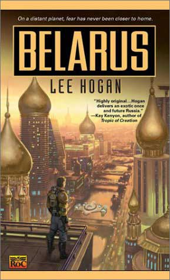

The only thing that this book has in common with the real country called Belarus is the title. That's it. Lee Hogan should've done her homework first. While reading the book I had the nagging thought that Lee Hogan is like a cyber squatter who steals someone else's Internet domain and exploits it in bad faith. Let me try to put the stolen jewel back where it belongs...

«Hogan delivers an exotic once and future Russia,» I read on the cover of the paperback edition. It is clear from the outset that when Hogan writes «Belarus» she actually means «the new Russia» (in the remote future). This is the most painful misconception of the book.

Although Western culture, book printing and new technological advances historically came to Russia through Belarus, ever since the fifteenth century Muscovy almost continuously waged bloody wars against the lands of what is now known as Belarus.

- Moscow ravaged Belarus in 1492-1494, 1500-1503, 1507-1508, 1512-1522.

- During Ivan the Terrible's reign in the 1560s on average 500-1000 Belarusians were killed every day.

- In 1654-67 during the 13-year war the Russians killed 50% of all Belarusian people and left the country smoldering in ashes.

- In 1705 Peter the Great burned hundreds of villages and blew up the most cherished Belarusian church — St Sofia in Polacak. 800,000 Belarusians were killed during his operations on our lands.

- In 1794 Tadeusz Kosciuszko led the Belarusian people in an anti-Russian uprising which was suppressed by the Russian military.

- In 1863 the Russians crushed an anti-Russian uprising, hanged and shot tens of thousands of Belarusians.

<!--- In 1918 they occupied the independent Belarus National Republic.- In 1935-38 they killed hundreds of the best poets, writers, artists, politicians and historians in Belarus for being «too nationalistic», many thousands were sent to Siberia.-->

Calling «the new Russia» by the name Belarus is simply offensive.

Is this just an example of the blatant disregard for world geography and history from which Americans suffer? Perhaps for her next book she should consider one of these titles: «Yugoslavia, the new Albania»; «Palestine, the new Israel»; «Greece, the new Turkey» or even «America, the new Cuba.»

Just how correct is it for my 10 million compatriots to be put back into Russia because Lee Hogan could not be bothered to open a history book?

I do have to admit that, if you perform a «global replace» function on the whole text to replace «Belarus» with some other name, e.g. Lithuania, Poland, or Slovakia, the story is not going to be affected. Just one page out of 400 will have to be changed. There is a scene where the new tsar Andrei Mironenko receives an e-mail from his deceased grandfather where he urges the grandson to name the planet Belarus: «Centuries ago, when Tsar Nicholas was overthrown, his supporters called themselves White Russians. They wanted to preserve tradition... We need to go somewhere and build a place that only has our own kind in it, and only our religion is allowed, and everyone likes the same food and listens to the same music and marries the right people...»

Lee Hogan makes yet another mistake, assuming that «Belarus» is equivalent to «White Russia.» But enough of that! Let's forget about this major blunder and move on: if we assume that Belarus does mean «new Russia» in this book, does Lee Hogan know what the heck she is writing about?

Unfortunately, she does not. Here are just a few of her numerous mistakes and misconceptions regarding Russian culture:

She completely misunderstands the Russian word «mir», giving it deep and obscure meanings which it does not have. She uses non-Russian nicknames for Russian names, e.g. Natalya becomes Tally and Pavel becomes Pav. Many other supposedly Russian names also are not Russian at all (e.g. Emily Kizheh, Krasna Kopecki, Tam). «ESA agents» seem to be the KGB agents of the future. Lee Hogan depicts them in a favorable light, making them very positive characters, the saviors and the guardians of peace on Belarus. In my view, the most bloody secret police on this planet should not be depicted in this fashion even in a science fiction book. It is simply unethical. On several occasions she confuses the Greek Orthodox and Russian Orthodox rites, and shows complete ignorance about who those «White Russians» really were.

Fortunately, after about 150 pages of mentioning Russia on almost every page she apparently gets tired of writing about it; the remaining 250 pages contain virtually no references to the «new Russia». The book turns into a simple action thriller with two major themes: the search for a maniac super-killer that rapes young girls and an imminent war against aliens (humanoid insects) lurking underground on the planet Belarus.

So do things improve once Lee Hogan stops the «Russian theme» and delves beneath the pseudo-Russian surface into detective and sci-fi themes? I don't really think so. It becomes a simplistic sci-fi book with no real value or depth. The plot is predictable and the dialogs are badly written.

There was only one part in the book which I truly enjoyed. It's a short chapter in which we meet those humanoid insects for the first time. The chapter opens like this: «Solan-ko sliced a piece of his dead brother's liver and chewed it slowly.» Once I closed the book the recurrent words of the chapter «truly, a brother makes the finest supper» were still ringing in my ears. This was a good, engaging, well-written piece, which set this little chapter apart from the rest of the novel.

At the end of the book I finally found one reference that links this book with the real Belarus. The second most important character in the book is a mysterious B.Y. who turns out to be a Baba Yaga wizard. The acronym BY crops up frequently. I found it amusing that the country domain for Belarus is also «.by». But I wonder if Lee Hogan has a clue about that?

P.S. Great thanks to <a href="mailto:jdingley@ssees.ac.uk?Subject=Lee%20Hogan%20Belarus">Jim Dingley</a> for editing this article!

