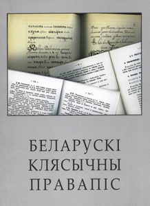

[back to downlads](download.html)  

English summary: Ever since the Soviet language reform of 1933 brought Belarusian orthographic norms closer to Russian according to communists' plans, Belarusian language has existed in two orthographic flavours: the Soviet version (the so called _narkamauka_), and the classical version (pre-1933 version or _tarashkievitsa_). After Belarus gained independence in 1990's the talks started about bringing the classical version "up-to-date" to reflect the changes in the language, to serve the changing needs of the Belarusian speakers, and to make the spelling of loan words more systematic. The document presented below (in PDF and Microsoft Word formats) is a result of intensive discussions and several years' work done by a group of distinguished Belarusian linguists: Zmicier Sauka, Vincuk Viachorka, Zmicier Sanko and Juras Bushlakou. The paper version was published in July 2005 in Vilnia/Minsk, and the new orthography rules were accepted and are already being used by several independent media outlets, such as Belarus Service of Radio Free Europe / Radio Liberty and "Nasha Niva" newspaper in Minsk.

"Беларускі клясычны правапіс" (2005)
====================================

Зьміцер Саўка, Вінцук Вячорка, Зьміцер Санько, Юрась Бушлякоў

Гэтая праца – вынік шматгадовае дзейнасьці дзеля ўдасканаленьня збору правілаў беларускага клясычнага правапісу, першую кадыфікацыю якога зьдзейсьніў Браніслаў Тарашкевіч у межах “Беларускае граматыкі для школ”. Працоўная група імкнулася стварыць выданьне для шырокае чытацкай аўдыторыі: як адмыслоўцаў – журналістаў і рэдактараў, пісьменьнікаў, навукоўцаў, гэтак і паспалітых карыстальнікаў. Свае заўвагі й пажаданьні можна накіроўваць на паштовы адрас: бульвар Шаўчэнкі 22-51, Менск, 220068; на электронны адрас: artahrama@hotmail.com, а таксама ў [гасьцявую кнігу](gb.html) pravapis.org.

  

Спампаваць файл(ы):  [**pravapis2005.pdf**](pravapis2005.pdf) (615КБ), [**pravapis2005.doc**](pravapis2005.doc) (847КБ)
